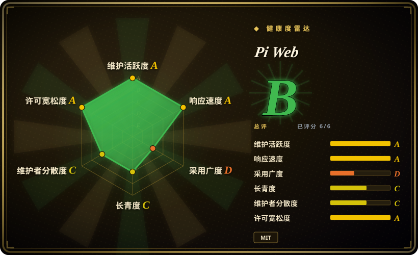
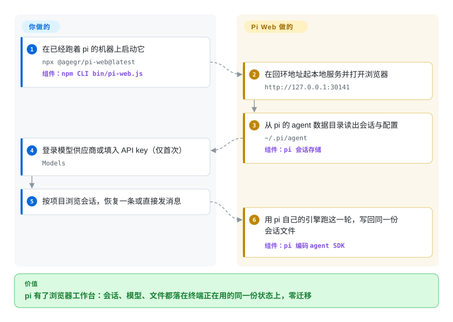

# Pi Web

pi 编码 agent 的会话以不透明的 JSONL 文件堆在 `~/.pi/agent` 里，「那次改迁移脚本的会话是哪条？」只能靠终端里翻历史。Pi Web 把这个目录变成浏览器工作台：跑的是同一批会话，用的是和终端 pi 同一套模型登录与配置，外加点击式的会话浏览、分支、文件／diff 查看和模型管理。

## 何时使用

你用 [pi](../../agent-frameworks/coding-agents/terminal-agents/pi.zh.md) 做编码 agent，项目会话躺在 `~/.pi/agent/sessions/<encoded-cwd>/<timestamp>_<uuid>.jsonl` 里，而你一直在丢全局视图：哪条会话还在跑、哪条把上下文窗口烧满了、哪条是你午饭后想接着用的。想要一块浏览器工作台时选 Pi Web——会话按项目分组、带运行状态／上下文用量／花费；从早前消息分支（「Edit from here」）或另起独立会话；供应商登录、API key、模型测试、插件包和 skills 都在 Models 面板里配；项目文件、git diff、worktree 切换不出标签页。

对比替代品的决定性取舍：Pi Web 不重新实现 pi——它用 pi 自己的引擎读写 pi 自己的磁盘状态，浏览器和终端是同一张桌子的两个窗口（零迁移、零重复登录）。对比 [CloudCLI (Claude Code UI)](claudecodeui.zh.md)，选择只在于你的大脑是哪家：CloudCLI 面向 Claude Code／Codex／Cursor CLI 家族，Pi Web 只面向 pi；对比 [Hermes Workspace](hermes-workspace.zh.md)（增强面板锚定 Hermes gateway API）同理；对比终端里的 [pi](../../agent-frameworks/coding-agents/terminal-agents/pi.zh.md) 本身，你是为一个浏览器界面多付一个本地服务进程，而 MIT 许可让它能进 CloudCLI 的 AGPL 进不了的场合。

## 怎么用起来

一条命令——`npx @agegr/pi-web@latest`——在 `127.0.0.1:30141` 起一个本地 Next.js 服务并打开浏览器。Pi Web 不重新实现 agent：它内嵌 `pi` CLI 的同款引擎包（manifest 里精确锁定的 `@earendil-works/pi-coding-agent`），读写 pi 的数据目录 `~/.pi/agent`——会话 JSONL 文件加上模型／设置／凭据存储——所以浏览器里恢复的会话就是终端里看到的那份文件，Models 面板里加的供应商 key 两边立刻都能用。边界在于：你跑一条命令、登录一次；它负责会话发现与分组、用内嵌引擎跑 agent 轮次、把真终端搬进页面（xterm.js 挂 node-pty）、预览源码／Markdown／图片／PDF／DOCX、盯 git diff、在侧栏切 worktree。把它想成同一张桌子的第二个窗口，而不是桌子的复制品。默认只听回环地址；绑更宽是显式选择且要密码。

<!-- flow-steps:begin (generated from flows/pi-web.json by tools/flow_card.py — do not edit) -->

流程文字版

1. **你**：在已经跑着 pi 的机器上启动它 — `npx @agegr/pi-web@latest` — 组件：`npm CLI bin/pi-web.js`
2. **Pi Web**：在回环地址起本地服务并打开浏览器 — `http://127.0.0.1:30141`
3. **Pi Web**：从 pi 的 agent 数据目录读出会话与配置 — `~/.pi/agent` — 组件：`pi 会话存储`
4. **你**：登录模型供应商或填入 API key（仅首次） — `Models`
5. **你**：按项目浏览会话，恢复一条或直接发消息
6. **Pi Web**：用 pi 自己的引擎跑这一轮，写回同一份会话文件 — 组件：`pi 编码 agent SDK`

**价值**：pi 有了浏览器工作台：会话、模型、文件都落在终端正在用的同一份状态上，零迁移

<!-- flow-steps:end -->

## 何时不用

- **你的编码 agent 不是 pi。** Pi Web 读的是 pi 的会话／配置目录、内嵌的是 pi 引擎，无法驱动 Claude Code、Codex、Cursor CLI 或 hermes-agent。Claude 家族用 [CloudCLI (Claude Code UI)](claudecodeui.zh.md)，hermes-agent 用 [Hermes Workspace](hermes-workspace.zh.md)。
- **终端已经够用。** pi 自带的 TUI 读写同一批会话，却不需要多跑、多更新、多设防一个服务进程；如果你从不在浏览器里翻历史或调模型，[pi 本身](../../agent-frameworks/coding-agents/terminal-agents/pi.zh.md)是活动部件更少的答案。
- **想把它暴露到公网。** README 自己警告：绑非回环地址「exposes an agent that can execute high-privilege actions」，而且密码登录不加密连接——明文 HTTP 暴露出局。留在 `127.0.0.1`、可信局域网，或走 VPN／HTTPS 反向代理。
- **需要多用户或团队界面。** 鉴权是单一共享密码（`PI_WEB_PASSWORD`；API 客户端用 Basic Auth、用户名 `pi`）——设计上就是单人操作。团队聊天平台用 [LibreChat](../../llm-chat-ui/librechat.zh.md) 或 [Open WebUI](../../llm-chat-ui/open-webui.zh.md)；并行监管多个 agent 用 [Agent Orchestrator](agent-orchestrator.zh.md)。
- **在意与最新 pi 的引擎同步。** Pi Web 把 `@earendil-works/pi-coding-agent` 精确锁定在一个版本（v0.9.3 对应 0.87.1），而 pi 本体持续发版——两次 Pi Web 发版之间，浏览器里的内嵌引擎可能落后于同一台机器上的 pi CLI。引擎一致性比界面更重要时，用 pi 的 TUI。[推断]
- **需要 Lindy 背书的依赖。** 约 6 个月大、pre-1.0、单人维护（agegr 占提交的绝大多数），6.9k star 攒得这么快——按本索引「年龄 × 仍在活跃」的先验，这是风险信号而不是耐久证明。pi 自己的 TUI，或更年长的 [CloudCLI (Claude Code UI)](claudecodeui.zh.md)，是更稳的形状。[推断]

## 横向对比

| 替代品 | 是否收录 | 我们的评价 | 取舍 |
|---|---|---|---|
| [Pi](../../agent-frameworks/coding-agents/terminal-agents/pi.zh.md) | ✅ | 终端已经够用就留在 pi 自带 TUI；当浏览／恢复大量会话、文件预览、网页端模型配置值得多跑一个本地服务进程时，才伸手拿 Pi Web。 | Pi Web 在 pi 自己的磁盘状态上加一层界面（零重复实现），代价是引擎版本被精确锁定、多一个要跑要更新的进程。 |
| [CloudCLI (Claude Code UI)](claudecodeui.zh.md) | ✅ | 大脑是 Claude Code／Codex／Cursor CLI 时选 CloudCLI，是 pi 时选 Pi Web——两个驾驶舱各读一家的磁盘状态，互相读不了对方的会话。 | 同一产品形态（本地编码 agent 的浏览器驾驶舱）。CloudCLI：AGPL、插件生态、厂商云、多 CLI；Pi Web：MIT、单一 agent、与 pi 共享会话／配置存储。 |
| [Hermes Workspace](hermes-workspace.zh.md) | ✅ | 大脑是 Nous 的 hermes-agent 才选 Hermes Workspace——增强面板锚定 Hermes gateway／dashboard API；Pi Web 锚定的则是 pi 的数据目录。 | 两者都是单 agent Web 控制台；Pi Web 的底座（pi）更年轻但实测采用量大得多，Hermes Workspace 则多了 tmux swarm 派发。 |
| [Open WebUI](../../llm-chat-ui/open-webui.zh.md) | ✅ | 要模型聊天平台（用户、RAG、预设）且不需要编码 agent 界面时选 Open WebUI；工作单元是编码 agent 的会话（文件、diff、worktree）时选 Pi Web。 | Open WebUI 渲染与模型的对话；Pi Web 渲染 agent 的工作区。重叠只有一个浏览器标签页。 |
| [Agent Orchestrator](agent-orchestrator.zh.md) | ✅ | 要在隔离 worktree 里并行监管多个 agent 并路由 CI／review 反馈时选 Agent Orchestrator；要浏览、分支、驾驶单个 agent 的会话时选 Pi Web。 | 桌面多 agent 控制面对比单 agent 浏览器工作区；Pi Web 提供会话分支和模型配置，不提供并行度。 |

## 技术栈

- **全 TypeScript**（GitHub languages API：2.1 MB TS＋1.0 MB JS，2026-09-28）：Next.js 16（`app/` 的 UI 与 API 路由）、React 19、xterm.js 6 挂 `node-pty` 提供真终端、`undici` 做感知代理的服务端 HTTP、`web-push` 做通知。
- **以库的形式内嵌 pi 引擎：** `@earendil-works/pi-agent-core`、`pi-ai`、`pi-coding-agent`、`pi-tui`，全部精确锁定 0.87.1——就是 `pi` CLI 由以构建的同批 npm 包。
- **分发：** npm `@agegr/pi-web`（v0.9.3，2026-09-23），`npx` 优先、可选全局 `pi-web` 命令；另有 GitHub Pages 上的静态浏览器 demo（回复预写、不调用模型）。

## 依赖

- **Node.js ≥ 22.19.0**（`engines` 声明）；`node-pty` 原生模块（1.2.0-beta.15）意味着平台要有可用的构建工具链或预编译产物。
- **一个 pi agent 数据目录**——通常是 `~/.pi/agent`，即你确实在用 pi；`PI_CODING_AGENT_DIR` 可改址。Pi Web 必须与 pi 跑在同一文件系统环境里才能看到既有会话。
- **模型访问**靠 Models 面板里配置的供应商登录或 API key——与 pi CLI 共享，没有独立密钥库。
- **其余零强制依赖**——没有外部数据库、队列或网关；会话和配置都在磁盘上，服务还会替你打开浏览器。

## 运维难度

**回环地址上低；一绑宽就升中。** `npx @agegr/pi-web@latest` 就是全部安装，更新重跑安装命令即可，空闲会话 10 分钟自动清理（`PI_WEB_IDLE_TIMEOUT_MS`），模型流量支持 `HTTP(S)_PROXY`。真正要紧的运维问题是网络暴露：默认 `127.0.0.1` 天生安全；远程使用就要 `PI_WEB_PASSWORD`、带 `PI_WEB_ALLOWED_HOSTS` 的 HTTPS 反向代理或可信 VPN——README 三者都写了，并明确反对明文 HTTP 暴露公网。接近每周一版的发车节奏意味着你会频繁更新。

## 健康度与可持续性

- **维护——非常活跃（2026-09-28）。** 仓库创建于 2026-03-22；v0.9.3 发布于 2026-09-23（前一天 v0.9.2、09-11 v0.9.1）；自 v0.7.0（2026-06-26）以来约 30 个 tag；issue 每日有人处理（一个修复关闭后次日跟进重开，#979→#980，2026-09-27）。
- **治理／bus factor——单人维护。** `owner.type` 是 User（agegr／Alex Yang，2015 年起的个人账号）；top-10 贡献者窗口里 agegr 536 次提交、其余每人 ≤11——长尾小贡献者，无基金会，未见 CODEOWNERS。[推断]
- **背书——独立伴随项目，未见上游背书。** 不是 earendil-works 的项目；pi 的 README（2026-09-28 读取）没有提到它，采用是自发的：6,882 star／985 fork／114 个 open issue，近一个月 npm 下载 22,236 次（2026-08-28→09-26），README 有 zh-CN／ja／ru 译本，还有中文 issue——对六个月大的工具是真实的跨国拉力。
- **年龄 × Lindy——年轻且爆火。** 约 6 个月大；按本索引先验，6.9k star 攒这么快是风险信号而非耐久证明。对冲项：实测的 npm 拉力和发版节奏是真的，但你实际押上的是一个人的路线图。[推断]
- **风险标志。** MIT（宽松；未见改许可历史）；对 pi SDK 的精确锁定意味着 pi 本体快速发车时 Pi Web 的内嵌引擎可能落后于你同时跑的 CLI；远程暴露的坑 README 写得清楚（密码登录不加密）。未做 CVE 扫描。[未验证]

## 存疑（未验证）

- [未验证] 功能面（带运行状态／上下文／花费的会话工作台、分支、含 PDF／DOCX 的文件预览、git worktree、Models 面板、插件／skill 管理）来自 README 与截图，未实际运行验证。
- [未验证] README 之外的安全模型（`PI_WEB_PASSWORD`、Basic Auth 用户 `pi`、空闲超时、`PI_WEB_ALLOWED_HOSTS` 白名单）未从源码审计。
- [未验证]「未见上游背书」只基于 2026-09-28 对 pi README 的 grep；pi 的文档站与 RFC 未搜索 Pi Web 的提法。
- [推断] 单人维护集中度（top-10 窗口 536 对 ≤11）来自 contributors API，GitHub stats 接口可能少算；仓库布局未见 CODEOWNERS／GOVERNANCE。
- [推断] `node-pty` 1.2.0-beta.15 意味着原生构建／工具链要求（且挂着 beta 版本号）——从 manifest 读出，未跨平台实测。
- [推断] 引擎漂移风险（锁定的 `@earendil-works/pi-coding-agent` 0.87.1 对持续发版的 pi）由 manifest 与发版列表推断；未见具体断裂案例。
- [推断] 6 个月 6,882 star 可能高估持久使用、低估 pi 生态热度；每月 22k 的 npm 数字更硬，但含一次性 `npx` 尝试。
- [未验证] star／fork／issue／下载计数与发版日期是 2026-09-28 的 API 快照，会漂移。
