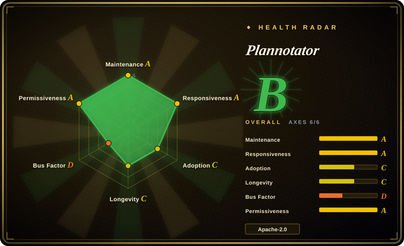
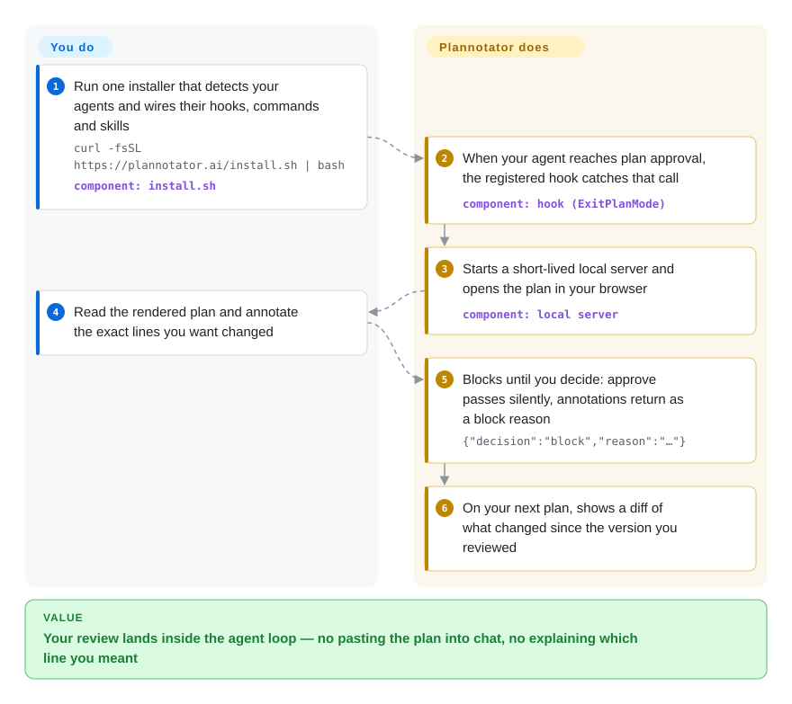

# Plannotator

You approve an agent's plan with one keystroke at the bottom of a terminal scrollback, and three files later you notice it read one paragraph differently than you did — the plan was never really reviewed, just skimmed, and there was nowhere to write "step 3 migrates the column before the backfill". Plannotator intercepts that moment: the plan (and later the diff) opens as a page in your own browser, you mark the exact blocks and lines, and those marks come back to the agent as its next instruction.

## When to use

You run a coding agent as your daily driver — Claude Code, Codex, OpenCode, Gemini CLI, Copilot CLI, Kiro, Droid, Amp or Pi — and you use plan mode for work that has real blast radius: a schema change, a migration, a public API. The approval step guarding it is a wall of text you can only skim, and when you do have notes they go into a chat message the agent may or may not tie back to the line you meant. You install Plannotator, and from then on a plan opens as rendered Markdown in a browser page with room for the whole document: you annotate specific blocks, approve or send the annotations, and on resubmission you see a diff of what changed since the version you reviewed.

The deciding tradeoff against its substitutes is that the gate lives **inside the agent loop**. A harness's built-in approval prompt gives you no annotations at all; a chat window loses the line-level link; a hosted review SaaS reviews a *pull request* after the code exists, not the plan before it, and cannot block your local agent's next turn. Plannotator is also the same surface for three jobs — plan/document/HTML annotation, local-diff and PR review (Git, GitButler, Jujutsu `jj`, Perforce, GitHub, GitLab), and annotating the agent's last message — which is why it is worth reaching for when the review artifact is not a PR yet.

## How it works

The installer is the only step that touches your agent's configuration: it detects which agents you have installed and writes the hook, command and skill entries for each of them. After that, the value comes from one hook protocol. When the agent is about to ask permission for a plan (Claude Code calls `ExitPlanMode`), the registered command starts a short-lived local web server, renders the plan in an editor that understands Markdown, code and HTML anchors, and opens your browser; **the hook blocks while you read**. Your decision travels back as stdout rather than as an exit code — the command always exits `0`: Approve prints nothing, so the hook passes and the agent proceeds, while Send Annotations prints `{"decision":"block","reason":"…"}`, which is the hook-native "block with feedback" signal Claude Code and Codex already speak, so the agent's turn resumes with your annotations as its reason. Resubmitting the plan shows a diff against the version you reviewed. The line between you and it is clean: **the project owns the server, the renderer, the annotation model, the diff view and the hook protocol; you own the judgment** — which lines are wrong and whether to approve — plus, for Ask AI and review agents, your own configured model provider.

<!-- flow-steps:begin (generated from flows/plannotator.json by tools/flow_card.py — do not edit) -->

Text version of the flow

1. **You**: Run one installer that detects your agents and wires their hooks, commands and skills — `curl -fsSL https://plannotator.ai/install.sh | bash` — component: `install.sh`
2. **Plannotator**: When your agent reaches plan approval, the registered hook catches that call — component: `hook (ExitPlanMode)`
3. **Plannotator**: Starts a short-lived local server and opens the plan in your browser — component: `local server`
4. **You**: Read the rendered plan and annotate the exact lines you want changed
5. **Plannotator**: Blocks until you decide: approve passes silently, annotations return as a block reason — `{"decision":"block","reason":"…"}`
6. **Plannotator**: On your next plan, shows a diff of what changed since the version you reviewed

**Value**: Your review lands inside the agent loop — no pasting the plan into chat, no explaining which line you meant

<!-- flow-steps:end -->

## When NOT to use

- **You want the machine to write the review findings.** Plannotator is a surface for *your* annotations, with optional AI assistance. If the requirement is LLM-generated line comments on a diff in CI, use [Open Code Review](../../ai-code-review/open-code-review.md), [PR-Agent](../../ai-code-review/pr-agent.md) or [Metis](../../ai-code-review/metis.md) instead — they produce findings without a human in the loop, which is the opposite shape.
- **You need a hosted, multi-person review workspace** (assignments, audit trail, comments from people who are not at your terminal). That is where the project itself is heading: the open-source asynchronous link sharing is documented as "moving to deprecated support", with the hosted Workspaces product named as the primary direction. For that job pick GitHub/GitLab review plus a hosted reviewer (CodeRabbit, Graphite, Reviewable — hosted services, not repos) rather than depending on a feature the upstream labels legacy.
- **Your harness has no lifecycle hook to intercept.** Plan interception is hook-based: Droid is commands-only with "no plan interception yet", and Codex hooks on native Windows are still experimental. Drive it manually (`/plannotator-annotate <file>`, `plannotator annotate <file> --hook`) or stay with the harness prompt.
- **The machine must make no unsolicited network calls.** Every plan/annotate/review surface checks `api.github.com` for the latest release when it loads and, per the README, "there is currently no opt-out setting"; URL annotation fetches through Jina Reader by default; local diff review may query `origin` with `git ls-remote` (that last one *is* disableable). If you are air-gapped or under egress review, either fork and strip the check or choose a tool that stays offline. [未验证]
- **You need a slow-moving dependency with stability guarantees.** v0.27.x with 157 releases in nine months, a 0.x version line, and a security policy that supports only the latest release is the opposite of that. Pin a version, read release notes before upgrading, and expect host-config-shape churn. [推断]
- **You do not want an installer rewriting your agent configuration.** It writes hooks, commands, skills and settings across every agent it detects, and the uninstall path is correspondingly elaborate (`--dry-run`, guarded `--purge`, ownership re-checks before deleting data) for a reason. Use the `--minimal` install (binary only, no wiring) if you would rather own your own hook entries.
- **You are working over SSH/devcontainer and cannot control the network path.** Remote mode binds `0.0.0.0` on a fixed port so a forwarded browser can reach it — fine on your own tailnet, not something to expose casually. [未验证]

## Comparison

| Alternative | In index | Our verdict | Tradeoff |
|---|---|---|---|
| Harness built-in plan approval (Claude Code / Codex permission prompt) | not a repo | When a plan is short and you only need yes/no, keep the built-in prompt; reach for Plannotator when you need to say *which* line is wrong, not just *no*. | Zero install and always on, but no annotations, no page, no plan diff, no record of a decision. |
| [CloudCLI (Claude Code UI)](claudecodeui.md) | ✅ | Choose CloudCLI when you want to *drive* agent sessions from a browser or phone (files, terminal, git); choose Plannotator when the job is reviewing and annotating a specific artifact with the agent blocked on your decision. | CloudCLI is session-shaped and broader; Plannotator is artifact-shaped and gates the turn — narrower, but that gate is the point. |
| [Open Code Review](../../ai-code-review/open-code-review.md) | ✅ | Choose Open Code Review when you want review findings produced automatically on every diff in CI; choose Plannotator when the value is a *human* decision on plan or diff that the agent then acts on. | Automatic coverage with no human attention, versus attention spent where blast radius is highest — usually both are wanted, at different stages. |
| herdr-annotate / Plannotator TUI (same maintainer's terminal and TUI variants) | not indexed | Keep Plannotator proper for browser-scale documents and plan interception; the terminal variants exist for people who live inside Herdr or want a TUI, and are deliberately left unindexed here as near-duplicates of the same review model. | Terminal surfaces work where a browser does not (headless boxes), but lose rendered Markdown/HTML, side-by-side diffs and the VS Code integration. |
| CodeRabbit / Graphite / Reviewable (hosted PR review services) | not a repo | Choose a hosted reviewer when the review must be social — teammates commenting on a PR with history and notifications; choose Plannotator when the reviewer is you and the agent is waiting on the answer. | Hosted handles multi-person workflow and audit, but it is closed, priced, and downstream of the local agent loop rather than inside it. |

## Tech stack

- **Language/runtime:** TypeScript on **Bun** — `bun.lock` + `bunfig.toml`, Bun workspaces (`apps/*`, `packages/*`), and the shipped `plannotator` binary is a compiled Bun executable (the repo-local `bin/plannotator.js` runs `apps/hook/server/index.ts` through `bun`).
- **Front-end:** React with a Vite build (`packages/ui`, `packages/editor`, `packages/review-editor`, `apps/review`), `dockview-react` for the panel layout, `@pierre/diffs` + `diff` for diff rendering, `marked` + `dompurify` for Markdown/HTML, `sonner` for toasts.
- **Server:** a local Bun HTTP server per review session (`packages/server`), plus providers for VCS backends — `git`, GitButler, `jj`, Perforce (`p4`), GitHub and GitLab — in `packages/shared` / `packages/server`.
- **Per-agent integrations:** a monorepo of plugins — `apps/hook` (Claude Code plugin + the CLI/server), `apps/opencode-plugin`, `apps/pi-extension`, `apps/codex`, `apps/copilot`, `apps/gemini`, `apps/droid-plugin`, `apps/amp-plugin`, `apps/kiro-cli`, plus `apps/vscode-extension`; skills live in `apps/skills/`.
- **Hosted pieces in the same repo:** `apps/marketing` (the docs/blog site), `apps/portal`, `apps/paste-service` (encrypted share links, Cloudflare Workers via `wrangler.toml`), `apps/waitlist-service`.
- **Quality tooling:** 446 test files under `packages/` (Bun's test runner), per-package `tsc --noEmit` typecheck targets, `.semgrep.yml`, `.gitleaks.toml`, six GitHub workflows including `release.yml`, `security.yml`, `dast.yml`, and ADRs under `adr/`.

## Dependencies

- **Runtime:** the prebuilt binary plus a supported agent that can run a hook command. No database, no account, no service to host. Data (plans, history, drafts, config, debug logs, IPC registry) lives under `~/.plannotator` unless `PLANNOTATOR_DATA_DIR` (or `XDG_DATA_HOME` when the legacy dir is absent) relocates it; some UI preferences are browser cookies.
- **Browser:** a local browser to open the review page (`PLANNOTATOR_BROWSER` overrides which one). Remote/SSH/devcontainer needs a forwarded port (`PLANNOTATOR_REMOTE=1`, `PLANNOTATOR_PORT`).
- **Network:** required for URL annotation (Jina Reader by default, `PLANNOTATOR_JINA`/`JINA_API_KEY`), GitHub/GitLab PR review (via your authenticated CLI and remote), Ask AI / review agents (your configured provider), and the release check on page load. Core local review works without egress except that check.
- **Optional self-hosting:** the paste/share service is self-hostable (Cloudflare Workers, `apps/paste-service`) and the portal URL is configurable; sharing can be switched off entirely with `PLANNOTATOR_SHARE=disabled`.
- **Building from source:** Bun, and the front-end must be built before the hook binary (`bun run --cwd apps/review build && bun run build:hook`) because the hook build copies pre-built HTML.

## Ops difficulty

**Low for one developer, medium once it is a team or a remote box.** The happy path is one installer, a local browser and zero services to run; the binary spawns a short-lived server per review and everything is stored in one directory you can delete. Difficulty concentrates in four places: (1) **upgrades** — a pre-1.0 project shipping roughly weekly, where a `git pull`-style upgrade also rewrites host agent configs; (2) **remote access** — fixed port, forwarding, and a server that binds all interfaces in remote mode, so the network path is yours to protect; (3) **uninstall/relocate** — because the installer touches so many host configs, cleanup is a guarded, multi-step operation rather than `rm`; (4) **building from source** — Bun workspaces plus a build order that matters. Integrations beyond the default install (VS Code extension, Obsidian/Bear plan saving, Tailscale serving, self-hosted share portal) each add their own surface.

## Health & viability

- **Maintenance (2026-09).** Extremely active: latest release v0.27.17 published 2026-09-21, last push 2026-09-21, 157 releases and ~1,248 commits since the repo was created 2025-12-28. Not archived. This is pace, though, not maturity.
- **Governance / bus factor — the main risk.** A single **User**-owned repo: the health radar grades governance **D**, with the top contributor holding **0.83** of 12-month contributions (top-3: 0.851), and the all-time contributor list shows the owner (`backnotprop`) at 984 commits against ~10 others in the low tens. There is no foundation, no `GOVERNANCE`, no `CODEOWNERS` in the tree; the roadmap is one maintainer's. What partly offsets it is unusual engineering discipline for a solo project — ADRs, a `SECURITY.md`, semgrep/gitleaks configs, six workflows, 446 test files — which makes an external fork takeover more tractable, not less necessary if the maintainer stops. [推断]
- **Age & Lindy — a young-repo risk flag.** ~9 months old with ~8.9k stars and 672 forks. Young + very high stars is a hype/maturity signal to treat as risk, not proof; the counterweight is that the cadence and release engineering look like sustained work rather than a launch spike. The star count against only 23 watchers is an unusual ratio I could not explain from the repo. [未验证]
- **Adoption.** Adoption axis **C** — 68,739 npm downloads in the last month for `@plannotator/pi-extension` (the radar's canonical package). Two npm packages published at the same version (`@plannotator/opencode`, `@plannotator/pi-extension`), a VS Code Marketplace extension, Obsidian and Bear integrations, and README-documented setup paths for around nine agents — a deliberate "meet your harness where it is" strategy, which is also why the surface area is large for a young project. [未验证]
- **Risk flags.** Pre-1.0 churn; **open-core pull** — open-source async link sharing is marked for deprecated support while the hosted Workspaces product is named the primary direction, so the collaboration feature you adopt today may only be maintained commercially tomorrow; a release-check egress with no opt-out; and a security policy that supports only the latest release, which in a weekly-release project is a short window.

## Caveats (unverified)

- [未验证] "No telemetry" is the README's claim; I confirmed no telemetry SDK (PostHog/Amplitude/Mixpanel/Sentry) appears in the dependency manifests or source tree, but did not run the binary or observe its traffic. The release check to `api.github.com` and the optional Jina/provider calls above *are* traffic the README documents.
- [未验证] The supported-agent list (Claude Code, Codex, Copilot CLI, Gemini CLI, OpenCode, Kiro, Droid, Amp, Pi) and per-agent behaviour differences are from the README and per-agent READMEs; I installed and exercised none of them.
- [未验证] No authentication layer on the local review server: remote mode binds `0.0.0.0` (`packages/server/remote.ts:152`) and I found no basic-auth/token/CSRF middleware in `packages/server`, but I did not audit the whole request path — treat an exposed instance as an open review surface until you check.
- [未验证] Front-end specifics (React + Vite + dockview panels, `@pierre/diffs`, DOMPurify, `marked`) are read from `package.json` files and the package layout, not from running the UI; the exact file count of tests (446) is a directory count, not a coverage measure.
- [未验证] The star-to-watcher ratio (~8.9k stars / 23 watchers / 672 forks) and the "157 releases in 9 months" pace are treated as signals of hype versus maturity; I have no evidence about how those stars were acquired, and star counts are date-sensitive.
- [推断] The support-window risk (0.x + latest-release-only security policy + weekly releases) is an inference from the version scheme and `SECURITY.md`, not a documented deprecation.
- [推断] Time saved per plan review, and the claim that annotations reduce rework, are not measured here; the page describes mechanisms and tradeoffs observed in the sources, not benchmarked outcomes.
