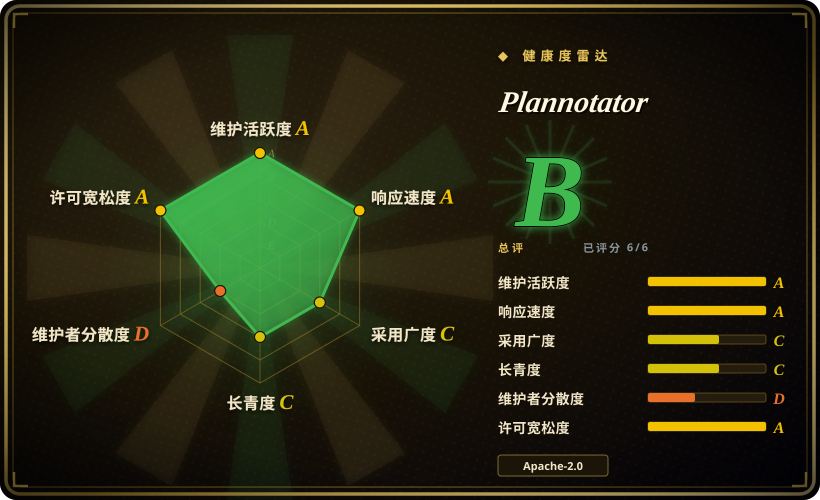
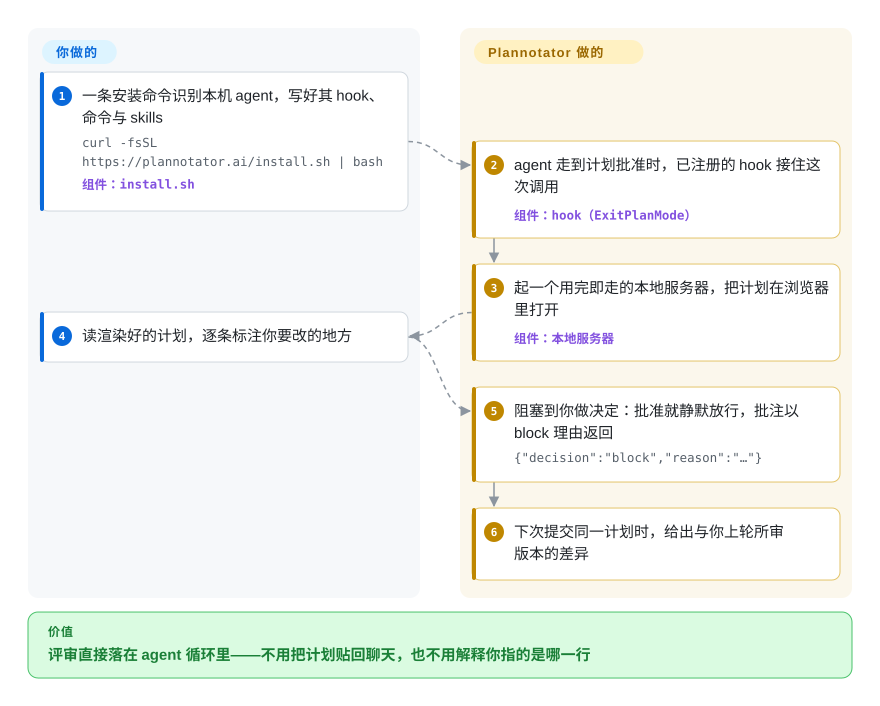

# Plannotator

你在终端回滚缓冲区的最后一屏上敲一个键，就算批准了 agent 的计划；三个文件之后你才发现，它对某一段的理解跟你不一样——那份计划其实没被评审过，只是被扫过一眼，而你也无处写下「第 3 步在回填之前就先改了列」。Plannotator 卡住的是这个时刻：把计划（以及之后的 diff）开成本机浏览器里的一页，你圈中具体的段落和行，这些批注就作为 agent 的下一条指令送回去。

## 何时使用

你日常把编码 agent 当主力——Claude Code、Codex、OpenCode、Gemini CLI、Copilot CLI、Kiro、Droid、Amp 或 Pi——并且对真正有爆炸半径的活（改 schema、写迁移、动公开 API）用 plan mode。守住实现的那一步批准动作，是一整屏你只能扫过去的文本；就算你真有意见，也只能丢进聊天消息里，agent 未必把它对回你说的那一行。装上 Plannotator 之后，计划以渲染好的 Markdown 出现在浏览器页面里，整份文档放得下：你标注具体段落，批准或发送批注；同一份计划再次提交时，你会看到相对你上轮所审版本的差异。

相对替代品，这里的决定性取舍是：这道闸门**长在 agent 的循环里面**。harness 内建的批准提示根本不给你批注；聊天窗口丢掉行级对应；托管评审 SaaS 评的是代码已经存在之后的 pull request，而不是实现之前的计划，也无法阻塞你本地 agent 的下一轮。Plannotator 同时还是三件事的共同界面——计划/文档/HTML 批注、本地 diff 与 PR 评审（Git、GitButler、Jujutsu `jj`、Perforce、GitHub、GitLab）、以及批注 agent 上一条消息——所以当被评审的东西还不是 PR 时，它才是那个该被想起的工具。

## 怎么用起来

安装器是唯一会动你 agent 配置的一步：它识别你装了哪些 agent，逐个写好 hook、命令与 skill 条目。之后的价值全部来自一套 hook 协议。当 agent 即将就计划请求许可时（Claude Code 走的是 `ExitPlanMode`），已注册的命令会起一个短命的本地服务器，把计划渲染进一个懂 Markdown、代码与 HTML 锚点的编辑器，并打开你的浏览器；**你阅读期间，hook 一直阻塞**。你的决定以 stdout 而不是退出码的形式回传——命令永远退出 `0`：点批准就不打印任何内容，hook 放行、agent 继续；点发送批注则打印 `{"decision":"block","reason":"…"}`，这正是 Claude Code 与 Codex 本来就认识的「带反馈阻塞」信号，于是 agent 的这一轮带着你的批注作为理由继续。同一份计划再次提交时，页面给出与你上轮所审版本的计划 diff。你和它的分界很清楚：**服务器、渲染器、批注模型、diff 视图和 hook 协议都归它；判断归你**——哪几行不对、批不批准——另外，要用 Ask AI 和评审 agent，还得配上你自己的模型 provider。

<!-- flow-steps:begin (generated from flows/plannotator.json by tools/flow_card.py — do not edit) -->

流程文字版

1. **你**：一条安装命令识别本机 agent，写好其 hook、命令与 skills — `curl -fsSL https://plannotator.ai/install.sh | bash` — 组件：`install.sh`
2. **Plannotator**：agent 走到计划批准时，已注册的 hook 接住这次调用 — 组件：`hook（ExitPlanMode）`
3. **Plannotator**：起一个用完即走的本地服务器，把计划在浏览器里打开 — 组件：`本地服务器`
4. **你**：读渲染好的计划，逐条标注你要改的地方
5. **Plannotator**：阻塞到你做决定：批准就静默放行，批注以 block 理由返回 — `{"decision":"block","reason":"…"}`
6. **Plannotator**：下次提交同一计划时，给出与你上轮所审版本的差异

**价值**：评审直接落在 agent 循环里——不用把计划贴回聊天，也不用解释你指的是哪一行

<!-- flow-steps:end -->

## 何时不用

- **你想让机器写出评审意见。** Plannotator 是为*你的*批注准备的界面，AI 只是可选辅助。若需求是让 LLM 在 CI 里对 diff 产出逐行评论，请改用 [Open Code Review](../../ai-code-review/open-code-review.zh.md)、[PR-Agent](../../ai-code-review/pr-agent.zh.md) 或 [Metis](../../ai-code-review/metis.zh.md)——它们在没有人类介入的情况下产出 finding，形态正好相反。
- **你需要托管的多人在线评审工作区**（指派、审计记录、不在你终端旁的同事也能评论）。这恰是项目自己的方向：开源版的异步链接分享已被文档标注为「转入 deprecated 支持」，托管产品 Workspaces 被写明为主要方向。这种需求请选 GitHub/GitLab 评审加一个托管评审服务（CodeRabbit、Graphite、Reviewable——托管服务，不是仓库），而不是押在一个上游自己称为遗留的功能上。
- **你的 harness 没有可拦截的生命周期 hook。** 计划拦截依赖 hook：Droid 只有命令、「尚无计划拦截」，Codex 的 hook 在原生 Windows 上仍是实验性。那就手动驱动（`/plannotator-annotate <file>`、`plannotator annotate <file> --hook`），或者继续用 harness 自带的提示。
- **这台机器不能有任何未经请求的外联。** 每个计划/批注/评审界面在加载时都会查 `api.github.com` 取最新版本，而 README 明说「目前没有关闭该检查的设置」；URL 批注默认经 Jina Reader 抓取；本地 diff 评审可能用 `git ls-remote` 查 `origin`（只有这一项可关）。若你处在隔离网或出口审查下，要么 fork 后剥掉该检查，要么换一个不联网的工具。[未验证]
- **你需要一个动作缓慢、有稳定性保证的依赖。** 九个月 157 个 release、0.x 版本线、安全策略只支持最新版，那是反面。固定版本、升级前读 release notes，并预期宿主配置形态会变。[推断]
- **你不愿意让安装器改写 agent 配置。** 它会为识别到的每个 agent 写入 hook、命令、skill 与设置，卸载路径相应地复杂（`--dry-run`、带护栏的 `--purge`、删除数据前重新核验归属）不是没有原因。若想自己管 hook 条目，用 `--minimal` 装法（只装二进制，不做接线）。
- **你在 SSH/devcontainer 里工作，又无法控制网络路径。** 远程模式会在固定端口上绑 `0.0.0.0`，好让转发进来的浏览器能访问——在自己的 tailnet 里没问题，别随手暴露。[未验证]

## 横向对比

| 替代品 | 是否收录 | 我们的评价 | 取舍 |
|---|---|---|---|
| harness 内建的计划批准（Claude Code / Codex 的许可提示） | 非仓库 | 计划很短、只需要批准或不批准时，继续用内建提示；需要说清*哪一行*不对而不只是说「不行」时，才换 Plannotator。 | 零安装、始终可用，但没有批注、没有页面、没有计划 diff，也不留决定记录。 |
| [CloudCLI（Claude Code UI）](claudecodeui.zh.md) | 已收录 | 想从浏览器或手机*驱动* agent 会话（文件、终端、git）时选 CloudCLI；任务是评审并批注某个具体产物、且 agent 正等着你的决定时选 Plannotator。 | CloudCLI 是会话形态、覆盖更宽；Plannotator 是产物形态并卡住这一轮——更窄，但那个卡点正是它的价值。 |
| [Open Code Review](../../ai-code-review/open-code-review.zh.md) | 已收录 | 想让每个 diff 在 CI 里自动获得评审 finding 时选 Open Code Review；价值在于*人*对计划或 diff 做出决定、并让 agent 据此行动时选 Plannotator。 | 自动覆盖不需要人类注意力，代价是注意力没有花在爆炸半径最大的地方——两者通常都需要，只是在不同阶段。 |
| herdr-annotate / Plannotator TUI（同一作者的命令行与 TUI 变体） | 未收录 | 浏览器尺度的文档与计划拦截继续用 Plannotator 本体；终端变体是给泡在 Herdr 里或想要 TUI 的人准备的，此处有意不收录，视作同一评审模型的近似重复。 | 终端界面在浏览器不可用的场景（纯 headless 机器）能顶上，但丢掉渲染后的 Markdown/HTML、并排 diff 与 VS Code 集成。 |
| CodeRabbit / Graphite / Reviewable（托管 PR 评审服务） | 非仓库 | 评审必须社会化——同事在 PR 上评论、要有历史与通知——时选托管评审服务；评审人就是你、agent 在等答案时选 Plannotator。 | 托管服务处理多人流程与审计，但闭源、收费，而且位于本地 agent 循环的下游，而不是循环之内。 |

## 技术栈

- **语言/运行时：** TypeScript + **Bun**——`bun.lock` 与 `bunfig.toml`，Bun workspaces（`apps/*`、`packages/*`），发布的 `plannotator` 二进制是 Bun 编译产物（仓库内的 `bin/plannotator.js` 用 `bun` 跑 `apps/hook/server/index.ts`）。
- **前端：** React + Vite 构建（`packages/ui`、`packages/editor`、`packages/review-editor`、`apps/review`），面板布局用 `dockview-react`，diff 渲染用 `@pierre/diffs` + `diff`，Markdown/HTML 用 `marked` + `dompurify`，提示用 `sonner`。
- **服务端：** 每次评审起一个本地 Bun HTTP 服务（`packages/server`），并在 `packages/shared` / `packages/server` 里提供各版本控制后端——`git`、GitButler、`jj`、Perforce（`p4`）、GitHub、GitLab。
- **各 agent 集成：** 一个插件 monorepo——`apps/hook`（Claude Code 插件 + CLI/服务入口）、`apps/opencode-plugin`、`apps/pi-extension`、`apps/codex`、`apps/copilot`、`apps/gemini`、`apps/droid-plugin`、`apps/amp-plugin`、`apps/kiro-cli`，加 `apps/vscode-extension`；skill 在 `apps/skills/`。
- **同仓库内的托管部分：** `apps/marketing`（文档/博客站）、`apps/portal`、`apps/paste-service`（加密分享链接，Cloudflare Workers + `wrangler.toml`）、`apps/waitlist-service`。
- **质量工具：** `packages/` 下 446 个测试文件（Bun 测试运行器）、各包 `tsc --noEmit` 类型检查目标、`.semgrep.yml`、`.gitleaks.toml`、六个 GitHub workflow（含 `release.yml`、`security.yml`、`dast.yml`），以及 `adr/` 下的 ADR。

## 依赖

- **运行时：** 预编译二进制，加上一个能执行 hook 命令的受支持 agent。没有数据库、没有账号、没有要自己跑的服务。数据（计划、历史、草稿、配置、调试日志、IPC 注册表）默认在 `~/.plannotator`，可用 `PLANNOTATOR_DATA_DIR`（或旧目录不存在时的 `XDG_DATA_HOME`）整体搬家；部分界面偏好存在浏览器 cookie 里。
- **浏览器：** 需要一个本地浏览器打开评审页（`PLANNOTATOR_BROWSER` 可指定）。远程/SSH/devcontainer 需要转发端口（`PLANNOTATOR_REMOTE=1`、`PLANNOTATOR_PORT`）。
- **网络：** URL 批注（默认经 Jina Reader，可 `PLANNOTATOR_JINA`/`JINA_API_KEY`）、GitHub/GitLab PR 评审（走你已认证的 CLI 与 remote）、Ask AI / 评审 agent（你配置的 provider）、以及页面加载时的版本检查都需要网络。除版本检查外，本地评审无需外联。
- **可选自托管：** 分享用的 paste 服务可自托管（Cloudflare Workers，`apps/paste-service`），portal 地址可配置；分享可用 `PLANNOTATOR_SHARE=disabled` 整体关闭。
- **从源码构建：** 需要 Bun，且必须先构建前端再构建 hook 二进制（`bun run --cwd apps/review build && bun run build:hook`），因为 hook 的构建会拷贝预构建的 HTML。

## 运维难度

**单人用低，变成团队或远程机器后中等。** 顺路径是一条安装命令、一个本地浏览器、零服务要跑：二进制每次评审起一个短命服务器，所有东西都在一个目录里，删掉即净。难度集中在四处：（1）**升级**——pre-1.0 项目大约每周发版，而升级动作同时会改写宿主的 agent 配置；（2）**远程访问**——固定端口、端口转发，且远程模式下服务绑所有网卡，网络路径得你自己守；（3）**卸载/搬家**——因为安装器碰了太多宿主配置，清理是一套带护栏的多步操作，而不是 `rm`；（4）**从源码构建**——Bun workspaces 加一个顺序有讲究的构建链。除默认安装之外的每项集成（VS Code 扩展、Obsidian/Bear 计划归档、Tailscale 服务、自托管分享 portal）都各自带来一层运维面。

## 健康度与可持续性

- **维护（2026-09）。** 极其活跃：最新 release v0.27.17 发布于 2026-09-21，最后 push 2026-09-21，仓库自 2025-12-28 创建以来已有 157 个 release、约 1,248 次提交。未归档。但这是速度，不是成熟度。
- **治理 / bus factor——主要风险。** 单人 **User** 仓库：健康度雷达给出治理 **D**，头部贡献者占 12 个月贡献的 **0.83**（前三名 0.851），历史上 owner（`backnotprop`）984 次提交，其余约 10 位贡献者在两位数以下。没有基金会、树里没有 `GOVERNANCE`、没有 `CODEOWNERS`；路线图就是一个人的。部分抵消这一点的是：对一个单人项目而言罕见的工程纪律——ADR、`SECURITY.md`、semgrep/gitleaks 配置、六个 workflow、446 个测试文件——这让外部 fork 接管的可行性更高，但如果维护者停手，需要接管的概率也更高。[推断]
- **年龄与 Lindy——年轻仓库的风险标记。** 约 9 个月、约 8.9k star、672 fork。年轻＋极高 star 是炒作/成熟度的风险信号，而非证明；反方向的证据是它的发版节奏和发布工程看起来是持续工作，而不是一次爆发。star 数与仅 23 个 watcher 的比例异常，我无法从仓库中解释。[未验证]
- **采用度。** 采用轴 **C**——`@plannotator/pi-extension` 上月 68,739 次 npm 下载（雷达选定的规范包）。两个 npm 包与主项目同版本发布（`@plannotator/opencode`、`@plannotator/pi-extension`）、一个 VS Code Marketplace 扩展、Obsidian 与 Bear 集成，README 记录了约九个 agent 的安装路径——「你的 harness 在哪，我就在哪」的刻意策略，也正因如此，对一个年轻项目来说它的表面积显得很大。[未验证]
- **风险标记。** pre-1.0 动荡；**open-core 拉力**——开源版异步链接分享被标为转入 deprecated 支持，而托管 Workspaces 被写明为主要方向，于是你今天采用的协作功能，明天可能只有商业版在维护；版本检查外联无法关闭；安全策略只支持最新版，在一个每周发版的项目里这个窗口很短。

## 存疑（未验证）

- [未验证]「无遥测」是 README 的说法；我确认了依赖清单与源码树里没有遥测 SDK（PostHog/Amplitude/Mixpanel/Sentry），但没有运行二进制，也没有观测它的流量。上文提到的版本检查（`api.github.com`）以及可选的 Jina/provider 调用*确实*是 README 记录在案的流量。
- [未验证] 受支持 agent 列表（Claude Code、Codex、Copilot CLI、Gemini CLI、OpenCode、Kiro、Droid、Amp、Pi）与各 agent 的行为差异来自 README 与各 agent 自己的 README；我一个都没有安装实测。
- [未验证] 本地评审服务没有认证层：远程模式绑 `0.0.0.0`（`packages/server/remote.ts:152`），我在 `packages/server` 里没找到 basic-auth/token/CSRF 中间件，但没有审计完整请求路径——在你亲自确认之前，把暴露在外的实例当作开放的评审界面。
- [未验证] 前端细节（React + Vite + dockview 面板、`@pierre/diffs`、DOMPurify、`marked`）读自 `package.json` 与包布局，不是运行界面得出的；测试文件数（446）是目录计数，不是覆盖率指标。
- [未验证] star 与 watcher 的比例（约 8.9k star / 23 watcher / 672 fork）和「九个月 157 个 release」的节奏，被当作炒作与成熟的信号使用；我没有任何关于这些 star 如何获得的证据，且 star 数对时间敏感。
- [推断] 支持窗口风险（0.x ＋ 只支持最新版的安全策略 ＋ 每周发版）是从版本方案与 `SECURITY.md` 推出的，不是被记录在案的弃用公告。
- [推断] 每次计划评审省下的时间、以及「批注减少返工」的说法，此处均未测量；本页描述的是从来源中观察到的机制与取舍，不是基准测试结论。
