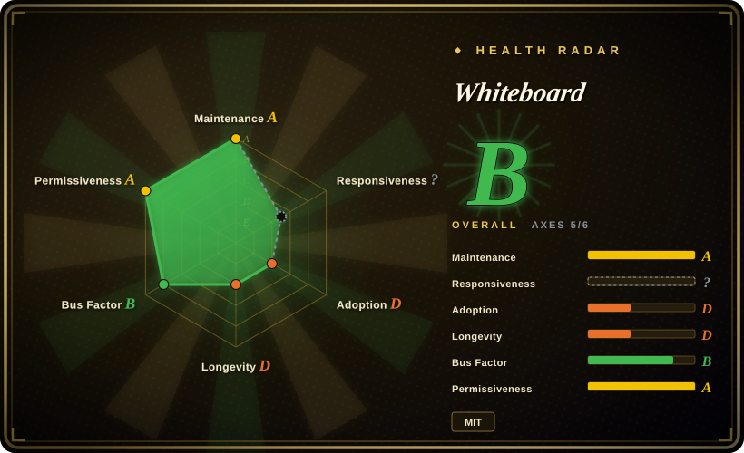
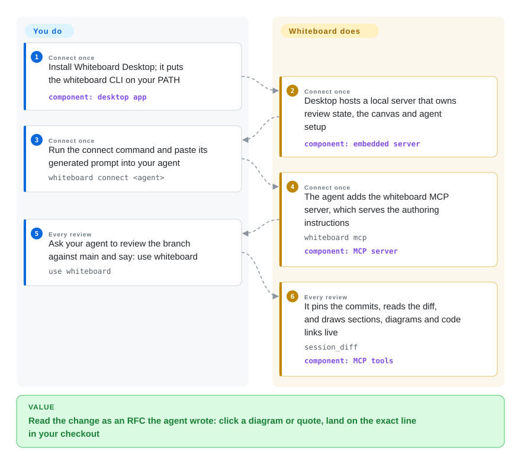

# Whiteboard

Your coding agent just opened a forty-file branch, and the only thing you can review is a wall of unified diff — by the time you notice the new async path dropped a retry, the design that caused it is invisible. Whiteboard hands the canvas to the agent: it draws an interactive, RFC-style review — sequence diagrams, entity-relationship diagrams, quotes from its own trace — where clicking any element jumps to the exact line in your local checkout.

## When to use

You run Claude Code, Codex, Cursor, OpenCode or Pi as your daily driver, and the thing you actually need to review is a *design decision* the agent made — why the new API has this shape, which requirement it interpreted differently — not the 400 diff lines that implement it. The pain is concrete: the agent's summary in chat is prose nobody ties back to code, and scrolling the diff you can't see the control flow you're supposed to trust. You install Whiteboard Desktop, connect your agent once, and ask it to review the branch; it authors a live canvas document pinned to those commits, and you read it the way you'd read a colleague's design doc — clicking a diagram node or a quote lands on the exact source line, with your editor's keybindings and LSP behind it.

The deciding tradeoff against its substitutes is *who authors the review and what it is anchored to*. Plannotator gates the plan before code exists with your annotations blocking the turn; PR-Agent has the machine write line-level findings into the PR; Excalidraw gives you a canvas that never links back to a checkout. Whiteboard is the one where your own agent draws an interactive RFC over an existing branch, every claim hyperlinked to reviewable code (`review-source:head/src/file.ts#L10-L24`), and the semantic diff underneath is AST-aware, not line noise — added functions summarize as pseudocode, tests and docs collapse.

## How it works

The desktop app is a vendored Code — OSS fork (VS Code's editor shell without the Copilot baggage) hosting a local server; it owns review discovery, document state and the canvas, and installs a `whiteboard` CLI shim into `~/.local/bin`. You do three one-time things: install the app, run `whiteboard connect <agent>`, and paste the prompt it prints into your agent — that prompt registers the `whiteboard` MCP server, which serves the authoring instructions. From there the agent does the writing: following those instructions it registers your repository, creates a whiteboard pinned to the commits or PR you named, reads the diff with tools like `session_diff`, and lays down sections — what/why, requirements, design (one sequence/flow/ER diagram), implementation — incrementally, so you watch it draw in real time. The boundary is clean: **you install and ask; the agent authors; the app presents and links**. Reading pays off because elements are anchors, not pixels — a diagram node, a quote from the agent's own trace, a `code_peek` of a contract, each jumping to the exact lines (or `base` for old code), while the optional trace capture (via the FFF MCP) lets the agent query and link the decisions it made autonomously. The AST-aware diff engine underneath, diffr, is a Rust binary from the same org shipped alongside the app.

<!-- flow-steps:begin (generated from flows/whiteboard.json by tools/flow_card.py — do not edit) -->

Text version of the flow

1. **You** (Connect once): Install Whiteboard Desktop; it puts the whiteboard CLI on your PATH — component: `desktop app`
2. **Whiteboard** (Connect once): Desktop hosts a local server that owns review state, the canvas and agent setup — component: `embedded server`
3. **You** (Connect once): Run the connect command and paste its generated prompt into your agent — `whiteboard connect <agent>`
4. **Whiteboard** (Connect once): The agent adds the whiteboard MCP server, which serves the authoring instructions — `whiteboard mcp` — component: `MCP server`
5. **You** (Every review): Ask your agent to review the branch against main and say: use whiteboard — `use whiteboard`
6. **Whiteboard** (Every review): It pins the commits, reads the diff, and draws sections, diagrams and code links live — `session_diff` — component: `MCP tools`

**Value**: Read the change as an RFC the agent wrote: click a diagram or quote, land on the exact line in your checkout

<!-- flow-steps:end -->

## When NOT to use

- **You want to *edit* from the review surface.** The README's own list: "You cannot currently edit files in Whiteboard." It is a read-and-author-the-document tool; if your loop is fix-in-place, stay in your editor or use the [CloudCLI (Claude Code UI)](claudecodeui.md) cockpit to drive the agent that edits.
- **You need the gate before code exists.** Whiteboard reviews pinned commits or branches — after the agent wrote them. If the decision you want to block on is a plan, use [Plannotator](plannotator.md), whose hook stops the agent's turn until you approve; Whiteboard has no such interception.
- **You want findings written automatically, without you reading.** If the requirement is an LLM posting line-level review comments on every PR in CI, use [PR-Agent](../../ai-code-review/pr-agent.md) or [Open Code Review](../../ai-code-review/open-code-review.md) — Whiteboard authors *a narrative for a human*, on demand, and produces nothing unless you ask your agent.
- **Your work is headless — SSH boxes, CI, no desktop session.** The canvas is an Electron app for macOS/Windows/Linux; the CLI and server are headless but there is no way to *view* a whiteboard without the desktop. On a remote box, terminal-native review or [CloudCLI (Claude Code UI)](claudecodeui.md) fits better.
- **You need live multi-person review today.** Share exists, but "updates made after a review is shared don't appear for others" (README Known limitations), and the hosted team product is only *planned*. For social review with notifications and audit trail, use GitHub/GitLab PR review plus a hosted reviewer (CodeRabbit, Greptile — hosted services, not repos).
- **One review must span several repos.** "Working and browsing files across multiple repos in a single review isn't well supported" (README) — split reviews per repo or keep a cross-repo tool like [Sourcegraph](../../rag-retrieval/sourcegraph.md) for that job.
- **You cannot accept default-on telemetry without verifying it off.** Anonymous PostHog telemetry ships enabled (docs/telemetry.md), with a setting and `DO_NOT_TRACK` to disable; crash dumps "can contain process memory, including open source text" and upload on next launch unless telemetry is off (docs/privacy.md). Under strict egress review, disable first, then install. [未验证] — read from docs; no traffic observed.
- **You need a settled dependency.** v0.1.x, ~6 weeks old, ~daily releases and a fresh name (Review→Whiteboard) with legacy paths (`~/.dev/reviews`, `review` package names) still in the tree — expect churn in stored formats and CLI surface. [推断]

## Comparison

| Alternative | In index | Our verdict | Tradeoff |
|---|---|---|---|
| [Plannotator](plannotator.md) | ✅ | Choose Plannotator when review means *gating the agent* — annotate the plan or diff and the turn blocks on your decision; choose Whiteboard when review means *reading an authored explanation* of a branch that already exists, with diagrams linked to code. | A hook inside the loop that stops the agent, versus a presentation layer that informs you — plannotator's artifact is your annotation; Whiteboard's is the agent's document. |
| [PR-Agent](../../ai-code-review/pr-agent.md) | ✅ | Choose PR-Agent when the reviewer should be the machine, commenting line-level on the PR automatically in CI; choose Whiteboard when you drive the analysis yourself — you pick what the agent draws and read the design, not the findings. | Automated coverage of every diff at the cost of depth and noise you triage, versus human-directed narrative that exists only when you ask for it. |
| [Excalidraw](../../diagramming/excalidraw.md) | ✅ | Choose Excalidraw when *you* draw the diagram and want mature hand-drawn multiplayer canvas (126k-star, MIT); choose Whiteboard when the agent draws the diagram and every node must click through to the exact line of the checkout under review. | Free-form, well-oiled, but content-less about your code — Whiteboard's canvas is evidence-linked by construction, and hand-editing is not on its feature list. |
| [CloudCLI (Claude Code UI)](claudecodeui.md) | ✅ | Choose CloudCLI to *drive* agent sessions from a browser or phone (files, terminal, git); choose Whiteboard for the artifact-shaped review of a pinned change the agent authored inside your desktop. | A session cockpit versus a review canvas; both are local-first supervision surfaces aimed at different verbs — operating versus reading. |
| CodeRabbit / Greptile (hosted PR review) | not a repo | Choose a hosted reviewer when the audience is your team with notifications, history and org audit; choose Whiteboard when the audience is one engineer at the machine that has the checkout. | Hosted collaboration is priced, closed and blind to your local agent traces; Whiteboard is MIT, local-first, but single-user shaped today. |

## Tech stack

- **Language/runtime:** TypeScript across a pnpm monorepo; Node 24 pinned by `.nvmrc`/`engines`, `pnpm@11`; the release line is "Review Desktop 0.x".
- **Shell:** the desktop app (`apps/review-desktop/`) vendors a Code — OSS fork under `apps/review-desktop/code-oss/`, pinned to upstream commit `8a7abeba` with a written `UPSTREAM` inventory of cherry-picked security backports (e.g. CVE-2026-81376); Review-owned workbench code lives in `code-oss/src/vs/review/`.
- **Server + storage:** Hono (`@hono/node-server`) embeds the review/JSON API server; documents live in a SQLite store (`~/.dev/review-api.db`) with authoring leases and version snapshots; zod schemas; pino logging; MCP via `@modelcontextprotocol/sdk`.
- **Canvas:** React browser UI under `packages/review/app` (private `@dev.fast/review-canvas`), Vite-built and copied into the desktop app.
- **Diff engine:** diffr — a Rust structural-diff binary from the same org (MIT), bundled per platform (Windows ships from a pinned source commit built with Cargo's lockfile and sha256-stamped).
- **Tooling:** oxlint/oxfmt, TypeScript 7 RC, Vitest browser mode over Playwright Chromium plus Node test suites and manual Electron e2e journeys.

## Dependencies

- **OS:** a desktop macOS, Windows or Linux install (download at dev.fast/install; auto-updates; the app owns the embedded server, no separate service to run). Data under `~/.dev/`.
- **A supported coding agent** with an MCP or plugin surface: packaged plugins for Claude Code, Codex, Cursor, OpenCode, Pi (`packages/agent-plugins/`); others load the shipped `/dev-review` skill via the Agent Skills convention (`~/.agents/skills`).
- **Telemetry egress by default:** PostHog events unless disabled (Settings, or `DO_NOT_TRACK`/`DNT` and friends); crash-dump upload on next launch unless telemetry is off.
- **Optional trace capture (Experimental):** registers the third-party FFF MCP server (`dmtrKovalenko/fff`) and needs an S3/R2 bucket or the hosted trace store (GitHub login + explicit consent); managed git hook dispatcher or Jujutsu commit-trailer template per repo.
- **Building from source:** two pinned Node versions (root `.nvmrc` and `code-oss/.nvmrc`) via fnm/nvm, pnpm 11, Python 3 + C/C++ toolchain, Linux X11 dev libraries, `zstd`, plus Playwright Chromium for DOM tests — a full Code — OSS compile.

## Ops difficulty

**Low to run, heavy to build.** The user path is one desktop install: the app hosts the server, keeps the CLI shim current, re-syncs agent plugins after updates, and everything sits under `~/.dev/` — nothing to operate. Difficulty concentrates in: (1) **churn** — a 0.x line shipping ~daily releases six weeks in, with a stored-data migration story already (`review migrate apply`, legacy MDX import), so pin and back up before upgrading; (2) **the vendored editor fork** — security posture depends on the maintainers' UPSTREAM discipline (they document cherry-picks commit-by-commit, which reads well, but it is one small team's treadmill against VS Code's release pace); (3) **from-source builds** — dual Node versions and a Code — OSS toolchain; (4) **integrations it writes into your machine** — agent configs get the MCP/plugin entries on connect, and enabling trace capture installs a third-party MCP and a managed git hook dispatcher.

## Health & viability

- **Maintenance (as of 2026-09-28).** Exceptionally active: repo created 2026-08-18, last push the day of this check, 15 releases through "Review Desktop 0.1.3" (2026-09-26) — releases roughly every 1–3 days. Not archived. Pace, not maturity.
- **Governance / bus factor.** Owned by the `devdotfast` org ("/dev/fast", homepage dev.fast, created 2026-08-17, 3 public repos); membership is private, and 4 human contributors carry the commits (198/116/55/34) plus bots — a small team, more than one person but effectively vendor-shaped with no `GOVERNANCE`/`CODEOWNERS`. Whether `/dev/fast` is a funded company or how it plans to monetize the planned hosted product: unverifiable from the repo. [未验证]
- **Age & Lindy.** ~6 weeks old with ~2.0k stars (1,977 on the check date) against 3 subscribers and 89 forks — a launch-spike popularity pattern on an unproven artifact. Treat the stars as a hype risk flag per the repo's own heuristic; there is no evidence here for how they were acquired. [推断]
- **Backing & direction.** "A hosted product for teams is planned, and everything will always remain self-hostable" (README) — MIT license, no CLA found in the tree, no relicense history (too young); watch the open-core line between the OSS app and the planned hosted service.
- **Risk flags.** Pre-1.0 API/format churn; the vendored Code — OSS fork inherits a large attack surface (mitigated, visibly, by tracked upstream pins and cherry-picked CVE fixes); anonymous telemetry and crash-dump upload on by default; support routed through Discord; a rename (Review→Whiteboard) still leaking into package names, paths and a dead-looking `devdotfast/review` issue link in CONTRIBUTING.md.

## Caveats (unverified)

- [未验证] The WASM-based diff-plugin system is claimed in the README ("customizable with a WASM-based plugin system"); no `.wasm` asset or plugin-authoring surface was found by searching the repo tree, and it was not exercised.
- [未验证] The "~45% of the codebase is Copilot these days" aside about stock VS Code is README color, not verifiable here.
- [未验证] Supported-agent behavior (Claude Code, Codex, Cursor, OpenCode, Pi) and the connect/prompt flow were read from `onboarding.md`, `connect-prompts.ts`, plugin manifests and the packaged `/dev-review` skill — nothing was installed or run.
- [未验证] Telemetry exclusions ("never includes your code, diffs, prompts…") and the crash-dump upload path are claims from `docs/privacy.md`/`docs/telemetry.md` (last checked 2026-09-24 upstream); no network traffic was observed.
- [推断] Click-to-code with LSP/keybindings is documented and exercised by e2e LSP journeys in the repo, but the jump-into-code UX was not run; the inference is that the journeys test what the README claims.
- [未验证] The star/watcher asymmetry and "launch spike" reading are date-sensitive signals (2026-09-28); no evidence exists in-repo about star provenance.
- [推断] Daily-release churn implying stored-format migration risk is inferred from the release list plus `review migrate apply`/legacy-import machinery, not from a documented breaking change.
