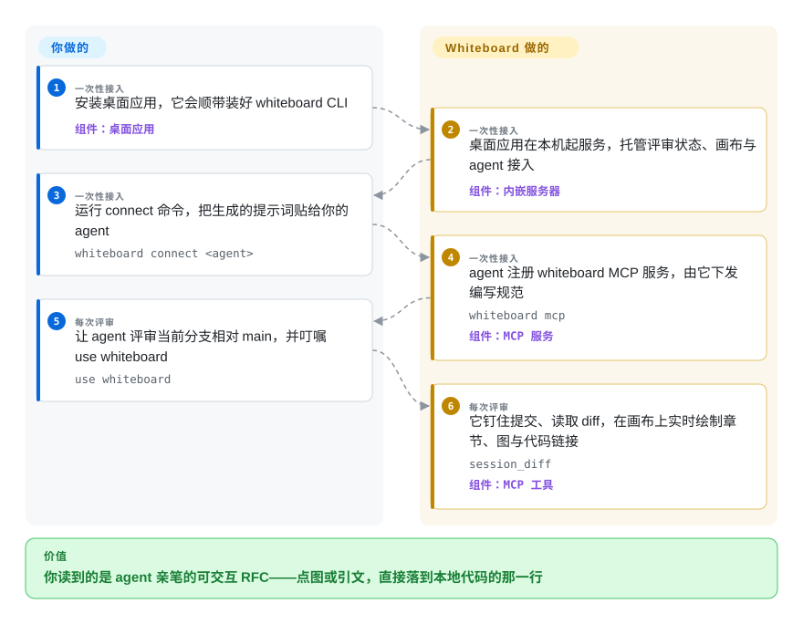

# Whiteboard

编码 agent 刚给你开出一个四十文件的分支，而你能审的只有一整面 unified diff——等你发现新异步路径把重试丢了，造成这件事的设计决策早就看不见了。Whiteboard 把画布交给 agent 自己：它画出一份可交互、RFC 风格的评审——时序图、实体关系图、来自它自身执行轨迹的引文——点任何一个元素就跳到本地 checkout 的确切代码行。

## 何时使用

你日常用 Claude Code、Codex、Cursor、OpenCode 或 Pi 干活，真正需要审的是 agent 做下的一个*设计决策*——新 API 为什么长这样、哪条需求它理解歪了——而不是实现它的四百行 diff。痛点很具体：聊天里 agent 的总结是没人能对回代码的散文，滚 diff 又看不见你本该信任的控制流。装好 Whiteboard 桌面版、一次性接上 agent，然后让它评审这个分支；它会在钉住这些 commit 的画布上实时写出一份文档——你像读同事的设计文档一样读它：点图上的节点或一段引文，落点就是那几行源码，背后还是编辑器的键位和 LSP。

它与替代品之间的决定性取舍是*谁来写评审、评审锚定在什么上*。Plannotator 在代码存在之前拦住计划、用你的批注阻塞这一轮；PR-Agent 让机器把行级 finding 直接写进 PR；Excalidraw 给你一块永远不回链代码的手绘画布。Whiteboard 是那个让你的 agent 自己对已存在的分支画出可交互 RFC 的——每条论断都超链接到可回看的确切代码行（`review-source:head/src/file.ts#L10-L24`），底下的语义 diff 还是 AST 感知的：新增函数折叠成伪代码，测试与文档自动收起。

## 怎么用起来

桌面版本体是一个内嵌的 Code — OSS fork（去掉 Copilot 累赘的 VS Code 编辑器外壳），里面跑着一个本地服务器：评审的发现、文档状态和画布都归它管，同时往 `~/.local/bin` 写一个 `whiteboard` CLI shim。你只需要做三件一次性的事：装好应用、运行 `whiteboard connect <agent>`、把它打印的那段提示词粘给你的 agent——这段提示词的作用是注册 `whiteboard` MCP 服务，由它下发编写规范。剩下的都是 agent 在写：按规范它先登记仓库、创建一个钉在你指定 commit 或 PR 上的 whiteboard，用 `session_diff` 这类工具读 diff，然后按 what/why、需求、设计（一图：时序/流程/ER）、实现的小节顺序增量落笔——你是看着它实时画出来的。边界很清楚：**你负责安装和提问，agent 负责撰写，应用负责呈现和回链**。读的时候回报在于元素都是锚点而非像素——图的节点、agent 自己轨迹里的引文、一段契约的 `code_peek`，点了都跳到确切行号（旧代码用 `base`）；可选的轨迹采集（经 FFF MCP）还让 agent 能查询并回链它自主做出的决定。底下的 AST 感知 diff 引擎 diffr 是同组织的 Rust 二进制，随应用一起打包分发。

<!-- flow-steps:begin (generated from flows/whiteboard.json by tools/flow_card.py — do not edit) -->

流程文字版

1. **你**（一次性接入）：安装桌面应用，它会顺带装好 whiteboard CLI — 组件：`桌面应用`
2. **Whiteboard**（一次性接入）：桌面应用在本机起服务，托管评审状态、画布与 agent 接入 — 组件：`内嵌服务器`
3. **你**（一次性接入）：运行 connect 命令，把生成的提示词贴给你的 agent — `whiteboard connect <agent>`
4. **Whiteboard**（一次性接入）：agent 注册 whiteboard MCP 服务，由它下发编写规范 — `whiteboard mcp` — 组件：`MCP 服务`
5. **你**（每次评审）：让 agent 评审当前分支相对 main，并叮嘱 use whiteboard — `use whiteboard`
6. **Whiteboard**（每次评审）：它钉住提交、读取 diff，在画布上实时绘制章节、图与代码链接 — `session_diff` — 组件：`MCP 工具`

**价值**：你读到的是 agent 亲笔的可交互 RFC——点图或引文，直接落到本地代码的那一行

<!-- flow-steps:end -->

## 何时不用

- **你想在评审界面里*改*文件。** README 自己列的第一条限制：“你现在无法在 Whiteboard 里编辑文件”（原文如此）。它是读与写文档的工具；如果你的循环是就地修改，请留在编辑器里，或用 [CloudCLI（Claude Code UI）](claudecodeui.zh.md) 这种驾驶舱去驱动会改代码的 agent。
- **你要在代码存在之前就设闸门。** Whiteboard 审的是钉住的 commit 或分支——agent 已经写完的东西。要拦的是一个计划，就用 [Plannotator](plannotator.zh.md)：它的 hook 会让 agent 停在原地等你批准；Whiteboard 没有这种拦截。
- **你想要机器自动写 finding、不需要人来读。** 需求若是 CI 里每个 PR 都有 LLM 行级评论，用 [PR-Agent](../../ai-code-review/pr-agent.zh.md) 或 [Open Code Review](../../ai-code-review/open-code-review.zh.md)——Whiteboard 产出的是*给人看的叙事*，你不开口它什么都不画。
- **你的工作环境没有桌面——SSH、CI、无图形会话。** 画布是 macOS/Windows/Linux 的 Electron 应用；CLI 和服务端能无头跑，但离开桌面应用你无法*看*任何一块 whiteboard。远程机器上，终端原生评审或 [CloudCLI（Claude Code UI）](claudecodeui.zh.md) 更合适。
- **你今天就依赖多人实时评审。** 分享存在，但“分享之后评审里的更新不会同步给别人”（README 已知限制），面向团队的托管产品只是*计划中*。要带通知、历史与组织审计的社交评审，用 GitHub/GitLab PR review 加托管评审服务（CodeRabbit、Greptile——是服务，不是仓库）。
- **一次评审必须横跨多个仓库。** “在单个评审里跨多仓库工作与浏览文件支持不佳”（README）——按仓库拆开评审，或把跨仓库检索的活交给 [Sourcegraph](../../rag-retrieval/sourcegraph.zh.md)。
- **默认开启的遥测在你没确认关掉之前不可接受。** 匿名 PostHog 遥测出厂即开（docs/telemetry.md），可在设置或 `DO_NOT_TRACK` 关掉；崩溃转储“可能包含进程内存中的开源文本”，遥测未关时下次启动会上传（docs/privacy.md）。在严格的出网管控环境，先关遥测再安装。[未验证]——读自文档，未实际观测流量。
- **你要一个已经定型的依赖。** v0.1.x、问世约 6 周、约每日发版，且刚经历改名（Review→Whiteboard）、`~/.dev/reviews` 与 `review` 包名等遗留路径仍在树里——存储格式和 CLI 表面都要预期震荡。[推断]

## 横向对比

| 替代品 | 是否收录 | 我们的评价 | 取舍 |
|---|---|---|---|
| [Plannotator](plannotator.zh.md) | ✅ | 评审意味着*拦住 agent*——批注计划或 diff、这一轮由你的决定阻塞时，选 Plannotator；评审意味着*读一份已存在分支的成文解释*、图全部回链到代码时，选 Whiteboard。 | 循环内的 hook 能停住 agent，而呈现层只负责让你看懂——Plannotator 的产物是你的批注，Whiteboard 的产物是 agent 的文档。 |
| [PR-Agent](../../ai-code-review/pr-agent.zh.md) | ✅ | 评审者应该是机器、在 CI 里自动对 PR 逐行评论时选 PR-Agent；分析由你主导、你指定 agent 画什么、读的是设计而不是 finding 时选 Whiteboard。 | 每个 diff 都被自动覆盖，代价是深度与要你筛的噪音；vs 只在你要时才出现、由人定向的叙事。 |
| [Excalidraw](../../diagramming/excalidraw.zh.md) | ✅ | 图由*你自己*画、要成熟的手绘多人画布（126k star、MIT）时选 Excalidraw；图由 agent 画、每个节点都必须点回正在评审的 checkout 时选 Whiteboard。 | 自由、打磨多年，但对你的代码一无所知——Whiteboard 的画布生来就带证据回链，而手写编辑不在它的功能单上。 |
| [CloudCLI（Claude Code UI）](claudecodeui.zh.md) | ✅ | 要从浏览器或手机*驾驶* agent 会话（文件、终端、git）时选 CloudCLI；要对钉住的变更做一次 agent 亲笔的、桌面内的产物化评审时选 Whiteboard。 | 会话驾驶舱 vs 评审画布；同为本地优先的监管界面，动词不同——一个在操作，一个在阅读。 |
| CodeRabbit / Greptile（托管 PR 评审） | 非仓库 | 受众是你团队、要通知/历史/组织审计时选托管评审服务；受众只是手握 checkout 的那一个工程师时选 Whiteboard。 | 托管协作收费、闭源、看不见你本地的 agent 轨迹；Whiteboard 是 MIT、本地优先，但今天仍是单人形态。 |

## 技术栈

- **语言/运行时：** pnpm monorepo 全 TypeScript；Node 24 由 `.nvmrc`/`engines` 钉死、`pnpm@11`；发布线名为 "Review Desktop 0.x"。
- **外壳：** 桌面应用（`apps/review-desktop/`）内嵌 Code — OSS fork，位于 `apps/review-desktop/code-oss/`，钉在上游 commit `8a7abeba`，`UPSTREAM` 文件逐条登记 cherry-pick 的安全回补（如 CVE-2026-81376）；Review 自研工作台代码放在 `code-oss/src/vs/review/`。
- **服务与存储：** Hono（`@hono/node-server`）内嵌评审/JSON API 服务器；文档存 SQLite（`~/.dev/review-api.db`），带撰写租约与版本快照；zod 校验、pino 日志；MCP 用 `@modelcontextprotocol/sdk`。
- **画布：** `packages/review/app` 下的 React 浏览器 UI（私有包 `@dev.fast/review-canvas`），Vite 构建后复制进桌面应用。
- **Diff 引擎：** diffr——同组织的 Rust 结构化 diff 二进制（MIT），按平台打包（Windows 从钉住的源码 commit 用 Cargo lockfile 构建并打 sha256 戳）。
- **工程工具：** oxlint/oxfmt、TypeScript 7 RC、Playwright Chromium 上的 Vitest 浏览器模式加 Node 测试套件，另有手工驱动的 Electron e2e 旅程。

## 依赖

- **操作系统：** 一台桌面 macOS、Windows 或 Linux（dev.fast/install 下载；自动更新；应用自己托管内嵌服务器，没有单独要运维的服务）。数据在 `~/.dev/`。
- **一个受支持的编码 agent**，具备 MCP 或插件面：`packages/agent-plugins/` 里有 Claude Code、Codex、Cursor、OpenCode、Pi 的打包插件；其余 agent 按 Agent Skills 约定从 `~/.agents/skills` 加载随附的 `/dev-review` skill。
- **默认出网的遥测：** PostHog 事件默认上报，除非关掉（设置项或 `DO_NOT_TRACK`/`DNT` 等变量）；遥测未关时崩溃转储在下次启动上传。
- **可选的轨迹采集（实验特性）：** 会注册第三方 FFF MCP 服务（`dmtrKovalenko/fff`），并需要一个 S3/R2 桶或显式同意的托管轨迹库（GitHub 登录）；每个仓库还要托管式 git hook 分发器或 Jujutsu 提交 trailer 模板。
- **从源码构建：** 两个钉住的 Node 版本（根 `.nvmrc` 与 `code-oss/.nvmrc`，经 fnm/nvm 切换）、pnpm 11、Python 3 与 C/C++ 工具链、Linux 的 X11 开发库、`zstd`，DOM 测试还要 Playwright Chromium——这是一次完整的 Code — OSS 编译。

## 运维难度

**跑起来轻，构建起来重。** 用户路径就一个桌面安装：应用自己托管服务器、保持 CLI shim 最新、每次更新后重新同步 agent 插件，一切都在 `~/.dev/` 之下——没有要运维的东西。难度集中在四处：(1) **震荡** ——0.x 线、头六周约每日发版，存储数据迁移机制已经存在（`review migrate apply`、旧 MDX 导入），升级前先钉版本、先备份；(2) **内嵌编辑器 fork** ——安全水位取决于维护者的 UPSTREAM 纪律（他们逐 commit 登记 cherry-pick，观感很好，但这是一个小团队在对抗 VS Code 的发版节奏）；(3) **源码构建** ——双 Node 版本加 Code — OSS 工具链；(4) **写进你机器的集成** ——connect 会往 agent 配置写 MCP/插件条目，打开轨迹采集还会装第三方 MCP 并在仓库挂托管式 git hook 分发器。

## 健康度与可持续性

- **维护（2026-09-28 核）。** 异常活跃：仓库建于 2026-08-18，最后 push 就在核查当天，截至 "Review Desktop 0.1.3"（2026-09-26）共 15 个 release——大约每 1–3 天一发。未归档。这是速度，不是成熟度。
- **治理 / bus factor。** 属 `devdotfast` 组织（"/dev/fast"，主页 dev.fast，建于 2026-08-17，3 个公开仓库）；成员列表私有，人肉贡献者 4 名扛起提交（198/116/55/34）外加 bot——小团队，不止一人，但实为厂商形态，无 `GOVERNANCE`/`CODEOWNERS`。`/dev/fast` 是否有融资、计划中的托管产品怎么变现：仓库内无法核实。[未验证]
- **年龄与 Lindy。** 问世约 6 周、约 2.0k star（核查日 1,977），对 3 个 watcher、89 fork——未经验证的产物上的发布冲击型热度。按本索引自己的启发式，把 star 当热度风险旗而非证据；star 来源在本仓库内没有证据。[推断]
- **背书与走向。** README 写明“面向团队的托管产品在计划中，一切将永远可自托管”——MIT，树里未见 CLA，太年轻没有重授权史；要盯的是 OSS 应用与计划中托管服务之间的 open-core 分界线。
- **风险旗。** pre-1.0 的 API/格式震荡；内嵌 Code — OSS fork 继承大攻击面（可见地由钉住的上游与 cherry-pick 的 CVE 修复缓解）；匿名遥测与崩溃转储默认开；支持走 Discord；改名（Review→Whiteboard）仍渗漏在包名、路径里，CONTRIBUTING.md 还挂着一个疑似失效的 `devdotfast/review` issue 链接。

## 存疑（未验证）

- [未验证] README 声称 diff 查看“可用基于 WASM 的插件系统定制”；在仓库树里搜不到 `.wasm` 资产或插件编写面，也没有实测。
- [未验证] “如今约 45% 代码库是 Copilot”这句关于原版 VS Code 的插话是 README 修辞，此处无法核实。
- [未验证] 支持的 agent 行为（Claude Code、Codex、Cursor、OpenCode、Pi）与 connect/粘提示流程，读自 `onboarding.md`、`connect-prompts.ts`、插件清单和随附的 `/dev-review` skill——什么都没安装、没运行。
- [未验证] 遥测排除项（“绝不含你的代码、diff、提示词……”）与崩溃转储上传路径，是 `docs/privacy.md`/`docs/telemetry.md` 的声明（上游最后核对 2026-09-24）；未观测任何实际流量。
- [推断] 点图入码带 LSP/键位一事有文档与仓内 e2e LSP 旅程佐证，但没有跑过这个 UX；推断内容是“这些旅程测的正是 README 所说的东西”。
- [未验证] star 与 watcher 的比例及“发布冲击”解读是日期敏感的信号（2026-09-28）；star 如何获得，仓库内无证据。
- [推断] “每日发版的震荡意味着存储格式迁移风险”是从 release 清单加 `review migrate apply`/旧版导入机制推断的，不是任何文档化的破坏性变更。
