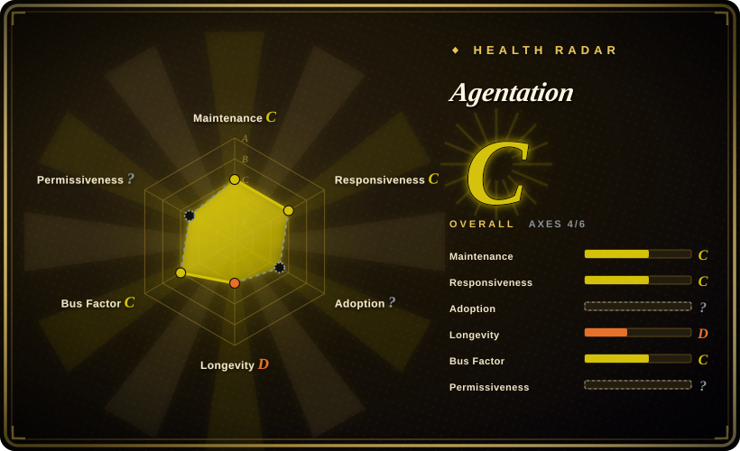
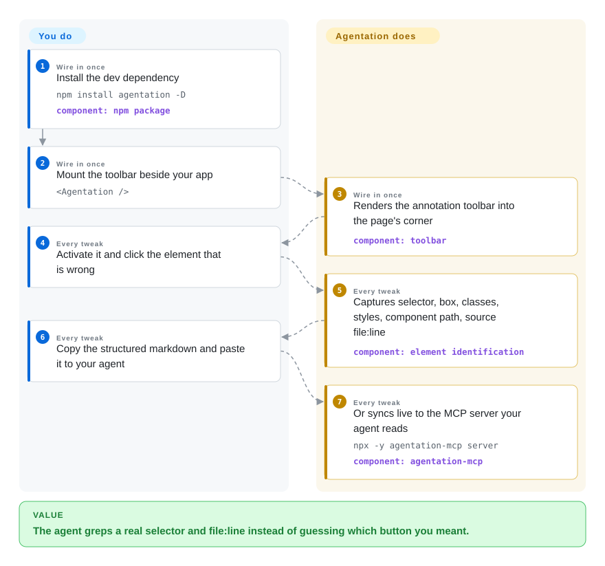

# Agentation

You tell your coding agent "the blue button in the sidebar is wrong" and it edits a different button, because the description never identified *which* DOM node you meant. Agentation puts a toolbar inside your running app: click the element, type the note, and the agent receives a selector, bounding box, class names, computed styles, React component path, and — in dev builds — the source `file:line`, so it can grep straight to the code.

## When to use

You're a React developer driving a coding agent (Claude Code, Codex, any MCP client) on a web app, and UI feedback loops fail on the reference problem: you describe what you see, the agent guesses which component you meant, and half the turns are wasted on "no, that button — the other one." You install `agentation` as a dev dependency, mount `<Agentation />` beside your app, and from then on you click the mis-rendered element and paste its structured markdown to the agent. Decide it against the alternatives on two axes. Against the in-app browsers of Cursor or Antigravity: those bind you to one IDE and only see their own tab, while Agentation renders inside *your* app with your dev server, hot reload, and any terminal agent. Against the browser-extension tools in this category (Pointa, Vibe Annotations): extensions never touch your app's code, but they can't see the React tree — Agentation can't run without your app being React, but it pulls component names and `file:line` out of the fiber tree, which an extension structurally cannot. It is the leader of this niche by a wide margin (4.8k stars vs. all competitors under 1k), so integration examples and MCP wiring are the most battle-tested here.

## Q&A

- **Q: Isn't this space full of strong competitors?** A: It's crowded but shallow — by 2026-09 the same-niche projects we indexed (earmark, markupkit, patch-mark, Pointa, Vibe Annotations) all sit under 200 stars, several dormant; Agentation's 4.8k stars and ~5.3M monthly npm downloads are the whole category's center of gravity. The small ones survive on one different mechanism each — see the comparison table.
- **Q: How does it know which code "the element I clicked" is?** A: Three stacked reads of the live DOM: an ancestor path of id/classes/test-ids; React's fiber keys (`__reactFiber$…`, the same hooks DevTools uses) for the component path; and `_debugSource` — falling back to *invoking the component with a throwing hooks dispatcher and parsing the stack trace* — for `file:line`. Details in How it works.

## How it works

The toolbar is one React component with zero runtime dependencies (React peer only); its UI lives in a shadow root so it can't collide with your styles. When you click an element, it walks the ancestors to build a readable path, stripping CSS-module hashes (`_3aB7x` junk) so classes stay greppable, marks shadow and iframe boundaries, and snapshots bounding box, computed styles (property set chosen by element type — typography for text, layout for containers), accessibility attributes, and nearby text. For React apps it reads the fiber tree — the internal `__reactFiber$` keys React attaches in dev — to name the component chain (`<App> <Dashboard> <ExportButton>`), filtering known framework internals like Next.js routers. The `file:line` is the hard part: dev builds may carry `_debugSource` on the fiber, and when they don't (React 19 + SWC strips it), the code *calls your component function with React's hooks dispatcher swapped for a throwing Proxy* — the first `useState` blows up with a stack trace, the frame is parsed, bundler URL prefixes are stripped, and the dispatcher is restored. Feedback leaves as markdown on the clipboard, via `onSubmit`/callback props, or through `endpoint` to the separate `agentation-mcp` package — a local HTTP + SQLite server that exposes pending annotations to the agent as MCP tools.

<!-- flow-steps:begin (generated from flows/agentation.json by tools/flow_card.py — do not edit) -->

Text version of the flow

1. **You** (Wire in once): Install the dev dependency — `npm install agentation -D` — component: `npm package`
2. **You** (Wire in once): Mount the toolbar beside your app — `<Agentation />`
3. **Agentation** (Wire in once): Renders the annotation toolbar into the page's corner — component: `toolbar`
4. **You** (Every tweak): Activate it and click the element that is wrong
5. **Agentation** (Every tweak): Captures selector, box, classes, styles, component path, source file:line — component: `element identification`
6. **You** (Every tweak): Copy the structured markdown and paste it to your agent
7. **Agentation** (Every tweak): Or syncs live to the MCP server your agent reads — `npx -y agentation-mcp server` — component: `agentation-mcp`

**Value**: The agent greps a real selector and file:line instead of guessing which button you meant.

<!-- flow-steps:end -->

## When NOT to use

- **Your app isn't React.** The element-capture half works anywhere, but the component path and source detection are React-fiber-specific. For framework-agnostic annotation with deterministic `file:line`, use [earmark](earmark.md) (build-time stamping for Vite/webpack/Svelte/HTML); for a framework-agnostic core with Vue/Svelte adapters, the repo itself is gone — the closest living options are [patch-mark](patch-mark.md) (any page via web component) or [markupkit](markupkit.md) (React-only too, but freehand-first).
- **You won't add a dependency to the app.** Anything that renders inside your app means editing app code. If the rule is "touch no project file", use a browser-extension tool like [Pointa](pointa.md) or [Vibe Annotations](vibe-annotations.md) instead — they lose fiber/source data but need zero integration.
- **License purity is a gate.** PolyForm Shield is a source-*available* license that forbids others from productizing the tool itself; it is not OSI open source. If your org requires an OSI license, use MIT-covered [earmark](earmark.md) or [patch-mark](patch-mark.md).
- **You need production-build source locations.** `_debugSource` and the stack-probe both depend on dev-mode code; in a stripped production build you get selectors and styles only. earmark's build-plugin stamping is the design that survives where metadata was compiled in on purpose.
- **The review target is the agent's output, not your running app.** For annotating plans/diffs, see [Plannotator](../supervision-surfaces/plannotator.md).

## Comparison

| Alternative | In index | Our verdict | Tradeoff |
| --- | --- | --- | --- |
| [earmark](earmark.md) | ✅ | Pick Agentation for a maintained, widely adopted loop with live fiber data; pick earmark only when you need build-time-stamped `file:line` in a non-React (Svelte/vanilla) stack and accept a 0-star, burst-then-dormant project. | Agentation = category leader with real cadence but React-only and non-OSI; earmark = MIT, framework-agnostic, deterministic source paths, and effectively no community. |
| [Pointa](pointa.md) | ✅ | Choose Pointa when the constraint is "never modify app code" — it's a Chrome extension; choose Agentation when you want component names and source lines, which need to live inside the React tree. | Extension = zero integration but no fiber access, localhost+Chromium only; component = best data fidelity, costs a dev dependency. |
| [Vibe Annotations](vibe-annotations.md) | ✅ | Choose Agentation — it is the same shape (annotate localhost, MCP read-back) with an order of magnitude more adoption; Vibe earns its row only for its non-developer sharing paths (file sharing, watch mode). | Agentation: in-app precision, in-app obligation. Vibe: extension convenience, a similar PolyForm Shield, ~170 stars. |
| [markupkit](markupkit.md) | ✅ | Pick Agentation for click-to-annotate; pick markupkit only for its freehand layer — circles, arrows, strikethroughs classified into shapes — and accept a dormant learning project. | Freehand expression vs. structured element capture; both are React components, only one has 5M downloads/month. |
| [patch-mark](patch-mark.md) | ✅ | Choose Agentation inside a React app; choose patch-mark when you must annotate a third-party preview page (docs site, staging of anything) with two lines and no install step. | Zero-dep web component with an explicit untrusted-evidence threat model vs. fiber-deep capture. |
| [Plannotator](../supervision-surfaces/plannotator.md) | ✅ | Complementary, not competing: Plannotator annotates what the agent wrote (plan/diff) and gates the turn; Agentation annotates what your app renders and feeds the next turn. | Run both when the human reviews artifacts *and* the UI. |
| Cursor / Antigravity built-in browser element pickers | not a repo | Use the IDE's built-in picker when you already live in that IDE and annotate only its own preview; choose Agentation when your agent is a terminal CLI or a different editor than the one rendering the page. | Zero install, but bound to the vendor's browser surface and closed-source app. |

## Tech stack

- **Language/build:** TypeScript, React 18+ peer dependency only, SCSS modules, no runtime libraries; toolbar UI rendered in a shadow root with a Popover-API top-layer surface on supporting browsers.
- **DOM internals used:** `getComputedStyle`, ancestor walking across `getRootNode()` shadow boundaries, React fiber keys (`__reactFiber$` / `__reactInternalInstance$`), `_debugSource`, and React's internal hooks dispatcher (`__SECRET_INTERNALS_…` on React 16–18, `__CLIENT_INTERNALS_…H` on 19) for the stack-probe fallback.
- **MCP companion:** `agentation-mcp` (separate package) — Node.js process serving HTTP on :4747 plus stdio MCP tools; SQLite persistence (needs Node 20+, 24 LTS recommended). Screenshots use a vendored DOM-to-image approach.

## Dependencies

- The React package itself needs only your app: nothing to run, nothing to deploy — clipboard/copy mode works with zero infrastructure.
- The optional agent-sync path needs the local `agentation-mcp` server on a dev machine (npx, no accounts, no cloud).
- Dev-mode app builds for component-name and source-file capture; production builds yield selectors, classes, geometry, and computed styles only.

## Ops difficulty

**Low.** A dev dependency and one mounted component: no service in CI, no data directory unless you run the MCP server, and annotations live in browser storage until copied or synced. The recurring cost is *awareness*: the toolbar must stay gated to dev builds (you mount it yourself), and the MCP server is another local port (:4747) whose SQLite state you may eventually want to clear. Upstream ships fast — weekly-ish releases through 2026-09 — so version pinning matters more than operation.

## Health & viability

- **Maintenance — very active (as of 2026-09-27).** Last push 2026-09-22; GitHub releases tagged 2026-09-21 (v3.1.0 line plus an `mcp-v1.3.0`); npm at v3.1.2. ~5.29M downloads/last-month for the `agentation` package.
- **Governance / bus factor.** Single-owner repo (benjitaylor) with 12 contributors; no foundation or company backing visible.
- **Age / Lindy.** Created 2026-01-18 — about 8 months old. Young for a Lindy prior, but the adoption slope (4.8k stars, 390 forks) is the steepest in this category by far; treat it as the category anchor, not a proven decade-old tool.
- **Backing.** Solo author monetizing attention (docs site agentation.com); no vendor SLA. If he stops, the fiber/dispatcher tricks meet a React upgrade without a maintainer — the failure mode to watch.
- **Risk flags.** PolyForm Shield 1.0.0 (source-available, restricts productizing the tool; not OSI); "reaches into React internals" design means upstream changes can silently degrade the source-file feature; 16 open issues (as of 2026-09-27).

## Caveats (unverified)

- [未验证] Shadow DOM / same-origin iframe support, animation freezing, and the Popover top-layer behavior are read from the README and source files, not exercised in a browser against a fixture app.
- [未验证] `agentation-mcp` tool surface beyond `agentation_get_all_pending` (which the README names) was not enumerated from source; SQLite persistence details are from `mcp/README.md`, not from running it.
- [推断] "Weekly-ish release cadence" is inferred from the release/tag timestamps visible via the GitHub API in 2026-09, not a full history audit.
- [推断] The judgment that extensions "structurally cannot" read the fiber tree holds for content-script isolation, but a devtools-API extension could in principle reach it; stated as a design contrast, not a browser-law impossibility.
- [未验证] The 4.8k-star / 5.29M-download figures are GitHub and npm API values captured 2026-09-27 and will drift quickly.
