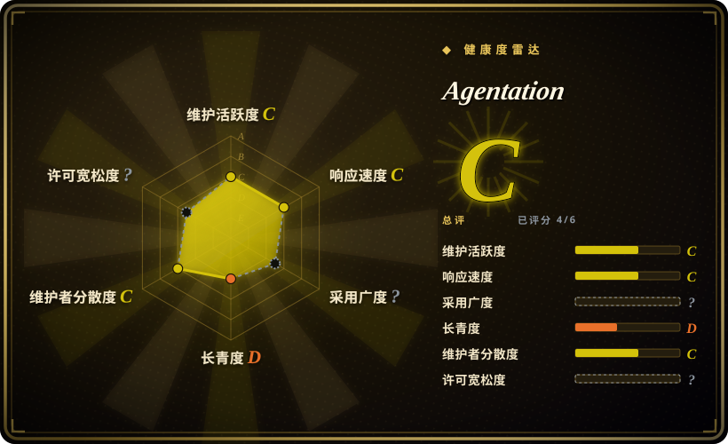
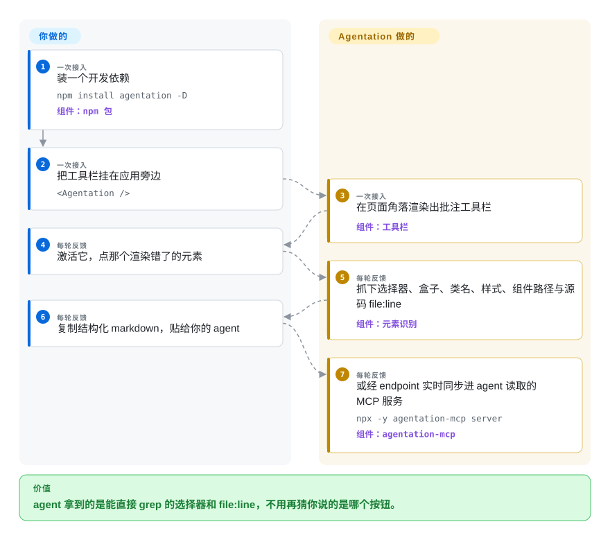

# Agentation

你对着编码 agent 说「侧边栏那个蓝色按钮不对」，它改了另一个按钮——因为你的描述从来没指认过是*哪个* DOM 节点。Agentation 往你运行中的应用里放一条工具栏：点中元素、写下批注，agent 收到的是选择器、盒子位置、类名、计算样式、React 组件路径，开发构建下还带源码 `file:line`，可以直接 grep 到代码。

## 何时使用

你是一个用 React 写界面的开发者，日常让编码 agent（Claude Code、Codex 或任何 MCP 客户端）改 web 应用，而 UI 反馈循环总死在「指代」上：你描述你看到的，agent 猜你说的是哪个组件，一半的回合耗在「不是这个按钮，是旁边那个」。你把 `agentation` 装成开发依赖，在应用旁边挂上 `<Agentation />`，之后点那个渲染错了的元素，把它的结构化 markdown 贴给 agent。和替代品的决策在两条轴上。对比 Cursor、Antigravity 的内嵌浏览器：那些把你绑死在某个 IDE、只看它自己的页签，而 Agentation 渲染在*你的*应用里，用你的 dev server、热更新，agent 换谁都行。对比本分类的浏览器扩展类工具（Pointa、Vibe Annotations）：扩展不碰应用代码，但也看不见 React 树——Agentation 反过来，应用必须是用 React 写的，它却能从 fiber 树里拽出组件名和 `file:line`，这是扩展结构上拿不到的。它是这个小类里断层式的第一（4.8k 星，其余竞品都在 1k 以下），集成范例和 MCP 接线也是这里最经得起用的。

## 快问快答

- **问：这个赛道竞品不少吧？** 答：拥挤但都浅——截至 2026-09，我们收录的同赛道项目（earmark、markupkit、patch-mark、Pointa、Vibe Annotations）全在 200 星以下、好几个已停更；Agentation 的 4.8k 星与约 530 万月下载就是这个品类的全部重心。小项目各靠一个差异化机制活着——见横向对比表。
- **问：它怎么知道你点的元素对应哪段代码？** 答：对活 DOM 做三层叠加读取：祖先链拼出 id/类名/test-id 路径；读 React 的 fiber 键（`__reactFiber$…`，和 DevTools 同款）得到组件链；`_debugSource` 拿 `file:line`，拿不到时退而*用一个逢访问即 throw 的 Proxy 换掉 hooks dispatcher 去调用组件函数*，从炸出来的堆栈里解析源文件位置。细节在「怎么用起来」。

## 怎么用起来

工具栏是一个零运行时依赖的 React 组件（只有 React peer），UI 住在 shadow root 里以免和你的样式打架。你点击元素时，它沿祖先链拼一段可读路径，顺手剥掉 CSS module 的哈希尾巴（`_3aB7x` 这类）让类名保持可 grep，标注 shadow 与 iframe 边界，再快照盒子、计算样式（按元素类型挑属性——文字元素给排版、容器给布局）、无障碍属性和邻近文本。对 React 应用，它读 fiber 树——React 在 dev 下挂在 DOM 元素上的 `__reactFiber$` 内部键——得到组件链（`<App> <Dashboard> <ExportButton>`），并把 Next.js 路由这类框架内部组件过滤掉。`file:line` 是难的部分：dev 构建的 fiber 上可能带 `_debugSource`，不带时（React 19 + SWC 会剥掉），代码*把 React 的 hooks dispatcher 换成逢属性访问即 throw 的 Proxy，然后调用你的组件函数*——第一个 `useState` 就炸出带堆栈的 Error，解析那一帧、剥掉 bundler 的 URL 前缀、再恢复 dispatcher。反馈的出口：剪贴板上的 markdown、`onSubmit`/回调 props，或者经 `endpoint` 同步给独立的 `agentation-mcp` 包——一个本地 HTTP + SQLite 服务，把待处理批注以 MCP 工具形式摊给 agent。

<!-- flow-steps:begin (generated from flows/agentation.json by tools/flow_card.py — do not edit) -->

流程文字版

1. **你**（一次接入）：装一个开发依赖 — `npm install agentation -D` — 组件：`npm 包`
2. **你**（一次接入）：把工具栏挂在应用旁边 — `<Agentation />`
3. **Agentation**（一次接入）：在页面角落渲染出批注工具栏 — 组件：`工具栏`
4. **你**（每轮反馈）：激活它，点那个渲染错了的元素
5. **Agentation**（每轮反馈）：抓下选择器、盒子、类名、样式、组件路径与源码 file:line — 组件：`元素识别`
6. **你**（每轮反馈）：复制结构化 markdown，贴给你的 agent
7. **Agentation**（每轮反馈）：或经 endpoint 实时同步进 agent 读取的 MCP 服务 — `npx -y agentation-mcp server` — 组件：`agentation-mcp`

**价值**：agent 拿到的是能直接 grep 的选择器和 file:line，不用再猜你说的是哪个按钮。

<!-- flow-steps:end -->

## 何时不用

- **你的应用不是 React。** 抓元素那半边到处都能用，但组件路径和源码定位是 React fiber 专属。要框架无关且 `file:line` 确定，用 [earmark](earmark.zh.md)（Vite/webpack/Svelte/HTML 的构建期打戳）；曾有的「框架无关核心 + Vue/Svelte adapter」仓库已下架，活着的最接近选项是 [patch-mark](patch-mark.zh.md)（两行挂任何页面）或 [markupkit](markupkit.zh.md)（同样 React-only，但手绘优先）。
- **不许往应用里加依赖。** 凡是渲染在你应用进程里的东西都要改应用代码。规则若是「一个项目文件都不碰」，改用浏览器扩展 [Pointa](pointa.zh.md) 或 [Vibe Annotations](vibe-annotations.zh.md)——放弃 fiber/源码数据，换零集成。
- **许可纯度是硬门槛。** PolyForm Shield 是 source-available 许可，禁止他人把这个工具本身产品化，不是 OSI 开源。组织要求 OSI 许可时，用 MIT 的 [earmark](earmark.zh.md) 或 [patch-mark](patch-mark.zh.md)。
- **要在生产构建里定位源码。** `_debugSource` 和堆栈探测都依赖 dev 代码；production 剥离后只剩选择器与样式。要「元数据是特意编进产物」的设计，看 earmark 的构建插件。
- **审的是 agent 的产出而不是你的运行界面。** 批注计划/diff 请去 [Plannotator](../supervision-surfaces/plannotator.zh.md)。

## 横向对比

| 替代品 | 是否收录 | 我们的评价 | 取舍 |
| --- | --- | --- | --- |
| [earmark](earmark.zh.md) | ✅ | 要有人维护、被广泛使用、拿活体 fiber 数据的闭环，选 Agentation；只有当你在非 React 栈（Svelte/vanilla）里需要构建期打戳的 `file:line`、且接受一个 0 星、两天热度后沉寂的项目，才选 earmark。 | Agentation 是品类头名但 React-only、非 OSI；earmark 是 MIT、框架无关、源码路径确定，代价是几乎不存在社区。 |
| [Pointa](pointa.zh.md) | ✅ | 约束是「绝不改应用代码」时选 Pointa——它是 Chrome 扩展；要组件名和源码行就回 Agentation，那些必须活在 React 树内部。 | 扩展零集成但拿不到 fiber，且仅限 localhost + Chromium；组件保真度最高，代价是一个开发依赖。 |
| [Vibe Annotations](vibe-annotations.zh.md) | ✅ | 一般选 Agentation——同一个形状（批注 localhost、MCP 回读）却有数量级更高的采用；Vibe 只在它的非开发者分享路径（文件分享、watch 模式）上赢一行。 | Agentation：应用内精度、应用内义务。Vibe：扩展便利、同款 PolyForm Shield、约 170 星。 |
| [markupkit](markupkit.zh.md) | ✅ | 点选批注选 Agentation；只有当你需要那层手绘——圈、箭头、删除线被分类成形状——才选 markupkit，并接受一个自我声明的学习型停更项目。 | 手绘表达力对结构化元素捕获；同为 React 组件，只有一个月下载 500 万。 |
| [patch-mark](patch-mark.zh.md) | ✅ | 在自己的 React 应用里选 Agentation；要批注第三方预览页（文档站、任意 staging）且只肯加两行、零安装步骤时选 patch-mark。 | 零依赖 web component 加明示的「不可信证据」威胁模型，对 fiber 深捕获。 |
| [Plannotator](../supervision-surfaces/plannotator.zh.md) | ✅ | 互补而非竞争：Plannotator 批注 agent 写的东西（计划/diff）并卡住这一步；Agentation 批注你的应用渲染的东西、喂给下一步。 | 人既审产物又审 UI 时，两个一起上。 |
| Cursor / Antigravity 内嵌浏览器的元素选择器 | 非仓库 | 你本来就住在那个 IDE、只批注它自己的预览页时，用 IDE 内建；agent 是终端 CLI、或渲染页面和编辑器不是一家时，选 Agentation。 | 零安装，但绑厂商的浏览器面与闭源应用。 |

## 技术栈

- **语言/构建：** TypeScript，React 18+ 仅 peer dependency，SCSS modules，无运行时库；工具栏 UI 渲染进 shadow root，在支持的浏览器上用 Popover API 的 top-layer 面。
- **用到的 DOM 内部机制：** `getComputedStyle`、跨 `getRootNode()` shadow 边界的祖先遍历、React fiber 键（`__reactFiber$` / `__reactInternalInstance$`）、`_debugSource`，以及 React 内部 hooks dispatcher（16–18 是 `__SECRET_INTERNALS_…`，19 是 `__CLIENT_INTERNALS_…H`）供堆栈探测回退。
- **MCP 伴侣：** `agentation-mcp`（独立包）——Node.js 进程，:4747 上 HTTP 加 stdio MCP 工具；SQLite 持久化（需 Node 20+，推荐 24 LTS）。截图走 vendored 的 DOM-to-image 路线。

## 依赖

- React 包本身只要你的应用：没有要跑的服务、没有要部署的东西——复制粘贴模式零基础设施。
- 可选的 agent 同步路要本机跑 `agentation-mcp`（npx，无账号、无云端）。
- 组件名与源码文件捕获依赖应用的 dev 构建；production 构建只剩选择器、类名、几何与计算样式。

## 运维难度

**低。** 一个开发依赖加一处挂载：CI 里没有服务、不开 MCP 服务就没有数据目录，批注在浏览器存储里躺到被复制或同步为止。长期成本是*注意力*：工具栏得一直锁在 dev 构建里（挂载由你控制），MCP 服务是本机又一个端口（:4747），它的 SQLite 状态早晚会想清一清。上游发布很快——2026-09 前后约周更——所以版本锁定比运维更重要。

## 健康度与可持续性

- **维护——非常活跃（截至 2026-09-27）。** 最后推送 2026-09-22；GitHub release 打于 2026-09-21（v3.1.0 线外加一个 `mcp-v1.3.0`）；npm 至 v3.1.2。`agentation` 包上月下载约 529 万。
- **治理／巴士因子。** 单一作者仓库（benjitaylor），12 名 contributor；未见基金会或公司背书。
- **年龄／Lindy。** 建仓 2026-01-18——约 8 个月。作为 Lindy 先验它很年轻，但采用斜率（4.8k 星、390 fork）是本类最陡；把它当品类锚点，别当十年老工具。
- **背书。** 单人作者靠注意力变现（文档站 agentation.com）；没有厂商 SLA。他停更时，fiber/dispatcher 这套机关遇到 React 升级将无人接盘——这是头号要盯的失效模式。
- **风险标记。** PolyForm Shield 1.0.0（source-available，限制产品化，非 OSI）；「伸手进 React 内部」的设计意味着上游改动可能静默劣化源码定位功能；16 个 open issue（截至 2026-09-27）。

## 存疑（未验证）

- [未验证] shadow DOM／同源 iframe 支持、动画冻结、Popover top-layer 行为读自 README 与源文件，未在浏览器里对着 fixture 应用实测。
- [未验证] `agentation-mcp` 除 README 点名的 `agentation_get_all_pending` 之外的工具面未从源码逐一枚举；SQLite 持久化细节来自 `mcp/README.md`，未实际运行。
- [推断] 「约周更」是从 2026-09 经 GitHub API 可见的 release/tag 时间戳推断，未做完整历史审计。
- [推断] 「扩展结构上读不到 fiber」成立于 content script 隔离，但理论上 devtools-API 扩展可及；此句是设计对比，不是浏览器安全定律。
- [未验证] 4.8k 星／529 万月下载为 2026-09-27 从 GitHub 与 npm API 抓取的瞬时值，漂移很快。
