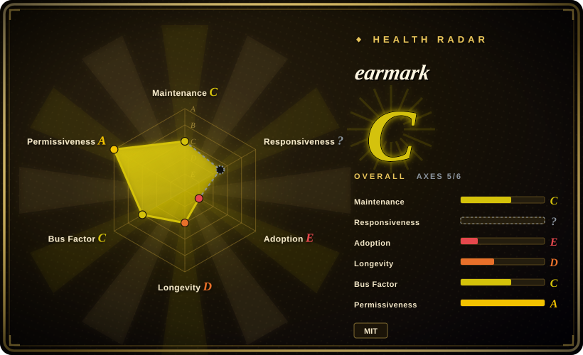
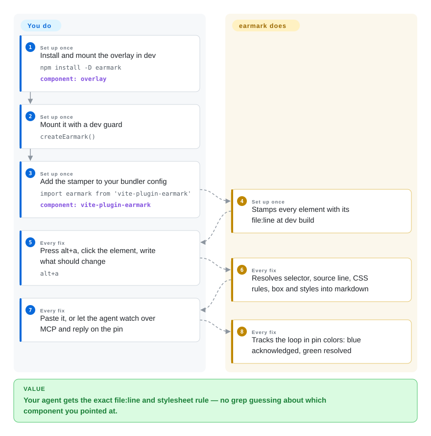

# earmark

"Should we grep for this button or just open the file?" — with runtime-only annotation you always grep, and React 19 + SWC stripped the debug metadata that used to tell you where the element came from. earmark answers the location at *build time*: a Vite plugin or webpack/Turbopack loader stamps every JSX/Svelte element with `data-earmark-src="src/Card.tsx:42:7"`, and its click-to-annotate overlay hands your coding agent the selector, that source line, the component path, computed styles, and box geometry — with a broker + MCP server that carries a full open → acknowledged → resolved lifecycle.

## When to use

You're working on a Svelte, vanilla, or mixed-framework frontend where [Agentation](agentation.md)'s runtime fiber-reading finds no component names or source lines — or you simply don't want an annotation tool probing React internals at all. You add `vite-plugin-earmark` (or `withEarmark` for Next.js, or the Svelte preprocessor), and the annotation output starts carrying exact `file:line` for both client and server renders. Choose earmark for three mechanisms nobody else in the niche has together: *deterministic* source paths stamped at build rather than reverse-engineered at click; *CSS rule resolution* that maps every rule styling the element back to its declaring file and line — "the padding you need lives at line 49 of the generic `button` rule, not `.primary`" — which works even on a plain static HTML page with no build at all; and an honest MCP state machine (`earmark_acknowledge` / `ask` / `resolve` / `dismiss`) that tells you whether a slow agent is working on your pin or ignoring you. The deciding tradeoff: you get the best *evidence pipeline* in this category and the weakest *survival odds* — it's a 0-star project whose public history is two days long.

## How it works

Three pieces, each optional alone. The **overlay** (`npm install -D earmark`, call `createEarmark()` in dev, or a plain `<script>` tag) gives you a toolbar: click an element, `T` for text selection, drag for regions, plus a freeze button for animations/video — no build step required; it degrades to selectors and styles when nothing stamped the source. The **stampers** (`vite-plugin-earmark`, `earmark-loader` for Next.js webpack+Turbopack, `earmark-stamp` preprocessor for Svelte) write `data-earmark-src="path:line:col"` onto every intrinsic element at dev-build time; for plain HTML, earmark instead re-fetches your served document and walks a position-tracked parse to find the line (and refuses to guess on framework shells). The **broker + MCP** (`claude mcp add earmark -- npx -y earmark-mcp`) runs one process that stores annotations (JSON or `node:sqlite`), streams state over SSE, and exposes the tool surface agents drive: `watch` blocks until you annotate, then `acknowledge → edit → resolve` moves your pin orange → blue → green. What the project owns: the picker, resolvers, broker, and MCP protocol; what you own: mounting the overlay and adding the plugin, and running the agent loop.

<!-- flow-steps:begin (generated from flows/earmark.json by tools/flow_card.py — do not edit) -->

Text version of the flow

1. **You** (Set up once): Install and mount the overlay in dev — `npm install -D earmark` — component: `overlay`
2. **You** (Set up once): Mount it with a dev guard — `createEarmark()`
3. **You** (Set up once): Add the stamper to your bundler config — `import earmark from 'vite-plugin-earmark'` — component: `vite-plugin-earmark`
4. **earmark** (Set up once): Stamps every element with its file:line at dev build
5. **You** (Every fix): Press alt+a, click the element, write what should change — `alt+a`
6. **earmark** (Every fix): Resolves selector, source line, CSS rules, box and styles into markdown
7. **You** (Every fix): Paste it, or let the agent watch over MCP and reply on the pin
8. **earmark** (Every fix): Tracks the loop in pin colors: blue acknowledged, green resolved

**Value**: Your agent gets the exact file:line and stylesheet rule — no grep guessing about which component you pointed at.

<!-- flow-steps:end -->

## When NOT to use

- **You need something maintained.** earmark's entire public history is 2026-08-17 through 2026-08-19 with 0 stars; nobody but you will notice when Vite or Next breaks the stamper. For a living project with 5M monthly downloads, use [Agentation](agentation.md) — if your stack is React, that's the default anyway.
- **Your stack is plain React and you want zero config.** earmark's edge is build-time stamping for non-React and stripped-metadata cases; in a React app the runtime fiber read is enough, and Agentation needs no plugin at all.
- **You can't vet a six-package supply chain that appeared two days before you.** npm hygiene signals are thin — no download history, no third-party eyes — and the "clean-room implementation" claim in its README is unverifiable by anyone but the author. If adoption requires a dependency someone else has scrutinized, take [patch-mark](patch-mark.md) (MIT, single package, simpler surface) or [Agentation](agentation.md) instead.
- **You want screenshots.** earmark refuses by design — it argues DOM-to-image re-renders are fake evidence and hands the agent a selector + URL instead. If the pixel state itself is the feedback, use [markupkit](markupkit.md) (PNG capture) or an extension tool that grabs real pixels like [Vibe Annotations](vibe-annotations.md).
- **You're on Windows or behind policies that ban unvetted npm workspaces.** Six packages (`earmark`, `earmark-server`, `earmark-mcp`, `vite-plugin-earmark`, `earmark-loader`, `earmark-stamp`) publish in lockstep and the README itself warns that re-running release can half-publish; pin exact versions.

## Comparison

| Alternative | In index | Our verdict | Tradeoff |
| --- | --- | --- | --- |
| [Agentation](agentation.md) | ✅ | When your app is React and you'll keep this dependency for years, choose Agentation — maintained, adopted, and it recovers `file:line` at runtime without build access; choose earmark for non-React stacks, Next.js/SWC where debug metadata is stripped, and the CSS-rule-level "which stylesheet line to edit" answer. | Determinism and framework reach vs. a project that may already be abandoned. |
| [patch-mark](patch-mark.md) | ✅ | Choose patch-mark when you can't or won't add a build plugin and a two-line web component on a preview page is enough; choose earmark when the exact source line and CSS rule are worth the pipeline. | patch-mark trades away source precision for embed-anywhere and a simpler MIT surface. |
| [Vibe Annotations](vibe-annotations.md) | ✅ | Pick Vibe when non-coders on your team annotate (extension, no app changes, sharing paths); pick earmark when the consumer of the evidence is only your terminal agent and you want greppable `file:line` + statuses. | Extension convenience vs. build-integrated precision — both MIT-vs-Shield aside, both young. |
| [markupkit](markupkit.md) | ✅ | Use markupkit when the message is spatial — "circle this, arrow these two together" — since its stroke classification says what earmark's click capture can't; use earmark when the message is code-locatable. | Freehand expression vs. machine-resolvable evidence. |
| Cursor / Windsurf in-app browser pickers | not a repo | Use the IDE picker when your loop never leaves that editor; earmark is for when your agent is a CLI that can't see a preview tab — it brings the browser's knowledge to the terminal. | Zero-install vendor surface vs. framework-level truth. |

## Tech stack

- **Language:** plain JavaScript (ESM) with hand-written `.d.ts` across all packages; no runtime dependencies in the overlay; TypeScript only in dev checks.
- **Packages (npm workspaces):** `earmark` (overlay+core), `earmark-server` (broker: HTTP + SSE, JSON or `node:sqlite` store, webhooks), `earmark-mcp` (MCP server + broker in one process, `init`/`doctor` CLI), `vite-plugin-earmark`, `earmark-loader` (webpack+Turbopack), `earmark-stamp` (Svelte preprocessor).
- **Testing:** 11 unit suites / 122 tests plus a 20-feature live `npm run verify` against real servers, a real stdio MCP process, real files and webhook listeners (author-reported counts).

## Dependencies

- Node.js (the sqlite backend needs 22.5+, falls back to JSON otherwise), any dev server for the overlay itself.
- The full `file:line` experience requires adding the build plugin to your bundler config (Vite/Next/Svelte); vanilla HTML/CSS need nothing beyond the script tag.
- A local broker (`npx earmark-mcp`, default port 7331, bound to 127.0.0.1) for agent-sync mode; copy-paste markdown mode runs with nothing installed.

## Ops difficulty

**Low while it works, invisible when it doesn't.** One `npx` process, file-backed state in `.earmark/`, no accounts, a loopback-only broker and a `doctor` command that prints the fixing command per failed check. The difficulty is not ops but *decay*: six cross-pinned packages, a stamper that must survive every Vite/Next major, and no maintenance observed since 2026-08-19 — treat breakage as when, and budget for vendoring.

## Health & viability

- **Maintenance — dormant on arrival (as of 2026-09-27).** Created 2026-08-17, last push 2026-08-19, tag v0.1.1; no public activity in the following five+ weeks. 0 stars, 0 forks, 0 open issues.
- **Governance / bus factor.** Two contributor accounts (iknahar + org) — effectively single-person; no foundation, no company.
- **Age / Lindy.** Six weeks old and already quiet: no Lindy credit at all. Index it as a *design reference* — the build-time-stamping and CSS-rule-resolution ideas are the load-bearing parts — not as a dependency bet.
- **Backing.** None visible; the docs site is GitHub Pages.
- **Risk flags.** The half-publish warning in its own README; unvetted supply chain across six npm names; "clean-room" provenance claim is unverifiable [未验证]. MIT itself is clean.

## Caveats (unverified)

- [未验证] Test counts (122 unit / 20 live features) and the `doctor` behavior are author-reported README claims; I read the repo tree but did not run the suites.
- [未验证] The 41/34 monthly downloads for `earmark`/`vite-plugin-earmark` are npm API values on 2026-09-27 — real but nearly zero.
- [未验证] "Clean-room implementation, not derived from any other tool's source" is the author's assertion; no independent comparison was done.
- [推断] Dormancy ("burst then quiet") is inferred from the 2-day public commit window; the maintainer could commit privately elsewhere.
- [推断] Next.js server-render stamping preventing hydration mismatches is stated in the README with reasoning; not reproduced.
