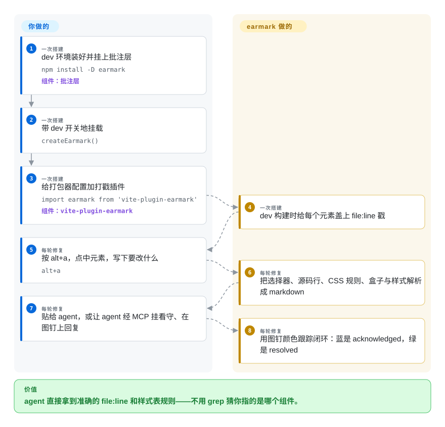

# earmark

「这个按钮是该 grep 还是直接开文件？」——只靠运行时读 DOM 的批注工具永远得 grep，而 React 19 + SWC 早把「元素从哪来」的调试元数据剥掉了。earmark 把定位挪到*构建期*：Vite 插件或 webpack/Turbopack loader 给每个 JSX/Svelte 元素打上 `data-earmark-src="src/Card.tsx:42:7"`，它的点选批注层交给编码 agent 的是选择器、那行源码、组件路径、计算样式和盒子几何——外加一个 broker + MCP 服务，带着完整的 open → acknowledged → resolved 生命周期。

## 何时使用

你的前端是 Svelte、原生 JS 或混合框架——[Agentation](agentation.zh.md) 的运行时 fiber 读取在这里拿不到组件名和源码行；或者你就是不想让批注工具伸手进 React 内部。你加上 `vite-plugin-earmark`（Next.js 用 `withEarmark`，Svelte 用 preprocessor），批注输出从此带精确到 `file:line` 的源码位置，客户端与服务端渲染都有。选 earmark 是买三个本赛道别家没有的机制：*确定性*源码路径——构建期盖戳，而不是点击时逆向猜；*CSS 规则解析*——把样式化该元素的每条规则映射回声明它的文件和行号——「你要改的 padding 在第 49 行的通用 `button` 规则里，不在 `.primary`」——连完全没构建步骤的静态 HTML 页都能用；以及一套诚实的 MCP 状态机（`earmark_acknowledge` / `ask` / `resolve` / `dismiss`），慢 agent 到底在做你那枚图钉还是装没看见，颜色说了算。决定性的取舍：你拿到本品类最好的*证据管线*，和最差的*存活赔率*——一个 0 星、公开历史只有两天的项目。

## 怎么用起来

三块拼图，每块单用都行。**批注层**（`npm install -D earmark`，dev 下调用 `createEarmark()`，或直接一个 `<script>` 标签）给你一个工具栏：点元素、`T` 选文字、拖拽选区域，外加冻结动画/视频的按钮——不需要构建步骤；没有被盖戳的源码时它就降级为选择器加样式。**打戳器**（`vite-plugin-earmark`、管 Next.js webpack+Turbopack 的 `earmark-loader`、Svelte 的 `earmark-stamp` preprocessor）在 dev 构建时给每个固有元素写 `data-earmark-src="path:line:col"`；纯 HTML 则改为重新抓取你服务端下发的文档、沿带位置记录的解析树走一遍来定位行号（框架空壳页宁可报不出也不瞎猜）。**broker + MCP**（`claude mcp add earmark -- npx -y earmark-mcp`）一个进程同时是 MCP 服务和浏览器对接的 broker：批注存储（JSON 或 `node:sqlite`）、SSE 推状态、把 agent 驱动的工具面摊出去——`watch` 阻塞到你批注为止，之后 `acknowledge → 改代码 → resolve` 让你的图钉从橙变蓝再变绿。项目负责的是：拾取器、解析器、broker、MCP 协议；你负责的是：挂批注层、加构建插件、跑 agent 循环。

<!-- flow-steps:begin (generated from flows/earmark.json by tools/flow_card.py — do not edit) -->

流程文字版

1. **你**（一次搭建）：dev 环境装好并挂上批注层 — `npm install -D earmark` — 组件：`批注层`
2. **你**（一次搭建）：带 dev 开关地挂载 — `createEarmark()`
3. **你**（一次搭建）：给打包器配置加打戳插件 — `import earmark from 'vite-plugin-earmark'` — 组件：`vite-plugin-earmark`
4. **earmark**（一次搭建）：dev 构建时给每个元素盖上 file:line 戳
5. **你**（每轮修复）：按 alt+a，点中元素，写下要改什么 — `alt+a`
6. **earmark**（每轮修复）：把选择器、源码行、CSS 规则、盒子与样式解析成 markdown
7. **你**（每轮修复）：贴给 agent，或让 agent 经 MCP 挂看守、在图钉上回复
8. **earmark**（每轮修复）：用图钉颜色跟踪闭环：蓝是 acknowledged，绿是 resolved

**价值**：agent 直接拿到准确的 file:line 和样式表规则——不用 grep 猜你指的是哪个组件。

<!-- flow-steps:end -->

## 何时不用

- **你要的是有人维护的东西。** earmark 的全部公开历史是 2026-08-17 到 2026-08-19、0 星；哪天 Vite 或 Next 把打戳器弄坏了，除了你不会有人发现。要一个活着、月下载 500 万的项目，用 [Agentation](agentation.zh.md)——栈是 React 的话本来就该选它。
- **你的栈是纯 React 且想零配置。** earmark 的长板是为非 React、为调试元数据被 SWC 剥掉的场景做构建期打戳；React 应用里运行时读 fiber 就够了，Agentation 连插件都不用。
- **你没法审一条三天前才出现的六包供应链。** 下载历史、第三方目光都很稀薄，README 里「clean-room 实现、不衍生自任何别家工具源码」的声明无人可核。采用前要求「有别人看过」的话，拿 [patch-mark](patch-mark.zh.md)（MIT、单包、面更小）或 [Agentation](agentation.zh.md)。
- **你要截图。** earmark 是明确拒绝的——它论证 DOM 重绘的截图是伪证据，宁可只给 agent 一个已核实的选择器加 URL。像素状态本身就是反馈内容时，用 [markupkit](markupkit.zh.md)（PNG 导出）或能抓真实像素的扩展类 [Vibe Annotations](vibe-annotations.zh.md)。
- **跨 Windows 或禁用未审计 npm 产物的团队策略。** 六个包（`earmark`、`earmark-server`、`earmark-mcp`、`vite-plugin-earmark`、`earmark-loader`、`earmark-stamp`）锁版本齐步发布，它自己的 README 都警告发布脚本半途中断可能只发布一半；必须精确锁版本。

## 横向对比

| 替代品 | 是否收录 | 我们的评价 | 取舍 |
| --- | --- | --- | --- |
| [Agentation](agentation.zh.md) | ✅ | 应用是 React、这个依赖要留好几年时选 Agentation——有人维护、被广泛采用、无需构建介入就能运行时恢复 `file:line`；非 React 栈、被 SWC 剥了调试元数据的 Next.js、以及「该改样式表哪一行」级别的回答，选 earmark。 | 确定性与框架覆盖面，对抗一个可能已被放弃的项目。 |
| [patch-mark](patch-mark.zh.md) | ✅ | 加不了构建插件、两行 web component 挂在预览页上就够用，选 patch-mark；精确源码行和 CSS 规则值得配一整条管线时，选 earmark。 | patch-mark 用源码精度换随处可嵌与更简单的 MIT 单包面。 |
| [Vibe Annotations](vibe-annotations.zh.md) | ✅ | 团队里非工程岗也要批注（扩展、不改应用、有分享路径）选 Vibe；证据只喂终端 agent、要可 grep 的 `file:line` 加状态机就回 earmark。 | 扩展便利对构建集成精度——撇开 MIT 与 Shield 的许可差异，两边都年轻。 |
| [markupkit](markupkit.zh.md) | ✅ | 信息是空间性的——「圈住这个、这俩画个箭头连起来」——笔画分类能说出 earmark 点选捕获说不出的话；信息可代码定位时用 earmark。 | 手绘表达力对机器可解析的证据。 |
| Cursor / Windsurf 内嵌浏览器选择器 | 非仓库 | 循环从不离开那个编辑器时用 IDE 内建；agent 是看不见预览页签的 CLI 时，earmark 把浏览器的知识搬进终端。 | 零安装厂商面，对框架级真相。 |

## 技术栈

- **语言：** 纯 JavaScript（ESM），六个包全部手写 `.d.ts`；批注层零运行时依赖；TypeScript 只出现在开发期类型检查。
- **包（npm workspaces）：** `earmark`（批注层+核心）、`earmark-server`（broker：HTTP + SSE，JSON 或 `node:sqlite` 存储，webhook）、`earmark-mcp`（MCP 服务与 broker 同进程，带 `init`/`doctor` CLI）、`vite-plugin-earmark`、`earmark-loader`（webpack+Turbopack）、`earmark-stamp`（Svelte preprocessor）。
- **测试：** 11 套单测／122 例，外加 20 项对着真实服务器、真实 stdio MCP 进程、真实文件与 webhook 监听器的 `npm run verify`（数字为作者自述）。

## 依赖

- Node.js（sqlite 后端要 22.5+，否则回落 JSON），批注层本身只要有任意 dev server。
- 完整的 `file:line` 体验要求往打包器配置里加构建插件（Vite/Next/Svelte）；纯 HTML/CSS 只要那一个 script 标签。
- agent 同步模式要本机 broker（`npx earmark-mcp`，默认 7331 端口、绑 127.0.0.1）；复制粘贴 markdown 模式什么都不用装。

## 运维难度

**能用的时候很低，坏的时候无声。** 一个 `npx` 进程、`.earmark/` 里的文件存储、无账号、broker 只绑 loopback，`doctor` 还能为每条失败检查打印修复命令。难的不是运维而是*朽坏*：六个互相锁版本的包、打戳器必须扛过每个 Vite/Next 大版本、2026-08-19 之后未见维护——把「坏掉」当何时而非是否，留好 vendoring 的预算。

## 健康度与可持续性

- **维护——落地即休眠（截至 2026-09-27）。** 建仓 2026-08-17、最后推送 2026-08-19、tag v0.1.1；其后五个多周无公开活动。0 星、0 fork、0 open issue。
- **治理／巴士因子。** 两个 contributor 账号（iknahar 加组织）——实质单人；无基金会、无公司。
- **年龄／Lindy。** 六周大且已安静：Lindy 完全不加分。把它当*设计参考*收录——构建期打戳与 CSS 规则解析这两个想法是承重墙——别当依赖赌注。
- **背书。** 未见；文档站是 GitHub Pages。
- **风险标记。** 它自己 README 里的半发布警告；六个 npm 名的未审计供应链；「clean-room」来源声明不可验证 [未验证]。许可证本身干净：MIT。

## 存疑（未验证）

- [未验证] 测试数（122 单测／20 项活体）与 `doctor` 行为是 README 的作者自述；我读了仓库树但未跑测试。
- [未验证] `earmark`/`vite-plugin-earmark` 月下载 41/34 是 2026-09-27 的 npm API 值——真实，但近乎为零。
- [未验证] 「clean-room 实现、不衍生自别家工具源码」是作者主张，未做任何独立对照。
- [推断] 「两天热度后沉寂」由公开的 2 天提交窗口推断；维护者可能在别处私有提交。
- [推断] Next.js 服务端同步打戳以避免 hydration 不匹配的说法来自 README 的推理，未复现。
