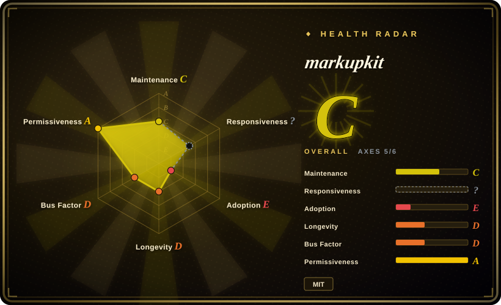
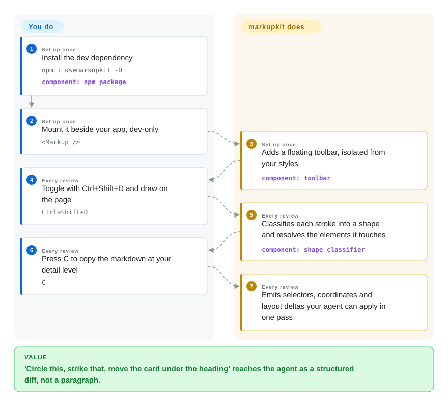

# markupkit

Click-to-annotate says *which* element is wrong; it can't say "circle this", "arrow these two as a pair", "move this card under that heading". markupkit draws on your live page freehand — every stroke classified into one of seven shapes — and in layout mode you drag/resize real elements until the page looks right, then hand the agent a structured diff of selectors, coordinates and deltas instead of a paragraph of prose.

## When to use

You're doing design review of an agent-generated UI and your feedback is *spatial and relational*, not element-local: the visual grouping is wrong, two controls belong together, this section needs to breathe. [Agentation](agentation.md) and its kin capture one element per click; markupkit captures a *drawing* — a stroke classifier scores every freehand mark against circle / arrow / strikethrough / underline / cross / rectangle / freehand (confidence ≥ 0.35) and the markdown output translates "struck-through the typo" or "arrowed these two cards" into element selectors plus shape semantics. Its layout mode is the other half of the pitch: select an element, drag it (snap-to-sibling-edge deltas like `→12px, ↓8px`), resize with 8 handles, drop wireframe primitives from a palette, and the copy output carries from/to rects the agent can apply in one pass. Plus two QA-flavored reads nobody else in this niche ships: live padding/margin zone visualization and WCAG 2.1 contrast ratios (AA/AAA pass-fail) on text. The honest tradeoff — this is a self-declared "learning project ... experimental software", built "out of curiosity" after reading agentation's source, by a single author, last pushed 2026-04-28: you're adopting the best *idea* in the niche with the second-weakest *survival odds* after earmark.

## How it works

A single React component (`usemarkupkit` on npm, zero runtime deps, ~10 kB gzipped by README claim) mounted beside your app; `Ctrl+Shift+D` toggles a toolbar whose UI lives isolated on the page. Per stroke, points are smoothed and bounded, then scored against seven shape templates; per click, a selector is built the greppable way — id first, then `data-testid`, then meaningful classes, `nth-child` only as last resort — with React component names recovered from `__reactFiber$` keys and source files from `_debugSource` or `data-source`/`data-file` attributes (the same dev-mode fiber read as agentation, without its stack-probe fallback). Output comes in four verbosity levels (compact / standard / detailed / forensic) so the same annotation can be a one-liner or a full computed-style dump. Persistence is localStorage (`markupkit_annotations`); an `endpoint` prop POSTs sessions to a server of your choosing — there is no bundled MCP server, so the agent either reads your server or you paste the markdown. What you do: mount it, draw, copy; what it does: shape classification, element resolution, diff formatting.

<!-- flow-steps:begin (generated from flows/markupkit.json by tools/flow_card.py — do not edit) -->

Text version of the flow

1. **You** (Set up once): Install the dev dependency — `npm i usemarkupkit -D` — component: `npm package`
2. **You** (Set up once): Mount it beside your app, dev-only — `<Markup />`
3. **markupkit** (Set up once): Adds a floating toolbar, isolated from your styles — component: `toolbar`
4. **You** (Every review): Toggle with Ctrl+Shift+D and draw on the page — `Ctrl+Shift+D`
5. **markupkit** (Every review): Classifies each stroke into a shape and resolves the elements it touches — component: `shape classifier`
6. **You** (Every review): Press C to copy the markdown at your detail level — `C`
7. **markupkit** (Every review): Emits selectors, coordinates and layout deltas your agent can apply in one pass

**Value**: 'Circle this, strike that, move the card under the heading' reaches the agent as a structured diff, not a paragraph.

<!-- flow-steps:end -->

## When NOT to use

- **You need a maintained dependency.** Last push 2026-04-28, 2 stars, one contributor, an explicit `DISCLAIMER.md`; anything production-shaped should take [Agentation](agentation.md) instead. (Also the fastest way to *study* the annotation-tool mechanism, since it's a smaller reimplementation of one.)
- **Your feedback is element-local and code-bound.** "The padding is wrong on this button" doesn't need a stroke classifier — click-capture with computed styles from [Agentation](agentation.md) or [earmark](earmark.md) is a tighter loop.
- **You're not on React.** The `Markup` component and fiber detection are React-only; the freehand layer's framework independence doesn't help when the mount point is a React component. Use [patch-mark](patch-mark.md) (any page) or [earmark](earmark.md) (Svelte/vanilla stamping).
- **You need the agent to pull and acknowledge status.** markupkit has no broker or MCP surface — pins have no open/acknowledged/resolved lifecycle; that loop exists in [earmark](earmark.md) and [Agentation](agentation.md)'s MCP server.
- **The drawing must survive reloads across a team.** localStorage persistence is single-browser; sharing beyond "copy markdown" is out of scope, which is exactly where the extension tools ([Vibe Annotations](vibe-annotations.md)) aimed.

## Comparison

| Alternative | In index | Our verdict | Tradeoff |
| --- | --- | --- | --- |
| [Agentation](agentation.md) | ✅ | Choose Agentation for the daily loop — maintained, adopted, MCP-synced; keep markupkit open as the reference implementation for "what if the annotation were a drawing" and as a readable descendant of agentation's own techniques. | Working tool vs. idea bank; markupkit adds strokes and layout diffs agentation lacks but ships dormant. |
| [earmark](earmark.md) | ✅ | Pick earmark when the payload is code evidence (source lines, CSS rule resolution) and you can tolerate its abandonment risk; pick markupkit when the payload is spatial intent (shapes, drag-diffs, contrast flags). | Machine-resolvable evidence vs. human spatial expression — two dormant MIT projects, opposite halves of the loop. |
| [patch-mark](patch-mark.md) | ✅ | patch-mark is the alive-enough, embeddable-anywhere click annotator; reach for markupkit only for its freehand and layout modes, accepting React-only and dormant. | Zero-dep web component on any page vs. a React learning project with a genuinely different input model. |
| [Vibe Annotations](vibe-annotations.md) | ✅ | Choose Vibe when non-developers annotate and you want screenshots plus sharing; markupkit answers a different question — "shape the fix spatially", and only for a developer with the page open. | Extension breadth vs. drawing depth. |
| Figma / design annotation in static comps | not a repo | Figma reviews the mock-up; markupkit annotates the *rendered* DOM with real selectors and computed styles — and hands the coding agent coordinates it can apply to the live app. | Pixel canvas vs. DOM truth; the former is a paid SaaS, out of this index by shape. |

## Tech stack

- **Language/build:** TypeScript, React 18+ peer, zero runtime dependencies; npm package name is `usemarkupkit` (repo is `markupkit`).
- **Detection internals:** stroke point smoothing + seven-template shape classifier; selector builder with id → `data-testid` → meaningful-class → `nth-child` priority; React fiber (`__reactFiber$`) component names; `_debugSource` plus `data-source`/`data-file` attributes for source files; `getComputedStyle` for spacing zones and WCAG contrast ratios.
- **No server:** `endpoint` prop POSTs to your own HTTP target; clipboard markdown is the default exit (four detail levels).

## Dependencies

- Your React app plus this dev dependency — no broker, no MCP package, nothing to run.
- Source-file detection requires dev-mode builds (same `_debugSource` constraint as agentation); contrast/spacing reads work anywhere.
- Cross-page persistence is localStorage only; team sync requires you to build and stand behind the `endpoint` server yourself.

## Ops difficulty

**Minimal while usable; zero support behind it.** There is nothing to operate (client-only), which also means nothing to maintain upstream: a React or Vite major that breaks the fiber assumptions arrives, and the repo has had no push since 2026-04-28. If you adopt it, budget to vendor the ~10 kB.

## Health & viability

- **Maintenance — dormant (as of 2026-09-27).** Created 2026-03-17, last push 2026-04-28 — over four months quiet; npm `usemarkupkit` at v2.0.0 with ~29 downloads/last-month.
- **Governance / bus factor.** One contributor; the README states plainly it is a public learning project inspired by benjitaylor's agentation, "use at your own risk. DYOR."
- **Age / Lindy.** Six months old, inactive for most of its life — no Lindy credit.
- **Backing.** None; GitHub Pages landing page.
- **Risk flags.** Self-declared experimental; no releases/tags beyond npm; MIT is the one unambiguously clean signal. The value to preserve is the design (stroke classification + layout diffs), which the license lets anyone re-implement.

## Caveats (unverified)

- [未验证] Shape-classifier threshold (0.35), snap thresholds, ~10 kB gzip, and the four output levels are README/props-table claims; not executed.
- [推断] "Smaller reimplementation of agentation's techniques (without the stack-probe fallback)" is reasoned from the README's own acknowledgment plus reading agentation's source; I did not line-by-line compare implementations.
- [未验证] 2 stars / 29 monthly downloads / push dates are API values captured 2026-09-27.
- [推断] Treating the `endpoint` prop as "bring your own server with no bundled consumer" is inferred from the absence of any server package in the repo and README — the expected wire format was not read from source.
