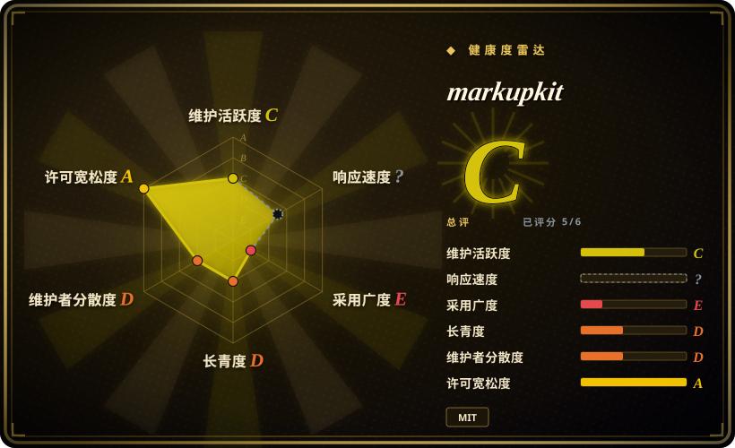
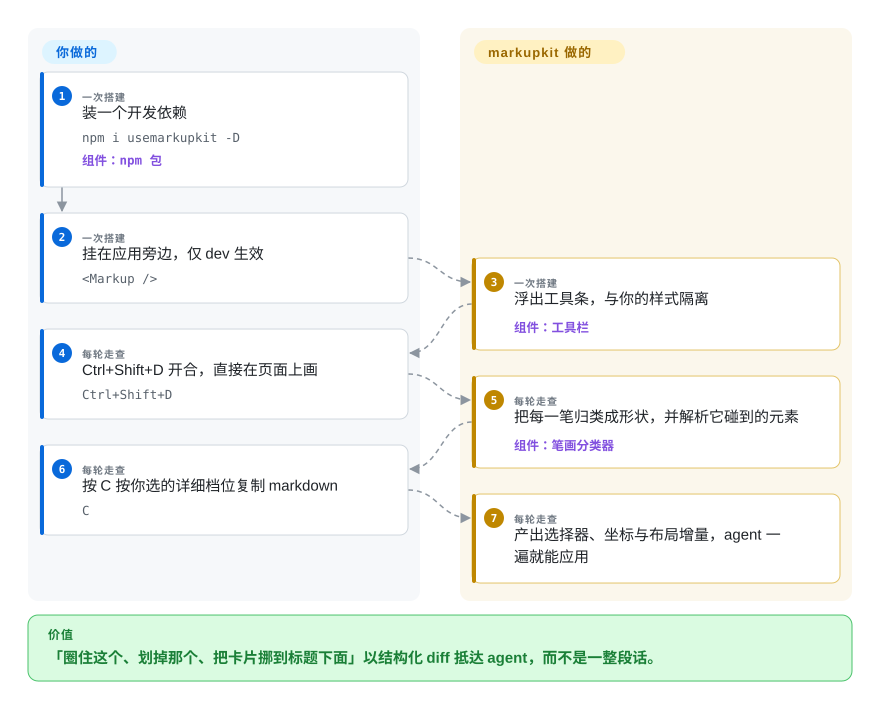

# markupkit

点选批注只能说*哪个*元素不对，说不出「圈住这块」「这俩是一伙的画个箭头」「这张卡挪到那个标题下面」。markupkit 让你在活页面上直接手绘——每一笔被归类成七种形状之一——layout 模式下你还能拖着真实元素改到页面顺眼为止，然后交给 agent 的是一份带选择器、坐标和增量的结构化 diff，而不是一段散文。

## 何时使用

你在给 agent 生成的 UI 做设计走查，反馈是*空间性、关系性*的，不落在单个元素上：视觉分组错了、两个控件该成对、这块得喘口气。[Agentation](agentation.zh.md) 及同乡一次捕获一个元素；markupkit 捕获的是一张*画*——笔画分类器把每道自由曲线对着 圈／箭头／删除线／下划线／叉／矩形／随手画 七个模板打分（置信度 ≥ 0.35 才算数），markdown 输出会把「划掉这个错别字」「这两个卡画箭头成组」翻译成元素选择器加形状语义。另一半卖点是 layout 模式：选中元素拖走（吸附到兄弟边，增量记成 `→12px, ↓8px`）、八个把手缩放、从面板里丢下 wireframe 原语，复制出的 from/to 矩形 agent 一遍就能应用。再加上本赛道别家都没有的两项 QA 读取：实时 padding/margin 区域可视化，和文字元素的 WCAG 2.1 对比度（AA/AAA 判定）。诚实的代价——它自述是「学习型项目……实验性软件」，作者写 README 说做它是因为读了 agentation 的源码好奇其所以然，单人维护、最后推送 2026-04-28：你采纳的是这个品类里最好的*想法*，和仅次于 earmark 的*存活赔率*。

## 怎么用起来

一个 React 组件（npm 名 `usemarkupkit`，零运行时依赖，README 自称 gzip 约 10 kB），挂在应用旁边；`Ctrl+Shift+D` 开一条与被页隔离的工具栏。每一笔：点集平滑、求包围盒，再对七个形状模板打分；每一次点击：选择器按可 grep 的方式拼装——先 id、再 `data-testid`、再「有语义的类名」、`nth-child` 垫底——React 组件名从 `__reactFiber$` 键里恢复，源文件读 `_debugSource` 或 `data-source`/`data-file` 属性（和 agentation 同一套 dev 期 fiber 读取，但没有它的堆栈探测回退）。输出分四档详细度（compact / standard / detailed / forensic），同一条批注可以是一行字也可以是全套计算样式。持久化靠 localStorage（`markupkit_annotations`）；`endpoint` prop 会把 session POST 到你自己选的服务——它没有随包的 MCP server，所以 agent 要么读你的服务，要么你贴 markdown。你做的：挂载、画、复制；它做的：笔画分类、元素解析、diff 排版。

<!-- flow-steps:begin (generated from flows/markupkit.json by tools/flow_card.py — do not edit) -->

流程文字版

1. **你**（一次搭建）：装一个开发依赖 — `npm i usemarkupkit -D` — 组件：`npm 包`
2. **你**（一次搭建）：挂在应用旁边，仅 dev 生效 — `<Markup />`
3. **markupkit**（一次搭建）：浮出工具条，与你的样式隔离 — 组件：`工具栏`
4. **你**（每轮走查）：Ctrl+Shift+D 开合，直接在页面上画 — `Ctrl+Shift+D`
5. **markupkit**（每轮走查）：把每一笔归类成形状，并解析它碰到的元素 — 组件：`笔画分类器`
6. **你**（每轮走查）：按 C 按你选的详细档位复制 markdown — `C`
7. **markupkit**（每轮走查）：产出选择器、坐标与布局增量，agent 一遍就能应用

**价值**：「圈住这个、划掉那个、把卡片挪到标题下面」以结构化 diff 抵达 agent，而不是一整段话。

<!-- flow-steps:end -->

## 何时不用

- **你要的是有人维护的依赖。** 最后推送 2026-04-28、2 星、单 contributor、还自带 `DISCLAIMER.md`；带生产形状的事拿 [Agentation](agentation.zh.md) 做。（反过来，它也是*研究*批注工具机制的最快路径——一个更小、更可读的再实现。）
- **反馈落在单元素、绑代码上。** 「这个按钮 padding 不对」用不着笔画分类器——[Agentation](agentation.zh.md) 或 [earmark](earmark.zh.md) 的点选加计算样式是更紧的循环。
- **不在 React 上。** `Markup` 组件和 fiber 检测都是 React 专属，手绘层的「框架无关」救不了挂载点本身是 React 组件。换 [patch-mark](patch-mark.zh.md)（任何页面）或 [earmark](earmark.zh.md)（Svelte/vanilla 打戳）。
- **要 agent 拉取并回报状态。** markupkit 没有 broker、没有 MCP 面——图钉不存在 open/acknowledged/resolved 生命周期；那套环在 [earmark](earmark.zh.md) 和 Agentation 的 MCP server 里。
- **画的东西要跨刷新、跨团队存活。** localStorage 只存单浏览器；「复制 markdown」之外的分享根本不在范围内——那恰是扩展类工具（[Vibe Annotations](vibe-annotations.zh.md)）瞄准的位置。

## 横向对比

| 替代品 | 是否收录 | 我们的评价 | 取舍 |
| --- | --- | --- | --- |
| [Agentation](agentation.zh.md) | ✅ | 日常循环选 Agentation——有人维护、有采用度、有 MCP 同步；markupkit 留着当「如果批注是一张画」的参考实现，也当 agentation 自家技术的可读后代来读。 | 能用的工具对想法库；markupkit 补上了 agentation 没有的笔画与 layout diff，代价是躺着。 |
| [earmark](earmark.zh.md) | ✅ | 载荷是代码证据（源码行、CSS 规则解析）且能接受弃更风险时选 earmark；载荷是空间意图（形状、拖拽 diff、对比度旗标）时选 markupkit。 | 机器可解析的证据对人手空间表达——两个休眠的 MIT 项目，恰好一个环的两半。 |
| [patch-mark](patch-mark.zh.md) | ✅ | patch-mark 是还活着、能嵌任何页面的点选批注器；只有当你要手绘和 layout 模式时才碰 markupkit，并接受 React-only 且休眠。 | 零依赖 web component 随处可嵌，对一个输入模型确实不同的 React 学习项目。 |
| [Vibe Annotations](vibe-annotations.zh.md) | ✅ | 非工程岗也来批注、还要截图和分享路径时选 Vibe；markupkit 回答的是另一个问题——「把修改在空间上画出来」，而且只对着开着页面的开发者。 | 扩展广度对绘画深度。 |
| Figma／静态稿上的设计批注 | 非仓库 | Figma 走查的是 mock-up；markupkit 批注的是*渲染后*的 DOM，带真选择器和计算样式——交给编码 agent 的坐标能直接落在活应用上。 | 像素画布对 DOM 真相；前者是付费 SaaS，按形态就在本索引之外。 |

## 技术栈

- **语言/构建：** TypeScript，React 18+ peer，零运行时依赖；npm 包名是 `usemarkupkit`（仓库名 `markupkit`）。
- **检测内部：** 笔画点平滑加七模板形状分类器；选择器拼装按 id → `data-testid` → 语义类名 → `nth-child` 优先级；React fiber（`__reactFiber$`）组件名；`_debugSource` 加 `data-source`/`data-file` 属性定位源文件；`getComputedStyle` 供间距区域与 WCAG 对比度。
- **没有服务端：** `endpoint` prop POST 到你自己的 HTTP 目标；默认出口是剪贴板 markdown（四档详细度）。

## 依赖

- 你的 React 应用加这个开发依赖——无 broker、无 MCP 包、没有要跑的东西。
- 源文件检测要求 dev 构建（和 agentation 同一 `_debugSource` 约束）；对比度/间距读取哪里都能用。
- 跨页持久化只有 localStorage；团队同步得你自己把 `endpoint` 那侧的服务搭起来、养起来。

## 运维难度

**能用的时候几乎为零；因为上游也没人养。** 纯客户端、无东西可运维——这同时意味着无东西在维护：React 或 Vite 大版本打破 fiber 假设的那天到来，仓库从 2026-04-28 起就没推送过。真要采纳，把 vendoring 这约 10 kB 的预算记上。

## 健康度与可持续性

- **维护——休眠（截至 2026-09-27）。** 建仓 2026-03-17、最后推送 2026-04-28——四个多月无动静；npm `usemarkupkit` 在 v2.0.0、上月下载约 29。
- **治理／巴士因子。** 单 contributor；README 明说这是受 benjitaylor 的 agentation 启发的公开学习项目，「use at your own risk. DYOR」。
- **年龄／Lindy。** 六个月大，且一生大部分时间在休眠——Lindy 不加分。
- **背书。** 无；落地页是 GitHub Pages。
- **风险标记。** 自述实验性；除 npm 外无 release/tag；MIT 是唯一无歧义的干净信号。值得保存的是设计本身（笔画分类加 layout diff），许可证允许任何人重新实现。

## 存疑（未验证）

- [未验证] 分类器阈值 0.35、吸附阈值、约 10 kB gzip、四档输出，均为 README/props 表主张，未实测。
- [推断] 「agentation 技术的更小型再实现（少了堆栈探测回退）」由 README 自述加我对 agentation 源码的阅读推出，未逐行对照两份实现。
- [未验证] 2 星／月下载 29／推送日期为 2026-09-27 的 API 瞬时值。
- [推断] 把 `endpoint` 理解为「自带服务端、无随包消费者」，依据是仓库中不存在任何 server 包与 README 表述——线上格式未从源码读毕。
