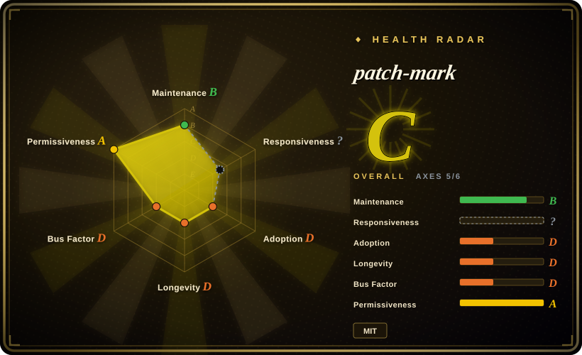
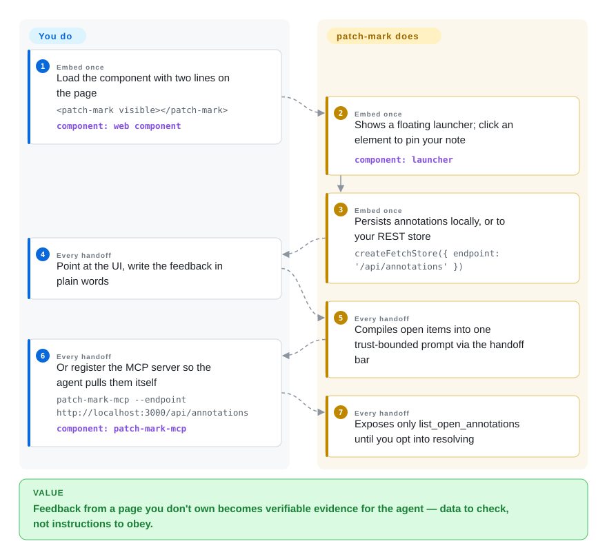

# patch-mark

You want UI feedback to reach your coding agent, but the page you're reviewing isn't your app — a staging build, a docs site, a vendor preview — and you won't add a dependency to code you don't own. patch-mark is a zero-dependency web component: two lines (`<script type="module">` plus `<patch-mark visible>`) on *any* page turn point-and-comment into structured markdown the agent can act on — with the unusual honesty of labeling that markdown **untrusted evidence** the agent must verify, not instructions to obey.

## When to use

You're reviewing something rendered outside your own bundle — a design partner's staging page, your docs site, an iframe'd preview — and you want the same annotate-then-hand-off loop the React devs get, without editing the project. Drop the component in your own bookmarklet/wrapper or serve the page through a small proxy, and every annotation exports as a self-contained prompt: selector, element name, position, visible text, your feedback, and a page key. It's also the choice when your threat model is the loudest thing in the room: patch-mark is the only tool in this niche that treats *the agent being fed annotations as an attack surface* — annotations are surfaced to MCP clients explicitly tagged as user data, the default MCP server exposes only `list_open_annotations` (the mutating `resolve_annotation` lives behind your `--allow-resolve` opt-in and still demands a summary, changed files, and checks run), and the copy-handoff prompt is written "trust-bounded" so annotations read as data, not directives. The deciding tradeoff vs. the category: you gain embed-anywhere reach and a security posture nobody else states, and you give up DOM depth — no React fiber, no `file:line`, no source detection in the core loop (the docs site shows a property inspector for exact `from → to` CSS changes on dev builds, which partially compensates).

## How it works

A custom element with shadow-DOM isolation and zero runtime dependencies (the React export `patch-mark/react` needs React ≥17 as a peer, optionally). You click the floating launcher, hover to inspect an element, click to select, type feedback; annotations persist via a store abstraction — default `createLocalStorageStore()`, or `createFetchStore({ endpoint })` to a REST backend you control (the docs define the adapter contract). The store is the seam: the **handoff bar** batches open annotations into one prompt ("Locate each element by Selector, Text, or Quote. Apply the Feedback. Don't pause for confirmation") minus anything resolved, and a **one-click complete** resolves the visible set using a click-time snapshot so a second reviewer's fresh feedback is never closed by accident. When the store is REST, `npx -y patch-mark-mcp --endpoint <url>` gives any MCP-speaking agent (Claude Code, Cursor, Codex) a read tool by default and, behind explicit opt-in, a resolve tool — supporting both the legacy 2025-03-26 and stateless 2026-07-28 MCP protocol revisions. What the project owns: picker, store contract, prompt formatting, MCP surface; what you own: getting the two lines onto the page and any backend.

<!-- flow-steps:begin (generated from flows/patch-mark.json by tools/flow_card.py — do not edit) -->

Text version of the flow

1. **You** (Embed once): Load the component with two lines on the page — `<patch-mark visible></patch-mark>` — component: `web component`
2. **patch-mark** (Embed once): Shows a floating launcher; click an element to pin your note — component: `launcher`
3. **patch-mark** (Embed once): Persists annotations locally, or to your REST store — `createFetchStore({ endpoint: '/api/annotations' })`
4. **You** (Every handoff): Point at the UI, write the feedback in plain words
5. **patch-mark** (Every handoff): Compiles open items into one trust-bounded prompt via the handoff bar
6. **You** (Every handoff): Or register the MCP server so the agent pulls them itself — `patch-mark-mcp --endpoint http://localhost:3000/api/annotations` — component: `patch-mark-mcp`
7. **patch-mark** (Every handoff): Exposes only list_open_annotations until you opt into resolving

**Value**: Feedback from a page you don't own becomes verifiable evidence for the agent — data to check, not instructions to obey.

<!-- flow-steps:end -->

## When NOT to use

- **The page is your own React app and you want the agent to land on the exact line.** patch-mark stops at selector + geometry + text; for `file:line` recovered from the fiber tree, use [Agentation](agentation.md); for build-stamped determinism, [earmark](earmark.md).
- **You need screenshots or drawings.** The core captures text/selector/position, not pixels or freehand — that's [markupkit](markupkit.md) (strokes, PNG) or [Vibe Annotations](vibe-annotations.md) / [Pointa](pointa.md) (real screenshots via extension).
- **Annotations must flow without anyone hosting a REST endpoint.** localStorage mode has no server for the MCP to read; the agent-sync story *requires* you to stand up the store adapter. Agentation's bundled `agentation-mcp` is one npx away by comparison.
- **You expect a maintained dependency.** Two stars, single author, last push 2026-08-19 (~5 weeks before this writing) — healthier than earmark/markupkit but not a five-million-downloads/month project; see [Agentation](agentation.md) for the safe bet.
- **You want the tool to close the loop (acknowledge, ask, resolve-lifecycle on pins).** patch-mark's MCP has read + resolve, not the full colored-pin state machine ([earmark](earmark.md)) or Plannotator-style turn gating ([Plannotator](../supervision-surfaces/plannotator.md)).

## Comparison

| Alternative | In index | Our verdict | Tradeoff |
| --- | --- | --- | --- |
| [Agentation](agentation.md) | ✅ | Inside your own React app choose Agentation — source lines, component paths, bundled MCP, and five-million monthly downloads of regression surface; choose patch-mark for pages you don't own and an explicit prompt-injection threat model. | DOM depth + adoption vs. embed-anywhere + security honesty. |
| [earmark](earmark.md) | ✅ | Both are MIT and framework-agnostic-ish; pick earmark when verified `file:line`/CSS-rule evidence justifies a build plugin and six-package supply chain, patch-mark when a single script tag on a foreign page is the whole requirement. | Evidence strength vs. integration weight. |
| [markupkit](markupkit.md) | ✅ | Spatial, expressive feedback belongs to markupkit (strokes, layout diffs) though it's React-only and dormant; patch-mark keeps the click-and-comment loop portable to any page. | Expressiveness vs. portability. |
| [Pointa](pointa.md) | ✅ | Choose Pointa when you refuse to edit the page at all — it's a Chrome extension; patch-mark edits *something* (two lines) but then works in any browser, not just Chromium, and ships a stricter MCP default. | Zero-touch + server-log capture vs. zero-dependency embed + read-only-by-default agent surface. |
| [Plannotator](../supervision-surfaces/plannotator.md) | ✅ | Different loop position: Plannotator gates the agent's turn on your annotation of its artifacts; patch-mark feeds the agent evidence about a rendered page without gating. | Human-as-approval-gate vs. human-as-sensor. |

## Tech stack

- **Language:** TypeScript, zero runtime dependencies, distributed as a custom element (`<patch-mark>`); React wrapper (`patch-mark/react`) with React ≥17 optional peer; npm ships the MCP server separately as `patch-mark-mcp`.
- **Storage:** pluggable store interface — localStorage default, `createFetchStore` for a REST contract defined in the docs.
- **MCP surface:** `list_open_annotations` (default), `resolve_annotation` (behind `--allow-resolve`, requires summary + changed files + checks); supports MCP protocol revisions `2025-03-26` and `2026-07-28` (stateless).
- **UI:** shadow-DOM isolated toolbar, five themes, every color a CSS custom property.

## Dependencies

- Nothing to run for copy-paste use (localStorage mode).
- Agent-sync mode needs a REST endpoint implementing the store contract (your app's backend or a stub), plus `npx patch-mark-mcp` pointed at it.
- Browser must support custom elements/shadow DOM (all evergreen browsers); it is desktop-oriented.

## Ops difficulty

**Low.** A script tag and a web component; optional REST store; optional npx-run MCP server. The docs publish a release checklist and the repo carries semver GitHub releases (v1.2.1 as of 2026-08). Maintainership burden lands on you only if you adopt it against a foreign page long-term and the project stays quiet.

## Health & viability

- **Maintenance — quick burst, then quiet (as of 2026-09-27).** Created 2026-07-22; releases v1.1.0 → v1.2.1 through August; last push 2026-08-19; ~282 npm downloads/last-month, 2 stars, 1 open issue.
- **Governance / bus factor.** Single maintainer (LKRCharon), no backing org visible; bilingual (EN/中文) docs suggest a Chinese-speaking author marketing internationally.
- **Age / Lindy.** Two months old — none.
- **Backing.** None visible (GitHub Pages docs/demo).
- **Risk flags.** MIT is clean; the security-posture claims (untrusted-input tagging, opt-in mutation) are the opposite of a risk flag and unusually good for the niche; dormancy is the watch item.

## Caveats (unverified)

- [未验证] The property inspector with exact `from → to` CSS changes and React/Vue dev-build source-file capture are documented on the project's landing/docs site; I did not read the component source confirming them, and the README fetched here doesn't show them.
- [未验证] MCP protocol revision support (`2025-03-26`, `2026-07-28`) and the `--allow-resolve` gating are README claims; not exercised against a live MCP client.
- [推断] "Single author" is from the contributors API listing one login plus commit style; undisclosed co-authors can't be ruled out.
- [未验证] Download/star counts are API values captured 2026-09-27.
