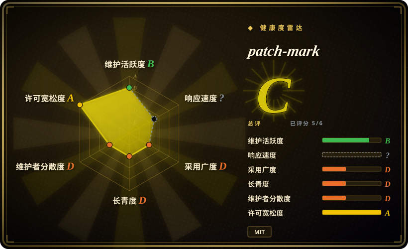
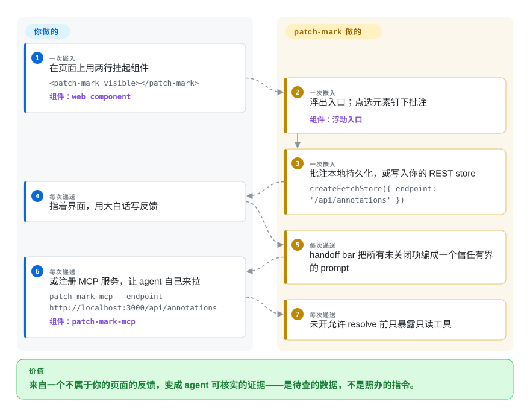

# patch-mark

你想把 UI 反馈递给编码 agent，可要看的页面不是你的应用——staging 构建、文档站、厂商预览——你也不会往不属于自己的代码里塞依赖。patch-mark 是个零依赖 web component：在*任何*页面加两行（`<script type="module">` 加 `<patch-mark visible>`），点选加留言就变成了 agent 可行动的结构化 markdown——它还带一份同类里少见的诚实：把那份 markdown 明标为**不可信证据**，agent 须去核实，而不是照办。

## 何时使用

你在看一个不在自己 bundle 里渲染的东西——设计合作方的 staging、你们的文档站、iframe 嵌来的预览——想要 React 开发者那套「批注完递出去」的循环，又不肯改那个项目。把组件塞进你自己的书签脚本/包装页，或者经一个小代理出站页面，每条批注就导出为自包含的 prompt：选择器、元素名、位置、可见文本、你的反馈、页面 key。你的威胁模型要是全场最响的，它也是首选：patch-mark 是本赛道唯一把*「喂给 agent 的批注本身当作攻击面」*的工具——批注到 MCP 客户端时明确标记为用户数据，默认 MCP 服务只暴露 `list_open_annotations`（会改状态的 `resolve_annotation` 锁在你的 `--allow-resolve` 显式开关后面，且仍要求填 summary、changed files、checks run），复制式递送的 prompt 按「信任有界」写法组装，让批注读起来是数据不是指令。和品类的决定性取舍：你得到随处可嵌的覆盖面和别家不会写明的一档安全姿态，交出的是 DOM 深度——核心循环里没有 React fiber、没有 `file:line`、没有源码检测（官网展示的属性检查器能在 dev 构建里给出精确的 `from → to` CSS 修改，算部分补偿）。

## 怎么用起来

一个带 shadow DOM 隔离、零运行时依赖的 custom element（React 出口 `patch-mark/react` 可选 peer 一个 React ≥17）。点浮动入口、悬停检视元素、点击选中、写反馈；批注经一个 store 抽象持久化——默认 `createLocalStorageStore()`，或 `createFetchStore({ endpoint })` 接你自己托管的 REST 后端（适配层契约在文档里）。store 就是那道接缝：**handoff bar** 把所有未关闭批注批量编成一个 prompt（「按 Selector、Text 或 Quote 定位每个元素。应用 Feedback。不要停下等确认」），已 resolved 的自动剔除；**一键完成**按点击时的快照解决当前可见集合，另一位评审刚提的反馈不会被顺手关掉。store 走 REST 时，`npx -y patch-mark-mcp --endpoint <url>` 让任何会讲 MCP 的 agent（Claude Code、Cursor、Codex）默认只有读工具，显式开关后才有 resolve 工具——同时兼容 legacy `2025-03-26` 与 stateless `2026-07-28` 两版 MCP 协议。项目负责：拾取器、store 契约、prompt 排版、MCP 面；你负责：把那两行放上页面，以及那个后端。

<!-- flow-steps:begin (generated from flows/patch-mark.json by tools/flow_card.py — do not edit) -->

流程文字版

1. **你**（一次嵌入）：在页面上用两行挂起组件 — `<patch-mark visible></patch-mark>` — 组件：`web component`
2. **patch-mark**（一次嵌入）：浮出入口；点选元素钉下批注 — 组件：`浮动入口`
3. **patch-mark**（一次嵌入）：批注本地持久化，或写入你的 REST store — `createFetchStore({ endpoint: '/api/annotations' })`
4. **你**（每次递送）：指着界面，用大白话写反馈
5. **patch-mark**（每次递送）：handoff bar 把所有未关闭项编成一个信任有界的 prompt
6. **你**（每次递送）：或注册 MCP 服务，让 agent 自己来拉 — `patch-mark-mcp --endpoint http://localhost:3000/api/annotations` — 组件：`patch-mark-mcp`
7. **patch-mark**（每次递送）：未开允许 resolve 前只暴露只读工具

**价值**：来自一个不属于你的页面的反馈，变成 agent 可核实的证据——是待查的数据，不是照办的指令。

<!-- flow-steps:end -->

## 何时不用

- **页面是你自己的 React 应用、要 agent 一步落到准确行。** patch-mark 止步于选择器加几何加文本；从 fiber 树恢复 `file:line` 用 [Agentation](agentation.zh.md)；要构建期打戳的确定性用 [earmark](earmark.zh.md)。
- **要截图或手绘。** 核心捕获的是文本/选择器/位置，不是像素和笔画——那是 [markupkit](markupkit.zh.md)（笔画、PNG）或 [Vibe Annotations](vibe-annotations.zh.md)／[Pointa](pointa.zh.md)（扩展抓真截图）的活。
- **反馈要在没人托管 REST 端点的情况下流动。** localStorage 模式没有可被 MCP 读的 server；agent 同步这条路*要求*你把 store 适配层搭起来。对比之下 Agentation 的随包 `agentation-mcp` 只差一句 npx。
- **你期待一个有人维护的依赖。** 2 星、单人作者、最后推送 2026-08-19（写作时约五周前）——比 earmark/markupkit 健康些，但远不是月下载五百万的项目；求稳看 [Agentation](agentation.zh.md)。
- **你要工具替你闭环（图钉上的 acknowledge、ask、resolve 全生命周期）。** patch-mark 的 MCP 只有读加 resolve，没有整支变色图钉状态机（[earmark](earmark.zh.md)），也没有 Plannotator 式的回合闸门（[Plannotator](../supervision-surfaces/plannotator.zh.md)）。

## 横向对比

| 替代品 | 是否收录 | 我们的评价 | 取舍 |
| --- | --- | --- | --- |
| [Agentation](agentation.zh.md) | ✅ | 在自己的 React 应用里选 Agentation——源码行、组件路径、随包 MCP，外加月五百万下载量帮你踩过的回归面；不属于你的页面、以及把 prompt 注入当回事的威胁模型，选 patch-mark。 | DOM 深度加采用度，对随处可嵌加安全诚实。 |
| [earmark](earmark.zh.md) | ✅ | 同为 MIT、都算框架无关；精确 `file:line`/CSS 规则证据值得配一个构建插件和六包供应链时选 earmark；「在别人页面上就放一个 script 标签」是全部需求时选 patch-mark。 | 证据强度对集成重量。 |
| [markupkit](markupkit.zh.md) | ✅ | 空间性、表现力反馈归 markupkit（笔画、layout diff），虽然它 React-only 且休眠；patch-mark 守住的是可移植到任何页面的点选留言循环。 | 表现力对可移植性。 |
| [Pointa](pointa.zh.md) | ✅ | 一寸页面代码都不想碰就选 Pointa——它是 Chrome 扩展；patch-mark 终究要改*点东西*（两行），但换来不限 Chromium，以及更严的 MCP 默认面。 | 零接触加服务端日志捕获，对零依赖嵌入加只读默认的 agent 面。 |
| [Plannotator](../supervision-surfaces/plannotator.zh.md) | ✅ | 环路位置不同：Plannotator 用你的批注卡住 agent 的回合；patch-mark 把渲染页面的证据递给 agent，不卡回合。 | 人当审批闸门，对 人当传感器。 |

## 技术栈

- **语言：** TypeScript，零运行时依赖，以 custom element（`<patch-mark>`）分发；React 包装（`patch-mark/react`）带 React ≥17 可选 peer；MCP 服务以 `patch-mark-mcp` 独立发布在 npm。
- **存储：** 可插拔 store 接口——默认 localStorage，REST 走 `createFetchStore`（契约见文档）。
- **MCP 面：** `list_open_annotations`（默认）、`resolve_annotation`（`--allow-resolve` 之后，且要求 summary 加 changed files 加 checks）；支持 MCP 协议 `2025-03-26` 与 `2026-07-28`（stateless）两版。
- **UI：** shadow DOM 隔离工具栏、五套主题、每个颜色都是 CSS 自定义属性。

## 依赖

- 复制粘贴用法什么都不用跑（localStorage 模式）。
- agent 同步模式需要一个实现 store 契约的 REST 端点（你应用的后端或一个 stub），再把 `npx patch-mark-mcp` 指过去。
- 浏览器要支持 custom elements/shadow DOM（所有 evergreen 浏览器）；面向桌面。

## 运维难度

**低。** 一个 script 标签加一个 web component；REST store 可选；MCP 服务是可选的 npx。文档带发布清单，仓库有语义化 GitHub release（截至 2026-08 为 v1.2.1）。维护负担只在你长期把它架在别人页面上、而项目继续沉默时才落到你头上。

## 健康度与可持续性

- **维护——一波快节奏后归于安静（截至 2026-09-27）。** 建仓 2026-07-22；8 月内从 v1.1.0 发到 v1.2.1；最后推送 2026-08-19；npm 上月下载约 282、2 星、1 个 open issue。
- **治理／巴士因子。** 单一维护者（LKRCharon），未见背书组织；双语（英／中）文档暗示一位面向国际市场写作的中文系作者。
- **年龄／Lindy。** 两个月大——不加分。
- **背书。** 未见（文档/演示在 GitHub Pages）。
- **风险标记。** MIT 干净；安全姿态类主张（不可信输入标记、变更需显式开关）不但不是风险旗标，在本赛道反而罕有地好；要盯的是沉寂。

## 存疑（未验证）

- [未验证] 属性检查器（精确 `from → to` CSS 修改）与 React/Vue dev 构建源码文件捕获，见官网 landing/docs；未读组件源码确认，且此处抓取的 README 未展示它们。
- [未验证] MCP 协议两版支持与 `--allow-resolve` 门控都是 README 主张，未接活体 MCP 客户端实测。
- [推断] 「单一作者」来自 contributors API 只列一个登录名加提交风格；无法排除未署名合作者。
- [未验证] 下载／星数为 2026-09-27 的 API 瞬时值。
