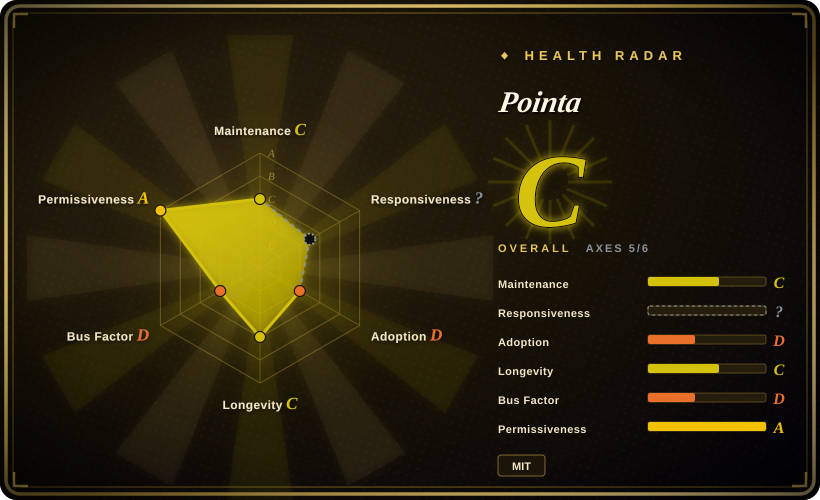
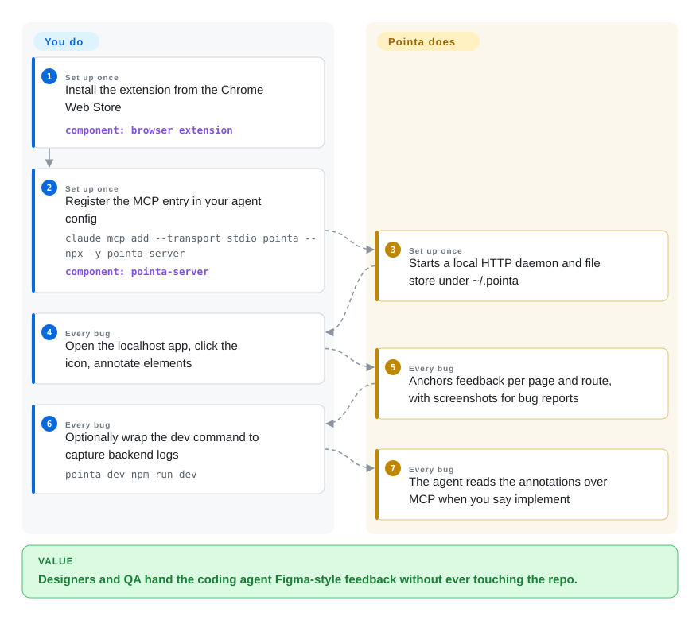

# Pointa

Your teammate (or future you) finds a UI bug on a localhost dev server and needs the coding agent to fix it — but nothing on the page is editable, because "your app" is someone else's project you're not supposed to touch. Pointa is the zero-integration corner of this category: a Chrome extension plus an MCP-speaking local server, so *no app code changes at all*. Click elements, write feedback, and the agent pulls the annotations over MCP — with your Node server's console logs optionally riding along in the same bug report.

## When to use

You're on a team where designers, PMs, or QA annotate localhost builds while developers drive Claude Code / Cursor / Windsurf, and the hard constraint is "the annotator installs nothing into the repo." Pointa fits where every component-based tool in this niche fails: no `npm install`, no mounting a component — install the extension, add one MCP entry (`npx -y pointa-server`), and any localhost page becomes Figma-annotatable. The distinctive second read is *backend* context: wrap the dev command once (`pointa dev npm run dev`) and the server intercepts `console.log`/`console.error` from your Node process so bug reports carry a timeline of what the backend printed while the UI misbehaved — something no in-page tool can do, since it never sees the server. Against the closest sibling, [Vibe Annotations](vibe-annotations.md), Pointa is the MIT-licensed fork that split off early (its README acknowledges the lineage) and stayed smaller; the deciding tradeoff is license cleanliness and simplicity against Vibe's larger community and richer collaboration surface — and against [Agentation](agentation.md), you trade DOM/fiber fidelity (which Pointa's content-script isolation can never reach, shadow DOM included) for zero footprint.

## How it works

Two pieces. The **extension** (Chromium MV3, localhost/`*.local` URLs only) owns the human surface: activate from the toolbar, click an element, type feedback; annotations are anchored per page/route, managed in a popup UI, and can capture bug reports with timelines or harvest "design inspiration" screenshots with CSS metadata from any page. The **server** (`pointa-server`, npm, auto-launched when you register it as an MCP stdio command) binds an HTTP API on 127.0.0.1:4242 for the extension and exposes MCP tools to your agent — the agent lists annotations, then implements them on your word ("implement the Pointa annotations"); state is file-based under `~/.pointa`. The `pointa dev <cmd>` wrapper is a thin Node interposer: it runs your dev command, hooks the console methods (or full stdout with `--capture-stdout`), and forwards output into the server's report store. What the project owns: picker UI, storage, MCP/HTTP surface, log capture; what you own: the agent loop and whatever the annotation actually means.

<!-- flow-steps:begin (generated from flows/pointa.json by tools/flow_card.py — do not edit) -->

Text version of the flow

1. **You** (Set up once): Install the extension from the Chrome Web Store — component: `browser extension`
2. **You** (Set up once): Register the MCP entry in your agent config — `claude mcp add --transport stdio pointa -- npx -y pointa-server` — component: `pointa-server`
3. **Pointa** (Set up once): Starts a local HTTP daemon and file store under ~/.pointa
4. **You** (Every bug): Open the localhost app, click the icon, annotate elements
5. **Pointa** (Every bug): Anchors feedback per page and route, with screenshots for bug reports
6. **You** (Every bug): Optionally wrap the dev command to capture backend logs — `pointa dev npm run dev`
7. **Pointa** (Every bug): The agent reads the annotations over MCP when you say implement

**Value**: Designers and QA hand the coding agent Figma-style feedback without ever touching the repo.

<!-- flow-steps:end -->

## When NOT to use

- **You want `file:line` and React component names.** Content scripts see the DOM, not the app's fiber tree or build metadata — Pointa hands selectors and text. In-page tools that mount inside the app reach deeper: [Agentation](agentation.md) (React, dev-build source detection), [earmark](earmark.md) (build-stamped paths for more frameworks).
- **Your team is small and you all live in the terminal anyway.** The extension+server pair is another moving surface per machine (store the Chrome install, keep :4242 free); copy-paste markdown from [patch-mark](patch-mark.md) or Agentation's clipboard mode covers a solo dev with less machinery.
- **You annotate non-Chromium browsers, remote/staging URLs, or shadow-DOM components.** Pointa's own list: Chromium only, localhost only, no closed-or-open shadow DOM annotation. [Vibe Annotations](vibe-annotations.md) shares the extension constraint; [markupkit](markupkit.md) / Agentation pierce open shadow roots.
- **You need confidence it will be maintained.** 32 stars, last push 2026-03-26 — five months silent at write time; the MCP ecosystem moves monthly (protocol revisions, client churn). The MIT license means a fork is cheap, but budget for it. [Agentation](agentation.md) is the low-drama choice.
- **You expect the fork to track its parent.** Pointa originally started from Vibe Annotations (MIT at fork time; Vibe has since moved to PolyForm Shield); the fork is on its own roadmap and diverges.

## Comparison

| Alternative | In index | Our verdict | Tradeoff |
| --- | --- | --- | --- |
| [Vibe Annotations](vibe-annotations.md) | ✅ | Choose Vibe when you want the bigger community, 6k+ extension installs, and file-sharing/watch-mode collaboration; choose Pointa when MIT licensing is a compliance requirement or you specifically want its `pointa dev` backend-log capture. | License + log capture vs. adoption + collaboration breadth. |
| [Agentation](agentation.md) | ✅ | Inside a React app, Agentation wins on evidence depth (fiber, `_debugSource`, 4747-synced MCP) and will still exist next year; Pointa wins the day the annotator cannot touch the repo — designers on a shared dev box. | DOM-internal fidelity with an install obligation vs. zero-footprint fidelity ceiling. |
| [earmark](earmark.md) | ✅ | Both MIT; earmark gives agents deterministic source/CSS evidence for developers who can add a build plugin, Pointa gives non-developers a UI the app never sees. Pick by who annotates, not by payload quality. | Evidence precision vs. reach to non-coders. |
| [patch-mark](patch-mark.md) | ✅ | patch-mark needs two lines on the page but runs in any browser and states a prompt-injection threat model; Pointa needs zero lines but is Chromium-only and trusts its loopback store by default. | Browser breadth + security posture vs. true zero-touch. |
| Chrome DevTools device toolbar / manual element copying | not a repo | The browser can already copy a selector; Pointa's product is the *persistence, routing, and MCP handoff* around the click — the part DevTools leaves to you. | Free built-in one-off steps vs. a kept list of feedback an agent can read back. |

## Tech stack

- **Extension:** JavaScript, Chrome Manifest V3; content-script element picker and popup UI; localhost-scoped permissions.
- **Server:** `pointa-server` on npm (Node.js), semantic-release-driven versions (v1.3.x), HTTP API on 127.0.0.1:4242, stdio-MCP or HTTP MCP (`/mcp` endpoint), file storage under `~/.pointa`.
- **Log capture:** `pointa dev <cmd>` wraps your Node dev command, intercepting `console.*` (or raw stdout) and forwarding to the report store.
- **Lineage:** forked from `RaphaelRegnier/vibe-annotations` while that was MIT.

## Dependencies

- A Chromium-based browser with the extension installed (store listing or load-unpacked), Node.js 18+ for the server.
- The server must be reachable on 127.0.0.1:4242 (or registered via `npx` as an MCP command so it self-manages).
- Works only on localhost / local-domain dev URLs; the app itself needs nothing.

## Ops difficulty

**Medium for its category — two surfaces per machine.** Extension installs are simple but fleet-sharing them is manual (no installer story), and the server is another local daemon whose file store (`~/.pointa`) accumulates. A firewall blocking 4242 and MCP config drift across agent upgrades are the documented pain points in its own troubleshooting section. Uninstalling is genuinely multi-step (extension + npm + data dir + agent config).

## Health & viability

- **Maintenance — dormant (as of 2026-09-27).** Created 2025-11-27; last push 2026-03-26 — about six months quiet; semantic-release tags through v1.3.6; `pointa-server` at ~184 downloads/last-month.
- **Governance / bus factor.** Effectively single-maintainer (AmElmo / Julien Berthomier) backed by a small company (Argil.io) — better than hobby-solo, no exit plan visible; plus the release bot account.
- **Age / Lindy.** Ten months old, half of it inactive — no Lindy credit; it's a young fork, and forks of young tools inherit fragility twice.
- **Backing.** Argil.io authorship is the strongest survival signal in this small niche; the Chrome Web Store presence gives distribution outside GitHub.
- **Risk flags.** MIT is clean; parent project relicensed to PolyForm Shield after the fork (watch for feature-lawyer ambiguity on code that predates the split — the fork itself carries its own MIT LICENSE [未验证]); 4 open issues unattended; Chromium-only.

## Caveats (unverified)

- [未验证] MCP tool names/surface were not enumerated from source — the README documents the registration commands and the "implement the annotations" flow, not a tool list.
- [未验证] Backend log interception behavior (`pointa dev`) is README-documented; not executed. Chrome Web Store user counts for the extension were not checked for Pointa (the 6k+ figure cited is Vibe's, from its own README).
- [推断] "Vibe relicensed after Pointa forked" is reasoned from Pointa's README crediting Vibe Annotations "licensed under MIT" as the starting point while Vibe's repo now carries PolyForm Shield + NOTICE; exact dates not bisected.
- [推断] Single-maintainer judgment: contributors API shows AmElmo plus a release bot.
- [未验证] Star/download/push figures are API values captured 2026-09-27.
