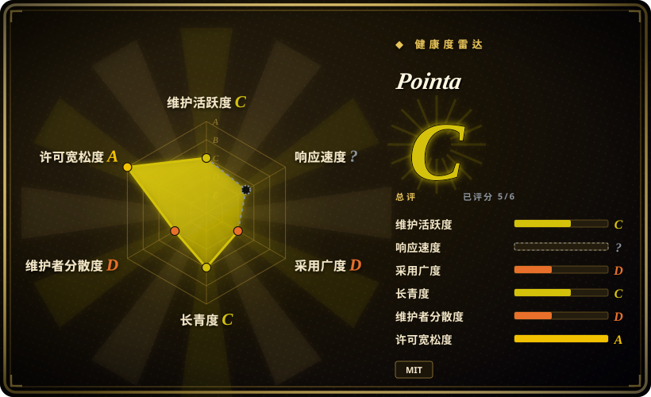
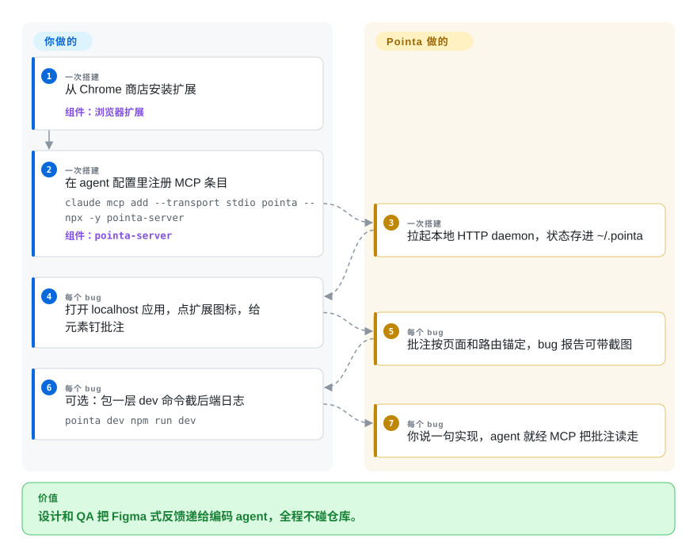

# Pointa

队友（或者未来的你）在 localhost 的 dev server 上发现一个 UI bug，要让编码 agent 修掉——可页面里什么都改不了，因为「你的应用」是不该被伸手的项目。Pointa 占住这个品类里「零集成」的角落：一个 Chrome 扩展加一个会讲 MCP 的本地服务，*应用代码一行都不改*。点元素、写反馈，agent 经 MCP 把批注拉走——还能顺手让你 Node 服务的 console 日志搭同一趟车进 bug 报告。

## 何时使用

你的团队里设计、产品或 QA 给 localhost 构建版做批注，开发者在终端里驱动 Claude Code／Cursor／Windsurf，硬约束是「批注的人不许往仓库里装任何东西」。本品类所有组件式工具都满足不了时 Pointa 顶上来：不用 `npm install`、不用挂组件——装扩展、加一条 MCP 配置（`npx -y pointa-server`），任何 localhost 页面都能像 Figma 一样圈点。第二块独一份的读取是*后端*上下文：把 dev 命令包一层（`pointa dev npm run dev`），服务就截流你 Node 进程的 `console.log`/`console.error`，bug 报告里带着 UI 出错瞬间后端打印的时间线——页面内的工具永远做不到这点，因为它们看不见服务器。对最近的同乡 [Vibe Annotations](vibe-annotations.zh.md)：Pointa 是早期从它身上分叉（README 承认血统）后独立长大的 MIT 版本，决定取舍是「许可干净加面简单」对「Vibe 的更大社区加更全的协作面」——对 [Agentation](agentation.zh.md)，则是拿 DOM 内保真度（content script 的隔离决定了 Pointa 永远够不到 fiber 树，shadow DOM 也是）换零足迹。

## 怎么用起来

两块。**扩展**（Chromium MV3，仅 localhost/`*.local`）管人的那面：从工具栏激活、点元素、写反馈；批注按页面/路由锚定、在 popup 里管理，可以连时间线一起打包成 bug 报告，也能在别的页面上收割「设计灵感」截图加 CSS 元数据。**服务**（npm 上的 `pointa-server`，注册成 MCP stdio 命令时自动拉起）在 127.0.0.1:4242 上给扩展开 HTTP API，给你的 agent 开 MCP 工具——agent 列出批注，然后听你一句「实现这些 Pointa 批注」开始动手；状态是文件制的，躺在 `~/.pointa`。`pointa dev <cmd>` 是个很薄的 Node 包壳：跑你的 dev 命令、钩住 console 方法（或 `--capture-stdout` 收全量 stdout）、把输出转进服务的报告存储。项目负责：拾取 UI、存储、MCP/HTTP 面、日志截流；你负责：agent 循环，以及这条批注到底什么意思。

<!-- flow-steps:begin (generated from flows/pointa.json by tools/flow_card.py — do not edit) -->

流程文字版

1. **你**（一次搭建）：从 Chrome 商店安装扩展 — 组件：`浏览器扩展`
2. **你**（一次搭建）：在 agent 配置里注册 MCP 条目 — `claude mcp add --transport stdio pointa -- npx -y pointa-server` — 组件：`pointa-server`
3. **Pointa**（一次搭建）：拉起本地 HTTP daemon，状态存进 ~/.pointa
4. **你**（每个 bug）：打开 localhost 应用，点扩展图标，给元素钉批注
5. **Pointa**（每个 bug）：批注按页面和路由锚定，bug 报告可带截图
6. **你**（每个 bug）：可选：包一层 dev 命令截后端日志 — `pointa dev npm run dev`
7. **Pointa**（每个 bug）：你说一句实现，agent 就经 MCP 把批注读走

**价值**：设计和 QA 把 Figma 式反馈递给编码 agent，全程不碰仓库。

<!-- flow-steps:end -->

## 何时不用

- **要 `file:line` 和 React 组件名。** content script 看得见 DOM，看不见应用的 fiber 树和构建元数据——Pointa 给到选择器和文本就封顶。挂进应用内部的工具够得更深：[Agentation](agentation.zh.md)（React、dev 构建源码检测）、[earmark](earmark.zh.md)（构建打戳，覆盖更多框架）。
- **团队很小、反正都住在终端里。** 扩展加服务是每台机器多两个活动面（Chrome 装一份、:4242 得空着）；单人开发，[patch-mark](patch-mark.zh.md) 或 Agentation 的剪贴板 markdown 用更少的机器给出同样的闭环。
- **你们用非 Chromium 浏览器、批注远程/staging URL、或 shadow-DOM 组件。** Pointa 自报家门：仅 Chromium、仅 localhost、shadow DOM 内元素不能批注。[Vibe Annotations](vibe-annotations.zh.md) 共享扩展系约束；[markupkit](markupkit.zh.md)／Agentation 能穿进 open shadow root。
- **你需要「它会被继续维护」的确定感。** 32 星、最后推送 2026-03-26——写稿时已静默五个月；而 MCP 生态按月在动（协议修订、客户端换血）。MIT 让分叉很便宜，但把这笔预算记上。要低戏剧性就选 [Agentation](agentation.zh.md)。
- **你期待分叉跟得上母体。** Pointa 最初从 Vibe Annotations 分出来（分叉时对方是 MIT；Vibe 后来改成了 PolyForm Shield）；分叉走自己的路线图，且越走越远。

## 横向对比

| 替代品 | 是否收录 | 我们的评价 | 取舍 |
| --- | --- | --- | --- |
| [Vibe Annotations](vibe-annotations.zh.md) | ✅ | 要更大社区、6k+ 扩展安装量和文件分享/watch 模式协作，选 Vibe；MIT 是合规硬要求、或你就是想要 `pointa dev` 的后端日志截流，选 Pointa。 | 许可加日志捕获，对 采用度加协作广度。 |
| [Agentation](agentation.zh.md) | ✅ | React 应用内部，Agentation 赢在证据深度（fiber、`_debugSource`、:4747 同步的 MCP），而且明年还在；当批注的人碰不到仓库——共享 dev 机上的设计师——Pointa 赢在那一天。 | DOM 内保真加安装义务，对 零足迹加保真上限。 |
| [earmark](earmark.zh.md) | ✅ | 同为 MIT；能加构建插件的开发者拿 earmark 的确定性源码/CSS 证据，碰不到代码的人拿 Pointa 的页外 UI。按「谁来批注」选，不按载荷质量选。 | 证据精度对 触达非工程岗。 |
| [patch-mark](patch-mark.zh.md) | ✅ | patch-mark 要在页面上加两行，但任何浏览器都跑，还明示 prompt 注入威胁模型；Pointa 两行都不加，但仅限 Chromium，默认信任它的 loopback 存储。 | 浏览器广度加安全姿态，对 真正的零接触。 |
| Chrome DevTools 设备工具栏／手动复制元素 | 非仓库 | 浏览器本来就能复制选择器；Pointa 的产品是点击之外的*持久化、按路由归组与 MCP 递送*——DevTools 让你自己补的那截。 | 免费的一次性手工，对 agent 可读回的批注清单。 |

## 技术栈

- **扩展：** JavaScript，Chrome Manifest V3；content script 拾取器加 popup UI；权限限定 localhost。
- **服务：** npm 上的 `pointa-server`（Node.js），semantic-release 驱动版本（v1.3.x），127.0.0.1:4242 的 HTTP API，stdio-MCP 或 HTTP-MCP（`/mcp` 端点），`~/.pointa` 文件存储。
- **日志捕获：** `pointa dev <cmd>` 包一层你的 Node dev 命令，截 `console.*`（或原始 stdout）转进报告存储。
- **血统：** 从 `RaphaelRegnier/vibe-annotations` 在 MIT 时期分叉而来。

## 依赖

- 装好扩展的 Chromium 系浏览器（商店安装或 load-unpacked），Node.js 18+ 跑服务。
- 服务要在 127.0.0.1:4242 可达（或注册成 `npx` 的 MCP 命令让它自管理）。
- 只作用于 localhost/本地域名 dev URL；应用本身什么都不用装。

## 运维难度

**在本品类里算中等——每台机器两个面。** 装扩展简单，但成批分发没有故事（没有 installer，手工来）；服务是又一个本地 daemon，文件存储（`~/.pointa`）会积累。防火墙挡 4242、agent 升级后 MCP 配置漂移，是它自己 troubleshooting 一节写明的痛点。卸载也是真的多步：扩展加 npm 加数据目录加 agent 配置。

## 健康度与可持续性

- **维护——休眠（截至 2026-09-27）。** 建仓 2025-11-27；最后推送 2026-03-26——静默约六个月；semantic-release 标签发到 v1.3.6；`pointa-server` 上月下载约 184。
- **治理／巴士因子。** 实质单人（AmElmo／Julien Berthomier），背后是一家小公司（Argil.io）——比纯爱好项目强，但看不到退出安排；外加一个发布机器人账号。
- **年龄／Lindy。** 十个月大、一半天数在静默——Lindy 不加分；它还年轻，且「年轻工具的分叉」脆弱要承两遍。
- **背书。** Argil.io 的作者身份是这个迷你品类里最强的存活信号；Chrome 商店的存在给了 GitHub 之外的分发渠道。
- **风险标记。** MIT 干净；母项目在分叉之后把许可改成了 PolyForm Shield（分叉点之前的代码有没有许可谱系上的模糊地带要留意——分叉仓库自带 MIT LICENSE [未验证]）；4 个 open issue 无人应；仅 Chromium。

## 存疑（未验证）

- [未验证] MCP 工具名/工具面未从源码枚举——README 给的是注册命令和「实现这些批注」的玩法，不是工具清单。
- [未验证] 后端日志截流（`pointa dev`）行为来自 README，未实测；6k+ 安装量是 Vibe 自己 README 的数字，Pointa 的商店用户数未核。
- [推断] 「Vibe 在分叉后改license」由 Pointa README 称起点为 MIT、而 Vibe 仓库现为 PolyForm Shield 加 NOTICE 两侧拼出；未 bisect 精确日期。
- [推断] 单维护者判断：contributors API 只列 AmElmo 与一个发布 bot。
- [未验证] 星数/下载/推送数字均为 2026-09-27 的 API 瞬时值。
