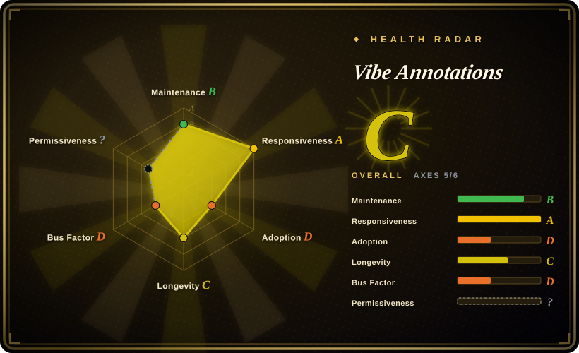
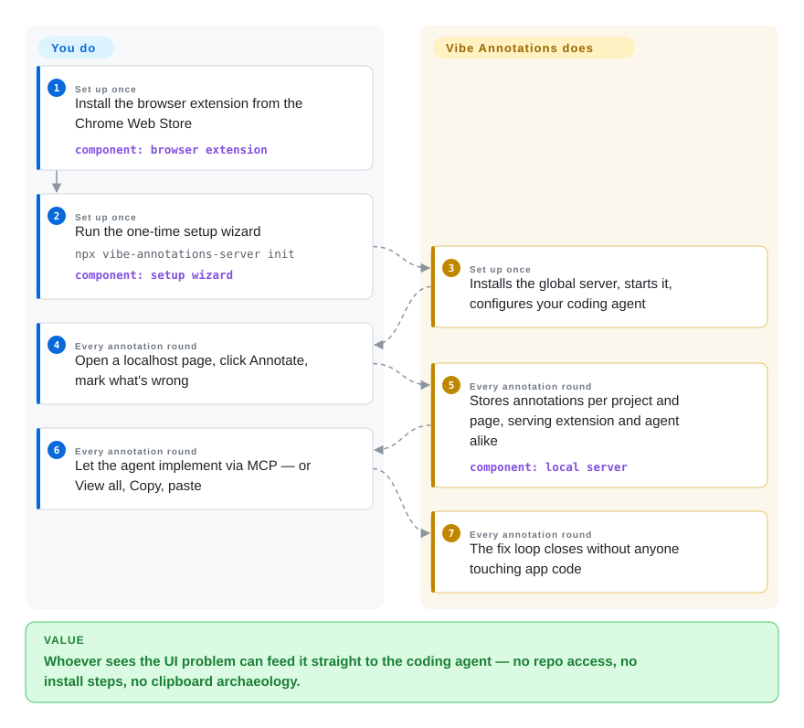

# Vibe Annotations

Annotating your own app is a developer problem; annotating it *for the agent while your designer does the looking* is a distribution problem — you can't make non-coders mount React components or add build plugins. Vibe Annotations is the browser-extension answer: install once from the Chrome Web Store, run one setup command, and every localhost page becomes Figma-annotatable, with the marked-up intent readable by Claude Code / Cursor / Codex via MCP *or* shared with a teammate as a file.

## When to use

You're on a small product team where the person who notices the UI is wrong is not the person running the agent, and nobody wants to touch app code to make feedback flow. Install the extension, run `npx vibe-annotations-server init` — one interactive wizard that installs the global server, starts it in the background, and configures your coding agent — then click **Annotate** on any localhost page. Choose Vibe over the in-app component tools ([Agentation](agentation.md), [markupkit](markupkit.md)) because its footprint is the browser, not the bundle — it works on apps you don't own, in languages it doesn't know, without a single PR to the project. Choose it over its own MIT fork [Pointa](pointa.md) because it kept innovating after the split: 6k+ store users, a watch/collaboration mode and file-sharing path so a reviewer's annotations travel to a developer who isn't on the same machine, plus AI-assisted annotation — in exchange for the parent's PolyForm Shield license and a bus-factor of roughly one plus contributors. The deciding tradeoff against Agentation: you trade the fiber-tree fidelity (component names, dev-mode `file:line` — invisible to any extension) for zero integration and non-developer reach; run both when the developer wants precision and the designer wants ease.

## How it works

Two components, mirroring the Pointa architecture it predates. The **Chrome extension** injects the annotation surface into localhost pages: click elements to pin comments, view all annotations in a side panel, copy them as structured markdown. The **server** (`vibe-annotations-server`, Node.js, background-running after `init`) is the meeting point: it stores annotations per project/page, serves the extension, and speaks MCP to whichever coding agent you configured — the agent's workflow being "read the annotations, implement, done" without any clipboard round-trip, or the "B" path of plain **View all → Copy** into a chat. The docs site describes the deeper layers — an architecture page, watch mode for following sessions, file-based sharing so annotations cross machines where no server is shared, and troubleshooting — while the repo is a pnpm workspace (`packages/`) with terms-of-service and a NOTICE file alongside the license. What the project owns: injection, storage, MCP translation, sharing; what you own: who in your team clicks Annotate and who types "implement the annotations."

<!-- flow-steps:begin (generated from flows/vibe-annotations.json by tools/flow_card.py — do not edit) -->

Text version of the flow

1. **You** (Set up once): Install the browser extension from the Chrome Web Store — component: `browser extension`
2. **You** (Set up once): Run the one-time setup wizard — `npx vibe-annotations-server init` — component: `setup wizard`
3. **Vibe Annotations** (Set up once): Installs the global server, starts it, configures your coding agent
4. **You** (Every annotation round): Open a localhost page, click Annotate, mark what's wrong
5. **Vibe Annotations** (Every annotation round): Stores annotations per project and page, serving extension and agent alike — component: `local server`
6. **You** (Every annotation round): Let the agent implement via MCP — or View all, Copy, paste
7. **Vibe Annotations** (Every annotation round): The fix loop closes without anyone touching app code

**Value**: Whoever sees the UI problem can feed it straight to the coding agent — no repo access, no install steps, no clipboard archaeology.

<!-- flow-steps:end -->

## When NOT to use

- **The annotator is you, in your own React app.** The extension ceiling applies: no component names, no source lines. [Agentation](agentation.md) reads the fiber tree and hands the agent `file:line` — the loop is shorter and the evidence sharper when you can mount a component.
- **OSI-open licensing is a gate.** PolyForm Shield 1.0.0 is source-available, not open source, and there's a TERMS.md on top; pick MIT [Pointa](pointa.md) (the early fork), [earmark](earmark.md), or [patch-mark](patch-mark.md).
- **You need it beyond localhost.** Both extension tools here are dev-machine products; on a remote staging URL with auth, your mileage depends on extension permissions, and neither claims support — for app-integrated tools the URL is irrelevant since they ride your app.
- **The setup wizard's global footprint worries you.** `init` installs a global server, keeps it running in the background, and edits your agent's MCP config — convenience for a product team, surface-area for a locked-down machine; copy-paste markdown mode of [patch-mark](patch-mark.md) or Agentation leaves nothing installed at all.
- **You're betting long-term on one part-time maintainer plus a handful of contributors** with 11 open issues (as of 2026-09-27). Healthier than the 2-star siblings, not as safe as the 4.8k-star one.

## Comparison

| Alternative | In index | Our verdict | Tradeoff |
| --- | --- | --- | --- |
| [Agentation](agentation.md) | ✅ | If the annotator can mount a component in the app, pick Agentation — fiber-level evidence and category-dominant maintenance; pick Vibe when the annotator is a designer, PM, or the app isn't yours. | Evidence depth vs. human reach. |
| [Pointa](pointa.md) | ✅ | Choose Vibe for the post-fork feature set (watch mode, file sharing, AI-assisted annotations) and the installed base; choose Pointa when MIT is required or its backend-log capture is the dealmaker. | Continued development + community vs. license + server-log capture. |
| [earmark](earmark.md) | ✅ | earmark serves the terminal-agent developer who wants greppable source truth and accepts a build plugin; Vibe serves the team that never wants to hear the word "plugin". Both young; Vibe measurably less so. | Code-locating precision vs. zero-code touch. |
| [patch-mark](patch-mark.md) | ✅ | patch-mark wins where extension installs are banned (Firefox, managed Chrome) — two script lines work anywhere a custom element runs; Vibe wins where even that is too much, and brings real screenshot capture to the report. | Embed-anywhere vs. install-anywhere; untrusted-input discipline vs. Figma-UX familiarity. |
| [Plannotator](../supervision-surfaces/plannotator.md) | ✅ | Orthogonal pair worth running together: Vibe captures "what's wrong on the page" from any teammate; Plannotator gates "what the agent is about to do" with your approval. | Sensor surface vs. approval gate. |

## Tech stack

- **Extension:** JavaScript Chrome MV3 extension distributed via Chrome Web Store (6k+ users per README badge, as of 2026-09).
- **Server:** `vibe-annotations-server` on npm (~345 downloads/last-month), Node.js, global install with background daemon managed by the `init` wizard; repo is a pnpm workspace (`packages/`).
- **Agent interface:** MCP (registration covered in docs/mcp-setup), plus markdown clipboard export as the no-MCP path.

## Dependencies

- Chrome (or a Chromium browser) with the extension; Node.js ≥18 for the server.
- Agent-sync mode: the local server must be running and registered with your coding agent's MCP config; copy mode needs neither.
- Scope is localhost development URLs; the annotated app itself stays untouched — that's the whole point.

## Ops difficulty

**Low per machine, invisible to the project.** The `init` wizard automates the annoying parts (global install, background start, agent config); day-2 is a background daemon and a store-managed extension that updates itself. Nothing to deploy or back up; annotations are local. The operational risk is organizational, not infrastructural: a solo-author extension can die in one Chrome Web Store policy change, and your team's workflow would need re-homing overnight.

## Health & viability

- **Maintenance — active (as of 2026-09-27).** Created 2025-07-16 (oldest in this sub-category, ~14 months); last push 2026-08-17; 11 open issues; three named contributors plus drive-by PRs.
- **Governance / bus factor.** RaphaelRegnier-led with a small contributor set; company-ish branding (spellbind.me) but no foundation.
- **Age / Lindy.** 14 months with real cadence and a distribution channel that survives GitHub-only repos (Chrome Web Store installs) — the strongest Lindy signal among the six tools indexed here besides Agentation itself.
- **Backing.** Indie/vendor-shaped; the extension's user base is both the adoption proof and the switching cost that keeps it alive.
- **Risk flags.** PolyForm Shield (not OSI) plus TERMS.md; relicensed history relative to its own fork lineage — Pointa forked when the code was MIT, and Vibe moved to Shield afterward, a reminder that the license can change again under a sole owner.

## Caveats (unverified)

- [未验证] Watch mode, file-sharing, and AI-assisted annotation are named in the README badge line and docs site; I did not run them. Their depth is unknown.
- [未验证] 6k+ Chrome Web Store users is the project's own badge claim; the store listing was not scraped for a current number.
- [推断] "Server daemon runs in background after init" is from the README's wizard description, not from reading the server source.
- [推断] Treating Pointa's parent lineage as MIT-at-fork is cross-read from the two READMEs (see Pointa's page); exact relicensing date not bisected.
- [未验证] Stars/issues/downloads/push figures are API values from 2026-09-27.
