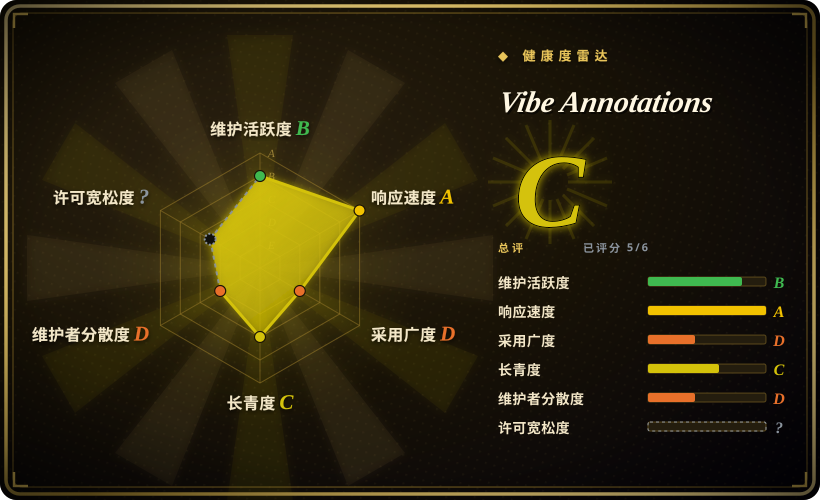
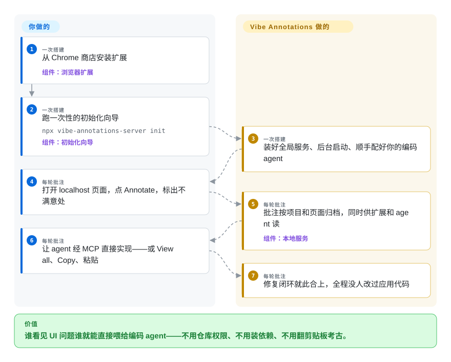

# Vibe Annotations

给自己的应用做批注是开发者问题；*让设计师负责看、agent 负责改*的批注是分发问题——你没法要求不写代码的人去挂 React 组件或加构建插件。Vibe Annotations 是浏览器扩展式的答案：Chrome 商店装一次、跑一条初始化命令，每个 localhost 页面都能像 Figma 一样圈点，标好的意图 Claude Code／Cursor／Codex 能经 MCP 读懂，*或者*当成文件发给队友。

## 何时使用

你在一个小的产品团队，发现 UI 不对的人不是跑 agent 的人，而且没人愿意为了「反馈能流动」去碰应用代码。装扩展，跑 `npx vibe-annotations-server init`——一个交互式向导，全局装好服务、后台拉起、把你那个编码 agent 也配好——然后任何 localhost 页面点 **Annotate**。选 Vibe 而不是组件式工具（[Agentation](agentation.zh.md)、[markupkit](markupkit.zh.md)），是因为它的足迹在浏览器不在 bundle——不是你拥有的应用、它不认识的技术栈，都能批注，且给那个项目提不了一个 PR。选它而不是自家 MIT 分叉 [Pointa](pointa.zh.md)，是因为分叉之后它还在进化：6k+ 商店用户、watch／协作模式、把评审者的批注传给不在同一台机器上的开发者的文件分享路径、AI 辅助批注——代价是 PolyForm Shield 许可，和「一个主力加几个 contributor」的巴士因子。对 Agentation 的决定性取舍：放弃 fiber 树的保真度（组件名、dev 期 `file:line`——扩展看不见这些），换零集成与对非开发者的触达；开发者要精度、设计师要省事时，两个一起上。

## 怎么用起来

两块，和它后来被分叉成的 Pointa 同构。**Chrome 扩展**把批注面注入 localhost 页面：点元素钉一条评论、侧栏看全部、复制成结构化 markdown。**服务**（npm 上的 `vibe-annotations-server`，Node.js，`init` 之后常驻后台）是汇合点：按项目/页面存批注、对扩展供 API、对你配置好的那个编码 agent 讲 MCP——agent 的工作流是「读批注、实现、完事」，全程不用剪贴板中转；不想配 MCP 也有 B 路线：纯 **View all → Copy** 贴进聊天。文档站展开了更深的层：architecture 页、跟进会话的 watch 模式、跨机器的文件分享、troubleshooting；仓库是 pnpm workspace（`packages/`），LICENSE 旁边放着 TERMS.md 和 NOTICE。项目负责：注入、存储、MCP 翻译、分享；你负责：团队里谁去点 Annotate、谁去敲「实现这些批注」。

<!-- flow-steps:begin (generated from flows/vibe-annotations.json by tools/flow_card.py — do not edit) -->

流程文字版

1. **你**（一次搭建）：从 Chrome 商店安装扩展 — 组件：`浏览器扩展`
2. **你**（一次搭建）：跑一次性的初始化向导 — `npx vibe-annotations-server init` — 组件：`初始化向导`
3. **Vibe Annotations**（一次搭建）：装好全局服务、后台启动、顺手配好你的编码 agent
4. **你**（每轮批注）：打开 localhost 页面，点 Annotate，标出不满意处
5. **Vibe Annotations**（每轮批注）：批注按项目和页面归档，同时供扩展和 agent 读 — 组件：`本地服务`
6. **你**（每轮批注）：让 agent 经 MCP 直接实现——或 View all、Copy、粘贴
7. **Vibe Annotations**（每轮批注）：修复闭环就此合上，全程没人改过应用代码

**价值**：谁看见 UI 问题谁就能直接喂给编码 agent——不用仓库权限、不用装依赖、不用翻剪贴板考古。

<!-- flow-steps:end -->

## 何时不用

- **批注的人就是你自己、应用是你自己的 React 项目。** 扩展天花板照样落下：没有组件名、没有源码行。[Agentation](agentation.zh.md) 读 fiber 树、把 `file:line` 递到 agent 手里——能挂组件时，循环更短、证据更利。
- **OSI 开源许可是门槛。** PolyForm Shield 1.0.0 是 source-available 不是开源，头上还压着 TERMS.md；要 MIT 就拿 [Pointa](pointa.zh.md)（早期分叉）、[earmark](earmark.zh.md) 或 [patch-mark](patch-mark.zh.md)。
- **要批注 localhost 以外的东西。** 本类两款扩展工具都是开发机产品；带鉴权的远程 staging URL 全看扩展权限，谁都没声称支持——组件式工具反而无所谓 URL，它们坐你的应用的车。
- **初始化向导的全局面让你不安。** `init` 会装全局服务、保持后台运行、改写你的 agent MCP 配置——对产品团队是便利，对锁死的机器是暴露面；[patch-mark](patch-mark.zh.md) 或 Agentation 的剪贴板模式什么都不装。
- **你不愿把长期押在「一个业余维护者加几名 contributor」**、11 个 open issue（截至 2026-09-27）上。比 2 星的同乡健康，不如 4.8k 星那位稳。

## 横向对比

| 替代品 | 是否收录 | 我们的评价 | 取舍 |
| --- | --- | --- | --- |
| [Agentation](agentation.zh.md) | ✅ | 批注的人能在应用里挂组件，选 Agentation——fiber 级证据加品类断层的第一维护度；批注的人是设计、产品，或应用根本不是你家的，选 Vibe。 | 证据深度对人的触达。 |
| [Pointa](pointa.zh.md) | ✅ | 要分叉之后的功能面（watch、文件分享、AI 辅助批注）和存量用户，选 Vibe；MIT 是硬要求、或 `pointa dev` 的后端日志捕获才是胜负手，选 Pointa。 | 持续发展加社区，对 许可加日志捕获。 |
| [earmark](earmark.zh.md) | ✅ | earmark 服务「要可 grep 的源码真相、肯加构建插件」的终端 agent 开发者；Vibe 服务「连『插件』这个词都不想听到」的团队。都年轻；Vibe 明显没那么年轻。 | 代码定位精度对 零代码接触。 |
| [patch-mark](patch-mark.zh.md) | ✅ | 禁装扩展的地方（Firefox、管控 Chrome）patch-mark 赢——两行 script 在能跑 custom element 的任何页面都活；连这两行都多余时 Vibe 赢，而且报告里带真截图。 | 随处可嵌对随处可装；不可信输入的纪律对 Figma 式手感。 |
| [Plannotator](../supervision-surfaces/plannotator.zh.md) | ✅ | 正交互补、值得同开：Vibe 从任何队友那里收「页面上哪里不对」；Plannotator 用你的批准卡住「agent 接下来要干什么」。 | 传感面 对 审批闸门。 |

## 技术栈

- **扩展：** JavaScript 的 Chrome MV3 扩展，经 Chrome Web Store 分发（README 徽章：6k+ 用户，截至 2026-09）。
- **服务：** npm 上的 `vibe-annotations-server`（上月下载约 345），Node.js，`init` 向导负责全局安装与后台守护；仓库为 pnpm workspace（`packages/`）。
- **agent 接口：** MCP（注册流程见 docs/mcp-setup），外加 markdown 剪贴板导出作为无 MCP 的退路。

## 依赖

- 装好扩展的 Chrome（或 Chromium 系浏览器）；Node.js ≥18 跑服务。
- agent 同步模式要求本地服务在跑且已注册进你的编码 agent 的 MCP 配置；复制模式两者都不要。
- 作用范围是 localhost 开发 URL；被批注的应用本身零改动——这本身就是卖点。

## 运维难度

**单机低、对项目不可见。** `init` 把烦人部分全自动化（全局装、后台启、配 agent）；day-2 是一个后台 daemon 和一个商店自更新的扩展。没有要部署、要备份的东西；批注全在本地。运维风险是组织性的不是基础设施性的：单人作者的扩展可能死于一次 Chrome 商店政策变更，而你们团队的工作流一夜之间要重新安家。

## 健康度与可持续性

- **维护——活跃（截至 2026-09-27）。** 建仓 2025-07-16（本小类最老，约 14 个月）；最后推送 2026-08-17；11 个 open issue；三位具名 contributor 加零散 PR。
- **治理／巴士因子。** RaphaelRegnier 主导、小 contributor 面；有公司化品牌（spellbind.me）但不是基金会。
- **年龄／Lindy。** 14 个月、节奏真实，且分发渠道不依赖 GitHub（Chrome 商店安装量）——除 Agentation 外，本次收录六款工具里最强的 Lindy 信号。
- **背书。** 独立开发者／小厂商形态；扩展用户盘既是采用度的证据，也是让它继续活着的沉没成本。
- **风险标记。** PolyForm Shield（非 OSI）外加 TERMS.md；相对自家分叉的换许可史——Pointa 在 MIT 时期分叉、Vibe 之后转向 Shield——提醒单人所有下许可还会再变。

## 存疑（未验证）

- [未验证] watch 模式、文件分享、AI 辅助批注只在 README 一行和文档站里点名，未实际运行，深度未知。
- [未验证] 6k+ 商店用户是项目自报徽章；未去商店列表抓现值。
- [推断] 「`init` 后服务常驻后台」来自 README 对向导的描述，未读 server 源码。
- [推断] Pointa 谱系的「分叉时为 MIT」由两个 README 互读拼出（见 Pointa 页）；改license精确日期未 bisect。
- [未验证] 星数/issue/下载/推送数字均为 2026-09-27 的 API 瞬时值。
