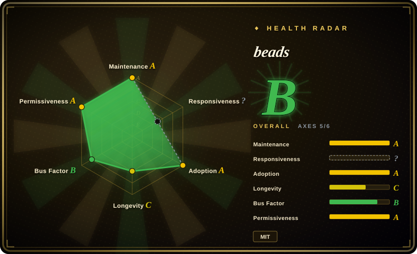
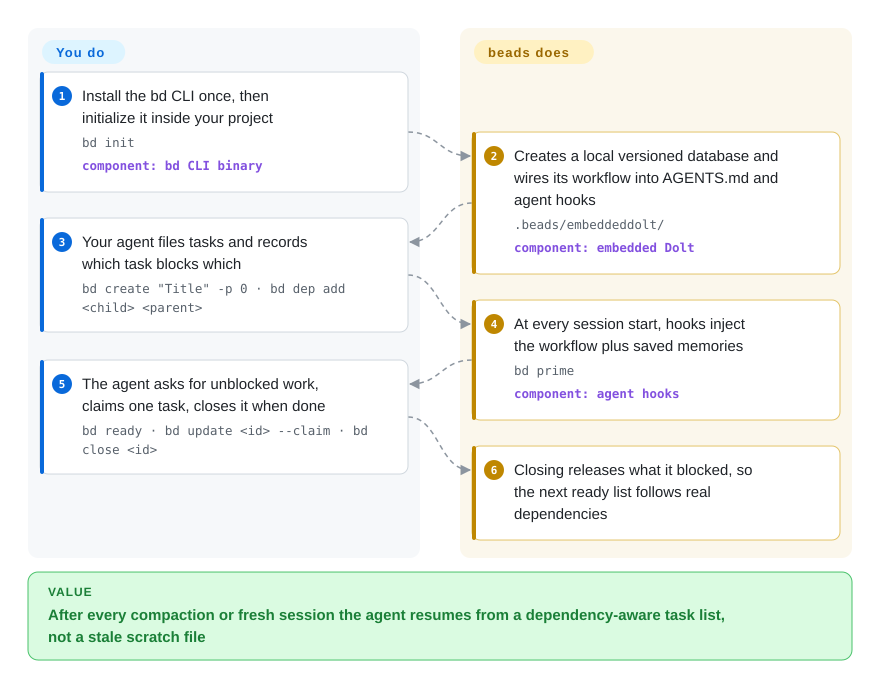

# beads

Your coding agent forgets what it was doing every time the context window compacts or you open a new session, and a hand-kept `TODO.md` can't say which task is blocked by which. beads gives the agent a small task database that lives in the repo, records what blocks what, and answers "what can I do next?" with one command (`bd`).

## When to use

You're a solo developer babysitting a coding agent through a multi-day refactor of a single repo. Every time the session compacts or you start a fresh one, the agent forgets half of what it was doing: the bug it spotted in the auth layer two hours ago is gone, the "do this after the migration lands" note never made it anywhere durable, and it quietly reorders work to whatever fits the token budget rather than what's actually unblocked. You've been patching over this with a hand-rolled `MEMORY.md`, but it has no notion of which tasks block which, and the moment you let the agent work on two branches it scribbles conflicting IDs all over it.

So you `bd init` in the repo and hand the agent the `bd` binary. Now its task state lives in a version-controlled, dependency-aware graph that syncs alongside the code — hash IDs keep parallel branches and agents from colliding, `bd ready` surfaces exactly the work that isn't blocked, and `bd remember`/`bd prime` replace that ad-hoc scratch file with memory the agent can actually carry across sessions. You pick it over GitHub Issues or Linear because it is offline-first, branchable like git and agent-first (JSON output on every command); you pick it over a plain markdown file because it knows the dependency graph.

## How it works

beads is a command-line issue tracker whose storage is Dolt — a SQL database that versions its data like git does (branch, diff, merge, push, pull). `bd init` creates that database inside your project's `.beads/` folder and, by default, writes the beads workflow into `AGENTS.md` and installs hooks for Claude Code or Codex, so the agent learns the commands without you pasting instructions. After that, you mostly stay out of the loop: the agent files tasks, records dependencies ("A blocks B"), asks `bd ready` for work nothing is blocking, claims one atomically, and closes it; the hooks run `bd prime` at every session start to re-inject the workflow and saved memories. Think of it as a shared to-do board that also knows which cards are waiting on others — and that the agent re-reads every morning. Cross-machine sync (`bd dolt push` / `bd dolt pull`) goes over your existing git remote; the default "embedded" mode runs the database inside the `bd` process and allows only one writer at a time.

<!-- flow-steps:begin (generated from flows/beads.json by tools/flow_card.py — do not edit) -->

Text version of the flow

1. **You**: Install the bd CLI once, then initialize it inside your project — `bd init` — component: `bd CLI binary`
2. **beads**: Creates a local versioned database and wires its workflow into AGENTS.md and agent hooks — `.beads/embeddeddolt/` — component: `embedded Dolt`
3. **You**: Your agent files tasks and records which task blocks which — `bd create "Title" -p 0 · bd dep add <child> <parent>`
4. **beads**: At every session start, hooks inject the workflow plus saved memories — `bd prime` — component: `agent hooks`
5. **You**: The agent asks for unblocked work, claims one task, closes it when done — `bd ready · bd update <id> --claim · bd close <id>`
6. **beads**: Closing releases what it blocked, so the next ready list follows real dependencies

**Value**: After every compaction or fresh session the agent resumes from a dependency-aware task list, not a stale scratch file

<!-- flow-steps:end -->

## When NOT to use

- **Human-team tracking** — no first-party web UI, dashboards or notifications; the only web views are community projects (e.g. `bd-board`). If product managers or non-engineers need to see the backlog, a hosted tracker fits better — beads can sync to GitHub/Jira/Linear, but then you are running two systems.
- **Several agents writing at once, without ops budget** — the default embedded mode is single-writer. Concurrent agents need `bd init --server` against an external `dolt sql-server` you run, back up and upgrade yourself.
- **Upgrades you can't coordinate** — schema migrations are frequent and one-way in practice: v1.3.0 (2026-09-15) applies 13+ migrations on first open, a newer schema locks out older binaries, a shared server is never auto-migrated, and every client of a shared store must upgrade together. A fleet of machines with mixed `bd` versions will hit the schema-skew guard.
- **You want boring, stable software** — the project is under a year old and ships a release or release candidate every week or two; its own changelog documents migration and rollback runbooks. The FAQ now calls 1.x production-ready with semantic versioning, but the change rate is still high.
- **Huge backlogs in one database** — the FAQ suggests splitting into one database per component past ~100k issues.
- **Avoiding a new storage engine** — the source of truth is a Dolt database (`.beads/issues.jsonl` is an export, not a backup). You inherit Dolt's format, disk growth (`bd gc` / `bd prune`) and backup story.
- **Concentrated maintainership** — one maintainer authored most commits and the project states it "uses AI agents for maintenance"; weigh that before building a long-lived workflow on it.

## Comparison

| Alternative | In index | Our verdict | Tradeoff |
|---|---|---|---|
| Plain markdown `MEMORY.md` / `TODO.md` | 未收录 | Choose plain markdown when a single agent works one branch and zero dependencies matter more than knowing what blocks what. | Zero deps and human-readable, but no dependency graph, no ready-detection, no merge-safe IDs — exactly the unstructured approach beads replaces. |
| GitHub Issues (+ `gh` CLI) | 未收录 | Choose GitHub Issues when humans triage the backlog in a browser; add beads only if agents also need an offline, branch-scoped copy. | Mature hosted tracker with web UI, notifications and cross-repo views, but online-first and not versioned with the branch; beads can sync with it (`bd github sync`) at the cost of running both. |
| Taskwarrior | 未收录 | Choose Taskwarrior for a person's own offline to-do list; choose beads when agents on several branches must merge task state. | Battle-tested offline CLI with rich filtering, but no versioned SQL backend, no cell-level merge across branches, and no agent hooks. |
| Linear / Jira | 未收录 | Choose Linear or Jira when a human team needs workflows, dashboards and permissions; beads stays the agents' working layer if used at all. | Best-in-class for human teams, but heavyweight, online-only and not versioned with the code; beads offers bidirectional sync (`bd linear` / `bd jira`) rather than replacing them. |
| Dolt directly (raw versioned SQL) | 未收录 | Choose raw Dolt when you want versioned SQL for your own schema and will build the agent ergonomics yourself. | Same branch/merge storage without an opinionated schema, but you write the issue model, dependency logic, ready-detection and agent hooks — beads is that layer. |

## Tech stack

- Go (module on Go 1.26), single CLI binary `bd`
- Dolt — version-controlled SQL database, embedded in-process in CGO builds (`github.com/dolthub/driver`), or reached as an external `dolt sql-server`
- JSONL — export / import and interchange format (`bd export`, `bd import`)
- Integrations: `bd setup` recipes for Claude Code, Codex, Cursor, Copilot, Gemini and others; tracker sync for GitHub, Jira, Linear, GitLab, Azure DevOps and Notion; a separate `beads-mcp` package on PyPI
- Distribution: Homebrew, npm (`@beads/bd`), install scripts, `go install`, winget

## Dependencies

- **Embedded mode (default)** — nothing beyond the `bd` binary; Dolt runs in-process and data lives in `.beads/embeddeddolt/`. Only CGO builds include it: a `CGO_ENABLED=0` `go install` produces a server-mode-only binary.
- **Server mode** — an external `dolt sql-server` process (one per project, or one shared via `bd init --shared-server`), plus connection config.
- **Optional** — a git remote for `bd dolt push` / `pull` (stored under `refs/dolt/data`), and API credentials for any tracker you sync with.

## Ops difficulty

**Medium.** Solo embedded use is low-friction: install, `bd init`, and the agent takes it from there. The cost appears around it. Upgrades are the main chore — the README's upgrade path is "sync, `bd export --all`, upgrade, `bd hooks install`", and on remote-backed or shared stores exactly one designated clone runs `bd migrate` and pushes while the others `bd bootstrap`. Multi-writer setups mean operating a Dolt SQL server. Backups are your job (`bd backup` or a Dolt remote), and the database grows until you run `bd gc`.

## Health & viability

- **Responsiveness**: Cannot be scored — unknown.
- **Maintenance** — very active as of 2026-09-28: last push the same day, v1.3.0 released 2026-09-15 and v1.3.1-rc.1 on 2026-09-21, with releases every one to three weeks since v1.0.0 (2026-04-02). Active but volatile: the 1.3.0 notes are dominated by schema-migration instructions.
- **Governance / bus factor** — started by Steve Yegge and moved from `steveyegge/beads` to the `gastownhall` org (Go module path still `github.com/steveyegge/beads`). Contributions are broad in count but concentrated in effect: the scorer counts 463 active contributors in 12 months, yet the top one holds a 0.542 share of recent commits (~4.8k commits all-time vs ~0.8k for the next). CONTRIBUTING states the project uses AI agents for maintenance and requires maintainer approval to merge.
- **Age & Lindy** — created 2025-10-12, under a year old as of 2026-09: too young for a Lindy verdict. ~27.5k stars and 1.8k forks within a year reflect attention, not durability.
- **Adoption** — real usage signals: npm `@beads/bd` 22811 downloads last month, 7489 Homebrew installs in 90 days and 1445311 release-asset downloads (scorer data, 2026-09-28). About 1.3k open issues show heavy traffic.
- **Risk flags** — MIT with no relicense history. Operational flags dominate: Dolt as the lock-in storage format and one-way schema migrations that require every client to upgrade together.

## Caveats (unverified)

- **"Used in production"** — the FAQ's claim that 1.x is used in production with stable core semantics is the project's self-description; no independent production case study was checked. `[未验证]`
- **Performance / scale** — "fast at thousands of issues" and the ~100k-issue split guidance are the project's FAQ, not independently benchmarked. `[未验证]`
- **Destructive agent operations** — the previous version of this page cited project warnings that agents had run destructive DB operations (e.g. `DROP TABLE`); the 2026-09-28 re-read did not find that warning in the current README/FAQ/AGENTS files, so it is neither confirmed nor retracted. `[未验证]`
- **Tracker sync quality** — the GitHub/Jira/Linear/GitLab/Azure DevOps/Notion sync commands exist in the CLI reference; how faithfully they round-trip fields, comments and dependencies was not tested. `[未验证]`
- **Maintainer concentration** — "top contributor ~4.8k commits" counts commits, which the AI-assisted workflow may inflate; it is a proxy for bus factor, not a measure of it. `[推断]`
