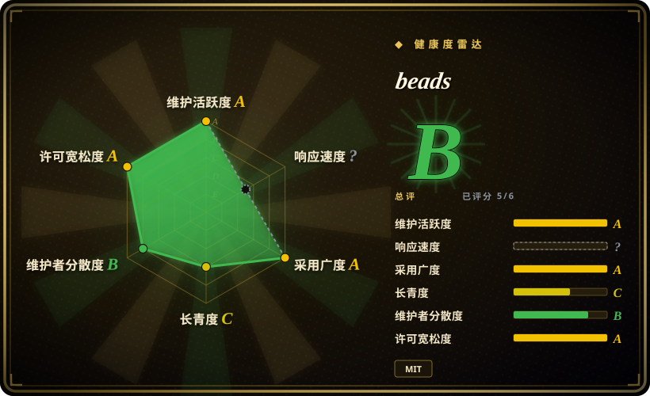
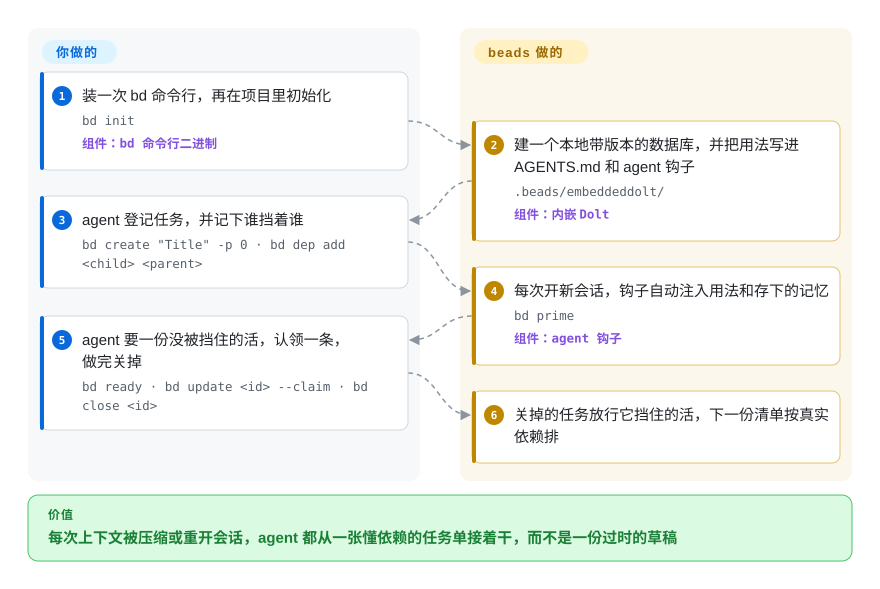

# beads

编码 agent 每逢上下文被压缩、或者你开个新会话，就忘了自己干到哪一步；手写的 `TODO.md` 又说不清哪件事卡着哪件事。beads 给 agent 一个放在仓库里的小任务库，记下谁挡着谁，一条命令（`bd`）回答“下一步能做什么”。

## 何时使用

你是个独立开发者，正盯着一个编码 agent 把单个仓库做一场跨好几天的重构。每次会话被压缩、或者你重开一个新会话，agent 就忘掉它手头一半的事：两小时前在 auth 层发现的那个 bug 没了，那条“等迁移落地后再做这个”的备注从来没被持久化到任何地方，而且它会按“塞得进 token 预算的”而非“真正无阻塞的”来悄悄重排工作顺序。你一直靠一个手写的 `MEMORY.md` 来打补丁，可它根本不知道哪些任务阻塞哪些任务；一旦你让 agent 在两个分支上干活，它就会往里乱涂相互冲突的 ID。

于是你在仓库里 `bd init`，把 `bd` 二进制交给 agent。现在它的任务状态活在一张可版本控制、感知依赖关系的图里，和代码一起同步——哈希 ID 让并行分支和多 agent 互不撞车，`bd ready` 恰好列出那些没被阻塞的工作，`bd remember`/`bd prime` 则用 agent 真正能跨会话带走的记忆，取代那个临时的草稿文件。你选它而不选 GitHub Issues 或 Linear，是因为它离线优先、能像 git 一样分支、每条命令都有 JSON 输出，天生给 agent 用；你选它而不选一份 markdown，是因为它懂依赖关系。

## 怎么用起来

beads 是一个命令行 issue 追踪器，底层存储是 Dolt——一个像 git 那样给数据做版本管理（分支、对比、合并、推拉）的 SQL 数据库。`bd init` 在项目的 `.beads/` 目录里建好这个库，并默认把 beads 的用法写进 `AGENTS.md`、给 Claude Code 或 Codex 装上钩子，agent 不用你贴说明就会用。之后你基本不用插手：agent 自己登记任务、记下依赖（“A 挡着 B”）、用 `bd ready` 要一份没被挡住的活、原子地认领一条、做完关掉；钩子在每次开会话时跑 `bd prime`，把用法和存下的记忆重新注入。可以把它想成一块会记住“哪张卡在等哪张卡”的共享看板，而且 agent 每天早上都会重读一遍。跨机器同步（`bd dolt push` / `bd dolt pull`）走你现有的 git 远端；默认的“内嵌”模式把数据库跑在 `bd` 进程里，同一时刻只允许一个写入者。

<!-- flow-steps:begin (generated from flows/beads.json by tools/flow_card.py — do not edit) -->

流程文字版

1. **你**：装一次 bd 命令行，再在项目里初始化 — `bd init` — 组件：`bd 命令行二进制`
2. **beads**：建一个本地带版本的数据库，并把用法写进 AGENTS.md 和 agent 钩子 — `.beads/embeddeddolt/` — 组件：`内嵌 Dolt`
3. **你**：agent 登记任务，并记下谁挡着谁 — `bd create "Title" -p 0 · bd dep add <child> <parent>`
4. **beads**：每次开新会话，钩子自动注入用法和存下的记忆 — `bd prime` — 组件：`agent 钩子`
5. **你**：agent 要一份没被挡住的活，认领一条，做完关掉 — `bd ready · bd update <id> --claim · bd close <id>`
6. **beads**：关掉的任务放行它挡住的活，下一份清单按真实依赖排

**价值**：每次上下文被压缩或重开会话，agent 都从一张懂依赖的任务单接着干，而不是一份过时的草稿

<!-- flow-steps:end -->

## 何时不用

- **给人类团队做任务追踪**——官方没有 web 界面、看板或通知，网页视图只有社区项目（例如 `bd-board`）。如果产品经理或非工程人员要看 backlog，托管 tracker 更合适；beads 能和 GitHub/Jira/Linear 同步，但那样你就得同时维护两套系统。
- **多个 agent 同时写、又没有运维预算**——默认内嵌模式只允许单写入者。并发 agent 需要 `bd init --server` 连一个外部 `dolt sql-server`，备份和升级都得你自己管。
- **升级没法统一协调**——schema 迁移频繁且实际上单向：v1.3.0（2026-09-15）首次打开就要跑 13 个以上的迁移，新 schema 会把旧版二进制挡在门外，共享 server 从不自动迁移，共用一个库的所有客户端必须一起升级。一群 `bd` 版本不一的机器会撞上 schema 版本守卫。
- **你要的是稳定无聊的软件**——项目不到一岁，每一两周就出一个正式版或候选版，自己的 changelog 里写着迁移和回滚手册。FAQ 如今称 1.x 已可用于生产、遵循语义化版本，但变动速度依然很高。
- **一个库里塞超大 backlog**——FAQ 建议超过约 10 万条 issue 时按组件拆成多个库。
- **不想引入新的存储引擎**——真正的数据源是 Dolt 数据库（`.beads/issues.jsonl` 只是导出，不是备份）。你会继承 Dolt 的格式、磁盘增长（`bd gc` / `bd prune`）和备份方式。
- **维护高度集中**——绝大多数提交出自一位维护者，项目自述“用 AI agent 做维护”；要在它上面搭长期工作流前先掂量这一点。

## 横向对比

| 替代品 | 是否收录 | 我们的评价 | 取舍 |
|---|---|---|---|
| 普通 markdown `MEMORY.md` / `TODO.md` | 未收录 | 单个 agent 只在一个分支上干活、零依赖比“知道谁挡着谁”更要紧时，选普通 markdown。 | 零依赖且人类可读，但没有依赖关系图、没有 ready 检测、没有可安全合并的 ID——正是 beads 要取代的非结构化做法。 |
| GitHub Issues（+ `gh` CLI） | 未收录 | 由人在浏览器里分拣 backlog 时选 GitHub Issues；只有 agent 还需要一份离线、跟着分支走的副本时才再加 beads。 | 成熟的托管 tracker，带 web 界面、通知和跨仓视图，但在线优先、不随分支做版本；beads 能与它同步（`bd github sync`），代价是两套一起跑。 |
| Taskwarrior | 未收录 | 个人的离线待办清单选 Taskwarrior；多个分支上的 agent 要合并任务状态时选 beads。 | 久经考验的离线 CLI，过滤能力丰富，但没有带版本的 SQL 后端，不能跨分支按字段合并，也没有 agent 钩子。 |
| Linear / Jira | 未收录 | 人类团队需要流程、看板和权限时选 Linear 或 Jira；beads 若要用，也只做 agent 的工作层。 | 面向人类团队的同类最佳，但重量级、仅在线、不与代码一起做版本；beads 提供双向同步（`bd linear` / `bd jira`），而不是取代它们。 |
| 直接用 Dolt（原始带版本 SQL） | 未收录 | 想给自己的 schema 用带版本的 SQL、并愿意自建 agent 体验时，选原始 Dolt。 | 同样的分支/合并存储，不带预设 schema，但 issue 模型、依赖逻辑、ready 检测和 agent 钩子都得你自己写——beads 就是那一层。 |

## 技术栈

- Go（模块基于 Go 1.26），单个 CLI 二进制 `bd`
- Dolt——带版本控制的 SQL 数据库，CGO 构建下以进程内方式嵌入（`github.com/dolthub/driver`），或连接外部 `dolt sql-server`
- JSONL——导出/导入与交换格式（`bd export`、`bd import`）
- 集成：`bd setup` 为 Claude Code、Codex、Cursor、Copilot、Gemini 等提供配置方案；与 GitHub、Jira、Linear、GitLab、Azure DevOps、Notion 的 tracker 同步；PyPI 上另有 `beads-mcp` 包
- 分发：Homebrew、npm（`@beads/bd`）、安装脚本、`go install`、winget

## 依赖

- **内嵌模式（默认）**——除 `bd` 二进制外什么都不用装；Dolt 跑在进程内，数据存于 `.beads/embeddeddolt/`。只有 CGO 构建带它：`CGO_ENABLED=0` 的 `go install` 产出的是仅支持 server 模式的二进制。
- **Server 模式**——一个外部 `dolt sql-server` 进程（每个项目一个，或用 `bd init --shared-server` 共享一个），加上连接配置。
- **可选**——一个 git 远端供 `bd dolt push` / `pull` 使用（存放在 `refs/dolt/data` 下），以及要同步的 tracker 的 API 凭据。

## 运维难度

**中等。** 单人内嵌使用摩擦很低：安装、`bd init`，剩下交给 agent。成本出在周边。升级是主要负担——README 给的升级路径是“先同步、`bd export --all`、换二进制、`bd hooks install`”，远端同步或共享的库还要指定唯一一个克隆跑 `bd migrate` 并推送，其余克隆跑 `bd bootstrap`。多写入者就得运维一个 Dolt SQL server。备份归你管（`bd backup` 或 Dolt 远端），数据库也会一直涨，直到你跑 `bd gc`。

## 健康度与可持续性

- **响应速度**：无法计算——unknown。
- **维护**——截至 2026-09-28 非常活跃：最后一次 push 就在当天，v1.3.0 于 2026-09-15 发布，v1.3.1-rc.1 于 2026-09-21 发布，自 v1.0.0（2026-04-02）以来每一到三周就有新版本。活跃但易变：1.3.0 的发布说明大半在讲 schema 迁移。
- **治理 / 巴士因子**——由 Steve Yegge 发起，仓库从 `steveyegge/beads` 迁到 `gastownhall` 组织（Go 模块路径仍是 `github.com/steveyegge/beads`）。贡献者人数多，但实际高度集中：评分器统计 12 个月内有 463 名活跃贡献者，但头号贡献者占近期提交的 0.542（历史累计约 4.8k 次提交，第二名约 0.8k）。CONTRIBUTING 写明项目用 AI agent 做维护，合并需维护者批准。
- **年龄与 Lindy**——创建于 2025-10-12，截至 2026-09 不足一年：太年轻，给不出 Lindy 裁决。一年内约 2.75 万 star、1.8k fork，说明的是关注度，不是持久性。
- **采用度**——有真实使用信号：npm `@beads/bd` 上月下载 22811 次，Homebrew 90 天安装 7489 次，发布产物累计下载 1445311 次（评分器数据，2026-09-28）。约 1.3k 个未关闭 issue 说明流量很大。
- **风险旗标**——MIT，无改协议历史。主要旗标在运维侧：Dolt 是锁定的存储格式，schema 迁移单向，且要求所有客户端一起升级。

## 存疑（未验证）

- **“已用于生产”**——FAQ 称 1.x 已在生产中使用、核心语义稳定，这是项目自述；没有核对过独立的生产案例。`[未验证]`
- **性能/规模**——“数千条 issue 下依然很快”以及约 10 万条就拆库的建议来自项目 FAQ，未经独立基准测试。`[未验证]`
- **agent 破坏性操作**——本页旧版引用过项目关于 agent 曾对数据库执行破坏性操作（例如 `DROP TABLE`）的警告；2026-09-28 重读时在当前 README/FAQ/AGENTS 文件里没找到这条警告，因此既未确认也未撤回。`[未验证]`
- **tracker 同步质量**——GitHub/Jira/Linear/GitLab/Azure DevOps/Notion 的同步命令在 CLI 参考里存在；字段、评论和依赖能否完整往返，没有实测。`[未验证]`
- **维护者集中度**——“头号贡献者约 4.8k 次提交”数的是提交次数，AI 辅助的工作流可能放大这个数；它只是巴士因子的代理指标，不是度量本身。`[推断]`
