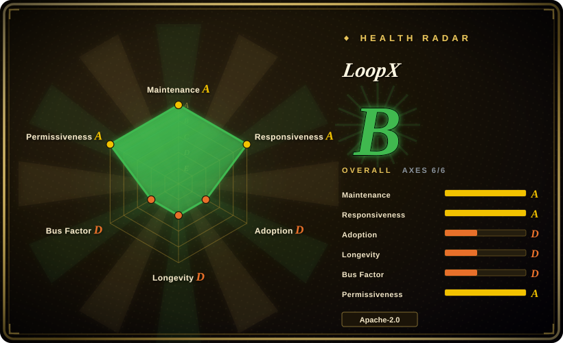
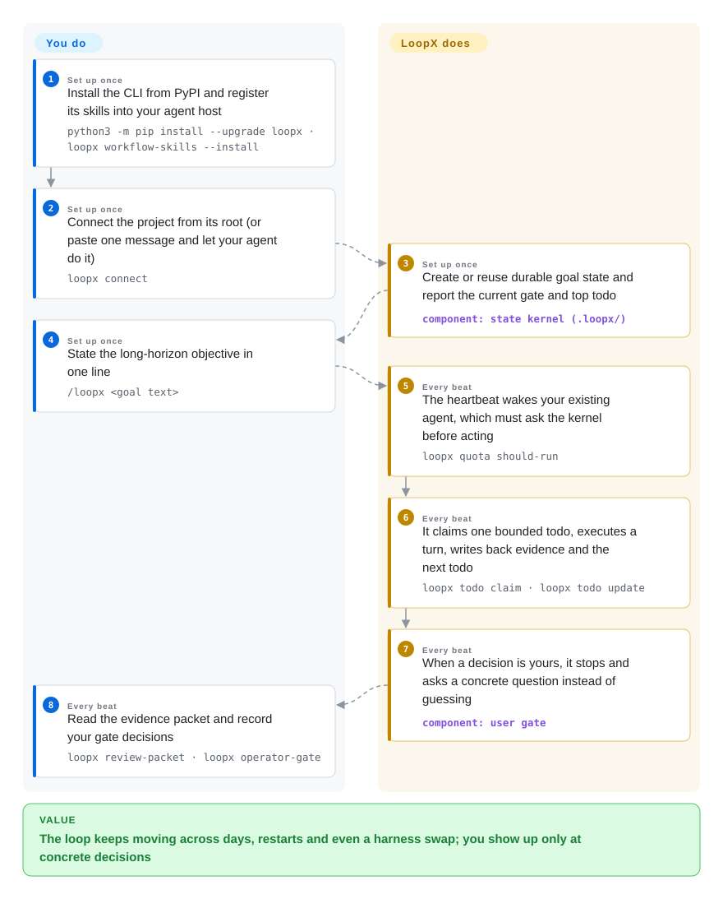

# LoopX

Your coding agent finishes a session and forgets the plan: the objective lives in chat history, the next step lives in your head, and the loop keeps burning tokens after it should have asked you something. LoopX keeps the goal, todos, human-decision gates, evidence, and turn budget as durable files on disk, and makes the agent you already run check in each beat — may I act, on what, with what to show.

## When to use

You run multi-day objectives through coding or research agents — an issue loop, a benchmark campaign, a refactor that spans sessions — and re-establishing context every session (what is the goal, what was decided, what evidence exists) eats your own attention. You like the runtimes you already use (Codex, Claude Code, OpenCode); you don't want a new agent framework, you want the work to outlive the session. Reach for LoopX when the *governance* is the missing piece: a local-first state kernel that decides each beat whether the agent may act, what slice is its turn, when it must stop and ask you a concrete question, and whether the last turn produced accepted evidence.

Against the closest indexed options the choice is structural: Ralph is a loop driver with no durable goal/gate/evidence state; beads is a task store that never decides when the agent runs; LoopX is one of the few open repos that combines both roles — continuation driver plus gated state — and stays runtime-neutral, so the same goal survives swapping Codex for Claude Code. Pick it specifically when goals span days, several agents share the work, or an owner must approve gates before publish/prod/data decisions.

## Q&A

**Q: What is the daily posture as a human?** A: Three touchpoints, not babysitting: state the goal once (`/loopx <text>`), answer the concrete gate questions the loop raises, and review evidence packets afterwards. Install and connect are designed as one pasted message to your agent, which then runs the CLI itself.

**Q: I already run a deeply customized harness (own watchers, schedulers, hooks) — does it collide?** A: Split by layer. Behavior-level customization (prompts, skills, models, tools) does not collide — LoopX is runtime-agnostic and sits beside the host. Control-loop-level customization does: the kernel is designed as the single state authority, every beat must route through its quota/claim/writeback protocol, so you would run its loop, not graft it onto yours. For a home-grown orchestrator its practical value is as a reference implementation, not a dependency.

## How it works

You install LoopX once as a CLI; from then on your existing agent does the work under its governance. Each beat — a heartbeat automation (Codex App), a visible `/goal` task (Codex CLI), or the host's own loop — the agent must first ask the kernel `loopx quota should-run` ("may I act now, and what kind of turn is allowed"), then claim one bounded todo (an owned slice of work), execute a single turn, and write back evidence plus the next todo before the slot is accounted (`spend-slot`). The durable state — objective, scope, gates, todos, run history — lives in project-local files (`.loopx/registry.json` plus a projected `ACTIVE_GOAL_STATE.md`), not in chat memory, so it survives session end, host restart, and a change of runtime. Your part is the gates: when the loop waits on a human call it asks a specific question, and you answer from the terminal, the local dashboard (`loopx dashboard`), or a connected Lark chat. Peer agents share one goal through claims and leases rather than a fixed leader.

<!-- flow-steps:begin (generated from flows/loopx.json by tools/flow_card.py — do not edit) -->

Text version of the flow

1. **You** (Set up once): Install the CLI from PyPI and register its skills into your agent host — `python3 -m pip install --upgrade loopx · loopx workflow-skills --install`
2. **You** (Set up once): Connect the project from its root (or paste one message and let your agent do it) — `loopx connect`
3. **LoopX** (Set up once): Create or reuse durable goal state and report the current gate and top todo — component: `state kernel (.loopx/)`
4. **You** (Set up once): State the long-horizon objective in one line — `/loopx <goal text>`
5. **LoopX** (Every beat): The heartbeat wakes your existing agent, which must ask the kernel before acting — `loopx quota should-run`
6. **LoopX** (Every beat): It claims one bounded todo, executes a turn, writes back evidence and the next todo — `loopx todo claim · loopx todo update`
7. **LoopX** (Every beat): When a decision is yours, it stops and asks a concrete question instead of guessing — component: `user gate`
8. **You** (Every beat): Read the evidence packet and record your gate decisions — `loopx review-packet · loopx operator-gate`

**Value**: The loop keeps moving across days, restarts and even a harness swap; you show up only at concrete decisions

<!-- flow-steps:end -->

## When NOT to use

- **One-session checklist grind.** If you just want an agent to work through `fix_plan.md` unattended tonight, use [Ralph for Claude Code](ralph-claude-code.md) — LoopX's gates, quota accounting, and evidence writeback are protocol overhead for work that fits one night.
- **You only need a task store.** If the agent already has its own continuation and you just need a dependency-aware issue graph it reads/writes, use [beads](beads.md); adopting LoopX pulls in its whole heartbeat protocol, not just the backlog.
- **Server-side, queue-shaped fleet work.** If long-running agents should live as a deployed service (Linear backlog → isolated per-issue runs, or sessions that wait days on webhooks), use [Symphony](../../agent-frameworks/agent-runtimes/agent-services/symphony.md) or [eve](../../agent-frameworks/agent-runtimes/agent-services/eve.md) — LoopX is local-first and needs an always-on host running your runtimes; it is a personal/team control plane, not a fleet backend.
- **You already own the control loop.** The kernel fails closed: heartbeats must re-enter through `quota should-run`, claims need registered agent identities, dashboards are projections and explicitly not the state authority. If your customized harness has its own scheduler/watcher that is the authority, integration means submitting to its loop or running two state authorities side by side.
- **Boring-maturity requirement.** The repo was created 2026-05-31; v1.2.1 shipped 2026-09-27 with 100+ GitHub releases behind it, and releases ≤v0.4.7 were MIT before the move to Apache-2.0 (per NOTICE). Expect protocol and file-layout churn; if you cannot re-audit every upgrade, this is the wrong risk profile.
- **Building an agent application.** It explicitly refuses to be a framework ("not another agent framework"); pick an entry from `agent-frameworks`/`agent-sdks` instead.
- **Strict zero-telemetry policy.** Basic usage statistics default on after first-use disclosure (daily random-ID heartbeat; `loopx usage-ping disable` or `LOOPX_USAGE_PING=0` turns it off, and docs state no content is collected).

## Comparison

| Alternative | In index | Our verdict | Tradeoff |
|---|---|---|---|
| [Ralph for Claude Code](ralph-claude-code.md) | ✅ | When continuation must survive days, restarts and a runtime swap with quotas and evidence, pick LoopX; pick Ralph when a guarded loop over one checklist in one session is the whole need. | LoopX buys multi-runtime durable governance at the cost of a fail-closed protocol and a young, fast-moving surface; Ralph is a simple Bash wrapper, but Claude-only and stateless beyond the plan file. |
| [beads](beads.md) | ✅ | Choose beads when the store itself is the deliverable and the driver is your own harness; choose LoopX when the next move, the human gate, and the turn budget must be decided for the agent. | beads: dependency-aware issue graph, longer track record; LoopX: state plus driver plus gates, much younger and heavier. |
| [Planning with Files](planning-with-files.md) | ✅ | When you want the ten-minute escape from /clear amnesia with nothing to operate, plan-as-files wins; LoopX earns its machinery only once gates/quota/evidence are the pain. | Zero install and zero protocol vs a full control plane. |
| [Symphony](../../agent-frameworks/agent-runtimes/agent-services/symphony.md) | ✅ | If work arrives as Linear issues and each needs an isolated autonomous run on a server, pick Symphony; LoopX fits human-owned goals that persist across days with the human in the gate loop. | Server queue model vs local-first personal/team control plane. |
| Harness-native goal/loop (Codex Goal, Claude Code /loop) | not a repo | A one-runtime trial of bounded continuation costs nothing and should be your baseline; LoopX is for when the native driver dies at the session or runtime boundary — LoopX's own LHTB numbers claim only +10.6% over native Codex Goal. | Zero install, but no cross-runtime state, shared gates, or evidence ledger. |

## Tech stack

- **Language:** Python 3.11+ (kernel + CLI, the dominant share of the tree); a managed TypeScript "Effect core" subprocess on Node.js 22.22.3+ (24 LTS recommended), started automatically and idle-exiting.
- **State:** plain local files — `.loopx/registry.json` per project, projected `ACTIVE_GOAL_STATE.md`, runtime root `~/.codex/loopx/` with goal run history; explicitly gitignored. No database.
- **Surfaces:** CLI is the source of truth; React dashboard/PWA served locally (`loopx dashboard`, loopback), native desktop preview apps reuse the same loopback services; Lark/Feishu kanban projection; host adapters for Codex App/CLI, Claude Code, OpenCode(2), Cursor, Pi, ZCode, Kiro CLI, Antigravity, DeepSeek Harness, KunlunCode.
- **Distribution:** PyPI wheel (`loopx`), skills materialized under host skill dirs (`~/.codex/skills`, `~/.claude/skills`, etc.).

## Dependencies

- **Required:** Python 3.11+, Node.js 22+, a POSIX shell (Windows: PowerShell 7), and at least one registered agent runtime with its own API budget — LoopX executes nothing itself; it gates and accounts for turns made by Codex/Claude Code/etc.
- **Operational:** an always-on machine for heartbeat/scheduler continuation; background execution dies with the host. Git only for contributor checkouts.
- **Optional:** Lark/Feishu app for manager conversations and kanban projection; browser for the dashboard; no external database or message broker.

## Ops difficulty

**Medium.** Install is two pip commands and a doctor check, and the intended connect path is a single pasted message rather than manual CLI. Difficulty accumulates afterwards: heartbeats follow a fail-closed protocol (registered agent ids, `scheduler_hint` acknowledgement, spend accounting) that is strict about identity and drift; the surface churns fast (100+ releases by 2026-09); updates must re-materialize host skills and restart hosts; and long horizons need a machine kept alive plus a budget you watch — quota bounds eligibility, not price. Local state (`.loopx/`, `.codex/goals/`) stays gitignored, so backup and migration are on you (`loopx backup-state`).

## Health & viability

Scored axes are on the radar card; judgment bullets, dated 2026-09-27:

- **Maintenance** — extreme cadence: pushed same day, v1.2.1 released 2026-09-27, near-daily desktop builds, 100+ releases in ~4 months. Sprinting, not coasting.
- **Governance / bus factor** — organization-owned (`loopx-project`) but one account holds 6,889 of 8,180 commits (~84%) across 92 contributors; DCO and a code of conduct exist; no foundation or named vendor backing. Roadmap ownership is effectively single-person.
- **Age / Lindy** — created 2026-05-31, under 4 months old; 6k stars that fast is a hype signal, not durability. No Lindy verdict is available yet — treat as unproven.
- **Adoption** — PyPI ~3.6k downloads/month with first upload 2026-08-16; the voluntary ADOPTERS directory is empty; the showcase cases (a real closed zilliztech/mfs refactor issue, 13h/4-day runs) are user-reported attributions.
- **Risk flags** — early MIT→Apache-2.0 relicensing (documented, patent-grant-positive direction); usage stats on by default (disable exists); benchmark headline is self-run.

## Caveats (unverified)

- [未验证] **LHTB benchmark numbers** (+17.3% vs Plain Codex, +10.6% vs native Codex Goal, 0.4948 mean reward): run by the LoopX authors, one effective trial per task, acknowledged unequal budgets; the LHTB suite itself is hosted on a personal page (zli12321.github.io) whose relationship to the LoopX authors was not confirmed.
- [未验证] **Showcase attributions** — zilliztech/mfs issue #166 exists and is closed (checked via API), but its LoopX attribution, the ">13h" and "4-day unattended" runs, and the "1B+ tokens" scale are user-reported; the "200+ hour" cases are wall-clock loop lifetime, not continuous execution.
- [推断] **Single-person roadmap control** — inferred from commit share (top1 ~84%) and the maintainer-linked install docs; formal governance roles were not audited.
- [未验证] **"No content collected" in usage pings** — per the docs' own statement; payloads were not inspected.
- [未验证] **Host adapter breadth** (KunlunCode, Ark, ZCode, Antigravity, Pi, Kiro) — listed in README/docs; none were exercised on this pass.
- [未验证] **Desktop app signing** — README states Apple Silicon updates are signed but the app is ad-hoc signed, not notarized; Windows previews update manually.
- [未验证] **Star/fork counts** (6,050 / 588) are a 2026-09-27 snapshot; volatile.
