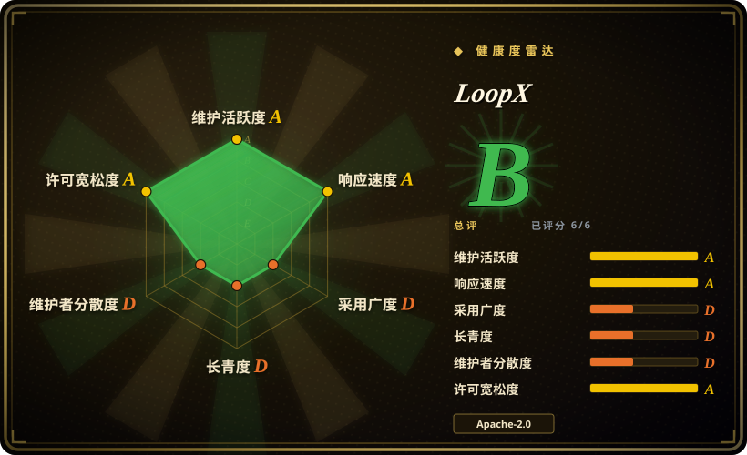
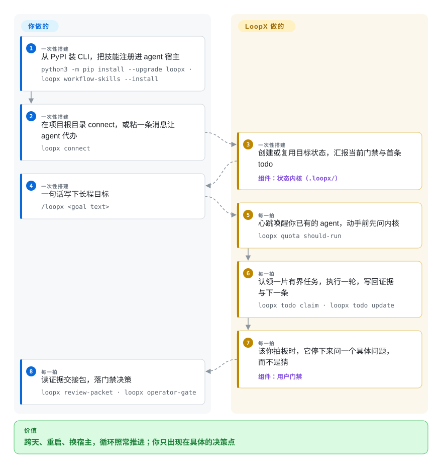

# LoopX

你的编码 agent 一结束会话就把计划弄丢了：目标留在聊天记录里，下一步存在你脑子里，而它在早该问你的地方继续烧 token。LoopX 把目标、待办、需要人拍板的门禁、证据和轮次预算落成盘上的持久文件，让你已经在用的 agent 每一拍先来报到——现在能不能动、动哪一片、干完拿出了什么。

## 何时使用

你在用编码或研究 agent 推进跨天的目标——issue 循环、benchmark 战役、跨会话的重构——每个会话都要重新交代「目标是什么、定过什么、有什么证据」，你自己的注意力成了瓶颈。同时你并不想换框架，Codex、Claude Code、OpenCode 都用得好；缺的是治理层。这时该想到 LoopX：一个本地优先的状态内核，每一拍替 agent 决定现在能不能动、轮到它做哪一片、什么时候必须停下来问你一个具体问题、上一轮的证据算不算数。

对比索引里最近的几个，选择是结构性的：Ralph 是个循环驱动器，但没有跨会话的目标、门禁与证据状态；beads 是个任务库，从不决定 agent 何时该跑；LoopX 是少数把两个角色合体的开源项目——续跑驱动加带门禁的状态——而且宿主中立，同一个目标能从 Codex 平滑换到 Claude Code。当目标跨天、多 agent 分担、或者发布/生产/数据决策前必须有 owner 过门禁时，它是最对味的选择。

## 快问快答

**问：人每天的用法到底是什么姿势？** 答：三个触点，不是盯梢：一次性写下目标（`/loopx <文本>`）、回答循环抛上来的具体门禁问题、事后读证据交接包。连安装接入都设计成给 agent 粘一条消息，由它替你跑 CLI。

**问：我自己有一套深度定制的 harness（自研 watcher、调度、hook），接它冲突吗？** 答：分层看。行为层的定制（prompt、技能、模型、工具）不冲突——LoopX 宿主中立，就在你的 agent 旁边治理。控制回路层的定制冲突：内核按「唯一状态权威」设计，每一拍必须走它的 quota/认领/写回协议，你是在跑它的循环，而不是把它嫁接进你的循环。对自研编排器，它的实用价值是当参考实现来抄设计，不是当依赖来引。

## 怎么用起来

LoopX 以 CLI 装一次，之后活还是你现有的 agent 在干，它只管治理。每一拍——Codex App 的心跳自动化、Codex CLI 里可见的 `/goal`、或宿主自己的循环——agent 动手前必须先问内核 `loopx quota should-run`（现在能动吗，允许动哪种），然后认领一片有界任务（一个归它所有的切片），执行一轮，写回证据和下一条待办，最后记一笔轮次账（`spend-slot`）。持久状态——目标、范围、门禁、待办、运行史——住在项目本地的文件里（`.loopx/registry.json` 加一份投影出的 `ACTIVE_GOAL_STATE.md`），不在聊天记忆里，所以会话结束、宿主机重启、甚至换运行时都丢不了。你负责的是门禁：循环卡在需要人判断的地方，会带着具体问题来找你，你在终端、本地看板（`loopx dashboard`）或接好的飞书会话里回答。多个对等 agent 靠认领与租约共享同一个目标，没有固定的 leader。

<!-- flow-steps:begin (generated from flows/loopx.json by tools/flow_card.py — do not edit) -->

流程文字版

1. **你**（一次性搭建）：从 PyPI 装 CLI，把技能注册进 agent 宿主 — `python3 -m pip install --upgrade loopx · loopx workflow-skills --install`
2. **你**（一次性搭建）：在项目根目录 connect，或粘一条消息让 agent 代办 — `loopx connect`
3. **LoopX**（一次性搭建）：创建或复用目标状态，汇报当前门禁与首条 todo — 组件：`状态内核（.loopx/）`
4. **你**（一次性搭建）：一句话写下长程目标 — `/loopx <goal text>`
5. **LoopX**（每一拍）：心跳唤醒你已有的 agent，动手前先问内核 — `loopx quota should-run`
6. **LoopX**（每一拍）：认领一片有界任务，执行一轮，写回证据与下一条 — `loopx todo claim · loopx todo update`
7. **LoopX**（每一拍）：该你拍板时，它停下来问一个具体问题，而不是猜 — 组件：`用户门禁`
8. **你**（每一拍）：读证据交接包，落门禁决策 — `loopx review-packet · loopx operator-gate`

**价值**：跨天、重启、换宿主，循环照常推进；你只出现在具体的决策点

<!-- flow-steps:end -->

## 何时不用

- **单会话清清单。** 如果只想让 agent 今晚无人值守啃完 `fix_plan.md`，用 [Ralph for Claude Code](ralph-claude-code.zh.md)——一晚上的活配不上 LoopX 的门禁、配额记账和证据写回这套协议开销。
- **只缺一个任务库。** agent 自己已有续跑机制、只需要一个它能读写的问题图时，用 [beads](beads.zh.md)；引 LoopX 进来的是整套心跳协议，不只是那个 backlog。
- **服务端队列式的机队作业。** 长任务应当是部署在服务上的形态（Linear 积压 → 每 issue 一次隔离运行，或会话挂在 webhook 上等几天），用 [Symphony](../../agent-frameworks/agent-runtimes/agent-services/symphony.zh.md) 或 [eve](../../agent-frameworks/agent-runtimes/agent-services/eve.zh.md)——LoopX 本地优先，得有一台常开的机器跑着你的运行时，它是个人/小队的控制面，不是机队后端。
- **控制回路已经是你自己的。** 它的内核 fail-closed：心跳必须从 `quota should-run` 重进、认领要有注册过的 agent 身份、看板只是投影且明文不是状态权威。如果你的定制 harness 里调度权在自研 watcher 手上，接入等于交出循环，或者两套状态权威并跑。
- **要的是沉稳成熟。** 仓库建于 2026-05-31；v1.2.1 发布于 2026-09-27，背后是 100 多个 GitHub release；≤v0.4.7 的发行曾是 MIT，之后才转 Apache-2.0（见 NOTICE）。协议和文件布局都会继续抖，每次升级都要重审的项目不适合这个风险画像。
- **是在写 agent 应用。** 它明文拒绝当框架（“不是又一个 agent 框架”）；去 `agent-frameworks`/`agent-sdks` 选。
- **零遥测硬要求。** 基础使用统计在首次披露后默认开启（每日随机 ID 心跳；`loopx usage-ping disable` 或 `LOOPX_USAGE_PING=0` 可关，文档称不收集内容）。

## 横向对比

| 替代品 | 是否收录 | 我们的评价 | 取舍 |
|---|---|---|---|
| [Ralph for Claude Code](ralph-claude-code.zh.md) | ✅ | 续跑要跨天、跨重启、还要能换宿主且带配额与证据时选 LoopX；一份清单一个会话、带护栏的循环就够用时选 Ralph。 | LoopX 换来多运行时的持久治理，代价是 fail-closed 协议和一个高速抖动的年轻表面；Ralph 只是一个 Bash 壳，简单但锁 Claude 且除了计划文件没有状态。 |
| [beads](beads.zh.md) | ✅ | 任务库本身是交付物、驱动器是你自己的，选 beads；下一步动作、人工门禁、轮次预算要由工具替 agent 决定时，选 LoopX。 | beads：带依赖关系的问题图、资历更长；LoopX：状态加驱动加门禁，但更年轻也更重。 |
| [Planning with Files](planning-with-files.zh.md) | ✅ | 只想十分钟逃出 /clear 失忆、什么都不想运维，计划当文件放最省；门禁/配额/证据才是痛点时，LoopX 的机器才回本。 | 零安装零协议 vs 整套控制面。 |
| [Symphony](../../agent-frameworks/agent-runtimes/agent-services/symphony.zh.md) | ✅ | 活以 Linear issue 到达、每件要在服务器上开一次隔离自主运行，选 Symphony；LoopX 适配的是人持有目标、人守门禁的跨天工作。 | 服务端队列模型 vs 本地优先的个人/小队控制面。 |
| 宿主自带的 goal/loop（Codex Goal、Claude Code /loop） | 非仓库 | 零安装就能试有界续跑，应当是你的基线；LoopX 的价值在原生驱动撑不过会话或运行时边界之处——它自己的 LHTB 数字对原生 Codex Goal 也只报 +10.6%。 | 零安装，但没有跨运行时状态、共享门禁和证据账本。 |

## 技术栈

- **语言：** Python 3.11+（内核与 CLI，占树主体）；Node.js 22.22.3+（推荐 24 LTS）托管的 TypeScript「Effect core」子进程，自动拉起、空闲退出。
- **状态：** 纯本地文件——每项目 `.loopx/registry.json`、投影出的 `ACTIVE_GOAL_STATE.md`、运行史在 `~/.codex/loopx/` 运行根；明文要求 gitignore。无数据库。
- **表面：** CLI 是状态权威；本地起的 React 看板/PWA（`loopx dashboard`，仅回环地址），桌面端预览复用同一回环服务；飞书/Lark 看板投影；宿主适配覆盖 Codex App/CLI、Claude Code、OpenCode(2)、Cursor、Pi、ZCode、Kiro CLI、Antigravity、DeepSeek Harness、KunlunCode。
- **分发：** PyPI wheel（`loopx`），技能文件铺到各宿主目录（`~/.codex/skills`、`~/.claude/skills` 等）。

## 依赖

- **必需：** Python 3.11+、Node.js 22+、POSIX shell（Windows 用 PowerShell 7），以及至少一个已注册的 agent 运行时和它自己的 API 预算——LoopX 不执行任何活，只对 Codex/Claude Code 等的每一轮做门禁与记账。
- **运行层面：** 跨心跳续跑需要一台常开机器；宿主机停了，后台执行就停。只有贡献者 clone 开发才需要 Git。
- **可选：** 飞书/Lark 应用（管理者会话与看板投影）；看板用的浏览器；无外部数据库或消息队列。

## 运维难度

**中等。** 安装是两条 pip 命令加一次 doctor，预期的接入姿势是给 agent 粘一条消息而非手敲 CLI。难度在后面累加：心跳走 fail-closed 协议（注册身份、`scheduler_hint` 确认、记账），对身份和漂移非常严格；表面抖得快（2026-09 已 100 多个 release）；升级要重新铺宿主技能并重启宿主；长周期还意味着养一台常开机器并盯住预算——配额管的是「能不能跑」，不是「花多少」。本地状态（`.loopx/`、`.codex/goals/`）按约定不进 git，备份与迁移自理（`loopx backup-state`）。

## 健康度与可持续性

打分轴见雷达卡；判断条目日期为 2026-09-27：

- **维护** — 极高频：当天有推送，v1.2.1 发布于 2026-09-27，桌面端近乎每日构建，4 个月里 100 多个 release。是冲刺不是躺平。
- **治理/bus factor** — 组织号 `loopx-project` 持有，但单一账号贡献 6,889/8,180 提交（约 84%），92 名贡献者；有 DCO 与行为准则，无基金会或具名厂商背书。路线图实质上一人说了算。
- **年龄/Lindy** — 建于 2026-05-31，不满 4 个月；这么快到 6k star 是热度信号不是韧性证明。Lindy 无从判断——按未经验证对待。
- **采用** — PyPI 月下载约 3.6k（首发 2026-08-16）；自愿登记的名用户目录（ADOPTERS）至今为空；showcase 案例（真实存在的 zilliztech/mfs 重构 issue、13 小时/4 天长跑）是用户自述归因。
- **风险信号** — 早期 MIT→Apache-2.0 改授权（有 NOTICE 明文记录，方向是补专利授权，相对温和）；使用统计默认开；基准头条为自测。

## 存疑（未验证）

- [未验证] **LHTB 基准数字**（对 Plain Codex +17.3%、对原生 Codex Goal +10.6%、mean reward 0.4948）：LoopX 作者自测，每题每模式一次有效试验，预算不对等且官方已承认；LHTB 题库挂在个人页（zli12321.github.io），其与 LoopX 作者的关系未查实。
- [未验证] **案例归因** — zilliztech/mfs issue #166 经 API 核实存在且已关闭，但其 LoopX 归因、「大于 13 小时」「4 天无人值守」「1B+ token」均为用户自述；「200+ 小时」是循环墙钟寿命，不是连续模型执行。
- [推断] **路线一人主导** — 由 top1 提交占比约 84% 与安装文档指向维护者个人 fork 推断；正式治理角色未审计。
- [未验证] **使用统计「不收集内容」** — 仅有官方文档表述，载荷未拆解检查。
- [未验证] **宿主适配广度**（KunlunCode、Ark、ZCode、Antigravity、Pi、Kiro）—— README/文档列举，本轮一个都没实跑过。
- [未验证] **桌面端签名** — README 自述 Apple Silicon 更新签名但为 ad-hoc 签名、未公证；Windows 预览手动更新。
- [未验证] **star/fork 数**（6,050/588）为 2026-09-27 快照，波动快。
