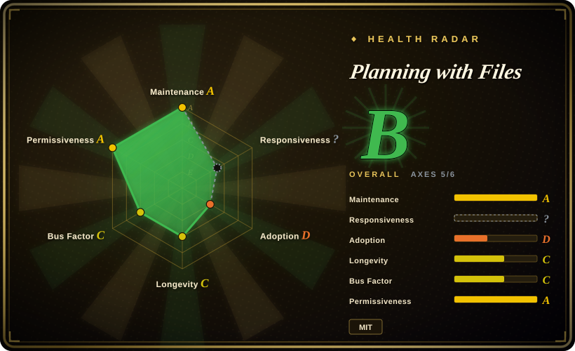
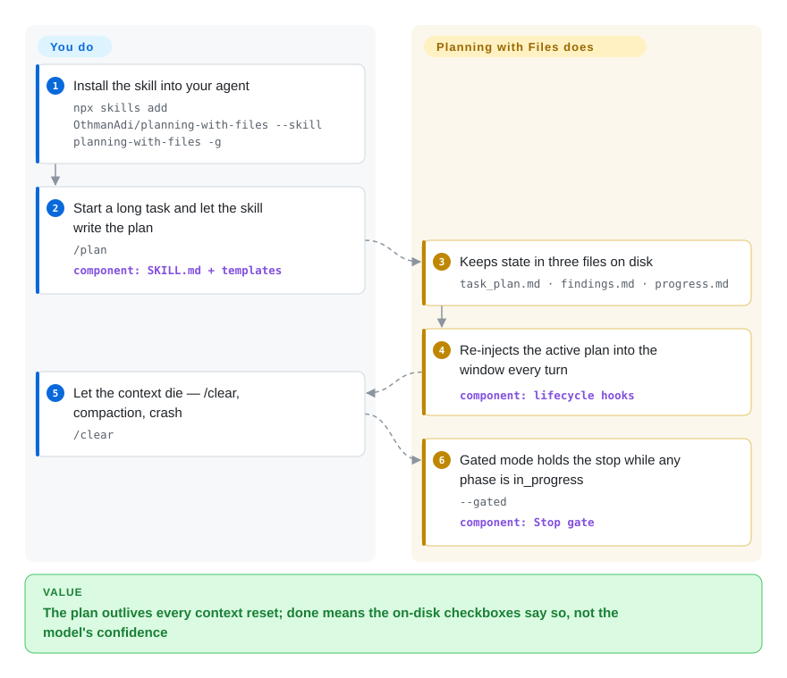

# Planning with Files

Your agent is mid-migration when the context window dies — `/clear`, a compaction, a crash — and the plan dies with it: it re-does finished phases and declares victory three steps early. Planning with Files keeps `task_plan.md` / `findings.md` / `progress.md` on disk and uses lifecycle hooks (or native host plugins) to re-inject the plan every turn, so resuming is reading files, not re-explaining the task.

## When to use

You're driving a coding agent through a long, multi-step task — a migration, a refactor across a dozen files, a research-then-implement run — and the context window keeps betraying you. The agent fills up, auto-compacts or you hit `/clear`, and it comes back having forgotten the plan: it re-does finished phases, drops the "fix this after the migration lands" note, or declares victory three steps early. You've tried pasting a TODO list back in by hand, but nothing survives the next compaction.

You install Planning with Files (`npx skills add OthmanAdi/planning-with-files --skill planning-with-files -g`). Now the agent writes its phases to `task_plan.md`, its discoveries to `findings.md`, and a running log to `progress.md`, and the shipped lifecycle hooks re-inject the plan at the start of each turn (and flush progress before compaction), so state lives on disk instead of only in the window. After a `/clear` or crash, recovery re-reads the planning files themselves — reading the agent's own session records (which the pre-v3.12 catchup did automatically) is now an explicit opt-in mode. For autonomous runs you opt into `--gated` mode, where a Stop-hook completion gate holds the stop only while an `in_progress` phase remains — with a block cap and stall detection so a broken plan can't trap the session — and an append-only JSONL run ledger replaces the raw `progress.md` tail with a fixed-shape summary. Because it speaks the SKILL.md/Agent-Skills standard the same skill drops into 60+ agents (Claude Code, Codex, Cursor, Copilot, Gemini CLI, Kiro, OpenCode, Hermes, Pi, DeepSeek Harness …; the `npx skills` installer alone targets 71), and six of those hosts get native plugins with injection, the gate, and `/pwf` tools and no shell hooks to register.

## How it works

The installable artifact is one `SKILL.md` plus templates — it tells the agent to write phases into `task_plan.md`, append discoveries to `findings.md`, and log sessions to `progress.md` (parallel tasks get isolated `.planning/YYYY-MM-DD-<slug>/` directories selected via `PLAN_ID`/`.active_plan`). The enforcement is the second half: shipped hook scripts (Shell/PowerShell/Python) that the host fires on its lifecycle events — `UserPromptSubmit`, `PreToolUse`, `Stop`, `PreCompact`, etc. — which is what re-injects the plan on every turn inside `===BEGIN PLAN DATA===` framing (so the model reads it as data, not instructions), reminds after writes, flushes progress before compaction, and in gated mode runs `check-complete` at the stop boundary: the gate greps the **Status** tokens written on disk, holds the stop while any phase is `in_progress`, caps how many times it can hold, and never executes anything from the plan files. On hosts where the skill is only markdown — a plain Agent-Skills install on a runtime that doesn't fire these events — you get the convention without the machinery. What stays yours: modes are per-plan and default-off (with no mode marker the hooks are byte-identical to plain v2 behavior), `PLANNING_DISABLED=1` is the per-invocation opt-out, `/plan-doctor` is the self-check that tells you whether injection/attestation/gate are actually firing on your host, and the `[PLAN TAMPERED]` protection only exists if you ran `/plan-attest` to lock a plan's SHA-256.

<!-- flow-steps:begin (generated from flows/planning-with-files.json by tools/flow_card.py — do not edit) -->

Text version of the flow

1. **You**: Install the skill into your agent — `npx skills add OthmanAdi/planning-with-files --skill planning-with-files -g`
2. **You**: Start a long task and let the skill write the plan — `/plan` — component: `SKILL.md + templates`
3. **Planning with Files**: Keeps state in three files on disk — `task_plan.md · findings.md · progress.md`
4. **Planning with Files**: Re-injects the active plan into the window every turn — component: `lifecycle hooks`
5. **You**: Let the context die — /clear, compaction, crash — `/clear`
6. **Planning with Files**: Gated mode holds the stop while any phase is in_progress — `--gated` — component: `Stop gate`

**Value**: The plan outlives every context reset; done means the on-disk checkboxes say so, not the model's confidence

<!-- flow-steps:end -->

## When NOT to use

- **You want a queryable, dependency-aware task graph, not flat markdown.** These are three append-style `.md` files an agent reads/writes — there is no `bd ready`-style unblocked-work query, no dependency edges enforced by a datastore, no merge-safe hash IDs. If you need a real task graph, reach for [beads](beads.md).
- **Your agent / IDE has no lifecycle hooks and no native plugin.** The "survives context loss" guarantee is hooks (or the Pi/Hermes/OpenCode/DeepSeek-Harness/Claude-Code plugin surfaces). On a plain Agent-Skills install with no hook support you get the templates and conventions, but not the automatic re-injection or completion gate — the behavior degrades to "the model is told to use the files." The parity tables in the README are explicit about which host fires what; check yours.
- **You distrust a fast-moving, single-author project for unattended autonomous runs.** The version line ran v3.1.3 → v3.21.0 in about three months (114 releases in nine), and the changelog is still dominated by per-host hook/path regressions — though recent history also shows a hardening posture: consent-bound session recovery (v3.12), fail-closed plan resolution (v3.9/v3.15), parallel-write guards (v3.10), and issue-numbered security fixes. Volatile surface, maturing engineering discipline — verify the gate behaves as you expect before trusting it to babysit an unattended agent.
- **You need the completion gate as a hard guarantee.** The gate holds a stop only while an `in_progress` phase remains on a host that supports Stop interception, and it has a block-count cap plus stall/ledger-progress checks precisely so it can't trap a session — advisory by design, not an absolute "won't stop until done" lock.
- **You only ever do short, single-turn tasks.** If your work fits in one context window and never compacts, the plan files and hooks are overhead with little payoff.
- **You want vendor-neutral plumbing with zero Claude/Manus framing.** The skill, docs, plugin-marketplace route, and defaults are heavily Claude-Code-first (`/plan`, `/plan-goal`, `/plan-loop`; the plugin ships `commands/` that the `npx skills` route does not); other IDEs are supported — and some now via native plugins — but parity is tracked release-to-release in explicit tables.

## Comparison

| Alternative | In index | Our verdict | Tradeoff |
|---|---|---|---|
| [beads](beads.md) | ✅ | Pick beads when you need a dependency-aware versioned task graph with merge-safe IDs and ready detection. | Dependency-aware, version-controlled task *graph* (Dolt-backed, `bd` binary) with merge-safe IDs and ready-detection; heavier and a real datastore vs. these three plain markdown files an agent edits. |
| [Context Mode](context-mode.md) | ✅ | Pick Context Mode when the problem is keeping an agent oriented, but you prefer its context-capture mechanism for your IDE. | Sibling agent-context approach; overlapping "keep the agent oriented" goal, different mechanism — compare the two pages directly for your IDE. |
| [Ralph](ralph-claude-code.md) | ✅ | Pick Ralph when you need a Claude Code autonomous-loop harness, not just persistent plan/state files. | Long-running autonomous-loop harness for Claude Code; orchestrates the run, whereas Planning with Files supplies the persistent plan/state the loop reads and writes. |
| Plain `task_plan.md` / `TODO.md` you maintain by hand | 未收录 | Pick manual files when zero install and total ownership matter more than lifecycle hooks or completion gates. | Zero install and fully yours, but no lifecycle hooks, no auto re-injection after `/clear`, no completion gate, no per-plan isolation — exactly the manual workflow this skill automates. |
| Native agent memory (`CLAUDE.md`, Cursor rules, Codex `AGENTS.md`) | 未收录 | Pick native memory files when static always-loaded instructions are enough. | Built-in, always loaded, no extra install — but a static instruction file, not a per-task evolving plan with progress logging and a stop gate. |
| Manus / hosted autonomous-agent products | 未收录 | Pick a hosted product when you want the managed "work like Manus" experience and accept leaving the repo-local OSS path. | The commercial pattern this skill imitates; managed and richer, but a hosted product, not an open IDE-local skill. Note: this README still cites Meta's Dec-2025 ~$2B acquisition of Manus — that deal was blocked by Chinese regulators in Apr 2026 and unwound; Manus operates independently again (TechCrunch/CNBC reporting, 2026). |

## Health & viability

- **Responsiveness**: Cannot be scored — type_na.
- **Maintenance (2026-09).** Very active — v3.21.0 released 2026-09-27, last push 2026-09-27, 114 GitHub releases since the 2026-01 start. Cadence remains a double-edged sword: the changelog is dominated by regression-class fixes (hook flags, install paths, per-host parity), so expect the surface to keep moving.
- **Governance / bus factor (2026-09).** Single-author: the repo is `User`-owned (OthmanAdi). The scorer (2026-09-28) counts 53 active maintainers over 12 months with top-1 share 0.76 (top-3 share 0.808) — the bus factor is one owner. That said, the changelog shows recurring external contributors (repeated PRs from @dylanpulver and others, community-reported issues closed with numbers) — maintenance is becoming partly community-fed.
- **Age & Lindy (2026-09).** Created 2026-01-03, so ~9 months old despite the v3 version number (which reflects rapid iteration, not maturity): too young for a Lindy verdict. Read the ~27k stars as ecosystem hype, not durability.
- **Adoption (2026-09).** ~27,158 stars (GitHub API, 2026-09-28, up from ~24k in June) and 2,847 npm downloads last month (scorer, 2026-09-28), plus skills.sh distribution and a "community shipped" section (forks like plan-cascade, multi-manus-planning) — broad visibility inside the agent-skill ecosystem, thin downstream-code signal (the radar keeps adoption at D on registry/graph evidence). [推断：adoption 判读以雷达信号为准，star 增长含品类热度]
- **Risk flags.** MIT, no relicense history. The real risks are *volatility on an unattended path* and *single-owner governance*: a fast-churning skill whose completion gate is advisory-by-design, whose hook behavior degrades silently on hosts that don't fire the events, and whose trust posture has already needed tightening in public (consent-bound session recovery, attestation framing, fail-closed guards).

## Caveats (unverified)

- [未验证] Star count 27,158 (GitHub API, 2026-09-28) — date-sensitive, not proof of quality.
- [未验证] The "96.7% pass rate (29/30, sonnet-4-6)" and "3/3 blind A/B wins" plus the "13.3 → 5.0 turns re-orientation" figure are the project's own evals (`docs/evals.md`), not independently reproduced.
- [未验证] "Installs across 60+ agents / the `npx skills` installer targets 71 agents" is the project's own framing; per-IDE hook parity is asserted in the README's own tables and lags release-to-release, so verify against your host's setup doc.
- [推断] Classifying this as a `skill-pack` (markdown templates + hook scripts, no standalone runtime) rather than a `tool` follows from its SKILL.md packaging and `npx skills add` distribution; the repo does ship executable shell/PowerShell/Python/TypeScript hook/plugin code, so the line is not perfectly clean.
- [未验证] The SHA-256 attestation (`/plan-attest` locks `task_plan.md`; hooks refuse tampered plans) and the v3 gated/autonomous semantics are described from the README/changelog, not independently tested.
- [推断] "Survives crashes / context loss" depends entirely on the host actually firing the relevant lifecycle hooks (or running the native plugins); on runtimes that don't fire a given event, that guarantee does not hold.
- [未验证] The gate's five-way safety design (mode, phase status, block count, ledger progress; never executes plan-file commands) is the project's own README wording; cap values and stall-detection thresholds were not audited from source.
