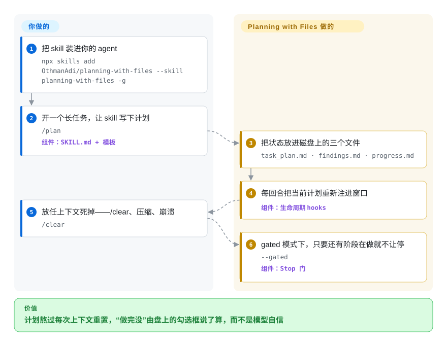

# Planning with Files

agent 正在做一场跨小时的迁移，上下文窗口却死了——`/clear`、一次压缩、一次崩溃——计划跟着一起没了：已完成的阶段被重做，还差三步它就宣布胜利。Planning with Files 把 `task_plan.md` / `findings.md` / `progress.md` 留在磁盘上，再用生命周期 hooks（或宿主原生插件）每回合重新注入计划，于是「继续干活」变成读文件，而不是重新解释任务。

## 何时使用

你在驱动一个编码 agent 跑一个长链条多步骤任务——一次迁移、一场横跨十几个文件的重构、一段先调研后实现的活——而上下文窗口不断背叛你。agent 把窗口填满、自动压缩，或者你手动 `/clear`，回来时它已经忘了计划：已完成的阶段重做一遍、「迁移落地后再修这个」的备注丢了、还差三步就提前宣布胜利。你试过把 TODO 列表手工贴回去，可什么都熬不过下一次压缩。

你装上 Planning with Files（`npx skills add OthmanAdi/planning-with-files --skill planning-with-files -g`）。现在 agent 把阶段写进 `task_plan.md`、把发现写进 `findings.md`、把流水日志写进 `progress.md`，随附的生命周期 hooks 在每回合开头重新注入计划（并在压缩前冲刷进度），状态住在磁盘上而不只在窗口里。`/clear` 或崩溃后，恢复读的就是这些计划文件本身——读取 agent 自己的会话记录（v3.12 之前由 catchup 自动做）如今是显式 opt-in 的模式。要无人值守的自主运行，你 opt-in `--gated` 模式：Stop-hook 完成门只要还有 `in_progress` 阶段就拦下停止——带 block 上限与停滞检测，坏计划不会把会话卡死——而 append-only 的 JSONL run ledger 用固定形状的摘要取代 `progress.md` 的原始尾部。因为它讲 SKILL.md/Agent-Skills 标准，同一个 skill 能落进 60+ agent（Claude Code、Codex、Cursor、Copilot、Gemini CLI、Kiro、OpenCode、Hermes、Pi、DeepSeek Harness……仅 `npx skills` 安装器就面向 71 个），其中六个宿主有原生插件，注入、完成门、`/pwf` 命令与工具都不必注册 shell hooks。

## 怎么用起来

可安装的构件就是一个 `SKILL.md` 加模板——它告诉 agent 把阶段写进 `task_plan.md`、把发现追加进 `findings.md`、把会话记进 `progress.md`（并行任务各自隔离进 `.planning/YYYY-MM-DD-<slug>/` 目录，由 `PLAN_ID`/`.active_plan` 选择）。真正的强制力是另一半：随附的 hook 脚本（Shell/PowerShell/Python）由宿主在其生命周期事件上触发——`UserPromptSubmit`、`PreToolUse`、`Stop`、`PreCompact` 等——每回合把计划裹在 `===BEGIN PLAN DATA===` 框里重新注入（让模型把它当数据而不是指令）、写入后提醒、压缩前冲刷进度；gated 模式下在停止边界跑 `check-complete`：门 grep 磁盘上写定的 Status 标记，只要还有阶段是 `in_progress` 就拦停、对拦截次数设上限，并且从不执行计划文件里的任何东西。在 skill 只是 markdown 的宿主上——装进一个不触发这些事件的运行时——你得到约定而得不到机器。仍然归你管的：模式按 plan 逐个选、默认关（不放模式标记时，hooks 的输出与朴素 v2 逐字节相同）；`PLANNING_DISABLED=1` 是单次调用的退出开关；`/plan-doctor` 自检会告诉你注入/认证/门在你的宿主上是否真的在触发；而 `[PLAN TAMPERED]` 保护只有在你跑过 `/plan-attest` 给计划锁了 SHA-256 之后才存在。

<!-- flow-steps:begin (generated from flows/planning-with-files.json by tools/flow_card.py — do not edit) -->

流程文字版

1. **你**：把 skill 装进你的 agent — `npx skills add OthmanAdi/planning-with-files --skill planning-with-files -g`
2. **你**：开一个长任务，让 skill 写下计划 — `/plan` — 组件：`SKILL.md + 模板`
3. **Planning with Files**：把状态放进磁盘上的三个文件 — `task_plan.md · findings.md · progress.md`
4. **Planning with Files**：每回合把当前计划重新注进窗口 — 组件：`生命周期 hooks`
5. **你**：放任上下文死掉——/clear、压缩、崩溃 — `/clear`
6. **Planning with Files**：gated 模式下，只要还有阶段在做就不让停 — `--gated` — 组件：`Stop 门`

**价值**：计划熬过每次上下文重置，“做完没”由盘上的勾选框说了算，而不是模型自信

<!-- flow-steps:end -->

## 何时不用

- **你要的是可查询、感知依赖的任务图，不是扁平 markdown。** 这就是三个 append 风格的 `.md` 文件，agent 读写——没有 `bd ready` 式的无阻塞工作查询、没有数据存储强制的依赖边、没有可安全合并的哈希 ID。需要真任务图时，选 [beads](beads.zh.md)。
- **你的 agent/IDE 既没有生命周期 hooks 也没有原生插件。** 「熬过上下文丢失」的保证来自 hooks（或 Pi/Hermes/OpenCode/DeepSeek-Harness/Claude-Code 的插件表面）。在没有 hook 支持的纯 Agent-Skills 安装上，你只有模板与约定，没有自动重注入和完成门——行为退化为「模型被告知要用这些文件」。README 的 parity 表对哪个宿主触发哪些事件写得很明白，先查你那个。
- **你不敢把无人值守的自主运行交给变动快的单人项目。** 版本线大约三个月内从 v3.1.3 冲到 v3.21.0（九个月 114 个 release），changelog 至今仍以每宿主 hook/路径回归的修复为主——但近期历史同样显示收敛的姿态：会话恢复改为知情同意（v3.12）、计划解析 fail-closed（v3.9/v3.15）、并行写保护（v3.10）、带 issue 编号的安全修复。表面易变、工程纪律在成熟——让门替你看着无人值守的 agent 之前，先验证它的行为符合预期。
- **你要把完成门当硬保证。** 门只在支持拦截 Stop 的宿主上、且只在还有 `in_progress` 阶段时拦停，还带 block 次数上限与停滞/账本进度检查——这些设计恰恰是为了不把会话卡死——它是刻意的建议机制，不是「不做完不许停」的绝对锁。
- **你只做短的、单轮任务。** 活在一个上下文窗口里装得下、从不压缩，计划文件和 hooks 就是几乎没有回报的开销。
- **你要零 Claude/Manus 叙事的厂商中立管线。** skill、文档、插件市场路线和默认值都高度 Claude-Code-first（`/plan`、`/plan-goal`、`/plan-loop`；插件带的 `commands/` 在 `npx skills` 路线里不发货）；其他 IDE 是支持的——部分已有原生插件——但 parity 是按 release 逐版本在表里追平的。

## 横向对比

| 替代品 | 是否收录 | 我们的评价 | 取舍 |
|---|---|---|---|
| [beads](beads.zh.md) | ✅ | 需要带可安全合并 ID 与就绪检测的、依赖感知的版本化任务图时，选 beads。 | 依赖感知、可版本控制的任务*图*（Dolt 支撑、`bd` 二进制），带可安全合并 ID 与 ready 检测；代价是更重、是真数据库，对比这里三个 agent 直接编辑的普通 markdown 文件。 |
| [Context Mode](context-mode.zh.md) | ✅ | 问题同样是让 agent 不迷路，但你的 IDE 上更合口味的是它的上下文捕获机制时，选 Context Mode。 | 同族的 agent 上下文方案；「让 agent 保持方向感」目标重叠，机制不同——直接对照两个页面按你的 IDE 比。 |
| [Ralph](ralph-claude-code.zh.md) | ✅ | 需要的是 Claude Code 自主循环的运行框架，而不只是持久计划/状态文件时，选 Ralph。 | Claude Code 的长时自主循环框架，编排整个运行；Planning with Files 提供的是那个循环读写的那份持久计划/状态。 |
| 手工维护的 `task_plan.md` / `TODO.md` | 未收录 | 零安装和完全所有权比生命周期 hooks、完成门更重要时，选手工文件。 | 零安装、全归你，但没有 hooks、没有 `/clear` 后的自动重注入、没有完成门、没有按任务隔离的计划目录——正是这个 skill 替你自动化的手工流程。 |
| agent 原生记忆（`CLAUDE.md`、Cursor rules、Codex `AGENTS.md`） | 未收录 | 静态、常驻加载的指令文件已经够用时，用原生记忆文件。 | 内建、常驻加载、免安装——但那是静态指令文件，不是随任务演进的计划，没有进度日志，也没有停止门。 |
| Manus / 托管自主 agent 产品 | 未收录 | 想要托管的「像 Manus 那样干活」体验、并接受离开仓库本地 OSS 路线时，选托管产品。 | 本 skill 模仿的商业原型；托管、更丰富，但是托管产品而非开源 IDE 本地 skill。注意：README 仍引用 Meta 于 2025-12 以约 $2B 收购 Manus——该交易已被中国监管于 2026-04 否决并拆解，Manus 已恢复独立运营（TechCrunch/CNBC，2026）。 |

## 健康度与可持续性

- **响应速度**：无法计算——type_na。
- **维护（2026-09）。** 非常活跃——v3.21.0 发布于 2026-09-27，最后 push 2026-09-27，自 2026-01 起已发 114 个 GitHub release。节奏仍是双刃剑：changelog 由回归类修复主导（hook flag、安装路径、每宿主 parity），表面还在动。
- **治理 / 巴士因子（2026-09）。** 单人作者：仓库是 `User` 个人所有（OthmanAdi）。评分器（2026-09-28）统计到 12 个月内 53 位活跃维护者、top-1 占比 0.76（top-3 占比 0.808）——巴士因子就是一个人。不过 changelog 显示外部贡献者在持续回流（@dylanpulver 等人反复提 PR、社区 issue 带编号关闭）——维护正在部分变成社区供稿。
- **年龄与 Lindy（2026-09）。** 创建于 2026-01-03，尽管版本号已是 v3，实际约 9 个月（数字反映的是迭代速度不是成熟度）：太年轻，给不出 Lindy 裁决。约 2.7 万 star 请读作品类热度，不是持久性。
- **采用度（2026-09）。** 约 27,158 star（GitHub API，2026-09-28，6 月时约 2.4 万）、上月 npm 下载 2,847（评分器，2026-09-28），加上 skills.sh 分发与一个「社区成果」清单（plan-cascade、multi-manus-planning 等 fork）——在 agent-skill 生态内曝光很广，但下游代码信号薄（雷达按注册表/依赖图证据把 adoption 留在 D）。[推断：adoption 判读以雷达信号为准，star 增长含品类热度]
- **风险旗标。** MIT，无重新授权历史。真实风险是*无人值守路径上的易变性*与*单人治理*：一个高速变动的 skill，完成门设计上是建议性的、hook 行为在不触发事件的宿主上会静默退化，而其信任姿态已经被迫公开收紧过（知情同意的会话恢复、注入的定界框架、fail-closed 守卫）。

## 存疑（未验证）

- [未验证] star 数 27,158（GitHub API，2026-09-28）——对日期敏感，不是质量保证。
- [未验证] “96.7% 通过率（29/30，sonnet-4-6）”“3/3 盲测 A/B 全胜”与“重定向 13.3 回合降到 5.0 回合”都是项目自己的评测（`docs/evals.md`），未独立复现。
- [未验证] “60+ agent 可装 / `npx skills` 安装器面向 71 个 agent”是项目自己的表述；各 IDE 的 hook parity 由 README 自己的表格声明且逐版本追平，请按你的宿主 setup 文档核实。
- [推断] 把它归类为 `skill-pack`（markdown 模板 + hook 脚本、无独立运行时）而非 `tool`，依据是其 SKILL.md 打包与 `npx skills add` 分发；但仓库确实发货可执行的 Shell/PowerShell/Python/TypeScript 钩子与插件代码，这条线并不完全干净。
- [未验证] SHA-256 认证（`/plan-attest` 锁 `task_plan.md`，hooks 拒绝被篡改的计划）与 v3 gated/autonomous 语义均转述自 README/changelog，未独立实测。
- [推断] “熬过崩溃/上下文丢失”完全取决于宿主是否真的触发相应生命周期事件（或运行原生插件）；在不触发某事件的运行时上，该保证不成立。
- [未验证] 门的五重安全设计（模式、阶段状态、block 计数、账本进度；从不执行计划文件命令）是项目 README 的自述；具体上限值与停滞检测阈值未从源码审计。
