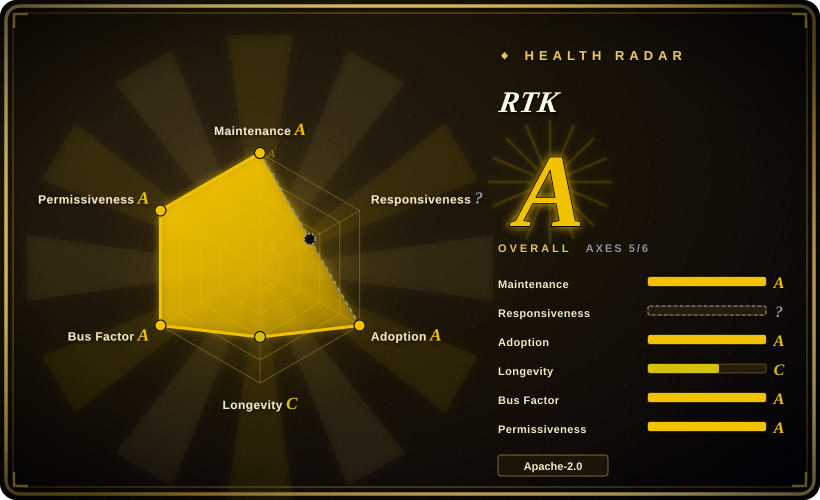
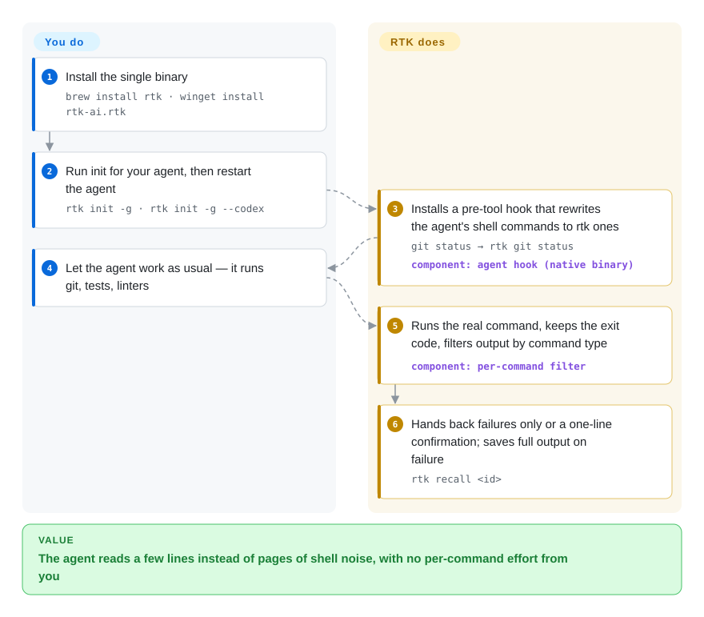

# RTK

Your coding agent runs `cargo test` and 200 lines of passing tests land in its context; it runs `git push` and reads fifteen lines of progress counters — and every line is billed and crowds out the code it should be looking at. RTK sits in front of those shell commands and hands the agent a short version instead: failures only, a one-line `ok main`, a directory tree with file counts.

## When to use

You run Claude Code, Codex, Cursor or Gemini CLI for hours a day, and when you scroll back through a session most of what the agent read is shell noise: `ls -la` with permissions and timestamps on every line, a `cargo test` run where 198 of 200 lines say `... ok`, `docker ps` with every column, `git log` with full commit bodies. Long sessions hit compaction early and the bill tracks the noise, not the work. You reach for RTK when that noise comes from **shell commands** and you want it gone without changing how you or the agent work: one `rtk init -g`, restart the agent, and from then on `git status` is silently rewritten to `rtk git status` before it runs.

You pick it over hand-rolled `| tail -20` pipes and AGENTS.md instructions because it covers 100+ commands with per-tool filters (test runners collapse passes to a count, linters group by rule and file, `git add/commit/push` become one line) and keeps the exit code, so the agent's pass/fail logic still works. You pick it over [Token Optimizer](token-optimizer.md) or [caveman](../../agent-skills/engineering/caveman.md) when you want a permissive license (Apache-2.0) and a single Rust binary that does one thing — shrink shell output — rather than a plugin that also rewrites file reads, checkpoints compaction or changes how the agent talks.

## How it works

RTK is a proxy: instead of the agent calling `git status` directly, it calls `rtk git status`, which runs the real `git status`, keeps its exit code, and then cuts the output down with a filter written for that specific tool — dropping noise, grouping similar lines (errors by file, files by directory), truncating long runs and collapsing repeated log lines into a count. You do not type the `rtk` prefix yourself: `rtk init` installs a hook — a small script the agent runs before every tool call — that rewrites the command before it executes, so the agent never knows RTK is there. Your part is installing the binary, running `rtk init` once per agent, and restarting the agent; the per-command filtering is RTK's. Think of it as a secretary who reads each printout and hands over only the three lines that matter — but keeps the full printout in a drawer when something failed, so the agent can ask for it with `rtk recall <id>` instead of re-running the command. Two limits define the boundary: the hook only sees **Bash** tool calls (Claude Code's built-in `Read`, `Grep` and `Glob` bypass it), and for agents without a hook (Windsurf, Cline, Kilo Code, Kimi) RTK can only write a rules file asking the model to prefix `rtk` itself.

<!-- flow-steps:begin (generated from flows/rtk.json by tools/flow_card.py — do not edit) -->

Text version of the flow

1. **You**: Install the single binary — `brew install rtk · winget install rtk-ai.rtk`
2. **You**: Run init for your agent, then restart the agent — `rtk init -g · rtk init -g --codex`
3. **RTK**: Installs a pre-tool hook that rewrites the agent's shell commands to rtk ones — `git status → rtk git status` — component: `agent hook (native binary)`
4. **You**: Let the agent work as usual — it runs git, tests, linters
5. **RTK**: Runs the real command, keeps the exit code, filters output by command type — component: `per-command filter`
6. **RTK**: Hands back failures only or a one-line confirmation; saves full output on failure — `rtk recall <id>`

**Value**: The agent reads a few lines instead of pages of shell noise, with no per-command effort from you

<!-- flow-steps:end -->

## When NOT to use

- **If most of your context goes to file reads, not shell output** — use [Token Optimizer](token-optimizer.md) or [caveman](../../agent-skills/engineering/caveman.md)'s wrap instead of RTK, because RTK's hook only intercepts Bash calls; Claude Code's `Read`/`Grep`/`Glob` pass straight through unless you tell the agent to use `rtk read` / `rtk grep` explicitly.
- **If the waste is compaction loss, conversation history or the agent's own verbosity** — use Token Optimizer (checkpoints around compaction) or caveman (shorter replies) instead, because RTK shrinks one input source. Its own README says the "up to 90%" is a cut in bash output, which dilutes to a much smaller cut in the total bill once prompts, history and output tokens are counted.
- **If the agent must be able to search the full raw output later** (long logs, forensic diffs, exact byte counts) — use [Context Mode](context-mode.md), which indexes raw output in a local database, or exclude those commands via `exclude_commands`, because RTK's filters drop lines by design and it keeps the full output only when a command fails or gets truncated.
- **If your agent only integrates through a rules file** (Windsurf, Cline/Roo Code, Kilo Code, Kimi) — pick an agent with a pre-tool hook (Claude Code, Codex, Cursor, Gemini CLI, OpenCode) or budget for partial savings, because without a hook the rewrite depends on the model remembering to prefix `rtk`, which it will not do every time.
- **If your security review forbids a third-party binary rewriting every agent shell command, or you need a frozen toolchain** — keep the agent's built-in compaction plus a few explicit `| tail` conventions in AGENTS.md instead, because RTK is v0.x, ships a minor release every one to two weeks (v0.46 → v0.50 between 2026-08-26 and 2026-09-24), sits on the command path of everything the agent executes, and its telemetry docs contradict each other (see Health).

## Comparison

| Alternative | In index | Our verdict | Tradeoff |
| --- | --- | --- | --- |
| [Token Optimizer](token-optimizer.md) | ✅ | When compaction survival, file-read deltas and a dollar ledger matter as much as shell noise, pick Token Optimizer; pick RTK when the waste is mostly command output and the license must be permissive. | Token Optimizer covers more waste sources (Read, compaction, bloated CLAUDE.md) but is PolyForm Noncommercial; RTK covers only Bash output under Apache-2.0 with far larger adoption. |
| [Context Mode](context-mode.md) | ✅ | When the agent needs the raw output kept and searchable, pick Context Mode's sandbox + index; pick RTK when you just want shorter output from the commands the agent already runs. | Context Mode keeps full data out of context but makes the agent route work through MCP tools and scripts; RTK changes nothing about agent behavior but discards what its filters cut. |
| [caveman](../../agent-skills/engineering/caveman.md) | ✅ | When the agent's own verbose replies and non-shell payloads are the cost, pick caveman; pick RTK for deterministic, shell-only compression under a permissive license. | caveman compresses what the agent writes and, if wrapped, more payload types with originals kept, but its engine is BSL-1.1 with opt-out CLI telemetry; RTK is narrower and Apache-2.0. |
| Claude Code built-in compaction (`/compact`) | not a repo | Rely on it alone when sessions rarely hit the context limit; add RTK when compaction fires early because command output fills the window. | Built-in compaction is zero-install but closed-source and summarizes after the fact, losing detail; RTK prevents the noise from entering in the first place. |
| Hand-rolled `head` / `tail` / `grep` pipes | not a repo | Use them for one or two noisy commands in a single project; pick RTK once you want the same trimming across every tool and every agent. | Pipes are transparent and dependency-free but per-command, and a trailing `tail` masks the command's exit code unless `pipefail` is set; RTK maintains 100+ filters for you at the cost of another binary on the command path. |

## Tech stack

- **Rust** (edition 2024, rust ≥ 1.91) — one binary; `clap` for the CLI, `regex` and per-command modules under `src/` for filtering, `quick-xml`/`serde_json` for parsing structured tool output (JSON test reporters, NDJSON from `go test`).
- **SQLite** (`rusqlite`, bundled) — local store for token-savings tracking (`rtk gain`) and the recall store for full output of failed runs.
- **Hook adapters** — `rtk hook claude` native binary hook (since v0.37.2, no bash/jq needed), TypeScript plugins for OpenCode / OpenClaw / Pi, a Python plugin for Hermes, rules files for hook-less agents.
- **User filters** — a TOML filter DSL for project-specific commands; `ureq` for the optional daily telemetry ping.

## Dependencies

- Nothing at runtime beyond the binary (prebuilt for macOS x86_64/arm64, Linux x86_64 musl/arm64, Windows x86_64; `cargo install --git` otherwise — **not** `cargo install rtk`, which pulls an unrelated crate).
- The tools it wraps (git, cargo, pytest, docker…) and **ripgrep** (`rg`) on PATH — some filters shell out to it.
- An AI coding agent RTK knows how to hook; 18 are listed, with hook-based integration for the major CLI agents.

## Ops difficulty

**Low per machine, recurring per agent.** Install is one package-manager command plus `rtk init` per agent and a restart; there is no daemon or server. The ongoing cost is upgrades: releases land weekly and the hook format has changed before (the legacy `rtk-rewrite.sh` shell hook had to be migrated to the native binary hook by re-running `rtk init -g`). Config lives in `~/.config/rtk/config.toml` (macOS: `~/Library/Application Support/rtk/`); `rtk init -g --uninstall` removes the hook. For a team, every developer machine installs and upgrades individually.

## Health & viability

- **Maintenance (2026-09-29): very active.** Stable releases v0.46.0 (2026-08-26) through v0.50.0 (2026-09-24), plus near-daily `dev-0.51.0-rc` builds; default branch pushed 2026-09-28. No abandonment signal.
- **Responsiveness: machine score unavailable (`?`), manual sample mixed.** Every issue gets an automatic acknowledgement from `rtk-wshm-sync-bot` within minutes, but in a sample of 16 externally filed issues opened 2026-09-11..15, 9 were still open two weeks later with no human comment; 1,532 issues were open on 2026-09-29. Expect a slow queue for bug reports.
- **Governance & backing:** owned by the `rtk-ai` organization (RTK AI Labs, the named telemetry data collector); the original author is Patrick Szymkowiak, but the top committers are now aeppling and KuSh, and about 96 people contributed in the last 12 months — bus factor is not a single person. The roadmap and funding model sit with one company.
- **Age / Lindy:** created 2026-01-22, about 8 months old — too young for the Lindy prior to say anything; judge it on activity, not tenure.
- **Adoption:** ~81.9k stars and 5.2k forks, corroborated by usage signals that are hard to fake cheaply — ~44.5k Homebrew installs in 90 days and ~1.1M release-asset downloads — so the star count reflects real use rather than inflation. crates.io is not a real channel for it (the only matching crate, `brokk-rtk`, sees ~1,350 downloads/month).
- **Risk flags:** Apache-2.0, no relicense. Telemetry docs disagree: `DISCLAIMER.md` says usage metrics are collected by default, while `docs/TELEMETRY.md` and `src/core/telemetry.rs` require explicit consent at `rtk init` / `rtk telemetry enable`. A crates.io name collision (`rtk` = Rust Type Kit) means the obvious `cargo install rtk` installs the wrong program.

## Caveats (unverified)

- [未验证] The "up to 90% of bash output" and per-command percentages are RTK's own measurements; token counts are estimated as bytes/4, not tokenized, and the effect on the total bill is smaller and workload-dependent.
- [未验证] The 100+ command filters were not individually tested for this page; filter quality varies per tool and may drop lines an agent needed.
- [未验证] The `<10ms` overhead headline vs ARCHITECTURE.md's "~5-15ms proxy overhead" — not benchmarked here.
- [未验证] Telemetry: the consent gate was read in `src/core/telemetry.rs`, not observed at runtime; `DISCLAIMER.md` still says "by default", so which document is current was not confirmed with maintainers.
- [推断] Rules-file integrations (Windsurf, Cline/Roo Code, Kilo Code, Kimi) depend on the model choosing to prefix `rtk`; savings there are inferred to be partial, not measured.
- [推断] The issue-response judgment rests on a 16-issue manual sample from one week; the machine scorer returned `?` (`no_window_signal`) because the newest 60 issues all fall inside its sampling offset on a repo this busy.
- [未验证] RTK AI Labs' business model and long-term funding are not documented in the repo.
- [未验证] The README's claim that RTK does not break prompt caching was not tested.
