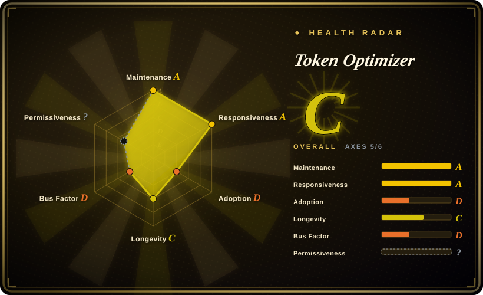
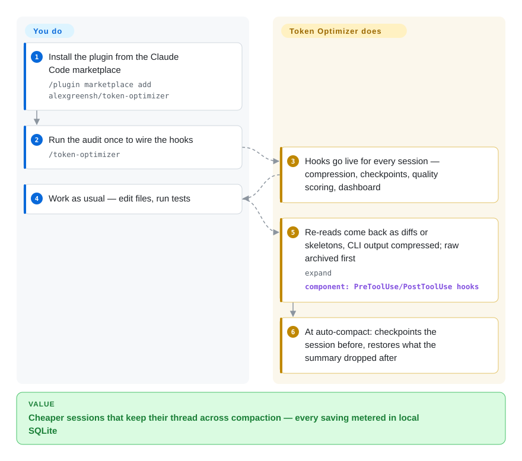

# Token Optimizer

Your coding agent's context fills with pytest spew, full re-reads of files it just edited, and 500-line grep dumps — then auto-compact fires and erases the error-fix sequence you spent the session building, while the API bill climbs the whole way. Token Optimizer is a hook-layer plugin (Claude Code first, ~10 agent platforms) that compresses what enters the context, checkpoints state around compaction, and records every saving in a local SQLite ledger with a dashboard.

## When to use

You live in Claude Code (or Codex, Cursor, OpenCode, Copilot…) on API billing or a tight token quota, and the waste is visible: a 564-token pytest output the model only needed 20 tokens of, the same 2,000-token file re-read in full after every edit, a 500-line grep result landing verbatim in the window. At 80% fill, auto-compact wipes the decisions and the agent starts asking what it was doing. You want sessions that cost less *and* keep their thread across compaction and restarts.

So you install the plugin, run `/token-optimizer` once to wire the hooks, and work as usual: PreToolUse hooks intercept Read/Bash before content enters the window (delta diffs for re-reads, signature skeletons for unchanged code, compressed CLI output), PostToolUse hooks archive the raw original to disk, checkpoints bracket every compaction, and each saving lands as a row in local SQLite that feeds a dollar dashboard. Pick this over pure output compressors ([RTK](rtk.md), Headroom) when compaction loss, structural waste (bloated CLAUDE.md, unused skills) and per-dollar accounting matter as much as raw compression — accepting a **noncommercial license** and a hook layer that rewrites what the model sees in exchange for coverage those tools don't attempt.

## How it works

Token Optimizer sits in your agent's hook events (PreToolUse, PostToolUse, UserPromptSubmit, SessionStart, Stop) as an external Python-stdlib process — no MCP server, nothing always-on in your context. When a tool call is about to enter the window, it swaps the payload for a cheaper form: a re-read becomes just the diff, an unchanged code file becomes a skeleton of signatures and imports, a CLI output becomes its essential lines; the raw original is archived to disk first, so `expand` can pull it back and a hook failure fails open (your command runs normally). Around compaction it checkpoints session state — active task, decisions, modified files — into SQLite at fill thresholds (20/35/50/65/80%), then restores what the compaction summary dropped and injects a digest of the largest tool outputs so the model re-orients without re-reading. You do the one-time install and occasional audits; the hooks do every session.

<!-- flow-steps:begin (generated from flows/token-optimizer.json by tools/flow_card.py — do not edit) -->

Text version of the flow

1. **You**: Install the plugin from the Claude Code marketplace — `/plugin marketplace add alexgreensh/token-optimizer`
2. **You**: Run the audit once to wire the hooks — `/token-optimizer`
3. **Token Optimizer**: Hooks go live for every session — compression, checkpoints, quality scoring, dashboard
4. **You**: Work as usual — edit files, run tests
5. **Token Optimizer**: Re-reads come back as diffs or skeletons, CLI output compressed; raw archived first — `expand` — component: `PreToolUse/PostToolUse hooks`
6. **Token Optimizer**: At auto-compact: checkpoints the session before, restores what the summary dropped after

**Value**: Cheaper sessions that keep their thread across compaction — every saving metered in local SQLite

<!-- flow-steps:end -->

## When NOT to use

- **You're using it at a company above the small-business line.** PolyForm Noncommercial 1.0.0 plus a written free permission only for organizations with **fewer than 5 people AND under $20k/month revenue**; anything bigger needs a paid commercial license. If OSS licensing is a hard requirement, use [RTK](rtk.md) (Apache-2.0) for output compression or plain built-in `/compact`.
- **You only want to *know* the spend, not change what the model sees.** A hook that rewrites tool results can hide information (mitigated by raw archiving and fail-open, but still a trust decision). Use ccusage-style JSONL analytics instead — measurement with zero interference.
- **You're not on Claude Code.** Ten platforms are wired (Codex, OpenCode, OpenClaw, Copilot, Cursor, Hermes, Pi, Antigravity beta, Grok beta), but install paths and hook coverage vary per runtime — Antigravity/Grok are beta, Windows supports the plugin install only (`install.sh` unsupported). Check the per-platform doc before betting on it.
- **You need stable, boring infrastructure.** Created 2026-02, single maintainer, 40+ releases in Aug–Sep 2026 alone — the surface moves daily and version pinning is your responsibility. For fleet cost *measurement* only, prefer analytics tools that don't touch the loop.
- **You expect the headline savings verbatim.** The advertised ~$1,396/month is the author's own 30-day snapshot, and ~$1,124 of it is a *modelled* "repeat reads avoided" estimate, not metered. Run your own audit (their `BENCHMARK.md` + evals harness) before promising anyone a number.
- **Your waste isn't in the loop's edges.** If the model is just misrouted by your own gateway or the bill is dominated by batch jobs outside the coding agent, a hook layer in the agent won't see it — fix routing at the gateway instead.

## Comparison

| Alternative | In index | Our verdict | Tradeoff |
|---|---|---|---|
| [RTK](rtk.md) | ✅ | When the waste is mostly command output and you need a permissive license or a single Rust proxy binary, pick RTK; pick Token Optimizer when compaction survival, structural-waste audits and dollar accounting matter more than license purity. | Shell-layer compression of dev commands (claimed 60–90%), Apache-2.0, huge adoption; covers the 15–25% of waste that is output — no checkpoints, no session DB, no behavioral detectors. |
| [Context Mode](context-mode.md) | ✅ | Pick Context Mode when you want heavy crunching moved into a sandboxed executor the agent scripts against (only stdout returns); pick Token Optimizer when you want the loop untouched and only its edges compressed. | Sandbox + MCP model requires Node ≥22.5 and trusting `ctx_execute` with arbitrary code; Token Optimizer stays a passive stdlib-Python hook layer. Both non-OSI (ELv2 vs PolyForm-NC). |
| Headroom (headroomlabs-ai/headroom) | 未收录 | Pick Headroom when output compression as a transparent proxy across LLM apps (not just coding agents) is the shape you want. | Compresses tool outputs/logs/RAG chunks before they reach the model; no compaction checkpoints or waste detectors; opt-in telemetry. Not added in this tab-intake batch. |
| ccusage (ccusage/ccusage) | 未收录 | Pick ccusage when you need usage/cost analytics only and won't allow anything to alter the agent's context. | Reads local JSONL, MIT, ~18.8k stars; measures but saves nothing. Not added in this tab-intake batch. |
| JFrog Boost | 非仓库 | Vendor closed beta (no public repo) — only an option if you accept its beta data collection. | Command-output compression as a product; its Beta Agreement covers collecting commands, args, exit codes, IP — the opposite stance to Token Optimizer's local-only claim. |

## Tech stack

- **Language:** Python 3.9+ pure stdlib for the hook runtime on Claude Code/Codex/Copilot/Cursor/Hermes/Pi/Antigravity/Grok; a TypeScript port with zero runtime deps for OpenCode/OpenClaw.
- **Storage:** local SQLite in WAL mode — a per-session DB (8 tables, 50MB cap) plus a trends DB (7 tables) powering dashboard, coach and 30-day analysis; the HTML dashboard is a read-only view regenerated on session end.
- **Integration surface:** agent hooks (PreToolUse/PostToolUse/UserPromptSubmit/SessionStart/Stop) wired via `hooks.json`, one dispatcher process per event; slash commands (`/token-optimizer`, `/token-coach`) and skills (token-optimizer, token-coach, token-dashboard, fleet-auditor, resume-checkpoint).
- **Distribution:** Claude Code plugin marketplace (releases checksum-verified via `CHECKSUMS.sha256`), Codex plugin CLI, `install.sh` flags for the rest; Astro docs site on GitHub Pages.
- **CI:** pytest suite on push/PR (Linux/macOS/Windows matrix, incl. a Windows real-spawn smoke test); signing + price-refresh workflows.

## Dependencies

- **Required:** a hook-capable coding agent — Claude Code (CLI or VS Code) is the first-class path; each other runtime (Codex, OpenCode, OpenClaw, Copilot, Cursor, Hermes, Pi, Antigravity beta, Grok beta) has its own installer and hook quirks.
- **Python 3.9+** on PATH for the hook scripts (Windows: plugin install only); TypeScript runtimes need no extra deps for the OpenCode/OpenClaw port.
- **Local disk only:** SQLite DBs and archived raw outputs live under the agent's home (e.g. `~/.claude/token-optimizer/`). No external DB, no MCP server, no telemetry endpoint (project's claim, not audited).
- **Optional:** an opt-in local HTTP daemon (`localhost:24842`) that makes the dashboard URL bookmarkable; otherwise open the HTML file it prints.

## Ops difficulty

**Low on Claude Code** — two plugin commands, enable auto-update once, run `/token-optimizer` once; from there hooks run themselves, and per-runtime uninstall is documented. **Medium across platforms or a fleet:** every non-Claude runtime has its own install path and capability gaps, and the release cadence is extreme (40+ releases in Aug–Sep 2026), so pin versions and update deliberately. Day-to-day burden is genuinely small: hooks are fail-open and non-blocking, state is two SQLite files, and the dashboard regenerates itself — but you own keeping the plugin current and trusting a fast-moving hook layer on every tool call.

## Health & viability

- **Maintenance** — hyperactive and current: latest release v5.13.26 on 2026-09-27, near-daily pushes, 40+ releases in Aug–Sep 2026; issues get triaged and closed within days (e.g. #204 filed 2026-09-27, closed 2026-09-28).
- **Governance / bus factor** — effectively one maintainer: `alexgreensh` authored 1,326 of ~1,400 commits; second contributor looks like the author's agent account `[推断]`. CLA and GitHub Sponsors exist; the roadmap is one person's, matching the one-day-per-patch release rhythm.
- **Age & Lindy** — created 2026-02-26, ~7 months old at verification: no Lindy protection. ~2.4k stars and 188 forks in that window signal strong attention, not durability — treat it as a young, fast-moving bet.
- **Adoption** — multilingual READMEs (ko/zh-CN/ja), a real docs site, ten platform adapters, checksummed signed releases, CI tests; the core ships via plugin marketplace/script rather than a registry, so there is no download-count cross-check.
- **Risk flags** — the headline: **PolyForm Noncommercial 1.0.0** (source-available, not OSI) with a written free tier only under 5 people AND <$20k/month revenue — commercial use above that requires a license from the author. Secondary: savings numbers are self-reported with the estimated tier dominating; a hook layer rewrites tool output the model sees (raw archive + fail-open + `expand` mitigate). `[未验证]`

## Caveats (unverified)

- **Savings figures** — `[未验证]` ~$1,396/month, 59.6M tokens, ~28% of workload are the author's own 30-day snapshot (1,698 sessions, 2026-09-14) split ~$126 metered vs ~$1,270 modelled "repeat reads avoided"; no independent reproduction exists, and the counterfactual model cannot be observed.
- **Zero-telemetry / local-only claim** — `[未验证]` the README and PRIVACY.md assert no analytics and no network calls; not audited here — if egress matters, verify with your own monitoring.
- **"60–70% of the conversation vanishes on auto-compact"** — `[未验证]` the project's characterization of Claude Code compaction, cited as motivation; not measured in this verification.
- **Platform capability matrix** — `[未验证]` per-platform hook coverage (and beta flags for Antigravity/Grok, Windows plugin-only) shifts release-to-release; confirm your runtime's doc before relying on a capability.
- **87-fixture test suite** — `[未验证]` claimed in the README as runnable by anyone; CI visibly runs a pytest suite, but the fixture count was not independently checked.
- **`alexgr-agent` as the author's bot account** — `[推断]` 31 commits from a similarly-named account on a single-maintainer repo; harmless either way, but it means the human bus factor is even lower than the contributor list suggests.
- **Stars / forks / watchers** — 2,419 / 188 / 13 via `gh` on 2026-09-28; volatile numbers, re-check before quoting.
