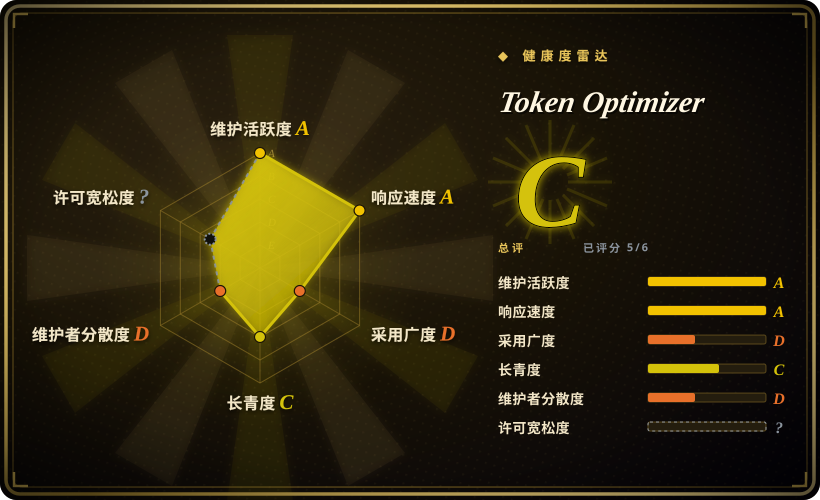
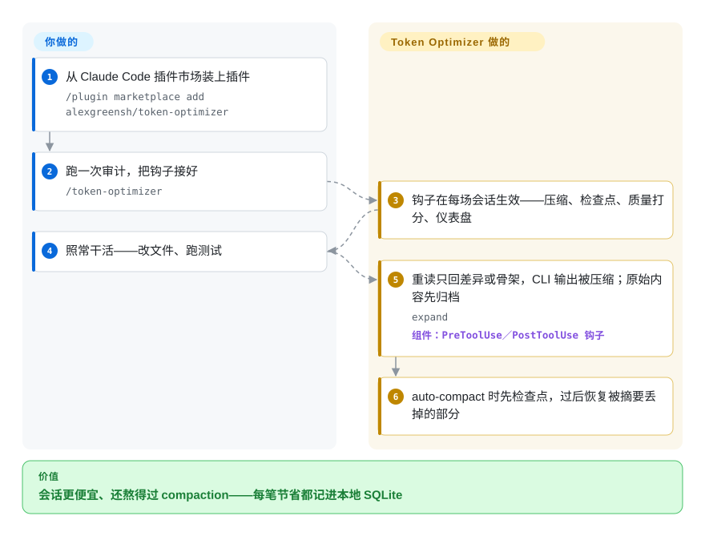

# Token Optimizer

coding agent 的上下文被 pytest 刷屏、刚编辑过的文件整篇重读、五百行 grep 结果原样塞进窗口撑到 auto-compact 一触发——整场会话攒下的排错线索被抹掉，而账单全程还在往上走。Token Optimizer 是装在钩子层的插件（Claude Code 优先，约 10 个 agent 平台）：进窗口的内容先压缩，compaction 前后打检查点，每笔节省都记进本地 SQLite 台账并出仪表盘。

## 何时使用

你重度使用 Claude Code（或 Codex、Cursor、OpenCode、Copilot……），按 API 计费或 Token 配额紧张，而且浪费看得见：564 个 token 的 pytest 输出模型其实只需要 20 个、同一个两千 token 的文件每改一次就被整篇重读、五百行 grep 原样落进窗口。窗口填到八成时 auto-compact 把决策抹掉，agent 开始问你它刚才在干什么。你想要的正是既省钱、又能让会话熬过 compaction 和重启还接得上话头。

于是装上插件，跑一次 `/token-optimizer` 把钩子接好，之后照常干活：PreToolUse 钩子在内容进窗口前拦下 Read/Bash（重读只回差异、未改的代码文件换成签名骨架、CLI 输出压缩），PostToolUse 钩子把原始输出归档到磁盘，检查点包住每次 compaction，每笔节省都写成 SQLite 里的一行，喂给按美元计的仪表盘。和纯输出压缩工具（[RTK](rtk.zh.md)、Headroom）相比，选它的时机是：compaction 丢失、结构性浪费（臃肿的 CLAUDE.md、没人用的 skills）和逐美元记账对你和压缩本身一样重要——代价是接受**非商用许可证**，以及一层会改写模型所见内容的钩子。

## 怎么用起来

Token Optimizer 以外部 Python 标准库进程的形式挂在 agent 的钩子事件上（PreToolUse、PostToolUse、UserPromptSubmit、SessionStart、Stop）——没有 MCP 服务器，也不会往你的上下文里常驻任何指令。当一次工具调用即将进窗口时，它把载荷换成更便宜的形态：重读只回差异、未改动的代码文件换成签名和导入的骨架、CLI 输出只留关键行；原始内容事先归档到磁盘，`expand` 随时取回，钩子失败则 fail-open（命令照常执行）。在 compaction 边界，它按填充阈值（20／35／50／65／80%）把会话状态——当前任务、决策、改动过的文件——检查点存进 SQLite，compaction 之后恢复被摘要丢掉的部分，并注入最大几笔工具输出的摘要，让模型不用重读就能重新定向。你只做一次性安装和偶尔的审计，钩子撑起每一场会话。

<!-- flow-steps:begin (generated from flows/token-optimizer.json by tools/flow_card.py — do not edit) -->

流程文字版

1. **你**：从 Claude Code 插件市场装上插件 — `/plugin marketplace add alexgreensh/token-optimizer`
2. **你**：跑一次审计，把钩子接好 — `/token-optimizer`
3. **Token Optimizer**：钩子在每场会话生效——压缩、检查点、质量打分、仪表盘
4. **你**：照常干活——改文件、跑测试
5. **Token Optimizer**：重读只回差异或骨架，CLI 输出被压缩；原始内容先归档 — `expand` — 组件：`PreToolUse／PostToolUse 钩子`
6. **Token Optimizer**：auto-compact 时先检查点，过后恢复被摘要丢掉的部分

**价值**：会话更便宜、还熬得过 compaction——每笔节省都记进本地 SQLite

<!-- flow-steps:end -->

## 何时不用

- **在超过小企业线的公司里使用。** 许可证是 PolyForm Noncommercial 1.0.0，外加一份书面免费许可——只覆盖「全职少于 5 人**且**月收入低于 2 万美元」的组织；更大就得找作者买商业授权。如果开放许可（OSI）是硬要求，输出压缩改用 [RTK](rtk.zh.md)（Apache-2.0），或直接用内置 `/compact`。
- **你只想知道花了多少，不想改变模型看到什么。** 改写工具结果的钩子天然可能藏信息（有原始归档和 fail-open 兜底，但这仍是个信任决定）。改用 ccusage 这类只读 JSONL 的分析工具——只测量，零干预。
- **你的主力不是 Claude Code。** 十个平台都接了线（Codex、OpenCode、OpenClaw、Copilot、Cursor、Hermes、Pi、Antigravity beta、Grok beta），但各运行时的安装路径和钩子覆盖差异很大——Antigravity／Grok 是 beta，Windows 只支持插件安装（`install.sh` 不可用）。押注之前先看对应平台的文档。
- **你需要稳定不动的基础设施。** 2026 年 2 月创建、单人维护、仅 2026 年 8–9 月就发布 40 多个版本——接口天天在动，版本钉死是你的责任。只要测量不要干预的话，选不碰回路的分析工具。
- **你把宣传的节省数字当真。** 号称每月约 1396 美元是作者自己的 30 天快照，其中约 1124 美元是**建模估算**的「避免的重复读取」，不是实测。先跑你自己的审计（仓库的 `BENCHMARK.md` 加评测框架），再向任何人承诺数字。
- **浪费不在回路边缘。** 如果是网关层把模型路由错了，或账单大头在 coding agent 之外的批处理任务上，agent 里的钩子看不见——去网关修路由。

## 横向对比

| 替代品 | 是否收录 | 我们的评价 | 取舍 |
|---|---|---|---|
| [RTK](rtk.zh.md) | 已收录 | 浪费主要来自命令输出、且要宽松许可证或单个 Rust 代理二进制时选 RTK；compaction 存活、结构性浪费审计和美元记账比许可证纯度更重要时选本页。 | RTK 在 shell 层压缩开发命令（号称 60–90%），Apache-2.0，采用面巨大；但只覆盖命令输出这部分（Token Optimizer 的 README 称约 15–25%，`[未验证]`）——没有检查点、会话库和行为检测器。 |
| [Context Mode](context-mode.zh.md) | 已收录 | 想把重活搬进一个沙箱执行器、让 agent 写脚本只拿回 stdout 时选 Context Mode；想让回路原样不动、只压缩它的边缘时选本页。 | Context Mode 的沙箱加 MCP 形态要 Node ≥22.5，还得把任意代码执行交给 `ctx_execute`；Token Optimizer 始终是被动的标准库 Python 钩子层。两者都非 OSI（ELv2 对 PolyForm-NC）。 |
| Headroom（headroomlabs-ai/headroom） | 未收录 | 想要一个透明代理形态的输出压缩、且覆盖 coding agent 之外的更多 LLM 应用时选它。 | 只压缩工具输出／日志／RAG 分块，没有 compaction 检查点和浪费检测器；有可选遥测。本次 tab-intake 批次未收录。 |
| ccusage（ccusage/ccusage） | 未收录 | 只需要用量／成本分析、且不允许任何东西改动 agent 上下文时选它。 | 读本地 JSONL，MIT，约 1.88 万 star；只测量不省钱。本次 tab-intake 批次未收录。 |
| JFrog Boost | 非仓库 | 厂商封闭 beta（无公开仓库）——只有接受其 beta 数据收集条款才谈得上可选。 | 以产品形态提供命令输出压缩；其 Beta 协议覆盖收集命令、参数、退出码和 IP——与 Token Optimizer 的纯本地立场正好相反。 |

## 技术栈

- **语言：** Claude Code／Codex／Copilot／Cursor／Hermes／Pi／Antigravity／Grok 上是 Python 3.9+ 纯标准库钩子运行时；OpenCode／OpenClaw 是零运行时依赖的 TypeScript 移植。
- **存储：** 本地 SQLite（WAL 模式）——每会话库（8 张表、50MB 上限）加趋势库（7 张表），驱动仪表盘、教练模式和 30 天分析；HTML 仪表盘只是这份数据的只读视图，会话结束自动重生成。
- **接入面：** agent 钩子（PreToolUse／PostToolUse／UserPromptSubmit／SessionStart／Stop）经 `hooks.json` 接线，每个事件一个分发器进程；斜杠命令（`/token-optimizer`、`/token-coach`）和 skills（token-optimizer、token-coach、token-dashboard、fleet-auditor、resume-checkpoint）。
- **分发：** Claude Code 插件市场（发布带 `CHECKSUMS.sha256` 校验）、Codex 插件 CLI、其余平台用 `install.sh` 参数；文档站是 GitHub Pages 上的 Astro 站点。
- **CI：** push／PR 跑 pytest 套件（Linux／macOS／Windows 矩阵，含 Windows 真实子进程冒烟测试）；另有签名和价格刷新工作流。

## 依赖

- **必需：** 一个支持钩子的 coding agent——Claude Code（CLI 或 VS Code）是一等路径；其余运行时（Codex、OpenCode、OpenClaw、Copilot、Cursor、Hermes、Pi、Antigravity beta、Grok beta）各有安装器和钩子差异。
- **Python 3.9+** 在 PATH 上供钩子脚本用（Windows 只支持插件安装）；OpenCode／OpenClaw 的 TypeScript 移植无需额外依赖。
- **只要本地磁盘：** SQLite 库和原始输出归档放在 agent 主目录下（如 `~/.claude/token-optimizer/`）。无外部数据库、无 MCP 服务器、无遥测端点（项目自述，未经审计）。
- **可选：** 一个选择性开启的本地 HTTP 守护进程（`localhost:24842`），让仪表盘 URL 可收藏；不开就用它打印出的文件路径。

## 运维难度

**Claude Code 上是低**——两条插件命令、开一次自动更新、跑一次 `/token-optimizer`；此后钩子自己跑，各运行时的卸载都有文档。**跨平台或车队场景是中：**每个非 Claude 运行时安装路径和能力缺口都不同，而且发布节奏极端（2026 年 8–9 月 40 多个版本），要钉住版本、有意识地升级。日常负担确实小：钩子 fail-open 且不阻塞、状态就两个 SQLite 文件、仪表盘自己重生成——但让一个高速移动的钩子层挂在每次工具调用上，这份信任和保鲜由你自己承担。

## 健康度与可持续性

- **维护**——超高频且跟得上：最新版 v5.13.26（2026-09-27），近乎每日推送，仅 2026 年 8–9 月就 40 多个发布；issue 几天内处理关闭（如 #204 于 2026-09-27 提出、次日关闭）。
- **治理／bus factor**——实际单人维护：`alexgreensh` 贡献约 1400 次提交中的 1326 次；第二贡献者疑似作者自己的 agent 账号 `[推断]`。有 CLA 和 GitHub 赞助；路线图就是这一个人的，和一天一补丁的发布节奏互相印证。
- **年龄／Lindy**——2026-02-26 创建，核实时约 7 个月大：没有 Lindy 保护。这个窗口内约 2.4k star、188 fork 说明关注度很高，但不说明耐久——把它当一个年轻、高速移动的赌注。
- **采用**——多语言 README（韩／简中／日）、正经文档站、十个平台适配器、带校验和的签名发布、CI 测试；核心经插件市场／脚本分发而非包管理器，没有下载量可交叉验证。
- **风险标记**——头号问题是许可证：**PolyForm Noncommercial 1.0.0**（source-available、非 OSI），书面免费档只覆盖「少于 5 人**且**月收入低于 2 万美元」，之上商用需向作者购买授权。其次是节省数字自报且估算档占大头；以及钩子层会改写模型看到的工具输出（原始归档、fail-open、`expand` 是缓解）。`[未验证]`

## 存疑（未验证）

- **节省数字**——`[未验证]` 每月约 1396 美元、5960 万 token、约 28% 工作量，全部来自作者自己的 30 天快照（1698 场会话，2026-09-14），其中约 126 美元实测、约 1270 美元是建模估算的「避免的重复读取」；没有独立复现，反事实模型本身也不可观测。
- **零遥测／纯本地声明**——`[未验证]` README 和 PRIVACY.md 断言无分析、无网络外发；本次未审计——在意出网流量的话用你自己的监控验证。
- **「auto-compact 会抹掉 60–70% 的对话」**——`[未验证]` 这是项目对 Claude Code compaction 的描述，被当作动机引用；本次核验没有实测。
- **平台能力矩阵**——`[未验证]` 各平台的钩子覆盖（以及 Antigravity／Grok 的 beta 标记、Windows 仅插件安装）随版本变动；依赖某项能力前先查对应运行时文档。
- **87 个夹具的测试套件**——`[未验证]` README 声称任何人可跑；CI 确实在跑 pytest 套件，但夹具数量未独立核对。
- **「命令输出只占上下文的 15–25%」**——`[未验证]` 这是 RTK 这类工具能覆盖的份额，出自 Token Optimizer 自己的 README（「Why not just use Headroom or RTK?」一节）；没有给出测量或方法，而且是竞品的说法——对比前先量你自己的会话。
- **`alexgr-agent` 是作者的机器人账号**——`[推断]` 单人维护的仓库里出现同命名规则的账号贡献了 31 次提交；无论真相如何，人力 bus factor 都比贡献者列表显示的更低。
- **star／fork／watcher 数**——2026-09-28 经 `gh` 查得 2419／188／13；数字波动大，引用前重查。
