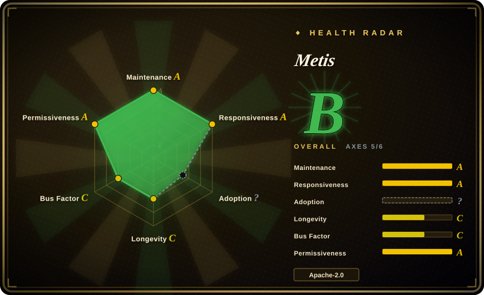
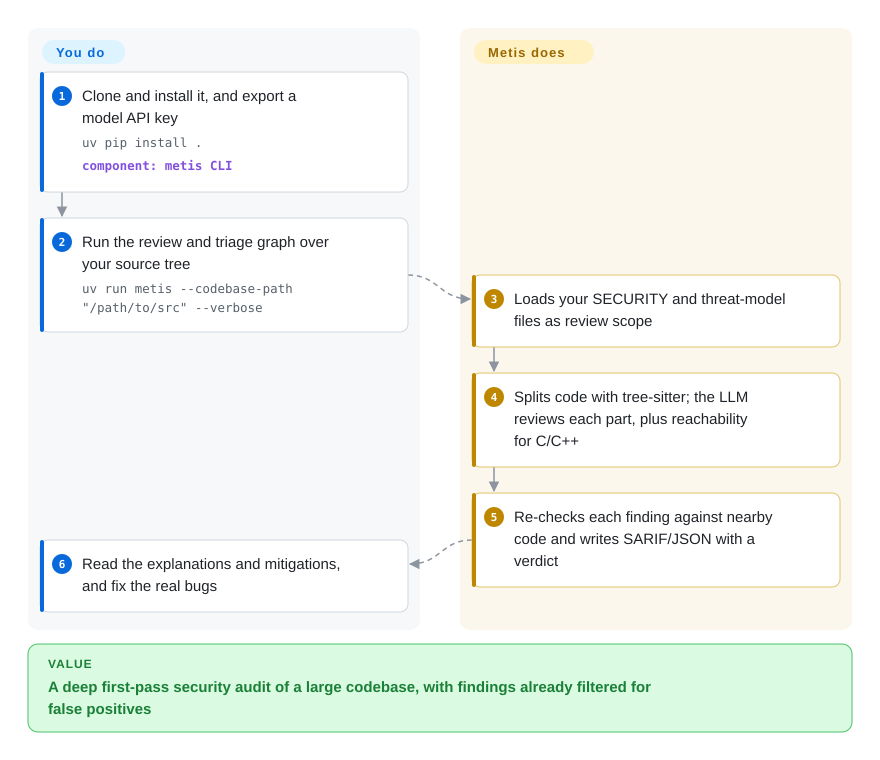

# Metis

Your SAST scanner hands you 600 findings on a legacy C codebase, most of them false alarms, while the bug that matters — a loop that computes the relocated address and never writes it back — matches no rule at all. Metis, from Arm's product security team, has an LLM read the code file by file looking for security flaws, then checks each finding (its own or another scanner's) against the surrounding source before it reaches you.

## When to use

You're on a product-security or firmware team responsible for a large C/C++ codebase — drivers, a bootloader, a hypervisor — plus some Python and Rust around it. Your rule-based SAST either floods you with findings nobody triages or stays silent on logic bugs, and a full manual audit is months of work. You want an LLM to do a first deep pass over the whole tree, run on whatever model your security policy allows (including a local vLLM or Ollama), and emit SARIF your existing tooling understands. You clone Metis, export a model key, run `uv run metis --codebase-path ./src`, and get a findings file with an explanation, a suggested mitigation and a confidence for each issue; you can also feed it your existing scanner's SARIF and let it mark each result valid, invalid or inconclusive with file:line evidence.

You pick Metis over [Claude Code Security Review](claude-code-security-review.md) when you need whole-codebase audits rather than PR-diff comments, and when the model must be your choice (OpenAI, Anthropic, Gemini, Bedrock or a local server) instead of Claude only. You pick it over Semgrep or CodeQL (not indexed) when the bugs you care about are semantic — wrong logic, missing write-back, misuse a rule can't express — and you can afford LLM tokens per file; for C and C++ in particular, its code-graph reachability analysis is the deepest path it ships.

## How it works

Metis is a command-line tool that runs a configurable pipeline of LLM steps over your source tree; you supply the model, the code and optionally your threat model, and it does the reading. It first loads your `SECURITY.*` and threat-model files into a "repository memory" so the model knows what counts as in scope. The review stage then splits each file into chunks with tree-sitter (a parser that understands code structure, so chunks follow functions rather than arbitrary line counts) and asks the model to find security issues in each; for C and C++ it also builds a code graph — who calls whom — and reasons about whether an issue is reachable from an entry point. A triage stage then re-checks each finding like a second reviewer: it gathers evidence around the reported line, follows symbol definitions and call sites, and asks the model for a structured verdict that is validated before being written into the SARIF output (the standard JSON format that code-scanning tools exchange). You decide which model and which paths, read the findings, and fix the code; an interactive mode adds `review_patch` for diffs, `triage` for third-party SARIF, and `ask` for questions over an optional vector index.

<!-- flow-steps:begin (generated from flows/metis.json by tools/flow_card.py — do not edit) -->

Text version of the flow

1. **You**: Clone and install it, and export a model API key — `uv pip install .` — component: `metis CLI`
2. **You**: Run the review and triage graph over your source tree — `uv run metis --codebase-path "/path/to/src" --verbose`
3. **Metis**: Loads your SECURITY and threat-model files as review scope
4. **Metis**: Splits code with tree-sitter; the LLM reviews each part, plus reachability for C/C++
5. **Metis**: Re-checks each finding against nearby code and writes SARIF/JSON with a verdict
6. **You**: Read the explanations and mitigations, and fix the real bugs

**Value**: A deep first-pass security audit of a large codebase, with findings already filtered for false positives

<!-- flow-steps:end -->

## When NOT to use

- **You want automatic comments on every pull request.** Metis is a CLI you run over a tree or a diff; it ships no GitHub Action or PR-bot. For PR-time security comments, use [Claude Code Security Review](claude-code-security-review.md); for general PR review, [PR-Agent](pr-agent.md).
- **You need reproducible, free, rule-based results as a CI gate.** LLM output varies run to run and every file costs tokens. For a deterministic gate with stable rule IDs, use Semgrep or GitHub CodeQL (not indexed), and point Metis's `triage` at their SARIF if false positives are the problem.
- **Your code cannot be sent to a model provider and you have no local GPU.** The default provider is OpenAI and the whole source is sent to the model. Local servers (vLLM, Ollama, llama.cpp) are supported, but weaker local models will find less; if neither is acceptable, stay with offline SAST such as Semgrep or CodeQL.
- **Your codebase is mostly a language where Metis only does the simple pass.** The deepest analysis (code-graph reachability) is C/C++ only; Java, Python, TypeScript, Go and the rest get per-file LLM review without reachability. If interprocedural taint tracking in those languages is the requirement, CodeQL is the stronger engine.
- **You need a polished product with support and dashboards.** Metis is a research-grade tool from one vendor's security team: configuration is a detailed `metis.yaml` execution graph, install is from a clone with `uv`, and output is JSON/SARIF files. If you want a managed service, a hosted AI review product is the other route.

## Comparison

| Alternative | In index | Our verdict | Tradeoff |
|---|---|---|---|
| [Claude Code Security Review](claude-code-security-review.md) | ✅ | Pick Claude Code Security Review for LLM security comments on each trusted PR in GitHub; pick Metis for whole-repository audits, SARIF triage and a model of your choice. | The Action drops into a workflow in minutes but is Claude-only and diff-scoped; Metis covers the full tree and C/C++ reachability but you run and wire it yourself. |
| Semgrep | not indexed | Pick Semgrep for fast, free, reproducible rule-based scanning in CI; pick Metis to find logic bugs no rule describes and to triage Semgrep's SARIF. | Semgrep is deterministic and cheap per run but pattern-bound; Metis reasons about semantics at a per-file token cost and with run-to-run variance. |
| GitHub CodeQL | not indexed | Pick CodeQL for deep dataflow/taint analysis with native GitHub code scanning; pick Metis when you need an LLM's explanation and mitigation text or want to cut CodeQL's false positives. | CodeQL offers interprocedural analysis in many languages but requires per-language queries and builds; Metis needs only source and a model but its deep path is C/C++ only. |
| [PR-Agent](pr-agent.md) | ✅ | Pick PR-Agent for general LLM review, descriptions and suggestions on every PR; pick Metis when the job is a focused security audit of existing code. | PR-Agent is broad and PR-native; Metis is security-only, with threat-model scoping and evidence-backed triage. |

## Tech stack

- **Language:** Python ≥ 3.12; CLI entry `metis` (run via `uv run metis`) or a Docker image you build.
- **Orchestration:** LangGraph/LangChain for the execution graph, LlamaIndex for indexing, tree-sitter (`tree-sitter-language-pack`) for code splitting and the C/C++ code graph.
- **Vector stores:** ChromaDB (default, local), PostgreSQL + pgvector, or Qdrant — needed only for `index`, `ask` and `update`.
- **LLM providers:** OpenAI (default), Azure OpenAI, Anthropic, Google Gemini/Vertex, AWS Bedrock, Bedrock Mantle, vLLM, Ollama, llama.cpp; separate embedding provider configurable.
- **Languages reviewed:** C, C++ (with reachability), plus Java, C#, Python, Ruby, Rust, Solidity, TypeScript, JavaScript, Go, Kotlin, PHP, Perl, Terraform, TableGen, Verilog/SystemVerilog, AArch64 assembly and Jupyter notebooks; extensible via language plugins.
- **Output:** JSON and SARIF, with triage metadata annotated onto SARIF results.

## Dependencies

- **An LLM endpoint:** an `OPENAI_API_KEY` by default, or a configured provider; a local inference server if code must stay on-premises.
- **Python 3.12+ and `uv`**, or Docker.
- **Optional:** PostgreSQL with pgvector (a `docker compose up -d` file is provided) or Qdrant for the vector index; an embedding provider when the backend does not supply one.
- No GPU unless you host the model yourself.

## Ops difficulty

**Medium.** A first run is a clone, `uv pip install .`, an API key and one command. The cost is elsewhere: a full-tree review of a large codebase makes many model calls (budget and rate-limit accordingly), useful results depend on tuning `metis.yaml` (execution graph, threat-model sources, custom prompt `.metis.md`), and a vector backend adds a database if you use `ask`/`update`. Review checkpoints are on by default, so interrupted long runs can resume.

## Health & viability

- **Maintenance (2026-10-08):** active — commits within the last week; releases roughly monthly to quarterly (metis-v1.4.0 2026-06-04, v1.5.0 2026-07-02, v1.5.2 2026-09-04, the last a backported memory fix for large C/C++ triage runs).
- **Governance & backing:** owned by Arm (the `arm` GitHub org), built by Arm's Product Security Team; one engineer (`mpekatsoula`) authored about 60% of the last year's commits among 24 active contributors, so the radar grades governance C. Corporate backing is solid, but the roadmap depends on a small internal team's priorities.
- **Age / Lindy:** created 2025-07 (~15 months). Young; no Lindy evidence yet.
- **Adoption:** ~874 stars (as of 2026-10); no package registry signal, since it is installed from source. It carries OpenSSF Scorecard and Best Practices badges.
- **Risk flags:** Apache-2.0, no relicense history. The main risk is strategic — an internal tool open-sourced by a hardware company could be deprioritized; there is no commercial edition or stated support commitment.

## Caveats (unverified)

- [未验证] Detection quality and false-positive rates versus Semgrep/CodeQL were not benchmarked here; the README's example finding is illustrative, not a measured result.
- [未验证] Token cost of a full-tree review depends on codebase size, chunking and model; no figure was measured.
- [推断] That Metis is not published on PyPI is inferred from the README's clone-and-`uv pip install .` instructions; a same-named PyPI package may belong to an unrelated project.
- [推断] The risk that Arm deprioritizes the project is a general judgment about vendor-internal tools, not based on any stated plan.
