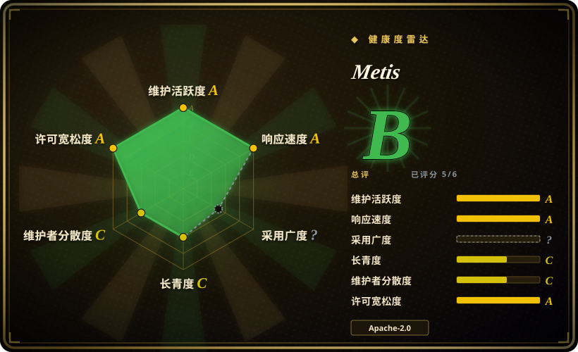
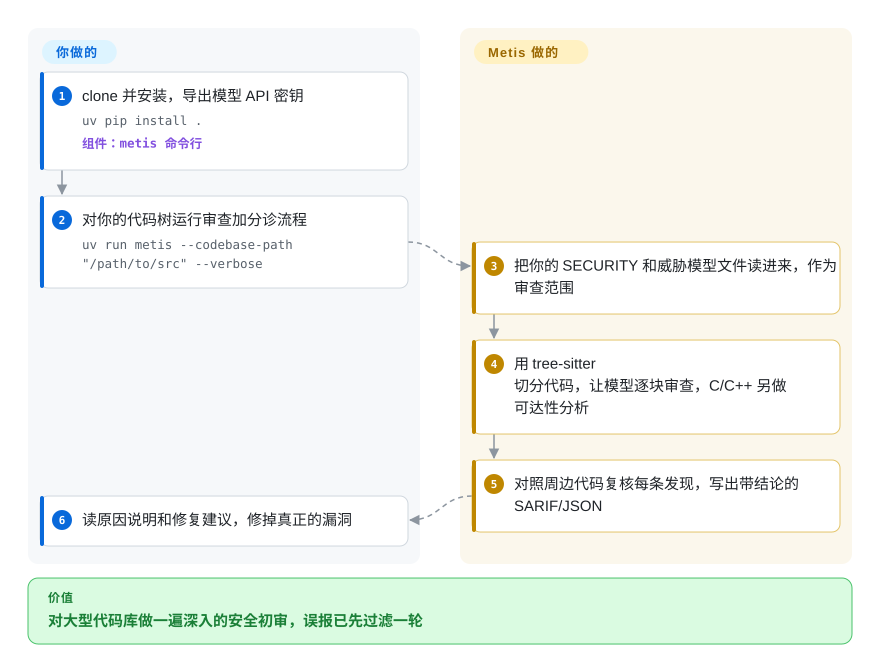

# Metis

规则扫描器在一份老旧 C 代码库上甩给你 600 条告警，大多是误报；真正要命的 bug，比如一个循环算出了重定位后的地址却从没写回内存，偏偏不匹配任何规则。Metis 出自 Arm 的产品安全团队：让大模型逐个文件读代码找安全漏洞，再把每条发现（它自己的或别的扫描器的）放回周围源码里核对一遍，才交到你手上。

## 何时使用

你在一个产品安全或固件团队，负责一大份 C/C++ 代码（驱动、bootloader、hypervisor），周围还有些 Python 和 Rust。基于规则的 SAST 要么吐出一堆没人分诊的告警，要么对逻辑漏洞一声不吭；完整的人工审计又要好几个月。你想让大模型先把整棵代码树深读一遍，用的是安全策略允许的模型（包括本地的 vLLM 或 Ollama），并输出现有工具能读的 SARIF。于是你 clone 下 Metis，导出模型密钥，运行 `uv run metis --codebase-path ./src`，拿到一份发现清单，每条都有原因说明、修复建议和置信度；你也可以把现有扫描器的 SARIF 喂给它，让它给每条结果标上有效、无效或无法判定，并附上 file:line 证据。

和 [Claude Code Security Review](claude-code-security-review.zh.md) 比，当你要的是整库审计而不是 PR diff 评论、并且模型必须由你来选（OpenAI、Anthropic、Gemini、Bedrock 或本地服务）而不是只能用 Claude 时，选 Metis。和 Semgrep、CodeQL（未收录）比，当你关心的是语义层面的漏洞（逻辑写错、忘了写回、规则表达不出的误用），且付得起逐文件的 LLM token 时，选 Metis；尤其对 C 和 C++，它的代码图可达性分析是它最深的一条路径。

## 怎么用起来

Metis 是一个命令行工具，在你的代码树上跑一条可配置的 LLM 步骤流水线；模型、代码和（可选的）威胁模型由你提供，阅读由它来做。它先把你的 `SECURITY.*` 和威胁模型文件读进“仓库记忆”，让模型知道什么算在范围内。审查阶段用 tree-sitter（一种理解代码结构的解析器，切块按函数走而不是按固定行数）把每个文件切块，让模型在每块里找安全问题；对 C 和 C++ 还会构建一张代码图（谁调用谁），判断问题能否从入口点到达。随后的分诊阶段像第二位审查者一样复核每条发现：在报告的那一行周围收集证据，顺着符号定义和调用点追下去，让模型给出结构化结论，经确定性规则校验后写进 SARIF 输出（代码扫描工具之间交换结果用的标准 JSON 格式）。选哪个模型、扫哪些路径、看结果和修代码归你；交互模式里还有审 diff 的 `review_patch`、分诊第三方 SARIF 的 `triage`，以及基于可选向量索引提问的 `ask`。

<!-- flow-steps:begin (generated from flows/metis.json by tools/flow_card.py — do not edit) -->

流程文字版

1. **你**：clone 并安装，导出模型 API 密钥 — `uv pip install .` — 组件：`metis 命令行`
2. **你**：对你的代码树运行审查加分诊流程 — `uv run metis --codebase-path "/path/to/src" --verbose`
3. **Metis**：把你的 SECURITY 和威胁模型文件读进来，作为审查范围
4. **Metis**：用 tree-sitter 切分代码，让模型逐块审查，C/C++ 另做可达性分析
5. **Metis**：对照周边代码复核每条发现，写出带结论的 SARIF/JSON
6. **你**：读原因说明和修复建议，修掉真正的漏洞

**价值**：对大型代码库做一遍深入的安全初审，误报已先过滤一轮

<!-- flow-steps:end -->

## 何时不用

- **你想在每个 PR 上自动出评论。** Metis 是一个对代码树或 diff 运行的 CLI，不带 GitHub Action 或 PR 机器人。PR 时的安全评论用 [Claude Code Security Review](claude-code-security-review.zh.md)；通用 PR 审查用 [PR-Agent](pr-agent.zh.md)。
- **你需要可复现、免费、基于规则的结果来当 CI 门禁。** LLM 的输出每次运行都会有出入，每个文件都花 token。要稳定规则 ID 的确定性门禁，用 Semgrep 或 GitHub CodeQL（未收录）；如果痛点是误报，再把它们的 SARIF 交给 Metis 的 `triage`。
- **代码不能发给模型供应商，你手里也没有本地 GPU。** 默认供应商是 OpenAI，整份源码都会发给模型。支持本地服务（vLLM、Ollama、llama.cpp），但较弱的本地模型能找到的会更少；两者都不可接受时，继续用 Semgrep、CodeQL 这类离线 SAST。
- **你的代码库主要是 Metis 只做简单一遍的语言。** 最深的分析（代码图可达性）只有 C/C++；Java、Python、TypeScript、Go 等只做逐文件 LLM 审查，没有可达性分析。如果这些语言的跨过程污点追踪是硬要求，CodeQL 是更强的引擎。
- **你要一个有支持、有面板的成品。** Metis 是一家厂商安全团队出的研究级工具：配置是一份细致的 `metis.yaml` 执行图，安装是 clone 后用 `uv`，产物是 JSON/SARIF 文件。想要托管服务，就走商业 AI 审查产品那条路。

## 横向对比

| 替代品 | 是否收录 | 我们的评价 | 取舍 |
|---|---|---|---|
| [Claude Code Security Review](claude-code-security-review.zh.md) | ✅ | 想在 GitHub 上对每个可信 PR 出 LLM 安全评论时选 Claude Code Security Review；要整库审计、SARIF 分诊和自选模型时选 Metis。 | Action 几分钟就能接进 workflow，但只能用 Claude、只看 diff；Metis 覆盖整棵代码树和 C/C++ 可达性，但要你自己运行和接线。 |
| Semgrep | 未收录 | 要在 CI 里快速、免费、可复现地做规则扫描时选 Semgrep；要找规则描述不了的逻辑漏洞、或给 Semgrep 的 SARIF 做分诊时选 Metis。 | Semgrep 确定性强、每次运行便宜，但受限于模式匹配；Metis 理解语义，代价是逐文件的 token 和每次运行的差异。 |
| GitHub CodeQL | 未收录 | 要深度数据流/污点分析并接入 GitHub 原生代码扫描时选 CodeQL；需要 LLM 写出的原因和修复说明、或想压低 CodeQL 误报时选 Metis。 | CodeQL 在多种语言上做跨过程分析，但要按语言写查询、要能构建；Metis 只要源码和模型，但深度路径只覆盖 C/C++。 |
| [PR-Agent](pr-agent.zh.md) | ✅ | 想在每个 PR 上做通用 LLM 审查、生成描述和建议时选 PR-Agent；任务是对存量代码做专项安全审计时选 Metis。 | PR-Agent 面广、天生贴合 PR；Metis 只管安全，带威胁模型限定范围和有证据支撑的分诊。 |

## 技术栈

- **语言：** Python ≥ 3.12；CLI 入口 `metis`（用 `uv run metis` 运行），或自己构建的 Docker 镜像。
- **编排：** 执行图用 LangGraph/LangChain，索引用 LlamaIndex，代码切块和 C/C++ 代码图用 tree-sitter（`tree-sitter-language-pack`）。
- **向量库：** ChromaDB（默认，本地）、PostgreSQL + pgvector 或 Qdrant，只有 `index`、`ask`、`update` 才需要。
- **LLM 供应商：** OpenAI（默认）、Azure OpenAI、Anthropic、Google Gemini/Vertex、AWS Bedrock、Bedrock Mantle、vLLM、Ollama、llama.cpp；embedding 供应商可单独配置。
- **可审查语言：** C、C++（带可达性），以及 Java、C#、Python、Ruby、Rust、Solidity、TypeScript、JavaScript、Go、Kotlin、PHP、Perl、Terraform、TableGen、Verilog/SystemVerilog、AArch64 汇编和 Jupyter notebook；可通过语言插件扩展。
- **输出：** JSON 和 SARIF，分诊信息以注解形式写进 SARIF 结果。

## 依赖

- **一个 LLM 端点：** 默认读 `OPENAI_API_KEY`，或配置其他供应商；代码必须留在本地时，需要一台本地推理服务。
- **Python 3.12+ 和 `uv`**，或 Docker。
- **可选：** 向量索引用的 PostgreSQL + pgvector（仓库提供 `docker compose up -d` 的配置）或 Qdrant；后端不自带 embedding 时还需要一个 embedding 供应商。
- 不需要 GPU，除非你自己托管模型。

## 运维难度

**中。** 第一次运行只要 clone、`uv pip install .`、一个 API 密钥和一条命令。成本在别处：对大型代码库做整树审查会发出大量模型调用（预算和限流要提前规划）；结果好不好取决于对 `metis.yaml` 的调校（执行图、威胁模型来源、自定义提示 `.metis.md`）；用 `ask`/`update` 时向量后端还会多出一个数据库。审查检查点默认开启，长时间运行被打断后可以续跑。

## 健康度与可持续性

- **维护（2026-10-08）：** 活跃，最近一周内仍有提交；发版大约一到三个月一次（metis-v1.4.0 于 2026-06-04，v1.5.0 于 2026-07-02，v1.5.2 于 2026-09-04，最后这个是给大型 C/C++ 分诊任务回移的内存修复）。
- **治理与背书：** 归 Arm（`arm` GitHub 组织）所有，由 Arm 产品安全团队开发；过去一年 24 位活跃贡献者中，一位工程师（`mpekatsoula`）贡献了约 60% 的提交，所以雷达给治理轴打了 C。公司背书扎实，但路线图取决于一个内部小团队的优先级。
- **年龄与 Lindy：** 2025-07 创建（约 15 个月），年轻，还谈不上 Lindy 证据。
- **采用：** 截至 2026-10 约 874 个 star；从源码安装，没有包仓库的下载信号。带有 OpenSSF Scorecard 和 Best Practices 徽章。
- **风险信号：** Apache-2.0，无改许可证历史。主要风险是战略性的：一家硬件公司开源出来的内部工具可能被降低优先级；没有商业版，也没有公开的支持承诺。

## 存疑（未验证）

- [未验证] 与 Semgrep、CodeQL 相比的检出质量和误报率，本页没有做基准测试；README 里的示例发现只是演示，不是测量结果。
- [未验证] 整树审查的 token 成本取决于代码库大小、切块方式和模型，本页没有测出具体数字。
- [推断] “Metis 没有发布到 PyPI”是根据 README 只给出 clone 后 `uv pip install .` 的安装方式推出来的；PyPI 上同名的包可能属于无关项目。
- [推断] “Arm 可能降低该项目优先级”是对厂商内部工具的一般判断，不基于任何公开计划。
