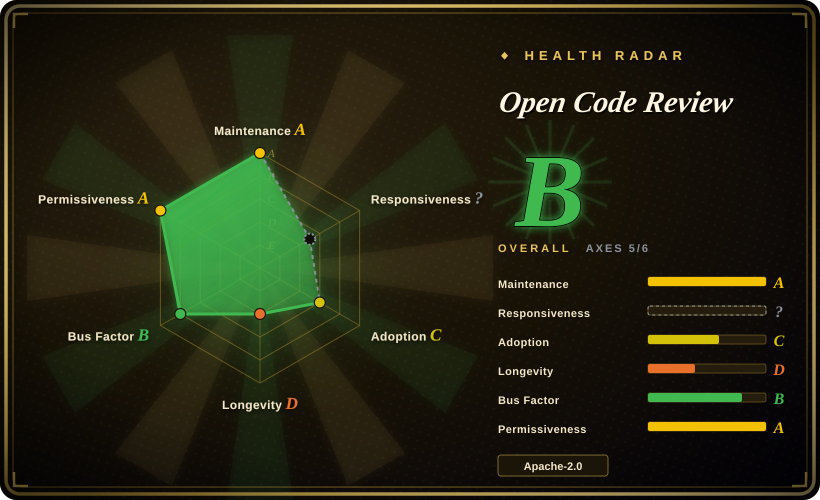
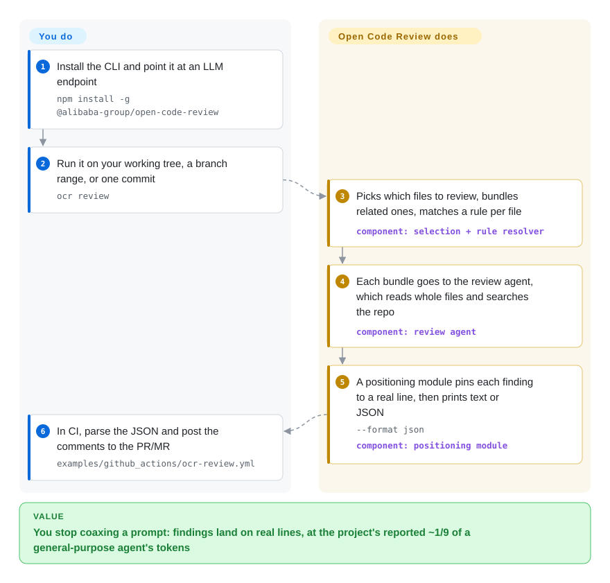

# Open Code Review

An LLM told to review a big diff tends to skim: it reads the first few files, stops, and the comments it does leave point at line numbers that don't match the problem. Open Code Review splits the job — deterministic code picks and bundles the files and pins each comment to a real line, while the model only judges content — so a vague "looks fine" becomes specific file:line findings, at the project's reported ~1/9 of the tokens a general-purpose agent burns.

## When to use

You're a backend engineer on a Java, Go or Python service whose CI runs on every pull request, but where nobody really reads the diff: the LLM skill your team bolted on reviews the first few files and stops, and the comments it leaves point at lines that don't match the problem. You want a reviewer that covers the whole changeset, lands each comment on a real line, and stays quiet rather than padding the PR with low-confidence noise. You install `ocr` and run `ocr review`: a deterministic pass decides which files are worth reviewing, bundles related ones and matches each file to a rule, then a tool-using LLM agent judges the content and a separate positioning module pins every finding to a line. If your team already pays for an AI coding agent on a subscription, delegation mode (`ocr delegate`) lets that agent's own model do the judging, so OCR needs no API key at all.

It also fits when you've inherited an unfamiliar codebase and there's no meaningful diff to review: `ocr scan` runs the same pipeline over whole files instead of a diff. Both commands emit a JSON envelope, and the repo ships a ready-made GitHub Actions / GitLab CI recipe that posts the findings back to the PR/MR (plus examples for Gerrit, GitFlic and Codeup). Because it is one Go binary — or an npm install — with plugins for Claude Code, Codex, Cursor, Kimi Code and OpenCode and IDE extensions for VS Code and JetBrains, you can drop it into an existing agent workflow without standing up a service.

## How it works

Open Code Review is a single binary you point at a diff. Before any model sees anything, a deterministic pass — plain code, no LLM — decides which files are worth reviewing (skipping binaries, lockfiles, test fixtures and paths that look like secrets), groups files that belong together into one review unit, and resolves which rule text applies to each file from a four-layer chain: a `--rule` flag, the project's `.opencodereview/rule.json`, your global `~/.opencodereview/rule.json`, and a built-in default that ships inside the binary. Each bundle then goes to a tool-using LLM agent — "tool-using" meaning it can read whole files and search the repository, not just the lines in the diff — and a separate positioning module snaps every finding to a real line before printing, so comments don't drift off target the way a pure-prompt reviewer's do. What you supply is an install and an LLM endpoint (or nothing at all in delegation mode, where your coding agent's own subscription does the judging); what OCR supplies is file selection, bundling, rule matching, the agent call, line positioning, and output as text or a JSON envelope your pipeline can parse. If there is no diff to review at all, `ocr scan` runs the same machinery over entire files.

<!-- flow-steps:begin (generated from flows/open-code-review.json by tools/flow_card.py — do not edit) -->

Text version of the flow

1. **You**: Install the CLI and point it at an LLM endpoint — `npm install -g @alibaba-group/open-code-review`
2. **You**: Run it on your working tree, a branch range, or one commit — `ocr review`
3. **Open Code Review**: Picks which files to review, bundles related ones, matches a rule per file — component: `selection + rule resolver`
4. **Open Code Review**: Each bundle goes to the review agent, which reads whole files and searches the repo — component: `review agent`
5. **Open Code Review**: A positioning module pins each finding to a real line, then prints text or JSON — `--format json` — component: `positioning module`
6. **You**: In CI, parse the JSON and post the comments to the PR/MR — `examples/github_actions/ocr-review.yml`

**Value**: You stop coaxing a prompt: findings land on real lines, at the project's reported ~1/9 of a general-purpose agent's tokens

<!-- flow-steps:end -->

## When NOT to use

- **You want the tool itself to comment on the PR/MR.** The CLI prints to stdout (text or JSON) and does not call the GitHub or GitLab API itself. The repo now ships copy-paste CI recipes that include the posting script, but you still supply the write token and maintain that step. If you need posting out of the box, pick [PR-Agent (Qodo)](pr-agent.md) or CodeRabbit instead. [推断]
- **You need high recall / a "find everything" auditor.** It deliberately trades recall for precision ("its Recall is lower than general-purpose agents — a deliberate trade-off"). If you want a noisy net over every possible smell, run a general-purpose coding agent (Claude Code with a review skill, say) and accept the false positives.
- **You're chasing security vulnerabilities specifically.** The built-in rules touch a few classes (XSS, SQL injection) but there is no taint analysis and no curated CWE catalog — for a security gate use [claude-code-security-review](claude-code-security-review.md) or Semgrep (not indexed).
- **Your files are outside the allowlist.** ~113 extensions are reviewable, with dedicated rules for 53 file/language types; anything else falls through to a generic `default.md` rule, and data/DSL-heavy code gets no language-specific guidance — reach for a DSL-specific linter for those files. Run `ocr rules check <file>` to see what your files actually resolve to.
- **Every run must be free or fully offline.** Default mode calls an external (or self-hosted) LLM on every review — token cost and latency per run, and the diff leaves your machine. If that is a hard constraint, use a deterministic scanner such as Semgrep, or self-host the endpoint. Delegation mode removes OCR's own key, but the content still goes to whatever model your coding agent uses.
- **You distrust vendor-origin tools or fast churn.** It is Alibaba-originated and on a very fast release train (v1.12.8, releases landing almost daily); the custom-rule format and config surface are coupled to its evolving CLI, and a vendor can re-prioritize a tool like this.

## Comparison

| Alternative | In index | Our verdict | Tradeoff |
|---|---|---|---|
| [claude-code-security-review](claude-code-security-review.md) | ✅ | Pick claude-code-security-review when the gate is security-only and must run as a Claude-native GitHub Action; pick Open Code Review when the same PR also needs general quality findings. | Security-specific and PR-native vs. general review that covers a few security classes but is not a scanner. |
| [PR-Agent (Qodo)](pr-agent.md) | ✅ | Pick PR-Agent when you want a bot that posts summaries, Q&A and inline comments to GitHub/GitLab MRs out of the box; pick Open Code Review when line precision and a deterministic selection layer matter more, and you accept running the CI posting recipe yourself. | PR-Agent owns the MR integration; Open Code Review owns the positioning pipeline and stops at JSON. |
| [react-doctor](react-doctor.md) | ✅ | Pick react-doctor when the codebase is React and you need a repeatable framework-specific rule catalog; pick Open Code Review when you need language-agnostic semantic judgment across a polyglot repo. | Fixed React rules vs. LLM judgment across ~113 file types. |
| CodeRabbit | not indexed | Pick CodeRabbit when you want hosted SaaS that auto-comments on PRs with broad recall and zero pipeline glue; pick Open Code Review when the diff must stay inside your own runner and you want to own the model and the rules. | Hosted, broad-recall, auto-posting vs. self-hosted, precision-biased, JSON-out. |
| Semgrep | not indexed | Pick Semgrep when the gate must be deterministic AST/rule matching with no LLM in the loop and no per-run token cost; pick Open Code Review when you need natural-language reasoning about intent. | Fast, free-per-run pattern matching vs. agent reasoning that costs tokens each review. |

## Tech stack

- **Language:** Go (~63%) is the CLI/engine; JavaScript + TypeScript (~24%) cover the browser session viewer, the VS Code extension and the CI posting scripts; Kotlin (~7%) the JetBrains plugin. Percentages from the repo's GitHub `languages` API (2026-09-22).
- **Architecture:** hybrid — a deterministic pipeline (six-gate file filtering with built-in secret-path protection, file bundling with divide-and-conquer, four-layer rule resolution, independent positioning and reflection modules) feeding a tool-using LLM agent with review-tuned prompts and toolset.
- **LLM layer:** any OpenAI- or Anthropic-compatible endpoint, a built-in provider list, custom/private gateways; **delegation mode** hands the judging to the host coding agent's own model.
- **Rules:** embedded `system_rules.json` default plus per-project and per-user JSON rule files; 53 shipped rule docs for specific file types, `default.md` as fallback.
- **Interfaces:** CLI (`ocr review`/`scan`/`session`/`viewer`/`rules`/`config`/`llm`/`delegate`), `--format text|json`, `--audience agent`; a local session viewer on `localhost:5483`; VS Code and JetBrains extensions; plugins for Claude Code / Codex / Cursor / Kimi Code / OpenCode; an agent skill; an MCP *client* for extra context tools; OpenTelemetry export.

## Dependencies

- **Runtime:** a single self-contained Go binary (Windows/macOS/Linux), npm `@alibaba-group/open-code-review`, an install script, or a GitHub Release binary.
- **Required:** **Git >= 2.41** (it uses Git for diff generation and code search) and, in default mode, an LLM endpoint plus key. Delegation mode needs no OCR-side LLM configuration.
- **Config:** `~/.opencodereview/config.json` (providers, model, MCP servers) and `~/.opencodereview/rule.json`, with an optional per-project `.opencodereview/rule.json` that is safe to commit.
- **State:** review sessions are JSONL files under `~/.opencodereview/sessions/`; the viewer reads them with no external dependency.
- **CI:** GitHub Actions and GitLab CI recipes ship in-repo; Gerrit, GitFlic and Codeup posting examples are provided.

## Ops difficulty

**Low.** No service, datastore or daemon: it is a binary you invoke on a diff in CI or locally, and each invocation is stateless, so there is no scaling or HA concern. The real operational variables are the LLM dependency (endpoint reachability, key/secret management, per-PR token cost and latency), the write token your CI posting step needs, tuning JSON rules to your repo, and — only if you expose the session viewer beyond localhost — the `OCR_VIEWER_ALLOWED_HOSTS` allowlist, since the viewer refuses wildcard binds by default. [推断]

## Health & viability

- **Maintenance:** Grade A — commits land daily (default branch HEAD 2026-09-22) and releases are near-daily (v1.12.8 on 2026-09-21; the repo went public 2026-05-18 and already carries 100+ tags).
- **Responsiveness — not scored (`?`).** Traffic exists, but the sampled window produced no qualifying issue/PR first-response measurement, so the axis is unknown here — not a good grade. Treat the ~217 open issues (2026-09-22, up from ~43 in 2026-06) as the thing to watch: growing adoption makes a growing queue normal, but it has not been shown to be draining faster than it fills. The radar's `overall` therefore aggregates 5 of 6 axes — read it as an incomplete hexagon, not as a score one axis short of perfect.
- **Adoption vs. longevity, together:** ~39.5k stars / ~2.8k forks and 388,518 npm downloads in the last month (2026-09) are strong demand signals, and they moved the adoption axis from D to B. The longevity axis stays D because the repo is only ~127 days old: attention is not durability. Read the two axes as "people are betting on it" vs. "it has not existed long enough to be a safe bet".
- **Governance & backing:** Grade B — published under the `alibaba` GitHub org with a `GOVERNANCE.md` describing component ownership and a contributor ladder; ~97 contributors in the last 12 months with the top contributor at ~47% of commits (bus factor improved, still concentrated), which is why the axis reads B rather than A. It is single-vendor rather than foundation-governed. The project also holds an **OpenSSF Best Practices "Gold"** badge — verified directly against `bestpractices.dev` (2026-09-22), which makes it an externally checkable process signal rather than a self-claim.
- **Risk flags:** precision-over-recall is deliberate (it will miss real issues by design); a near-daily release train means rule and config surfaces can churn; every default-mode review sends your diff to an LLM and costs tokens; responsiveness is currently unmeasured; the headline benchmark is first-party even though its dataset is public. Apache-2.0, no relicense history, no open-core gating observed.

## Caveats (unverified)

- [未验证] Star (~39.5k), fork (~2.8k) and open-issue (~217) counts are the values fetched on 2026-09-22 and move constantly; on a four-month-old repo, high stars are as much a hype risk flag as a signal.
- [推断] The "~1/9 of the tokens / higher Precision and F1" benchmark numbers are the project's own measurement with its own harness; the underlying AACR-Bench dataset is public, but the comparison was not independently reproduced here.
- [推断] "It does not post to PRs/MRs itself" follows from the docs describing a separate posting step over the JSON envelope; confirm against the current CLI before relying on it, since CI integration is an active area (GitLab comment handling was fixed as recently as 2026-09).
- [推断] The supported-file claim is read from the in-repo allowlist (~113 extensions) and the shipped rule-doc count (53); coverage is not uniform — many file types fall back to `default.md`. Verify your stack with `ocr rules check`.
- [未验证] The "two years internal at Alibaba / tens of thousands of developers / millions of defects" maturity claim is the project's own framing, not independently verified.
- [推断] Language percentages come from the GitHub `languages` API (a byte count), not a build analysis, and shift with the repo.
- [未验证] Delegation mode and the session viewer are described from the project's docs (2026-09); no hands-on run was performed here, so real behaviour and how delegation interacts with each host agent's quota are unconfirmed.
