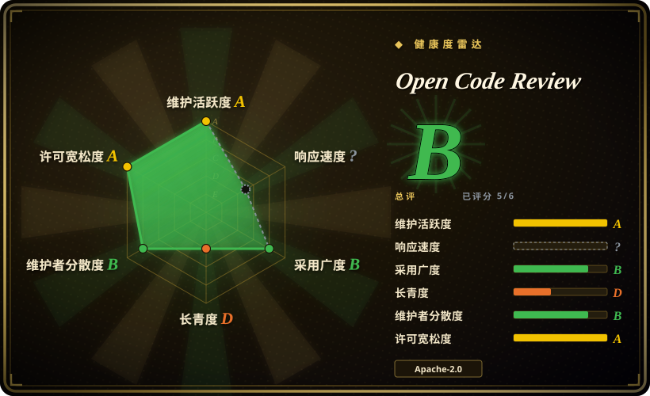
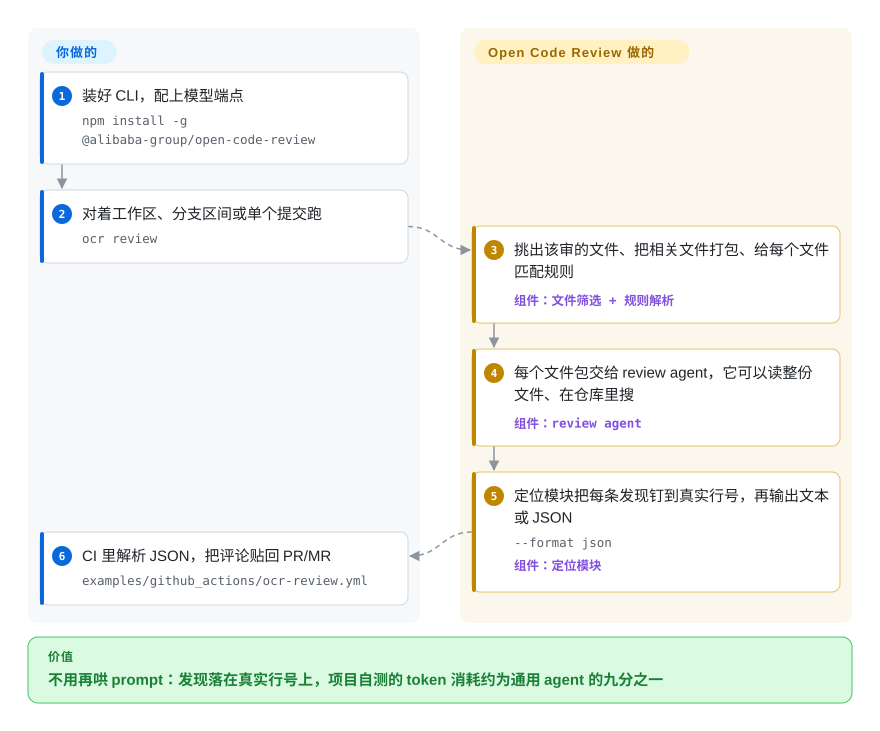

# Open Code Review

让大模型审一大坨 diff，它常常只看前几个文件就收工，留下的评论行号还常常对不上真正的问题。Open Code Review 把这件事拆开：选文件、打包、把评论钉到真实行号由确定性代码来做，模型只负责判断内容——于是含糊的「看着没问题」变成具体的 file:line 发现，token 消耗按项目自测约为通用 agent 的九分之一。

## 何时使用

你是某个 Java、Go 或 Python 服务的后端工程师，CI 在每个 PR 上都会跑，但没人真去读那份 diff：团队之前接上的 LLM skill 只看前几个文件就停，留下的评论行号对不上问题本身。你要的 reviewer 得同时做到三件事——覆盖整份变更集、把每条评论落在真实行上、宁可少说也不要拿低置信度的噪声把 PR 淹掉。你装好 `ocr` 再跑 `ocr review`：先由确定性的一遍挑出该审的文件、把相关文件打成一个包、给每个文件匹配规则，然后交给会用工具的 LLM agent 判断内容，最后独立的定位模块把每条发现钉到具体行。如果团队本来就在按订阅付费使用 AI 编程 agent，可以走 delegation 模式（`ocr delegate`），让那个 agent 自己的模型来判，OCR 侧完全不需要配 API key。

另一种合适的场景是你接手了一个陌生代码库、手上没有有意义的 diff：`ocr scan` 会把同一套流程跑在整份文件上，而不是 diff 上。两条命令都能输出 JSON，仓库里还直接带着 GitHub Actions／GitLab CI 的现成配方，把发现贴回 PR/MR（另外附 Gerrit、GitFlic、Codeup 的示例）。它是一个 Go 二进制（也能 npm 安装），带 Claude Code、Codex、Cursor、Kimi Code、OpenCode 插件和 VS Code／JetBrains 扩展，所以你不用起服务就能把它塞进现有的 agent 工作流。

## 怎么用起来

Open Code Review 就是一个你对着 diff 调用的二进制。在任何模型看到东西之前，先跑一遍确定性流程（纯代码，不调 LLM）：决定哪些文件值得审（二进制、锁文件、测试夹具、看起来像密钥的路径都会被跳过），把该放一起的文件打成一个审阅单元，再从一个四层优先链里解析出每个文件该用哪段规则——`--rule` 参数、项目里的 `.opencodereview/rule.json`、全局的 `~/.opencodereview/rule.json`，以及随二进制内置的默认规则。之后每个文件包交给一个会用工具的 LLM agent——「会用工具」的意思是它能读整份文件、能在仓库里搜，而不只是看 diff 里那几行——再由独立的定位模块把每条发现钉到真实行才输出，所以评论不会像纯 prompt 方案那样飘走。你要出的是一次安装加一个 LLM 端点（走 delegation 模式的话连这个都不用，直接借用编程 agent 自己的订阅额度）；OCR 出的是文件筛选、打包、规则匹配、调用 agent、行定位，以及文本或 JSON 信封形式的输出。如果根本没有 diff 可审，`ocr scan` 会把同一套机制跑在整份文件上。

<!-- flow-steps:begin (generated from flows/open-code-review.json by tools/flow_card.py — do not edit) -->

流程文字版

1. **你**：装好 CLI，配上模型端点 — `npm install -g @alibaba-group/open-code-review`
2. **你**：对着工作区、分支区间或单个提交跑 — `ocr review`
3. **Open Code Review**：挑出该审的文件、把相关文件打包、给每个文件匹配规则 — 组件：`文件筛选 + 规则解析`
4. **Open Code Review**：每个文件包交给 review agent，它可以读整份文件、在仓库里搜 — 组件：`review agent`
5. **Open Code Review**：定位模块把每条发现钉到真实行号，再输出文本或 JSON — `--format json` — 组件：`定位模块`
6. **你**：CI 里解析 JSON，把评论贴回 PR/MR — `examples/github_actions/ocr-review.yml`

**价值**：不用再哄 prompt：发现落在真实行号上，项目自测的 token 消耗约为通用 agent 的九分之一

<!-- flow-steps:end -->

## 何时不用

- **你想让工具自己把评论贴回 PR/MR。** CLI 只输出到 stdout（文本或 JSON），它自己不会去调 GitHub／GitLab 的接口。仓库现在提供了开箱可抄的 CI 配方，里面含回贴脚本，但写权限 token 和这一步的维护仍然是你的。想要开箱即用的回贴，应该选 [PR-Agent（Qodo）](pr-agent.zh.md) 或 CodeRabbit。`[推断]`
- **你需要高召回 / 「全都找出来」式的审计。** 它刻意以精确率换召回率（项目自己的说法是「Recall 低于通用 agent——一个刻意的取舍」）。如果你想要一张能捞出每一处可疑味道的大网，应该改用通用编程 agent（比如 Claude Code 配一个 review skill），并接受随之而来的误报。
- **你专门追安全漏洞。** 自带规则触及了几类安全问题（XSS、SQL 注入），但没有污点分析、也没有精选 CWE 目录——要把关安全就该用 [claude-code-security-review](claude-code-security-review.zh.md) 或 Semgrep（未收录）。
- **你的文件不在允许清单里。** 可审的扩展名约 113 个，其中 53 类文件/语言有专门规则；其余会落到通用的 `default.md` 规则上，数据文件和 DSL 密集的代码拿不到语言级指导——这类文件应该改用对应 DSL 的专用 linter。可以用 `ocr rules check <file>` 看你的文件实际解析成了什么。
- **每一跑都必须免费或完全离线。** 默认模式下每次 review 都要调外部（或自托管）LLM——按次付出 token 成本和延迟，diff 也会离开你的机器。如果这是硬约束，应该改用 Semgrep 这类确定性扫描器，或者自托管该端点。delegation 模式省掉了 OCR 自己的 key，但内容依然要交给编程 agent 所用的那个模型。
- **你不放心厂商出身的工具或快速迭代。** 它出自阿里，发版极快（v1.12.8，几乎每天都有新版本）；自定义规则格式和配置面与持续演进的 CLI 耦合，厂商也可能对这类工具重新排定优先级。

## 横向对比

| 替代品 | 是否收录 | 我们的评价 | 取舍 |
|---|---|---|---|
| [claude-code-security-review](claude-code-security-review.zh.md) | ✅ | 只要安全这一道闸、且必须跑成 Claude 原生的 GitHub Action，就选 claude-code-security-review；同一个 PR 还想要通用质量发现时，选 Open Code Review。 | 安全专用且 PR 原生，对比通用 review——也覆盖少量安全类，但不是扫描器。 |
| [PR-Agent（Qodo）](pr-agent.zh.md) | ✅ | 想要一个开箱就把摘要、问答、行内评论贴到 GitHub／GitLab MR 的 bot，选 PR-Agent；更看重行级精度和确定性筛选层、愿意自己在 CI 里跑回贴配方时，选 Open Code Review。 | PR-Agent 管住了 MR 集成面；Open Code Review 管住了定位流水线，但止步于 JSON。 |
| [react-doctor](react-doctor.zh.md) | ✅ | 代码库是 React、需要可重复的框架专属规则目录时选 react-doctor；需要在多语言仓库里做语言无关的语义判断时选 Open Code Review。 | 固定的 React 规则，对比跨约 113 类文件的 LLM 判断。 |
| CodeRabbit | 未收录 | 想要托管 SaaS 自动评论、召回广且零流水线胶水时选 CodeRabbit；要求 diff 不出自己的 runner、模型和规则都想自己掌控时选 Open Code Review。 | 托管、广召回、自动回贴，对比自托管、偏精确率、输出 JSON。 |
| Semgrep | 未收录 | 闸门必须是无 LLM 参与的确定性 AST/规则匹配、且不接受按次 token 成本时选 Semgrep；需要的是对意图的自然语言推理时选 Open Code Review。 | 单次快且免 token 的模式匹配，对比每次 review 都要花 token 的 agent 推理。 |

## 技术栈

- **语言：** Go（约 63%）承载 CLI／引擎；JavaScript 加 TypeScript（约 24%）覆盖浏览器端 session viewer、VS Code 扩展和 CI 回贴脚本；Kotlin（约 7%）是 JetBrains 插件。百分比取自仓库的 GitHub `languages` 接口（2026-09-22）。
- **架构：** 混合式——确定性流水线（六道闸的文件筛选，内含内置密钥路径保护；分治式文件打包；四层规则解析；独立的定位与反思模块）喂给一个会用工具的 LLM agent，配 review 场景精调的 prompt 与工具集。
- **LLM 层：** 任意 OpenAI 或 Anthropic 兼容端点、内置 provider 列表、自定义／私有网关；**delegation 模式**则把判断交给宿主编程 agent 自己的模型。
- **规则：** 内置 `system_rules.json` 默认层，加上项目级、用户级 JSON 规则文件；针对具体文件类型自带 53 份规则文档，兜底是 `default.md`。
- **接口：** CLI（`ocr review`／`scan`／`session`／`viewer`／`rules`／`config`／`llm`／`delegate`）、`--format text|json`、`--audience agent`；`localhost:5483` 上的本地 session viewer；VS Code 与 JetBrains 扩展；Claude Code／Codex／Cursor／Kimi Code／OpenCode 插件；一个 agent skill；作为 MCP *client* 接入额外上下文工具；以及 OpenTelemetry 导出。

## 依赖

- **运行时：** 单个自包含 Go 二进制（Windows/macOS/Linux），或 npm `@alibaba-group/open-code-review`，或安装脚本、GitHub Release 二进制。
- **必需：** **Git >= 2.41**（它用 Git 做 diff 生成和代码搜索），以及默认模式下的 LLM 端点与 key。delegation 模式不需要在 OCR 侧配置 LLM。
- **配置：** `~/.opencodereview/config.json`（provider、模型、MCP server）与 `~/.opencodereview/rule.json`，另可选项目级 `.opencodereview/rule.json`（可安全提交）。
- **状态：** review session 是 `~/.opencodereview/sessions/` 下的 JSONL 文件；viewer 直接读它们，没有额外依赖。
- **CI：** 仓库自带 GitHub Actions 与 GitLab CI 配方；另附 Gerrit、GitFlic、Codeup 的回贴示例。

## 运维难度

**低。** 没有服务、数据存储或常驻进程：它就是个在 CI 或本地对着 diff 调用的二进制，每次调用都无状态，因此不存在扩容／高可用问题。真正的运维变量是 LLM 依赖（端点可达性、key／密钥管理、每个 PR 的 token 成本与延迟）、CI 回贴步骤需要的写权限 token、把 JSON 规则调到适配你的仓库，以及——只有当你把 session viewer 暴露到 localhost 之外才需要考虑的——`OCR_VIEWER_ALLOWED_HOSTS` 允许清单，因为 viewer 默认拒绝通配绑定。`[推断]`

## 健康度与可持续性

- **维护：** Grade A——每天都有提交（默认分支 HEAD 停在 2026-09-22），发版几乎是每天一次（v1.12.8 于 2026-09-21；仓库 2026-05-18 才公开，已累计 100 多个 tag）。
- **响应速度——未评分（`?`）。** 有 traffic，但抽样窗口没有产生可计分的 issue／PR 首次响应，所以这一轴是未知，而不是好成绩。该盯的是未关闭 issue 数（2026-09-22 约 217 个，2026-06 时约 43 个）：采用增长带来更长的队列是正常的，但没有任何证据显示它在以快于进量的速度被清空。雷达的 `overall` 因此只聚合了 6 轴中的 5 轴——请按一个不完整的六边形来读，而不是「只差一轴满分」。
- **采用与长寿要合起来读：** 约 39.5k stars／约 2.8k forks，npm 月下载量 329,386 次（2026-09），需求信号很强，把采用这一轴从 D 拉到了 C。长寿仍是 D，因为仓库只有约 127 天：关注度不等于耐久。两轴合读就是「有人在下注」对「它还没活够久到可以放心下注」。
- **治理与背书：** Grade B——发布在 `alibaba` GitHub 组织下，带有 `GOVERNANCE.md`（描述组件归属与贡献者晋升路径）；近 12 个月约 97 位贡献者，首位贡献者约占 47% 的提交（bus factor 改善但仍集中），所以这一轴是 B 而不是 A。它是单一厂商而非基金会治理。项目还持有 **OpenSSF Best Practices「Gold」** 徽章——直接对 `bestpractices.dev` 核实（2026-09-22），所以这是外部可查的流程信号，而不是自述。
- **风险标记：** 精确率优先于召回率是刻意设计（会按设计漏掉真实问题）；近乎每天发版意味着规则与配置面可能频繁变动；默认模式下每次 review 都会把 diff 发给 LLM 并产生 token 成本；响应速度当前未测到；头部的 benchmark 是项目自测，尽管数据集是公开的。Apache-2.0，未发现 relicense 历史，也未观察到 open-core 功能闸门。

## 存疑（未验证）

- [未验证] star（约 39.5k）、fork（约 2.8k）、未关闭 issue（约 217）都是 2026-09-22 抓取的数值，时刻在变；在一个四个月大的仓库上，高 star 既是信号也是炒作风险。
- [推断] 「token 约为通用 agent 的九分之一／Precision 与 F1 更高」是项目用自家 harness 跑出的自测结果；底层 AACR-Bench 数据集是公开的，但这份对比没有在本地独立复现。
- [推断] 「它自己不回贴 PR/MR」是从文档描述「在 JSON 信封之上另起一步回贴」推出的；CI 集成是活跃开发区（GitLab 评论处理 2026-09 才刚修过），依赖前请对照当前 CLI 核实。
- [推断] 支持文件范围的说法来自仓库内允许清单（约 113 个扩展名）与自带规则文档数量（53），覆盖并不均匀——很多文件类型会落到 `default.md`。用 `ocr rules check` 核实你的技术栈。
- [未验证] 「阿里内部两年／服务数万开发者／发现数百万缺陷」这一成熟度说法是项目自己的表述，未经独立验证。
- [推断] 语言占比来自 GitHub `languages` 接口（按字节计），不是构建分析，且会随仓库变动。
- [未验证] delegation 模式与 session viewer 的描述来自项目文档（2026-09）；此处没有实际跑过，所以真实行为以及 delegation 与各宿主 agent 配额的交互方式未确认。
