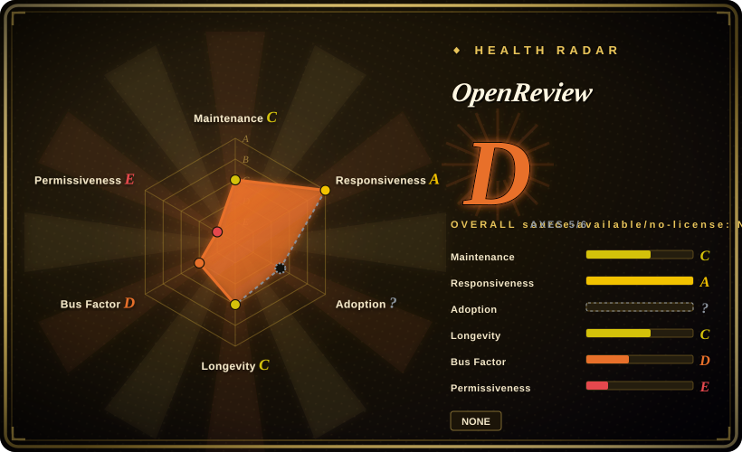
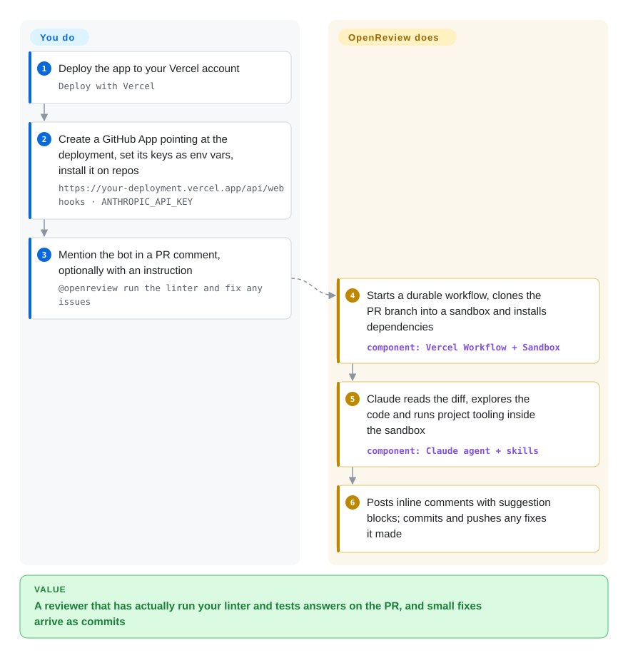

# OpenReview

You want a Claude-powered reviewer on your pull requests that can actually run your linter and tests instead of only reading the diff, and you would rather host it yourself than pay a review SaaS. OpenReview is a Next.js app you deploy to Vercel: comment `@openreview` on a PR and it clones the branch into a throwaway sandbox, lets Claude explore and run your tooling, posts inline suggestions, and can push small fixes back to the branch.

## When to use

You run a small team's GitHub repos on Vercel already, and the AI review you tried only reads the diff: it tells you a function "might not handle null" without checking, and it can't notice that `bun run lint` fails on the PR. You don't want every PR to get a wall of bot comments either — you want to ask for a review when you are ready, sometimes with a specific question ("@openreview check for security vulnerabilities", "@openreview run the linter and fix any issues"). OpenReview fits that: a mention in a PR comment starts a review in a Vercel Sandbox — an isolated, short-lived machine Vercel spins up for the job — with the repo cloned and dependencies installed, so the agent can run commands, then answer with line-level GitHub suggestion blocks you can accept by reacting 👍.

Choose it over a GitHub-Action reviewer such as [Claude Code Security Review](claude-code-security-review.md) or [PR-Agent](pr-agent.md) when the deciding factor is *a reviewer that executes your project's tooling and can commit fixes, on infrastructure you own*. The price is that "your own infrastructure" means Vercel specifically (Sandbox and Workflow are Vercel services), the model is hard-wired to Claude, and the project is a beta that the README itself calls an internal Vercel experiment. Treat it as a well-built reference app to fork rather than a product to depend on.

## How it works

OpenReview is a web app with one important endpoint, `/api/webhooks`, that a GitHub App you create calls whenever someone comments on a PR. **The app ships the whole loop — webhook handling, sandbox lifecycle, the Claude agent and its tools, review skills, posting and pushing — you supply the deployment, the GitHub App, and the keys.** When the comment mentions `@openreview`, a durable workflow (Vercel Workflow: a job runner that resumes where it stopped if a step crashes) checks push access, creates a sandbox, clones the PR branch, installs dependencies and hands Claude Sonnet 4.6 the PR context. The agent reads files and runs linters or tests inside the sandbox, posts its findings as inline comments with suggestion blocks, and if it changed files (formatting, lint fixes, simple bugs) the workflow commits and pushes them to the PR branch before tearing the sandbox down. Review know-how comes from *skills* — Markdown instruction files in `.agents/skills/` that the agent only loads when a request matches their description; the bundled ones are Next.js/React/Vercel-centric, and you add your own as new folders.

<!-- flow-steps:begin (generated from flows/openreview.json by tools/flow_card.py — do not edit) -->

Text version of the flow

1. **You**: Deploy the app to your Vercel account — `Deploy with Vercel`
2. **You**: Create a GitHub App pointing at the deployment, set its keys as env vars, install it on repos — `https://your-deployment.vercel.app/api/webhooks · ANTHROPIC_API_KEY`
3. **You**: Mention the bot in a PR comment, optionally with an instruction — `@openreview run the linter and fix any issues`
4. **OpenReview**: Starts a durable workflow, clones the PR branch into a sandbox and installs dependencies — component: `Vercel Workflow + Sandbox`
5. **OpenReview**: Claude reads the diff, explores the code and runs project tooling inside the sandbox — component: `Claude agent + skills`
6. **OpenReview**: Posts inline comments with suggestion blocks; commits and pushes any fixes it made

**Value**: A reviewer that has actually run your linter and tests answers on the PR, and small fixes arrive as commits

<!-- flow-steps:end -->

## When NOT to use

- **Your code is not on GitHub.** It only speaks GitHub webhooks through a GitHub App; GitLab and TFS requests sit open as issues. Use [PR-Agent](pr-agent.md), which covers GitLab, Bitbucket, Azure DevOps and Gitea, or [Open Code Review](open-code-review.md)'s CI recipes.
- **You can't or won't run on Vercel.** Sandbox and Workflow are Vercel services; a community "De-Vercelify" PR was closed unmerged in 2026-03. For a reviewer that runs on stock CI runners, use [Claude Code Security Review](claude-code-security-review.md) (security only) or PR-Agent as a GitHub Action.
- **You need a model other than Claude, or a gateway.** The model string is hard-coded in `lib/agent.ts` (`anthropic/claude-sonnet-4.6`); issues asking for other providers have been open since 2026-03 and a gateway PR is unmerged. PR-Agent and Open Code Review let you pick the provider.
- **You need a license you can rely on.** There is no LICENSE file; the README's one-word "MIT" is the only grant, and the "Missing License" issue opened 2026-08-13 is unanswered. Without a license file, legal review will treat it as all-rights-reserved — fork it only after Vercel adds one, or pick the MIT-licensed PR-Agent.
- **You need automatic review on every PR.** It is on-demand by design (mention-triggered); review on PR creation is an open feature request. PR-Agent and the Claude Code Security Review Action run on `pull_request` events.
- **You need a maintained dependency.** All 77 commits came from one author between 2026-03-02 and 2026-03-06 and nothing has landed since; the README labels it beta with breaking changes expected. If you adopt it, fork and own it.
- **Untrusted contributors can comment on your PRs.** The agent runs repository code (installs, linters, tests) and holds a token that can push to PR branches; its pre-flight "push access" check is about the App's access to the branch, not about who commented. Anyone who can comment `@openreview` on a malicious PR exercises that. Restrict the GitHub App to repos where commenters are trusted, or use a read-only reviewer such as Open Code Review.

## Comparison

| Alternative | In index | Our verdict | Tradeoff |
|---|---|---|---|
| [PR-Agent](pr-agent.md) | ✅ | Choose PR-Agent when you need multi-host support, a provider of your choice, or automatic review on every PR; choose OpenReview when you want the reviewer to run your tooling in a sandbox and push fixes, on Vercel. | PR-Agent is a mature, multi-maintainer MIT tool that reviews from the diff with any LLM; OpenReview executes code in a sandbox but is GitHub-, Vercel- and Claude-only. |
| [Claude Code Security Review](claude-code-security-review.md) | ✅ | Choose it when the gate is security findings on trusted PRs and you want nothing to host; choose OpenReview for general, on-demand review that can also fix code. | A stateless GitHub Action with a security prompt and false-positive filter vs. a deployed app with sandboxes, durable workflows and commit access. |
| [Open Code Review](open-code-review.md) | ✅ | Choose Open Code Review when you want precise file:line findings from a CLI in any CI, with any model and no server; choose OpenReview when you want a conversational `@mention` bot that runs commands. | A single binary in your pipeline with deterministic file selection vs. a hosted bot that explores the repo interactively. |
| [Metis](metis.md) | ✅ | Choose Metis for deep security review of a whole codebase (including legacy C) with finding triage; choose OpenReview for interactive PR review on a web stack. | Security-scan depth across files vs. PR-scoped, mention-driven help with fixes. |
| anthropics/claude-code-action | 未收录 | Choose claude-code-action when you want Claude answering `@claude` on PRs inside GitHub Actions with no deployment; choose OpenReview when you want that behaviour self-hosted with Vercel's sandbox and durable workflow. | Both are Claude-on-mention; the Action rides Actions runners and supports subscription tokens, OpenReview needs a Vercel project, a GitHub App and an API key. |

## Tech stack

- **Language / framework:** TypeScript, Next.js 16 (App Router route handlers), React 19, Tailwind; Bun as package manager.
- **Execution:** Vercel Workflow (`workflow` 4.1 beta) for durable, resumable runs; Vercel Sandbox (`@vercel/sandbox`) for the isolated clone-install-run environment.
- **AI:** AI SDK v6 with the model id `anthropic/claude-sonnet-4.6`; a skill loader (`loadSkill`) reads `.agents/skills/*/SKILL.md` on demand.
- **GitHub integration:** Chat SDK (`chat` + `@chat-adapter/github`) for webhook/comment handling, Octokit for the API; state via `@chat-adapter/state-redis` or in-memory.

## Dependencies

- **Vercel account** with Sandbox and Workflow — both are metered Vercel services, not bundled software.
- **A GitHub App you create** (Contents, Issues and Pull requests read & write; subscribed to issue-comment and PR-review-comment events), with its App ID, installation ID, private key and webhook secret as env vars.
- **Anthropic API key** (`ANTHROPIC_API_KEY`); every review is billed model usage.
- **Redis** (`REDIS_URL`) — optional; without it, state is kept in memory and lost between instances.

## Ops difficulty

**Medium.** The deploy itself is a one-click Vercel clone, but you own a GitHub App (key rotation, permissions that include writing to repos), three cost meters (Vercel Sandbox, Vercel Workflow, Anthropic tokens) and a beta codebase with pinned beta dependencies that upstream no longer updates — so upgrades of Next.js, Workflow or the Sandbox SDK are your job. Debugging a failed review means reading Vercel Workflow run logs. Moving off Vercel is a rewrite of the execution layer, not a config change.

## Health & viability

- **Maintenance (2026-10-08):** a five-day build sprint (2026-03-02 to 2026-03-06), then no commits to `main` for seven months, no releases, and a README beta warning. Issues and PRs keep arriving (latest 2026-09-21) and none of the substantive ones has been merged. Reads as a **finished demo, not a maintained product**.
- **Governance / bus factor:** owned by the `vercel-labs` org, but every commit is from one person — a single-maintainer project inside an experiments org, with no roadmap or CONTRIBUTING file.
- **Backing & Lindy:** Vercel built it "to help the Vercel team test their technologies together", i.e. as a showcase for Sandbox, Workflow and the AI SDK. Seven months old and dormant for six of them: no Lindy credit.
- **Adoption:** ~1.7k stars and 121 forks (2026-10-08) show interest, and the fork count suggests people take it as a template; there is no package to measure dependents.
- **Risk flags:** no LICENSE file (README says MIT; the "Missing License" issue is unanswered) — the health radar caps the overall grade for it. Hard dependency on Vercel services and on one model vendor.

## Caveats (unverified)

- [未验证] The README's "License: MIT" line is the only license statement; whether it is legally sufficient without a LICENSE file is a question for your counsel, not something this page can settle.
- [推断] `GITHUB_APP_INSTALLATION_ID` is a single env var, which suggests one deployment serves one GitHub App installation (one org/user's repos); not tested here.
- [推断] The untrusted-commenter risk is read from source at commit `672deb2`: `workflow/index.ts` calls `checkPushAccess(repoFullName, prBranch)` (the App's access to the branch), and a search of `lib/bot.ts` found no check on the commenter's permission. Mitigations elsewhere in the code, or in GitHub App settings, were not ruled out; the repo publishes no threat model.
- [未验证] Per-review cost (Sandbox minutes, Workflow steps, Claude tokens) is not published; it depends on repo size, install time and how much the agent runs.
- [未验证] The model id `anthropic/claude-sonnet-4.6` is read from `lib/agent.ts` at commit `672deb2`; whether it routes through Vercel AI Gateway or straight to Anthropic depends on env configuration (an open PR from 2026-03 is about clarifying that).
- [推断] Stars and forks (~1.7k / 121 on 2026-10-08) are interest signals; no production users are documented.
