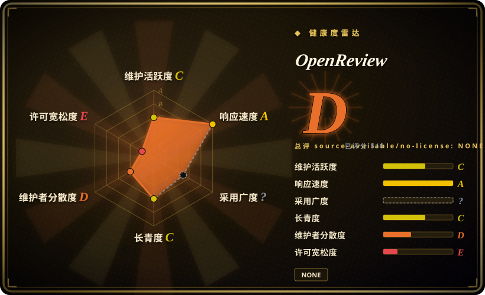
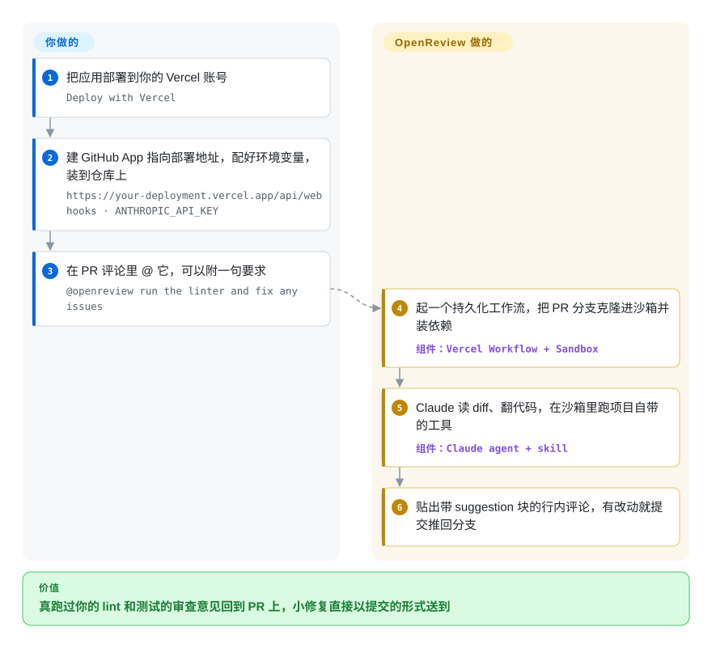

# OpenReview

你想让 PR 上的 AI 审查真去跑一遍你的 lint 和测试，而不是只盯着 diff 猜，又不想为此买一个审查 SaaS。OpenReview 是一个部署到 Vercel 的 Next.js 应用：在 PR 里评论 `@openreview`，它把分支克隆进一台用完即扔的沙箱，让 Claude 在里面翻代码、跑工具，贴出行内修改建议，还能把小修复直接推回分支。

## 何时使用

你们是个小团队，代码在 GitHub，本来就用 Vercel。之前试过的 AI 审查只读 diff：它说某个函数“可能没处理 null”，却不去验证，也发现不了这个 PR 上 `bun run lint` 根本过不了。你也不想每个 PR 都被机器人评论刷屏，而是想在自己准备好时再叫它，有时还带个具体问题（“@openreview check for security vulnerabilities”“@openreview run the linter and fix any issues”）。OpenReview 正好是这个形态：在 PR 评论里 @ 它，就在 Vercel Sandbox 里开始一次审查——Sandbox 是 Vercel 临时起的一台隔离机器——仓库已克隆、依赖已装好，agent 能真的跑命令，最后用 GitHub 的 suggestion 代码块给出行级建议，你点个 👍 就能采纳。

跟 [Claude Code Security Review](claude-code-security-review.zh.md)、[PR-Agent](pr-agent.zh.md) 这类 GitHub Action 审查器相比，选它的决定性理由是：**审查者会执行你项目的工具链、能提交修复，而且跑在你自己的基础设施上**。代价是“自己的基础设施”特指 Vercel（Sandbox 和 Workflow 都是 Vercel 的服务），模型写死为 Claude，而且 README 自己说这是 Vercel 内部试验出来的 beta。把它当成一个写得不错、拿来 fork 的参考应用，而不是可以长期依赖的产品。

## 怎么用起来

OpenReview 是个 Web 应用，关键只有一个端点 `/api/webhooks`：你自建的 GitHub App 在有人评论 PR 时就调它。**整条链路——接 webhook、管沙箱生命周期、Claude agent 和它的工具、审查 skill、发评论和推代码——都在应用里；你出的是部署、GitHub App 和各种 key。** 评论里 @ 了 `@openreview`，一个持久化工作流（Vercel Workflow：步骤崩了能从断点接着跑的任务执行器）先检查推送权限，再建沙箱、克隆 PR 分支、装依赖，把 PR 上下文交给 Claude Sonnet 4.6。agent 在沙箱里读文件、跑 lint 或测试，把发现写成带 suggestion 块的行内评论；要是它改了文件（格式、lint、简单 bug），工作流就提交并推回 PR 分支，最后销毁沙箱。审查经验来自 skill——放在 `.agents/skills/` 里的 Markdown 指令文件，只有请求对上它的描述时 agent 才加载；自带的几个偏 Next.js/React/Vercel，你可以加自己的文件夹。

<!-- flow-steps:begin (generated from flows/openreview.json by tools/flow_card.py — do not edit) -->

流程文字版

1. **你**：把应用部署到你的 Vercel 账号 — `Deploy with Vercel`
2. **你**：建 GitHub App 指向部署地址，配好环境变量，装到仓库上 — `https://your-deployment.vercel.app/api/webhooks · ANTHROPIC_API_KEY`
3. **你**：在 PR 评论里 @ 它，可以附一句要求 — `@openreview run the linter and fix any issues`
4. **OpenReview**：起一个持久化工作流，把 PR 分支克隆进沙箱并装依赖 — 组件：`Vercel Workflow + Sandbox`
5. **OpenReview**：Claude 读 diff、翻代码，在沙箱里跑项目自带的工具 — 组件：`Claude agent + skill`
6. **OpenReview**：贴出带 suggestion 块的行内评论，有改动就提交推回分支

**价值**：真跑过你的 lint 和测试的审查意见回到 PR 上，小修复直接以提交的形式送到

<!-- flow-steps:end -->

## 何时不用

- **代码不在 GitHub。** 它只通过 GitHub App 接 GitHub 的 webhook；GitLab、TFS 的需求都还挂在 issue 里。改用支持 GitLab、Bitbucket、Azure DevOps、Gitea 的 [PR-Agent](pr-agent.zh.md)，或 [Open Code Review](open-code-review.zh.md) 的 CI 配方。
- **你不能或不想跑在 Vercel 上。** Sandbox 和 Workflow 都是 Vercel 的服务；社区提的“De-Vercelify”PR 在 2026-03 被关掉、没合。想在普通 CI runner 上跑，用 [Claude Code Security Review](claude-code-security-review.zh.md)（只管安全）或以 GitHub Action 方式跑 PR-Agent。
- **你要用 Claude 以外的模型或走网关。** 模型名写死在 `lib/agent.ts`（`anthropic/claude-sonnet-4.6`）；要求支持其他供应商的 issue 从 2026-03 开着到现在，网关相关的 PR 也没合。PR-Agent 和 Open Code Review 都能自选供应商。
- **你需要一份靠得住的许可证。** 仓库里没有 LICENSE 文件，唯一的授权是 README 里一个词“MIT”，2026-08-13 有人开的“Missing License” issue 没人回。没有许可证文件，法务会按“保留所有权利”处理——等 Vercel 补上再 fork，或者选 MIT 许可的 PR-Agent。
- **你要每个 PR 自动审。** 它按设计只在被 @ 时运行；“PR 一创建就审”是个还开着的功能请求。PR-Agent 和 Claude Code Security Review 的 Action 都挂在 `pull_request` 事件上。
- **你需要一个有人维护的依赖。** 全部 77 个提交出自同一个人，集中在 2026-03-02 到 2026-03-06，之后再无合入；README 标着 beta、预告会有破坏性变更。真要用，就 fork 下来自己养。
- **不受信任的人能在你的 PR 上评论。** agent 会执行仓库代码（装依赖、跑 lint、跑测试），还握着能往 PR 分支推送的令牌；它开跑前的“推送权限”检查查的是 App 对分支的权限，不是评论者是谁。谁能在恶意 PR 上评论 `@openreview`，谁就能动用这些能力。把 GitHub App 只装在评论者可信的仓库上，或改用只读的 Open Code Review。

## 横向对比

| 替代品 | 是否收录 | 我们的评价 | 取舍 |
|---|---|---|---|
| [PR-Agent](pr-agent.zh.md) | ✅ | 需要多代码托管平台、自选模型供应商、或每个 PR 自动审时选 PR-Agent；想让审查者在沙箱里跑你的工具并推修复、且接受 Vercel 时选 OpenReview。 | PR-Agent 成熟、多人维护、MIT，任意 LLM 读 diff 审查；OpenReview 能在沙箱里执行代码，但只支持 GitHub、Vercel 和 Claude。 |
| [Claude Code Security Review](claude-code-security-review.zh.md) | ✅ | 闸门是“可信 PR 上的安全发现”、又不想托管任何东西时选它；要通用的、按需的、还能改代码的审查时选 OpenReview。 | 无状态的 GitHub Action，带安全提示词和误报过滤；对面是要部署的应用，带沙箱、持久化工作流和提交权限。 |
| [Open Code Review](open-code-review.zh.md) | ✅ | 想在任意 CI 里用命令行拿到精确到文件和行号的发现、任意模型、无服务端时选 Open Code Review；想要能对话、会跑命令的 `@` 机器人时选 OpenReview。 | 流水线里的单个二进制、确定性挑文件；对面是一个交互式翻仓库的托管机器人。 |
| [Metis](metis.zh.md) | ✅ | 要对整个代码库（包括老 C 代码）做深度安全审查并分诊发现时选 Metis；要在 Web 技术栈上做交互式 PR 审查时选 OpenReview。 | 跨文件的安全扫描深度，对比以 PR 为范围、@ 才动、还能帮你修。 |
| anthropics/claude-code-action | 未收录 | 想在 GitHub Actions 里让 Claude 回应 PR 上的 `@claude`、不部署任何东西时选它；想把同样的行为放到自己托管的 Vercel 沙箱和持久化工作流里时选 OpenReview。 | 两者都是“@ 一下 Claude 就干活”；Action 跑在 Actions runner 上、支持订阅令牌，OpenReview 需要 Vercel 项目、GitHub App 和 API key。 |

## 技术栈

- **语言 / 框架：** TypeScript，Next.js 16（App Router 路由处理器），React 19，Tailwind；包管理用 Bun。
- **执行层：** Vercel Workflow（`workflow` 4.1 beta）负责可续跑的持久化执行；Vercel Sandbox（`@vercel/sandbox`）提供克隆、安装、运行用的隔离环境。
- **AI：** AI SDK v6，模型 id 为 `anthropic/claude-sonnet-4.6`；skill 加载器（`loadSkill`）按需读取 `.agents/skills/*/SKILL.md`。
- **GitHub 集成：** Chat SDK（`chat` + `@chat-adapter/github`）处理 webhook 和评论，Octokit 调 API；状态存 `@chat-adapter/state-redis` 或内存。

## 依赖

- **Vercel 账号**，开通 Sandbox 和 Workflow——两者都是按量计费的 Vercel 服务，不是随包附带的软件。
- **你自建的 GitHub App**（Contents、Issues、Pull requests 读写；订阅 issue 评论和 PR review 评论事件），把 App ID、安装 ID、私钥、webhook secret 配成环境变量。
- **Anthropic API key**（`ANTHROPIC_API_KEY`）；每次审查都按模型用量计费。
- **Redis**（`REDIS_URL`）——可选；不配就存内存，实例之间不共享、会丢。

## 运维难度

**中。** 部署本身是 Vercel 一键克隆，但你要养一个 GitHub App（轮换私钥、管住包含“写仓库”在内的权限）、盯三块账单（Vercel Sandbox、Vercel Workflow、Anthropic token），还要接手一份钉着多个 beta 依赖、上游已不再更新的 beta 代码——Next.js、Workflow、Sandbox SDK 的升级都得你来。审查失败时要去翻 Vercel Workflow 的运行日志。想离开 Vercel，就得重写执行层，不是改个配置的事。

## 健康度与可持续性

- **维护（2026-10-08）：** 五天的集中开发（2026-03-02 到 2026-03-06），之后七个月 `main` 上再无提交，没有 release，README 挂着 beta 提示。issue 和 PR 还在陆续进来（最近一条 2026-09-21），实质性的一个都没合。读作**做完了的演示，而不是在维护的产品**。
- **治理 / 巴士因子：** 挂在 `vercel-labs` 组织下，但所有提交都出自同一个人——试验性组织里的单人项目，没有路线图，也没有 CONTRIBUTING。
- **背书与 Lindy：** Vercel 做它是为了“让 Vercel 团队把自家技术放在一起试一试”，即 Sandbox、Workflow、AI SDK 的展示品。七个月大，其中六个月不动：谈不上 Lindy。
- **采用：** 2026-10-08 约 1.7k star、121 个 fork，说明有人关注，fork 数也暗示大家把它当模板用；没有发布包，测不了依赖方数量。
- **风险标记：** 没有 LICENSE 文件（README 写 MIT，“Missing License” issue 无人回应）——健康度雷达因此封顶了总分。硬绑 Vercel 服务和单一模型供应商。

## 存疑（未验证）

- [未验证] README 里那行“License: MIT”是唯一的许可声明；没有 LICENSE 文件时它在法律上够不够，要问你的法务，本页定不了。
- [推断] `GITHUB_APP_INSTALLATION_ID` 只有一个环境变量，意味着一次部署只服务一个 GitHub App 安装（一个组织或用户的仓库）；此处未实测。
- [推断] “不受信任的评论者”风险读自提交 `672deb2` 的源码：`workflow/index.ts` 调的是 `checkPushAccess(repoFullName, prBranch)`（App 对分支的权限），在 `lib/bot.ts` 里没搜到对评论者权限的检查。代码别处或 GitHub App 设置里是否另有防护，没有排除；仓库也没发布威胁模型。
- [未验证] 单次审查的成本（Sandbox 时长、Workflow 步数、Claude token）没有公开数据，取决于仓库大小、安装耗时和 agent 跑了多少命令。
- [未验证] 模型 id `anthropic/claude-sonnet-4.6` 读自提交 `672deb2` 的 `lib/agent.ts`；它走 Vercel AI Gateway 还是直连 Anthropic 取决于环境配置（2026-03 有个还开着的 PR 就是要讲清这件事）。
- [推断] star 和 fork（2026-10-08 约 1.7k / 121）只是关注度信号；没有找到公开的生产用户。
