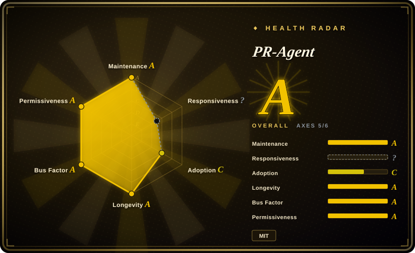
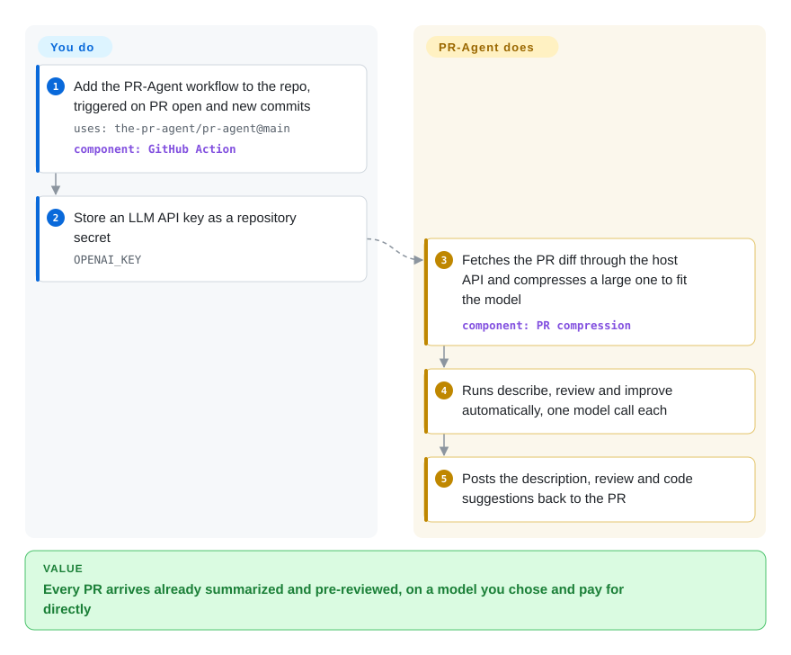

# PR-Agent

Pull requests sit for a day with an empty description and a "LGTM" from someone who skimmed two files. PR-Agent is a bot you add to the repo that reads every PR the moment it opens and posts a written description, a review, and concrete code suggestions as comments — using whichever LLM you give it a key for.

## When to use

You lead a team of five to thirty engineers on GitHub, GitLab, Bitbucket, Azure DevOps or Gitea. PRs land with a title like `fix stuff` and no description; reviewers open them cold, and half the review round-trips are "what is this for?". You want every PR to arrive already summarized and pre-reviewed, you want to pick the model and pay the provider directly, and you don't want to send your code to yet another SaaS vendor. You add one workflow file (or a webhook for the non-GitHub hosts) plus an API key, and from the next PR on a bot comment shows up with a generated description, a review that flags risky changes and missing tests, and a list of suggested patches.

Pick it over a hosted reviewer such as CodeRabbit or Qodo when self-hosting and model choice are the point: PR-Agent runs in your CI or your own container, talks to any model LiteLLM can reach (OpenAI, Anthropic, Gemini, Bedrock, Azure, a local Ollama), and its prompts live in a TOML config you can edit. Pick it over a CLI-only reviewer such as Open Code Review when you want the posting, the slash-command chat (`/ask`, `/improve`) and multi-host support handled for you rather than wired into CI yourself.

## How it works

PR-Agent is a set of "tools" — `describe`, `review`, `improve`, `ask` and a few more — each of which is essentially one prompt sent to an LLM with the PR's diff attached. **What it does for you:** it fetches the PR through the git host's API (no checkout of the code), squeezes a large diff into the model's context window with its "PR compression" step — dropping and summarizing hunks until it fits — makes one model call per tool, and posts the answer back as PR comments or code suggestions. Run as a GitHub Action, it fires `describe`, `review` and `improve` automatically when a PR opens or gets new commits, and any of them can be re-run by typing the slash command in a PR comment. **What you do:** add the workflow (or webhook / container), supply an LLM key and a git token, and optionally override settings — model, which tools auto-run, how many suggestions — as environment variables or a `.pr_agent.toml` in the repo, and (opt-in) point it at a folder of `SKILL.md` review-guidance files that get injected into every prompt.

<!-- flow-steps:begin (generated from flows/pr-agent.json by tools/flow_card.py — do not edit) -->

Text version of the flow

1. **You**: Add the PR-Agent workflow to the repo, triggered on PR open and new commits — `uses: the-pr-agent/pr-agent@main` — component: `GitHub Action`
2. **You**: Store an LLM API key as a repository secret — `OPENAI_KEY`
3. **PR-Agent**: Fetches the PR diff through the host API and compresses a large one to fit the model — component: `PR compression`
4. **PR-Agent**: Runs describe, review and improve automatically, one model call each
5. **PR-Agent**: Posts the description, review and code suggestions back to the PR

**Value**: Every PR arrives already summarized and pre-reviewed, on a model you chose and pay for directly

<!-- flow-steps:end -->

## When NOT to use

- **You want a review that understands the whole codebase, not just the diff.** Each call sees the compressed diff plus some surrounding lines and any linked ticket — there is no repository index. The README itself points to Qodo's hosted platform for the "context-aware" experience — use Qodo or CodeRabbit (both hosted, not repos) if cross-file context matters more than self-hosting.
- **You want precise, line-anchored findings with low noise.** Its review is a single prompt over a compressed diff, so comments can be generic. Use [Open Code Review](open-code-review.md), which selects files deterministically and pins each finding to a real line, and accept wiring the posting step yourself.
- **Your goal is a security gate.** PR-Agent reviews for general quality. For vulnerability-focused review with a false-positive filter use [Claude Code Security Review](claude-code-security-review.md), or a SAST tool such as Semgrep.
- **Your legal review needs a stable license.** The LICENSE file changed three times in 14 months: AGPL-3.0 (2025-05-22), Apache-2.0 (2026-05-20), MIT (2026-07-09). It is permissive today, but pin a version and check LICENSE at the tag you ship; if you need a long, stable licensing record, prefer a tool without that history.
- **Code may not leave your network and you have no capable local model.** Every tool call ships the diff to the LLM endpoint you configure. A local model through Ollama keeps the code in-house, but review quality then depends on that model; if neither is acceptable, stay with human review plus linters.
- **You need PRs from forks reviewed with secrets.** Fork PRs only get the API key under `pull_request_target`, which runs with the base repo's secrets on untrusted PR text. If that exposure is unacceptable, run PR-Agent from the CLI on demand (`pr-agent --pr_url … review`) instead of automatically.

## Comparison

| Alternative | In index | Our verdict | Tradeoff |
|---|---|---|---|
| [Open Code Review](open-code-review.md) | ✅ | When line accuracy and low noise matter most, pick Open Code Review; pick PR-Agent when you want a bot that posts descriptions, reviews and slash-command answers on several git hosts out of the box. | OCR's deterministic file selection and line pinning beat PR-Agent's one-prompt-per-tool review on precision, but OCR stops at JSON and you build the posting step. |
| [Claude Code Security Review](claude-code-security-review.md) | ✅ | For a security-only gate on PRs, pick Claude Code Security Review; pick PR-Agent for general description, review and improvement suggestions with any model. | CCSR is tuned for vulnerabilities and Claude only; PR-Agent is model-agnostic and general-purpose but has no security-specific false-positive filter. |
| [OpenReview](openreview.md) | ✅ | If your stack already runs on Vercel and you want a bot deployed there, evaluate OpenReview; choose PR-Agent when you want a mature, multi-host bot that runs in plain CI or Docker. | PR-Agent has three years of releases and five git hosts; OpenReview is a young Vercel-labs project whose page here is still a first-pass intake. |
| CodeRabbit | not a repo | Choose CodeRabbit when you'd rather pay for a hosted reviewer with repository context and no infra; choose PR-Agent when code must stay on infrastructure and models you control. | Hosted SaaS: no ops and richer context, but your code goes to a third party and the prompts are not yours to edit. |
| Qodo (hosted platform) | not a repo | Choose Qodo when you want the context-aware successor PR-Agent's README points to; choose PR-Agent for a self-hosted, editable, single-call reviewer. | Qodo is the commercial product that PR-Agent was spun out of; more features, but closed and vendor-hosted. |

## Tech stack

- **Language / runtime:** Python ≥ 3.12 (`pyproject.toml`), packaged on PyPI as `pr-agent` and as the Docker image `pragent/pr-agent` (releases 0.34.2+; the old `codiumai/pr-agent` namespace is frozen at v0.31).
- **LLM layer:** LiteLLM for provider routing, plus the `openai` and `anthropic` SDKs and `tiktoken` for token counting.
- **Server modes:** FastAPI / Starlette with uvicorn or gunicorn for the webhook apps; a GitHub Action runner for CI; a CLI (`pr-agent --pr_url …`).
- **Config:** Dynaconf-loaded TOML (`pr_agent/settings/configuration.toml`), overridable per repo and by environment variables.
- **Telemetry:** OpenTelemetry and a Prometheus `/metrics` endpoint on the webhook apps; optional Langfuse tracing.

## Dependencies

- **An LLM API key** (or a reachable local model via LiteLLM). The shipped default `model` is an OpenAI model; change it in config to use Anthropic, Gemini, Bedrock, Azure OpenAI, Ollama and others.
- **A git-host token** with permission to comment on PRs: the built-in `GITHUB_TOKEN` in the Action, or an app/bot token for GitLab, Bitbucket, Azure DevOps or Gitea webhooks.
- **A place to run:** GitHub Actions runners (no server), or a container/host for the webhook server if you use a non-GitHub host or want an always-on app.
- **No database.** State lives in the PR comments; nothing is persisted between runs.

## Ops difficulty

**Low** as a GitHub Action: one YAML file and one secret, nothing to keep running. **Medium** as a self-hosted webhook app for GitLab/Bitbucket/Azure DevOps: you run and expose a container, manage a bot token, and keep the image updated. The recurring cost is the LLM bill — three model calls per PR push with the default auto-run set — and the operational work is tuning prompts and noise, plus tracking a fast release cadence (roughly every one to three weeks) that sometimes disables a tool (`/help_docs` has been off since v0.36.1 over a credential-exposure issue).

## Health & viability

- **Maintenance (2026-10-08):** very active — v0.43.0 through v0.47.0 shipped between 2026-08-22 and 2026-10-02, and the default branch had commits today.
- **Governance — A, spread out:** re-scored on 2026-10-08, 39 active maintainers in 12 months, top contributor 16.6% and top three 47% of commits. Context: the repo moved from Qodo to a community org (`The-PR-Agent`); `pyproject.toml` names two maintainers (Naor Peled, community; Ofir Friedman, Qodo), and recent commits come from a spread of community contributors rather than Qodo staff. The README says a foundation donation is in progress. Bus factor is real but young: the hand-off is months old.
- **Backing & Lindy:** created 2023-07 (about 3.3 years), active the whole time. Qodo still sponsors it, but it is now explicitly the "legacy" open-source project next to Qodo's commercial platform — the vendor's roadmap no longer runs through this repo.
- **Adoption:** ~13.3k stars and 30,654 PyPI downloads in the last month (radar, 2026-10-08); widely referenced as the default open-source PR bot.
- **Risk flags:** three license changes in 14 months (AGPL → Apache → MIT); the Docker namespace moved; a security-related feature (`/help_docs`) is disabled pending a fix.

## Caveats (unverified)

- [未验证] The README's "~30 seconds, low cost" per tool call is a project claim; actual latency and cost depend on model and PR size.
- [推断] Releases tagged between 2025-05-22 and 2026-05-20 were cut while the LICENSE file read AGPL-3.0; inferred from the LICENSE commit history, not from each release tarball.
- [未验证] The foundation donation mentioned in the README had no named foundation or date as of 2026-10-08.
- [推断] Review comments being "generic" on large PRs follows from the one-call-per-tool design plus diff compression; not measured here.
- [未验证] Gitea support and the full per-host feature matrix were taken from the README/docs list, not tested.
