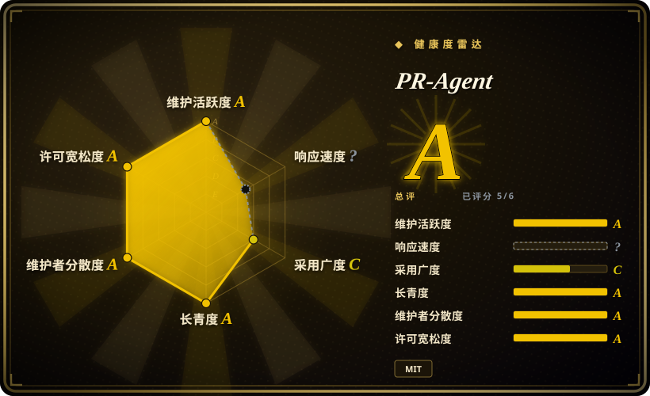
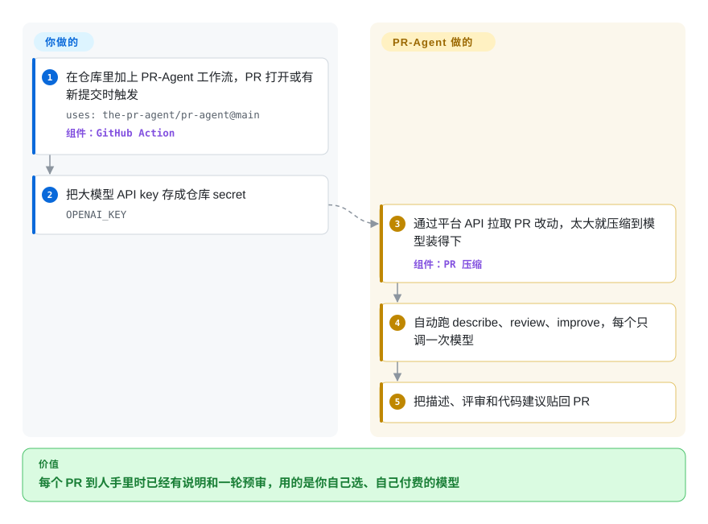

# PR-Agent

PR 挂了一天，描述是空的，评审只有一句“LGTM”，评审人其实只扫了两个文件。PR-Agent 是加进仓库的一个机器人：PR 一打开就读完改动，把说明、评审意见和具体的代码修改建议作为评论贴上去，用的是你提供 key 的那个大模型。

## 何时使用

你带一个五到三十人的团队，代码放在 GitHub、GitLab、Bitbucket、Azure DevOps 或 Gitea 上。PR 标题经常是 `fix stuff`，描述空着；评审人每次都得从零读起，一半的来回都是在问“这是干嘛的”。你希望每个 PR 进来时已经有一段说明和一轮预审，模型由你自己挑、费用直接付给模型厂商，代码也不想再交给又一家 SaaS。你加一个工作流文件（非 GitHub 平台就配一个 webhook）和一个 API key，从下一个 PR 开始，机器人评论里就会出现生成的说明、一份点出高风险改动和缺失测试的评审，以及一组建议补丁。

和 CodeRabbit、Qodo 这类托管评审服务比，当“自己部署、自己选模型”是重点时选它：PR-Agent 跑在你的 CI 或你自己的容器里，能接 LiteLLM 能连上的任何模型（OpenAI、Anthropic、Gemini、Bedrock、Azure、本地 Ollama），提示词放在一个可以改的 TOML 配置里。和 Open Code Review 这种只给命令行输出的评审工具比，当你希望贴评论、PR 里的斜杠命令对话（`/ask`、`/improve`）和多平台支持都由工具包办、而不是自己在 CI 里拼时，选它。

## 怎么用起来

PR-Agent 由一组“工具”组成——`describe`、`review`、`improve`、`ask` 等——每个工具本质上就是带着 PR 改动发给大模型的一条提示词。**它替你做的：**通过代码托管平台的 API 拉取 PR（不需要把代码检出到本地），用“PR 压缩”把大改动塞进模型的上下文窗口（上下文窗口就是模型一次能读的文本上限；压缩会丢掉或概括部分代码块直到装得下），每个工具调一次模型，再把结果作为 PR 评论或代码建议贴回去。以 GitHub Action 运行时，PR 打开或有新提交就自动跑 `describe`、`review`、`improve`，任何一个都可以在 PR 评论里敲对应的斜杠命令重跑。**你要做的：**加工作流（或 webhook、容器），提供大模型 key 和平台 token，按需用环境变量或仓库里的 `.pr_agent.toml` 覆盖设置——用哪个模型、哪些工具自动跑、给几条建议；还可以（默认关闭）指定一个放 `SKILL.md` 评审指引文件的目录，让这些指引注入到每条提示词里。

<!-- flow-steps:begin (generated from flows/pr-agent.json by tools/flow_card.py — do not edit) -->

流程文字版

1. **你**：在仓库里加上 PR-Agent 工作流，PR 打开或有新提交时触发 — `uses: the-pr-agent/pr-agent@main` — 组件：`GitHub Action`
2. **你**：把大模型 API key 存成仓库 secret — `OPENAI_KEY`
3. **PR-Agent**：通过平台 API 拉取 PR 改动，太大就压缩到模型装得下 — 组件：`PR 压缩`
4. **PR-Agent**：自动跑 describe、review、improve，每个只调一次模型
5. **PR-Agent**：把描述、评审和代码建议贴回 PR

**价值**：每个 PR 到人手里时已经有说明和一轮预审，用的是你自己选、自己付费的模型

<!-- flow-steps:end -->

## 何时不用

- **你要的是理解整个代码库的评审，而不只是看改动。** 每次调用看到的是压缩后的改动、少量上下文行和关联的工单，没有仓库索引。README 自己也把“理解上下文”的体验指向 Qodo 的托管平台——如果跨文件上下文比自己部署更重要，用 Qodo 或 CodeRabbit（都是托管服务，非仓库）。
- **你要定位精确到行、噪音少的发现。** 它的评审是对压缩后改动的一次提示，评论可能比较泛。改用 [Open Code Review](open-code-review.zh.md)：它用确定性代码挑文件、把每条发现钉在真实行上，代价是贴评论那一步要你自己接。
- **你要的是安全门禁。** PR-Agent 评的是通用质量。要专看漏洞、带误报过滤的评审，用 [Claude Code Security Review](claude-code-security-review.zh.md)，或 Semgrep 这类 SAST 工具。
- **法务需要一个稳定的许可证。** LICENSE 文件 14 个月里改了三次：AGPL-3.0（2025-05-22）、Apache-2.0（2026-05-20）、MIT（2026-07-09）。现在是宽松许可，但请锁定版本、核对你实际发布的那个 tag 下的 LICENSE；如果需要长期稳定的许可记录，优先选没有这段历史的工具。
- **代码不能出内网，又没有够用的本地模型。** 每次工具调用都会把改动发到你配置的模型端点。通过 Ollama 接本地模型可以让代码不出门，但评审质量取决于那个模型；两者都不行，就继续用人工评审加 linter。
- **你需要带 secret 评审 fork 来的 PR。** fork PR 只有在 `pull_request_target` 下才拿得到 API key，而它会带着主仓库的 secret 处理不受信任的 PR 内容。接受不了这个暴露面，就改成按需用 CLI 跑（`pr-agent --pr_url … review`），别自动触发。

## 横向对比

| 替代品 | 是否收录 | 我们的评价 | 取舍 |
|---|---|---|---|
| [Open Code Review](open-code-review.zh.md) | ✅ | 最看重定位准确、噪音低时选 Open Code Review；想要一个开箱即在多个平台上贴说明、评审和斜杠命令回答的机器人时选 PR-Agent。 | OCR 用确定性选文件和行定位，在精度上胜过 PR-Agent 每个工具一条提示词的做法，但 OCR 只输出 JSON，贴评论要你自己搭。 |
| [Claude Code Security Review](claude-code-security-review.zh.md) | ✅ | 只要 PR 上的安全门禁时选 Claude Code Security Review；要通用的说明、评审和改进建议、且想随意换模型时选 PR-Agent。 | CCSR 专为漏洞调过、只用 Claude；PR-Agent 不绑模型、覆盖面广，但没有专门的安全误报过滤。 |
| [OpenReview](openreview.zh.md) | ✅ | 技术栈已经跑在 Vercel 上、想把机器人也部署在那里时，可以评估 OpenReview；要一个成熟、多平台、在普通 CI 或 Docker 里就能跑的机器人时选 PR-Agent。 | PR-Agent 有三年的发布记录、支持五个平台；OpenReview 是 Vercel Labs 的年轻项目，本索引里的页面还是首版 intake。 |
| CodeRabbit | 非仓库 | 宁愿付费买一个带仓库上下文、免运维的托管评审时选 CodeRabbit；代码必须留在自己控制的基础设施和模型上时选 PR-Agent。 | 托管 SaaS：不用运维、上下文更全，但代码要交给第三方，提示词也不归你改。 |
| Qodo（托管平台） | 非仓库 | 想要 PR-Agent README 指向的那个“理解上下文”的继任产品时选 Qodo；要自托管、可改提示词、每个工具一次调用的评审器时选 PR-Agent。 | Qodo 是 PR-Agent 分出来之前所属的商业产品；功能更多，但闭源、由厂商托管。 |

## 技术栈

- **语言与运行时：** Python ≥ 3.12（见 `pyproject.toml`），在 PyPI 上发布为 `pr-agent`，Docker 镜像为 `pragent/pr-agent`（0.34.2 及以后；旧的 `codiumai/pr-agent` 命名空间冻结在 v0.31）。
- **大模型层：** 用 LiteLLM 做厂商路由，另有 `openai`、`anthropic` SDK 和用于计 token 的 `tiktoken`。
- **服务形态：** webhook 应用用 FastAPI / Starlette 加 uvicorn 或 gunicorn；CI 里用 GitHub Action 运行器；另有 CLI（`pr-agent --pr_url …`）。
- **配置：** Dynaconf 加载的 TOML（`pr_agent/settings/configuration.toml`），可按仓库或用环境变量覆盖。
- **遥测：** OpenTelemetry，webhook 应用上有 Prometheus `/metrics` 端点；可选 Langfuse 追踪。

## 依赖

- **一个大模型 API key**（或 LiteLLM 能连上的本地模型）。配置里默认的 `model` 是 OpenAI 的模型；改配置即可换成 Anthropic、Gemini、Bedrock、Azure OpenAI、Ollama 等。
- **一个能在 PR 上发评论的平台 token：** Action 里用自带的 `GITHUB_TOKEN`；GitLab、Bitbucket、Azure DevOps、Gitea 的 webhook 用应用或机器人 token。
- **一个运行的地方：** GitHub Actions runner（不用服务器），或者在用非 GitHub 平台、想要常驻应用时，准备一个跑 webhook 服务的容器或主机。
- **不需要数据库。** 状态都在 PR 评论里，两次运行之间不保存任何东西。

## 运维难度

**以 GitHub Action 形式用：低。** 一个 YAML 文件加一个 secret，不用常驻任何服务。**以自托管 webhook 应用接 GitLab、Bitbucket、Azure DevOps：中。** 你要运行并对外暴露一个容器、管理机器人 token、跟进镜像更新。持续成本是模型账单——默认配置下每次 PR 推送调三次模型；持续工作是调提示词、压噪音，以及跟上很快的发布节奏（大约一到三周一版），其间偶尔会有工具被临时关掉（`/help_docs` 因凭据泄露问题从 v0.36.1 起一直关闭）。

## 健康度与可持续性

- **维护（2026-10-08）：** 非常活跃——2026-08-22 到 2026-10-02 之间发了 v0.43.0 到 v0.47.0，默认分支今天还有提交。
- **治理——A，较分散：** 2026-10-08 重新评分，12 个月内有 39 名活跃维护者，第一名占提交的 16.6%、前三名 47%。背景：仓库从 Qodo 移交到了社区组织 `The-PR-Agent`；`pyproject.toml` 列了两名维护者（社区的 Naor Peled、Qodo 的 Ofir Friedman），近期提交来自分散的社区贡献者而不是 Qodo 员工。README 说正在向一个基金会捐赠。单点风险真实存在，而且移交才几个月。
- **背书与 Lindy：** 2023-07 创建（约 3.3 年），一直活跃。Qodo 仍在赞助，但它现在被明确定位为 Qodo 商业平台旁边的“遗留”开源项目——厂商的路线图已经不经过这个仓库。
- **采用：** 约 1.33 万 stars，PyPI 近一个月下载 30,654 次（雷达数据，2026-10-08）；被广泛当作默认的开源 PR 机器人引用。
- **风险信号：** 14 个月内三次换许可证（AGPL → Apache → MIT）；Docker 命名空间迁移过；一个安全相关功能（`/help_docs`）在修复前处于关闭状态。

## 存疑（未验证）

- [未验证] README 说每次工具调用“约 30 秒、成本低”，这是项目自述；实际耗时和费用取决于模型和 PR 大小。
- [推断] 2025-05-22 到 2026-05-20 之间打的 release，当时 LICENSE 文件是 AGPL-3.0；这是从 LICENSE 的提交历史推出来的，没有逐个核对 release 包。
- [未验证] README 提到的基金会捐赠，截至 2026-10-08 没有写明是哪个基金会、何时完成。
- [推断] 大 PR 上评论偏泛，是从“每个工具一次调用 + 改动压缩”的设计推出来的，本页没有实测。
- [未验证] Gitea 支持和各平台完整功能矩阵取自 README 和文档列表，没有实测。
