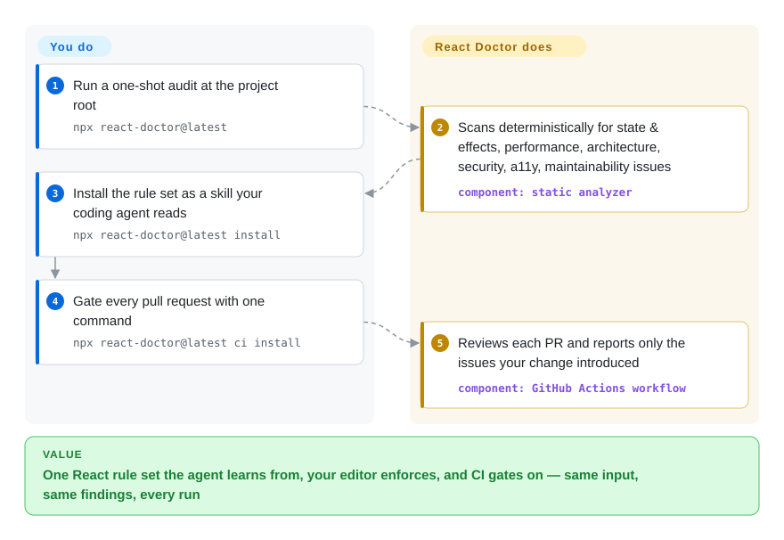

# React Doctor

A deterministic static analyzer for React that catches the bad code coding agents write — runnable as a one-shot `npx` audit, an installable agent skill, an oxlint/ESLint plugin, or in CI.

## When to use

You're a frontend engineer letting a coding agent (Claude Code, Cursor, Codex, OpenCode) churn out React components for a Next.js, Vite, or Astro app. The diffs look plausible and tests pass, but the agent keeps reaching for `useEffect` where it shouldn't, uses array indices as keys, recreates objects every render, and quietly introduces accessibility and security regressions you only notice in review — or in production. You want a fast, repeatable gate that flags exactly these React-specific mistakes without you re-reading every line. You run `npx react-doctor@latest` and get a deterministic audit across state & effects, performance, architecture, security, accessibility, and maintainability — the same input always yields the same findings, so it's reviewable and CI-friendly.

The bigger win is closing the loop with the agent itself. After the first audit you run `npx react-doctor@latest install` to drop it in as a skill for your agent, so future edits are checked against the same rule set and the agent learns to fix (and stop reintroducing) the issues it just made. Because it also ships oxlint and ESLint plugins, a language server, and VSCode/Zed extensions, the same rules can live in your editor and in a GitHub Actions PR scan — one consistent React rule set across agent, editor, and CI instead of relying on an LLM reviewer to re-judge the code each time. Since 2026 it also records runtime performance traces (`react-doctor scan <url>` drives Chrome and maps hot spots to component names), which extends it from pure static linting into "why is this render slow".

## How it works

React Doctor is a deterministic rule engine, not an LLM judge. `npx react-doctor@latest` parses your React/TypeScript source and runs a fixed catalog of rules (e.g. `react-doctor/no-array-index-as-key`) across six categories — state & effects, performance, architecture, security, accessibility, maintainability — and it also flags overly complex React functions and repeated JSX trees as composition candidates. Same code + same version ⇒ same findings, which is what makes it usable as a CI gate rather than a second opinion. A second mode records runtime data: `react-doctor scan http://localhost:3000` opens an isolated Chrome profile, records a Chrome DevTools performance trace while you interact with the app, and annotates hot spots with the React component names that caused them. What it does for you on setup: `install` writes an agent-readable skill file into your repo/agent config, `ci install` scaffolds a GitHub Actions workflow (plus a gate-only GitLab scaffold) that comments only on issues your change introduced. What stays yours: rule severity and scan scope if you disagree with the defaults (`doctor.config.ts`), and the actual fixing — React Doctor reports, your agent or team edits. Being a linter, it catches only the enumerated anti-patterns, never intent or business-logic bugs.

<!-- flow-steps:begin (generated from flows/react-doctor.json by tools/flow_card.py — do not edit) -->

Text version of the flow

1. **You**: Run a one-shot audit at the project root — `npx react-doctor@latest`
2. **React Doctor**: Scans deterministically for state & effects, performance, architecture, security, a11y, maintainability issues — component: `static analyzer`
3. **You**: Install the rule set as a skill your coding agent reads — `npx react-doctor@latest install`
4. **You**: Gate every pull request with one command — `npx react-doctor@latest ci install`
5. **React Doctor**: Reviews each PR and reports only the issues your change introduced — component: `GitHub Actions workflow`

**Value**: One React rule set the agent learns from, your editor enforces, and CI gates on — same input, same findings, every run

<!-- flow-steps:end -->

## When NOT to use

- **You're not writing React.** It is React-specific by design (works across Next.js, Vite, Astro, TanStack, React Native, Expo) — but for Vue, Svelte, Angular, or backend code it does nothing. Use a general reviewer instead.
- **You want semantic, intent-level review of *any* language.** React Doctor runs a fixed catalog of React rules deterministically; it is not an LLM that reasons about business logic, naming, or architecture in prose. For LLM-driven, language-agnostic review see [open-code-review](open-code-review.md) or [claude-code-security-review](claude-code-security-review.md).
- **Security is your primary need.** It has a security category, but it is a broad React linter, not a dedicated vulnerability/taint-analysis reviewer. A security-focused tool will go deeper on auth, injection, and data-flow.
- **License-sensitive / vendored builds.** The LICENSE file (read 2026-09-28) is a **Modified MIT**: permission is standard MIT except two uses require prior written permission from Million Software — (1) using the software, its source code, or derivative works as training/fine-tuning/evaluation data or as input to any ML-training pipeline, and (2) selling it or offering it as a paid/hosted/managed service (incl. commercial API or SaaS) whose value derives entirely or substantially from it. So do not treat it as a permissive MIT dependency when you are redistributing it, training models on it, or building a competing hosted product — read the actual terms.
- **You need rule stability / a frozen API.** It is pre-1.0 and moving fast (multiple packages, frequent releases); rules and config (`doctor.config.ts`) may shift between versions, so pin if a CI gate depends on exact findings.
- **You don't want a multi-package toolchain.** The repo is a Turbo monorepo (core, api, language-server, oxlint/ESLint plugins, editor extensions, CLI). If you only want a single library import, the surface area is larger than you need.

## Comparison

| Alternative | In index | Our verdict | Tradeoff |
|---|---|---|---|
| [open-code-review](open-code-review.md) | ✅ | Choose open-code-review when you need language-agnostic LLM judgment over PR logic; choose React Doctor when repeatable React-specific agent-error rules are the gate. | LLM-driven, language-agnostic PR review (Alibaba); reasons about logic in prose. React Doctor is deterministic, React-only, rule-based — repeatable but no semantic judgment. |
| [claude-code-security-review](claude-code-security-review.md) | ✅ | Choose claude-code-security-review when security vulnerability reasoning is the primary job; choose React Doctor for broad React lint, performance, accessibility, and correctness checks. | Claude-based security-focused review (Anthropic); deep, language-agnostic vuln reasoning. React Doctor is a broad React linter, not a dedicated security analyzer. |
| eslint-plugin-react-hooks / react | 未收录 | Choose the official React lint rules for canonical hooks coverage with the smallest conceptual surface; choose React Doctor when the agent-skill workflow and extra agent-error rules are the value. | The canonical React lint rules; React Doctor overlaps but adds an agent-skill workflow, an oxlint plugin, and curated agent-error rules beyond the official sets. |
| oxlint | 未收录 | Choose oxlint when the need is a fast Rust linter host; choose React Doctor when you need the React-specific rule pack that can run through oxlint. | The fast Rust linter React Doctor ships a plugin for; oxlint is the engine/host, React Doctor supplies the React-specific agent-facing rule pack. |
| Biome | 未收录 | Choose Biome for all-in-one JS/TS formatting and broad linting; choose React Doctor when the deciding need is catching agent-written React anti-patterns. | All-in-one Rust formatter+linter; broad JS/TS lint coverage but not focused on catching agent-written React anti-patterns specifically. |

## Tech stack

- **Language:** TypeScript (ESM, `"type": "module"`).
- **Monorepo:** Turbo-managed packages — `core`, `api`, `language-server`, `oxlint-plugin-react-doctor`, `eslint-plugin-react-doctor`, `react-doctor` (CLI), `vscode-react-doctor`, `zed-react-doctor`, `deslop-cli`, `deslop-js`, `website`.
- **Lint engines:** ships both an **oxlint** plugin and an **ESLint** plugin; releases are co-versioned across packages (latest: `react-doctor@0.9.14` = `oxlint-plugin-react-doctor@0.9.14` = `eslint-plugin-react-doctor@0.9.14`, GitHub Releases 2026-09-12).
- **Editor/IDE:** a language server plus VSCode and Zed extensions.
- **Runtime tracing:** `react-doctor scan <url>` drives system Chrome (isolated profile, or attached via `--cdp` endpoint) to record a DevTools performance trace.
- **Distribution:** CLI via `npx react-doctor@latest`; agent skill via `npx react-doctor@latest install`; CI via `npx react-doctor@latest ci install` (GitHub Actions PR scanning, reconfigure with `ci config`, update with `ci upgrade`; GitLab gets a gate-only scaffold). Config in `doctor.config.ts`.
- **Build/dev tooling:** vite-plus, Changesets for releases, ts-json-schema-generator.

## Dependencies

- **Runtime:** Node.js + a package runner (`npx`/pnpm). No database or server to host — it is a local/CLI static analyzer.
- **Engine:** oxlint when using the oxlint plugin path; ESLint when using the ESLint plugin path. [推断] core analysis runs without a separate engine via the CLI, but plugin paths require their host linter.
- **For `scan` mode:** a local Chrome (DevTools performance tracing); traces are stored locally and treated by the README as sensitive application data.
- **Telemetry (README, 2026-09):** the CLI reports crashes, run traces, and anonymous usage counters to Sentry — environment, invocation context, project shape, rule names + counts, explicitly *no* file contents; opt out with `--no-telemetry`.
- **Project:** an existing React/TypeScript codebase to scan (Next.js, Vite, Astro, TanStack, React Native, Expo all stated as supported).
- **Install:** zero persistent install for a one-shot audit (`npx react-doctor@latest`); the skill/CI installers add config and a skill file to your repo/agent.

## Ops difficulty

**Low.** For the common case it is a single `npx` command with nothing to deploy, host, or maintain — no server, no datastore, deterministic output that slots into CI. Difficulty rises only mildly: wiring it as a GitHub Actions gate, tuning `doctor.config.ts`, or adopting the oxlint/ESLint plugins into an existing lint setup means version-pinning and config reconciliation. The pre-1.0, multi-package nature means you should pin versions if a CI gate depends on exact findings.

## Health & viability

- **Responsiveness**: Grade A — median first-response time 0.2 hours across 53 qualifying issues/PRs (scorer, 2026-09-28).
- **Maintenance (2026-09):** very actively maintained — repo pushed 2026-09-28 (day of this check), co-versioned releases roughly monthly (`react-doctor@0.9.12` 2026-08-13 → `0.9.13` 2026-09-02 → `0.9.14` 2026-09-12, GitHub Releases), only 23 open issues at ~14.9k stars (GitHub API, 2026-09-28). Momentum is strong.
- **Governance & backing:** under the `millionco` org (Million Software, Inc. — the company behind Million.js and the LICENSE copyright holder, million.dev contact verified 2026-09-28), so there's a funded React-tooling company behind it rather than a lone hobbyist — higher bus-factor than a single-maintainer repo, and the 12-month top-committer share (~65%) confirms concentration in that team. Still single-vendor, not foundation-governed.
- **Age & Lindy:** created 2026-02-13, ~7.5 months old as of 2026-09 — **very young; no Lindy track record.** It's pre-1.0 (0.9.x) and moving fast across a multi-package monorepo, so the rule catalog and `doctor.config.ts` can shift between versions; pin if a CI gate depends on exact findings.
- **Risk flags:** **license is the standout flag** — `LicenseRef-Modified-MIT` (GitHub reports "Other"): two uses need written permission (ML-training data usage; paid/hosted/managed offering). Do **not** treat it as permissive MIT for redistribution or building a competing service; the LICENSE text was read on 2026-09-28. Sentry telemetry is on by default (opt-out flag exists). No CVEs observed.

## Caveats (unverified)

- [未验证] Star count ~14.9k as of 2026-09-28 (GitHub API); stars are unreliable and date-sensitive; indicative only.
- [未验证] The full rule catalog is not enumerated here; the README names categories (state & effects, performance, architecture, security, accessibility, maintainability) and one example rule (`react-doctor/no-array-index-as-key`) — verify the exact rule set against the current repo.
- [推断] Agent-skill "learning" means the agent reads the installed rule/skill file and applies fixes; it is not model weight training. Behavior across different agents is not guaranteed.
- [未验证] Framework support claims (Next.js/Vite/Astro/TanStack/React Native/Expo) are from the project's own README, not independently benchmarked.
- [推断] GitHub still shows some legacy `v2.x` tags alongside the Changesets `react-doctor@0.9.x` release line; the Releases list (0.9.14, 2026-09-12) and npm `latest` dist-tag were used as the version source of truth, and the v2.x tags' purpose was not investigated.
