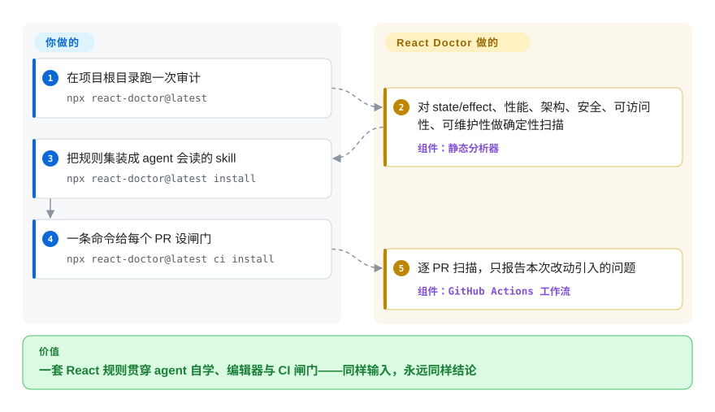

# React Doctor

一个面向 React 的确定性静态分析器，专抓 coding agent 写出来的烂 React 代码——既能用 `npx` 一次性审计，也能装成 agent skill、装成 oxlint/ESLint 插件，或接进 CI。

## 何时使用

你是前端工程师，正让某个 coding agent（Claude Code、Cursor、Codex、OpenCode）给 Next.js、Vite 或 Astro 应用批量生成 React 组件。diff 看起来都挺合理、测试也过，但 agent 老是在不该用的地方塞 `useEffect`、拿数组下标当 key、每次 render 都重建对象，还悄悄引入只有在 review 时——甚至上线后——才发现的可访问性和安全回归。你想要一道快、可重复的关卡，精准标出这些 React 特有的错误，而不用自己逐行重读。于是你跑 `npx react-doctor@latest`，得到一份覆盖 state & effects、性能、架构、安全、可访问性、可维护性的确定性审计——同样的输入永远给出同样的结论，因此可复查、也适合进 CI。

更大的价值是把回路接到 agent 自身。首轮审计后，你用 `npx react-doctor@latest install` 把它装成 agent 的 skill，这样后续改动都会对照同一套规则检查，agent 也会学着去修（并不再反复重犯）它刚犯的那些问题。由于它同时提供 oxlint 与 ESLint 插件、一个 language server，以及 VSCode/Zed 扩展，同一套规则可以同时活在你的编辑器和 GitHub Actions 的 PR 扫描里——一套一致的 React 规则贯穿 agent、编辑器和 CI，而不是每次都靠 LLM reviewer 重新判一遍代码。2026 年起它还支持运行时性能追踪（`react-doctor scan <url>` 驱动 Chrome 录制 trace，把热点对应到具体组件），从纯静态 lint 延伸到「这次 render 为什么慢」。

## 怎么用起来

React Doctor 是确定性规则引擎，不是 LLM 评审。`npx react-doctor@latest` 解析你的 React/TypeScript 源码，用一套固定规则目录（如 `react-doctor/no-array-index-as-key`）扫六个维度——state 与 effect、性能、架构、安全、可访问性、可维护性，同时把过度复杂的 React 函数和重复的 JSX 树标成可组合的候选项。同样的代码加同样的版本，每次结论完全一致——这正是它能当 CI 闸门、而不是只当「第二意见」的原因。第二种模式采集运行时数据：`react-doctor scan http://localhost:3000` 用隔离的 Chrome 配置打开系统浏览器，在你与应用交互时录制 DevTools 性能 trace，再把热点标注到引发瓶颈的 React 组件名上。装配也由它代劳：`install` 往你的仓库/agent 配置里写入 agent 可读的 skill 文件，`ci install` 搭好 GitHub Actions 工作流（GitLab 则给仅闸门的脚手架），逐 PR 只评论本次改动引入的问题。留在你手上的：不认同默认配置时的规则严重级与扫描范围（`doctor.config.ts`），以及修复本身——React Doctor 只报问题，改代码仍靠你的 agent 或团队。作为 linter，它只抓目录里枚举的反模式，不推理意图与业务逻辑。

<!-- flow-steps:begin (generated from flows/react-doctor.json by tools/flow_card.py — do not edit) -->

流程文字版

1. **你**：在项目根目录跑一次审计 — `npx react-doctor@latest`
2. **React Doctor**：对 state/effect、性能、架构、安全、可访问性、可维护性做确定性扫描 — 组件：`静态分析器`
3. **你**：把规则集装成 agent 会读的 skill — `npx react-doctor@latest install`
4. **你**：一条命令给每个 PR 设闸门 — `npx react-doctor@latest ci install`
5. **React Doctor**：逐 PR 扫描，只报告本次改动引入的问题 — 组件：`GitHub Actions 工作流`

**价值**：一套 React 规则贯穿 agent 自学、编辑器与 CI 闸门——同样输入，永远同样结论

<!-- flow-steps:end -->

## 何时不用

- **你写的不是 React。** 它就是为 React 设计的（覆盖 Next.js、Vite、Astro、TanStack、React Native、Expo）——但对 Vue、Svelte、Angular 或后端代码它什么都做不了。那些场景请换通用 reviewer。
- **你要的是任意语言、意图层面的语义审查。** React Doctor 是确定性地跑一套固定的 React 规则目录，不是一个能用自然语言推理业务逻辑、命名、架构的 LLM。要 LLM 驱动、语言无关的审查，看 [open-code-review](open-code-review.zh.md) 或 [claude-code-security-review](claude-code-security-review.zh.md)。
- **安全是你的首要诉求。** 它有安全类别，但本质是一个覆盖面广的 React linter，不是专门做漏洞/污点分析的安全 reviewer。专门的安全工具在认证、注入、数据流上会挖得更深。
- **对 license 敏感 / 需要 vendored 构建。** 它的 LICENSE 文件（2026-09-28 已读）是 **Modified MIT**：除两处例外外就是标准 MIT 授权，而这两处使用需要事先取得 Million Software 的书面许可——（1）把本软件、其源码或衍生作品用作任何 ML 模型的训练/微调/评估数据或输入；（2）出售本软件，或把它作为价值完全或实质上源自本软件的付费/托管/托管式服务（含商业 API 或 SaaS）提供给第三方。所以二次分发、拿它训练模型或自建竞品托管服务时，别把它当成宽松 MIT 依赖，先读真实条款。
- **你需要规则稳定 / 冻结的 API。** 它还在 1.0 之前、迭代很快（多包、发版频繁）；规则和配置（`doctor.config.ts`）可能在版本间变化，所以一旦 CI 闸门依赖精确结论，请 pin 版本。
- **你不想引入一套多包工具链。** 仓库是个 Turbo monorepo（core、api、language-server、oxlint/ESLint 插件、编辑器扩展、CLI）。如果你只想 import 一个单库，它的表面积比你需要的大。

## 横向对比

| 替代品 | 是否收录 | 我们的评价 | 取舍 |
|---|---|---|---|
| [open-code-review](open-code-review.zh.md) | ✅ | 当你需要语言无关的 LLM 对 PR 逻辑做语义判断时，选 open-code-review；当闸门必须是可重复的 React 专属 agent 易错规则时，选 React Doctor。 | LLM 驱动、语言无关的 PR 审查（阿里巴巴）；用自然语言推理逻辑。React Doctor 是确定性、仅限 React、基于规则——可重复但没有语义判断。 |
| [claude-code-security-review](claude-code-security-review.zh.md) | ✅ | 当安全漏洞推理是首要任务时，选 claude-code-security-review；当目标是覆盖 React lint、性能、可访问性和正确性时，选 React Doctor。 | 基于 Claude、聚焦安全的审查（Anthropic）；深入、语言无关的漏洞推理。React Doctor 是覆盖面广的 React linter，不是专门的安全分析器。 |
| eslint-plugin-react-hooks / react | 未收录 | 当你只要官方 React lint 规则和最小概念表面积时，选官方插件；当 agent-skill 工作流和额外的 agent 易错规则才是价值时，选 React Doctor。 | React 官方 lint 规则；React Doctor 与之有重叠，但额外提供 agent-skill 工作流、oxlint 插件，以及超出官方集的「agent 易犯错」规则。 |
| oxlint | 未收录 | 当需求只是高速 Rust linter 宿主时，选 oxlint；当你需要能经 oxlint 运行的 React 专属规则包时，选 React Doctor。 | React Doctor 为之提供插件的高速 Rust linter;oxlint 是引擎/宿主，React Doctor 供给面向 agent 的 React 专属规则包。 |
| Biome | 未收录 | 当你需要 JS/TS 一体化格式化和广覆盖 lint 时，选 Biome；当决定性需求是抓 agent 写出的 React 反模式时，选 React Doctor。 | 一体化的 Rust 格式化+lint;JS/TS lint 覆盖广，但不专门针对「抓 agent 写的 React 反模式」。 |

## 技术栈

- **语言：** TypeScript(ESM,`"type": "module"`)。
- **Monorepo:** Turbo 管理的多包——`core`、`api`、`language-server`、`oxlint-plugin-react-doctor`、`eslint-plugin-react-doctor`、`react-doctor`(CLI)、`vscode-react-doctor`、`zed-react-doctor`、`deslop-cli`、`deslop-js`、`website`。
- **Lint 引擎：** 同时提供 **oxlint** 插件和 **ESLint** 插件；各包版本同步发布（最新：`react-doctor@0.9.14` = `oxlint-plugin-react-doctor@0.9.14` = `eslint-plugin-react-doctor@0.9.14`，GitHub Releases 2026-09-12）。
- **编辑器/IDE:** 一个 language server，外加 VSCode 与 Zed 扩展。
- **运行时追踪：** `react-doctor scan <url>` 驱动系统 Chrome（隔离配置，或经 `--cdp` 端点附加）录制 DevTools 性能 trace。
- **分发：** CLI 走 `npx react-doctor@latest`;agent skill 走 `npx react-doctor@latest install`;CI 走 `npx react-doctor@latest ci install`（GitHub Actions PR 扫描，`ci config` 重配、`ci upgrade` 升级；GitLab 得到仅闸门的脚手架）。配置在 `doctor.config.ts`。
- **构建/开发工具：** vite-plus、Changesets（发版）、ts-json-schema-generator。

## 依赖

- **运行时：** Node.js + 包运行器（`npx`/pnpm）。没有数据库或要托管的服务——它是本地/CLI 静态分析器。
- **引擎：** 走 oxlint 插件路径时需要 oxlint；走 ESLint 插件路径时需要 ESLint。[推断] 通过 CLI 的核心分析不需要单独引擎，但插件路径需要其宿主 linter。
- **scan 模式：** 本机 Chrome（DevTools 性能追踪）；trace 存本地，README 明示应视为敏感应用数据。
- **遥测（README,2026-09）：** CLI 会向 Sentry 上报崩溃、运行 trace 与匿名使用计数——环境、调用上下文、项目形态、规则名与计数，明确*不含*文件内容；可用 `--no-telemetry` 关闭。
- **项目：** 一个现成的 React/TypeScript 代码库可供扫描（声明支持 Next.js、Vite、Astro、TanStack、React Native、Expo）。
- **安装：** 一次性审计零常驻安装（`npx react-doctor@latest`）;skill/CI 安装器会往你的仓库/agent 写入配置和 skill 文件。

## 运维难度

**低。** 常见用法就是一条 `npx` 命令，没有要部署、托管或维护的东西——无服务、无数据存储、确定性输出，天然适合接进 CI。难度只会轻微上升：把它接成 GitHub Actions 闸门、调 `doctor.config.ts`，或把 oxlint/ESLint 插件并进既有 lint 配置时，需要 pin 版本和调和配置。它 1.0 之前、多包的特性意味着：一旦 CI 闸门依赖精确结论，就该 pin 版本。

## 健康度与可持续性

- **响应速度**：Grade A——中位首次响应时间 0.2 小时，基于 53 个 qualifying issues/PRs（打分器，2026-09-28）。
- **维护（2026-09）：** 维护非常活跃——仓库 push 于 2026-09-28（即本次核验当天），各包同步发版约每月一跳（`react-doctor@0.9.12` 2026-08-13 → `0.9.13` 2026-09-02 → `0.9.14` 2026-09-12，GitHub Releases），约 14.9k star 下未关闭 issue 仅 23（GitHub API,2026-09-28）。势头强劲。
- **治理与背书：** 归属 `millionco` 组织（Million Software, Inc.——Million.js 背后、LICENSE 版权人，2026-09-28 经 founders@million.dev 联系方式核实），因此背后是一家有投入的 React 工具链公司而非孤身爱好者——bus-factor 高于单人维护仓库，近 12 个月前 1 名 committer 约 65% 的占比也印证了集中于该团队。但仍是单一厂商，非基金会治理。
- **年龄与 Lindy：** 创建于 2026-02-13，截至 2026-09 约 7.5 个月——**非常年轻；无 Lindy 记录。** 它在 1.0 之前（0.9.x）、在一个多包 monorepo 上快速迭代，所以规则目录和 `doctor.config.ts` 可能在版本间变动；一旦 CI 闸门依赖精确结论，请 pin 版本。
- **风险标记：** **许可证是最突出的标记**——`LicenseRef-Modified-MIT`（GitHub 报为「Other」）：两处使用需书面许可（用作 ML 训练数据；作为付费/托管服务提供）。二次分发或自建竞品托管服务时，**别**把它当宽松 MIT；LICENSE 原文已于 2026-09-28 读验。Sentry 遥测默认开启（有退出开关）。未观察到 CVE。

## 存疑（未验证）

- [未验证] star 约 14.9k（GitHub API,2026-09-28）；GitHub star 不可靠且对时间敏感，仅供参考。
- [未验证] 此处未穷举完整规则目录；README 列了类别（state & effects、性能、架构、安全、可访问性、可维护性）和一个示例规则（`react-doctor/no-array-index-as-key`）——具体规则集请对照当前仓库核实。
- [推断] agent-skill 的「学习」指 agent 读取已安装的规则/skill 文件并据此修复，而非模型权重训练；不同 agent 上的行为不保证一致。
- [未验证] 框架支持声明（Next.js/Vite/Astro/TanStack/React Native/Expo）来自项目自述，未经独立基准验证。
- [推断] GitHub 上除 Changesets 的 `react-doctor@0.9.x` release 线外还残留若干旧 `v2.x` tag；版本事实以 Releases 列表（0.9.14,2026-09-12）与 npm `latest` dist-tag 为准，v2.x tag 的用途未做考证。
