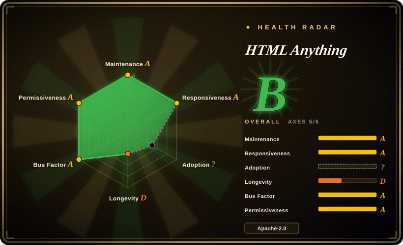
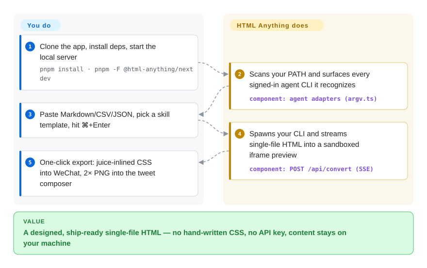

# HTML Anything

A local-first Next.js web app that turns Markdown/CSV/JSON into ship-ready single-file HTML by driving the coding-agent CLI you already have logged in — zero API key, 75 skill templates across 9 deliverable surfaces, one-click export to WeChat / X / Zhihu / PNG.

## When to use

You're a developer-writer or a content/marketing operator who already has Claude Code (or Cursor / Codex / Gemini / Copilot / OpenCode / Qwen / Aider / IBM Bob) installed and logged in, and you keep hitting the same wall: your draft is Markdown, but what your WeChat / Xiaohongshu / Zhihu audience actually sees needs to be a designed, laid-out HTML artifact — and hand-writing the CSS, type scale and grid is exactly the work you don't want to do. You run HTML Anything locally (`pnpm dev`), it auto-detects whichever agent CLI is on your `PATH`, you paste your content, pick one of the 75 skill templates (a deck, a Xiaohongshu card, a magazine article, a data report), hit ⌘+Enter, and watch the HTML stream into a sandboxed iframe line by line. When it finishes, you one-click copy juice-inlined CSS into the WeChat editor, or render a 2× PNG straight into the tweet composer — no second "I'll clean it up later" pass.

The defining trait is that it ships **no model and no API key of its own**: it spawns your local CLI with permissive flags and reuses your existing subscription session, so marginal cost is $0 and your input never leaves the machine (CSV/Excel parsing happens in-browser). That makes it a good fit when you want a opinionated, design-constrained HTML generator but refuse to wire up yet another API key or pay per-generation, and you're comfortable running a dev server on your own laptop.

## How it works

HTML Anything is a local Next.js app with no model of its own — the inference layer is the agent CLI you already signed in to on your machine. On boot the browser calls `/api/agents`, the server scans your `PATH` (including dirs a GUI-launched Node normally misses, like `~/.local/bin` and `/opt/homebrew/bin`) and surfaces every CLI it recognizes; each CLI gets a thin adapter in `next/src/lib/agents/argv.ts` that knows its exact argv and stdin protocol (e.g. `claude -p --output-format stream-json`, `codex exec --json --sandbox workspace-write`). When you hit ⌘+Enter, `POST /api/convert` spawns that CLI — with maximally permissive flags, which is why the security model is scoped to one operator on one machine and why every `/api/*` request is gated by a Host-header allowlist middleware — and streams the generated HTML back as SSE, painted line by line into a `<iframe sandbox>` preview. "Pick a template" really means picking one of the 75 `SKILL.md` folders: each injects the agent's prompt with hard design constraints (CJK-first font stack, 8 px baseline grid, contrast ≥ 4.5, must-use-real-data) plus an `example.html` so you can preview the output style before generating. What stays yours: installing and authenticating one of the CLIs, reading the generated HTML, and driving the export step — `juice` inlines the CSS for WeChat paste and `modern-screenshot` rasterises the iframe to a 2× PNG, both in your browser, nothing uploaded.

<!-- flow-steps:begin (generated from flows/html-anything.json by tools/flow_card.py — do not edit) -->

Text version of the flow

1. **You**: Clone the app, install deps, start the local server — `pnpm install · pnpm -F @html-anything/next dev`
2. **HTML Anything**: Scans your PATH and surfaces every signed-in agent CLI it recognizes — component: `agent adapters (argv.ts)`
3. **You**: Paste Markdown/CSV/JSON, pick a skill template, hit ⌘+Enter
4. **HTML Anything**: Spawns your CLI and streams single-file HTML into a sandboxed iframe preview — component: `POST /api/convert (SSE)`
5. **You**: One-click export: juice-inlined CSS into WeChat, 2× PNG into the tweet composer

**Value**: A designed, ship-ready single-file HTML — no hand-written CSS, no API key, content stays on your machine

<!-- flow-steps:end -->

## When NOT to use

- **You don't run a local coding-agent CLI.** The whole architecture is "spawn the CLI you already logged in." No `claude` / `cursor-agent` / `codex` / `gemini` / `copilot` / `opencode` / `qwen` / `aider` / `bob` on `PATH` means nothing to drive — there is no built-in inference fallback.
- **You want a hosted, click-and-go SaaS.** This is a repo you clone and run; the agent always stays on your laptop. The Vercel deploy only covers the web layer, not the generation. Non-developers who won't touch a terminal are not the audience.
- **You need a single embeddable HTML-editing library or API.** It's a full app (Next.js server routes that `spawn` CLIs, a browser UI, middleware), not a drop-in component. If you want a programmatic Markdown→image/HTML function, the upstream building blocks (`markdown-nice`, `markdown-to-image`) are closer.
- **You need production-grade stability or multi-user serving.** Status is self-described "early but real," with **no tagged release** and a Security model explicitly scoped to "a single operator on a single machine" (`/api/convert` spawns the CLI with maximally permissive flags; `/api/deploy` writes credentialed config to disk). Don't expose it to a network without understanding the Host-allowlist middleware.
- **You want the bigger, faster-moving design suite.** By the README's own framing this is the *focused* HTML editor; the same team's [open-design](open-design.md) is the larger desktop app (more skills, more surfaces, PPTX/MP4 export). If you outgrow the HTML-only scope, that's the upgrade path.
- **Lock-in / lineage caveat.** Agent detection, the `SKILL.md` protocol and the design-system model are borrowed verbatim from open-design; you're adopting that ecosystem's conventions, not a neutral standard. [推断]

## Comparison

| Alternative | In index | Our verdict | Tradeoff |
|---|---|---|---|
| [open-design](open-design.md) | ✅ | Choose open-design when you need the same team's larger desktop app. | Same team's larger desktop app — far more skills/design-systems, native desktop, PPTX/MP4 export. HTML Anything is the focused, web-only, HTML-output subset built on top of it. |
| [guizang-ppt-skill](../agent-skills/slides-ppt/guizang-ppt.md) | ✅ | Choose guizang-ppt-skill when you need a portable agent skill for polished HTML decks. | A single agent skill for polished HTML decks (vendored into HTML Anything as `deck-guizang-editorial`). It's a skill you drop into any agent; HTML Anything is the surrounding app + picker + export + 75 skills. |
| [guizang-social-card-skill](../agent-skills/visual-content/guizang-social-card.md) | ✅ | Choose guizang-social-card-skill when you need Xiaohongshu/WeChat cover cards. | Skill for Xiaohongshu/WeChat cover cards. Narrow + portable vs HTML Anything's broad multi-surface app. |
| [Impeccable](impeccable.md) | ✅ | Choose Impeccable when you need a design-language or harness-quality layer. | A design *language* / harness-quality layer (makes any agent better at design), not a generation app. Complementary, not a substitute. |
| markdown-nice (mdnice) | 未收录 | Choose markdown-nice when you need a web editor for Markdown-to-WeChat/Zhihu styling. | Web editor for Markdown→WeChat/Zhihu paste-ready styling; mature, no agent, theme-based not prompt-driven. HTML Anything reuses its `juice` inlining idea but adds agent generation + 9 surfaces. |
| markdown-to-image (gcui-art) | 未收录 | Choose markdown-to-image when you need Markdown-to-social-card PNG generation. | Markdown→social-card-PNG generator; narrower output, also no local-agent model. |

## Tech stack

- **Language:** TypeScript (the running app). GitHub reports the repo as majority **HTML** because the 75 skill templates ship as HTML/`example.html` assets. [推断]
- **Frontend:** Next.js 16 (16.2.6 per `next/package.json`, App Router + Turbopack), React 19 (19.2.4), Tailwind v4, zustand.
- **Server routes:** `GET /api/agents` (PATH scan / CLI detection), `POST /api/convert` (SSE streaming spawn), `/api/deploy`. Transport is `child_process.spawn` with one stdin/stdout adapter per CLI in `next/src/lib/agents/argv.ts`.
- **Browser-side processing:** `juice` (CSS inlining), `modern-screenshot` (PNG export), `xlsx` / `papaparse` (spreadsheet parsing), `marked` + `highlight.js` (Markdown input), `dompurify` (XSS defense).
- **Preview:** `<iframe sandbox="allow-scripts allow-same-origin">` + `srcdoc`.
- **Skill format:** Claude Code `SKILL.md` convention + extended frontmatter (`mode` · `scenario` · `surface` · `preview` · `design_system`); each skill is a folder under `next/src/lib/templates/skills/`.

## Dependencies

- **Runtime:** Node.js + `pnpm` (a small pnpm workspace: `next/` app + `e2e/` Playwright package). `next/package.json` read 2026-09-28 pins no `engines` field — minimum Node/pnpm versions are unstated; it must satisfy Next.js 16's own requirements.
- **Required external dependency:** at least one supported coding-agent CLI installed AND already authenticated (`claude login` / `cursor login` / `gemini auth` etc.). This is the model layer — the app has none of its own.
- **Network:** templates pull Tailwind CDN / Google Fonts at preview time inside the iframe; otherwise local-first, nothing uploaded.
- **Deploy:** local `pnpm -F @html-anything/next dev`; the web layer is Vercel-deployable, but the agent must stay on the operator's machine.

## Ops difficulty

**Low for the intended single-operator local use; medium-to-high if you try to host it.** The happy path is `git clone` → `pnpm install` → `pnpm dev` → open localhost, and the value is entirely local. Friction comes from (1) the hard precondition of a logged-in agent CLI — if detection misses your binary or your session expired, nothing generates; (2) it being early with no tagged release, so you're tracking `main`; and (3) the security posture: routes spawn the CLI with maximally permissive flags and `/api/deploy` writes credentials to disk, gated only by a Host-header allowlist middleware. Exposing it beyond loopback (LAN/mDNS via `HTML_ANYTHING_ALLOWED_HOSTS`, or reverse-proxy via `HTML_ANYTHING_ALLOW_ANY_HOST=1`) shifts real security responsibility onto you. Treat it as a personal tool, not a service.

## Health & viability

- **Responsiveness**: Grade A — median first-response time 0.0 hours across 12 qualifying issues/PRs (scorer, 2026-09-28).
- **Maintenance (2026-09):** [推断] active but immature — last push 2026-09-15, but **still no tagged release** (releases and tags both empty as of 2026-09-28, self-described "early but real"), so you track `main` with no version line. Open issues ~37 (GitHub API, 2026-09-28). Recent activity is healthy; the absence of any release cadence is the concern, not stalled commits.
- **Governance & backing:** [推断] under the `nexu-io` org — same team as [open-design](open-design.md), the larger desktop app this is the focused subset of. So there's an org and a sibling product behind it rather than a lone author, but it's a young single-vendor project; agent detection, the `SKILL.md` protocol and the design-system model are borrowed verbatim from `open-design`, so you're adopting that ecosystem's conventions, not a neutral standard.
- **Age & Lindy:** [未验证] repo created 2026-05-11, ~4.5 months of public history as of 2026-09 — **brand-new; no Lindy prior.** README figures (75 skills / 9 surfaces / 9 CLIs — and the upstream "40k★" claims) are promotional and can drift on `main`; the README even disagrees with itself on the CLI count right now (headline and per-CLI table say 9, the stats table still says 8), so verify before depending.
- **Risk flags:** [推断] **security posture is the standout flag** — `/api/convert` spawns the local CLI with maximally permissive flags and `/api/deploy` writes credentials to disk, gated only by a Host-header allowlist. Safe only as a single-operator loopback tool; exposing it to a network shifts real security responsibility onto you. Apache-2.0 (permissive, no relicense history). It is also dependent on your separately-installed agent CLI staying compatible — its own viability is partly hostage to upstream vendor CLIs.

## Caveats (unverified)

- [未验证] Star count ~9.0k as of 2026-09-28 (GitHub API 8,961) — GitHub stars are unreliable and date-sensitive; treat as indicative only.
- [未验证] No tagged release exists (GitHub releases and tags both empty as of 2026-09-28); "75 skills / 9 surfaces / 9 CLIs" are the project's own README figures, not independently verified, and the README's stats table still says 8 CLIs — the counts may drift on `main`.
- [未验证] Minimum Node/pnpm versions are unstated: `next/package.json` (read 2026-09-28) has no `engines` field, so runtime requirements fall back to whatever Next.js 16 demands.
- [推断] GitHub labels the repo "HTML" by line count, but the executable application is TypeScript/Next.js; the HTML majority is the skill-template assets.
- [推断] Agent detection, the `SKILL.md` protocol and the design-system model are described as "borrowed verbatim" from `nexu-io/open-design` (same team) and `multica-ai/multica` — adopting it means adopting that ecosystem's conventions.
- [未验证] The README's own header markets `nexu-io/open-design` as "40k★ · 200+ contributors"; those upstream figures are promotional and unverified.
- [未验证] Whether all 9 CLI adapters (IBM Bob added on `main` since 2026-09) actually work end-to-end on a given OS/PATH layout depends on the per-CLI argv/protocol staying current with each vendor's CLI — verify your specific agent before relying on it.
