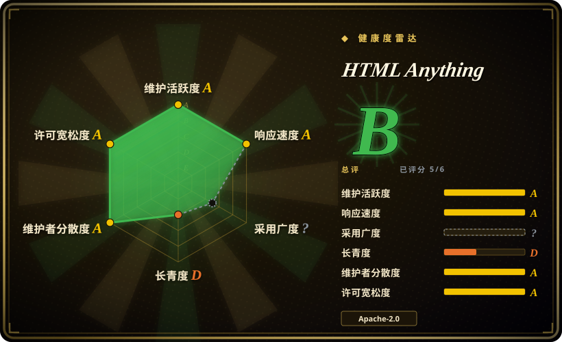
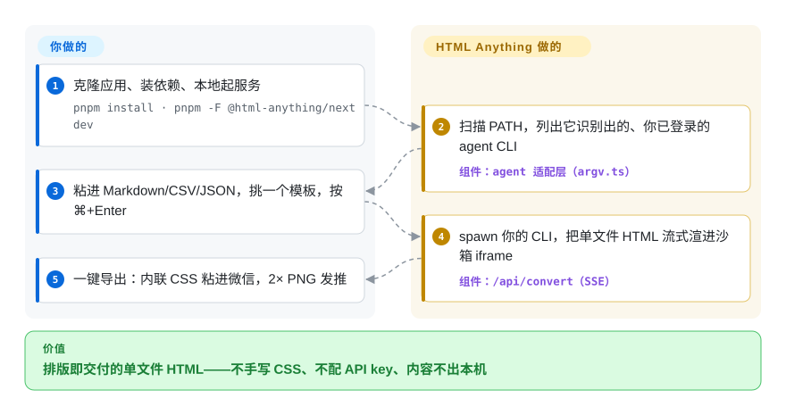

# HTML Anything

一个 local-first 的 Next.js Web 应用，通过驱动你本地已登录的 coding-agent CLI，把 Markdown/CSV/JSON 变成可直接交付的单文件 HTML——零 API key,75 个 skill 模板覆盖 9 种交付面，一键导出到微信 / X / 知乎 / PNG。

## 何时使用

你是开发者型作者，或内容/营销运营，本机已经装好并登录了 Claude Code（或 Cursor / Codex / Gemini / Copilot / OpenCode / Qwen / Aider / IBM Bob），而你总撞上同一堵墙：草稿是 Markdown，但微信 / 小红书 / 知乎读者真正看到的，需要是排好版、有设计感的 HTML 产物——而手写 CSS、字阶、栅格，恰恰是你最不想干的活。你在本地把 HTML Anything 跑起来（`pnpm dev`），它自动探测 `PATH` 上的 agent CLI，你粘进内容，挑一个 75 个 skill 模板里的样式（一份 deck、一张小红书卡片、一篇杂志文章、一份数据报告），按 ⌘+Enter，看着 HTML 在 sandbox iframe 里一行行流式渲染出来。生成完，一键把 juice 内联好的 CSS 复制进微信编辑器，或渲成 2× PNG 直接拖进推文框——没有“回头再修一下”的第二趟。

它最关键的特征是**自己不带模型、不带 API key**：它用宽松参数 spawn 你本地的 CLI，复用你已有的订阅会话，所以边际成本是 $0，你的输入也不出本机（CSV/Excel 解析在浏览器里做）。因此当你想要一个有主见、带设计约束的 HTML 生成器，却又不愿再接一个 API key、不愿按次付费，并且能接受在自己笔记本上跑个 dev server 时，它很合适。

## 怎么用起来

HTML Anything 本体是一个本地 Next.js 应用，自己不带任何模型——推理层就是你机器上已登录的那个 agent CLI。启动时浏览器调 `/api/agents`，服务端扫描你的 `PATH`（包括 GUI 启动的 Node 通常漏掉的 `~/.local/bin`、`/opt/homebrew/bin` 等目录），列出所有识别得到的 CLI；每个 CLI 一个瘦适配器，写在 `next/src/lib/agents/argv.ts` 里，各自知道自己的 argv 与 stdin 协议（如 `claude -p --output-format stream-json`、`codex exec --json --sandbox workspace-write`）。你按下 ⌘+Enter 后，`POST /api/convert` 用最宽松参数 spawn 该 CLI——这正是它的安全模型限定「单机单操作者」、且所有 `/api/*` 请求都过 Host 头白名单 middleware 的原因——生成结果以 SSE 流式回传，逐行绘进 sandbox iframe 预览。所谓「挑模板」，实际是挑 75 个 `SKILL.md` 目录之一：每个模板往 agent 的 prompt 里注入硬性设计约束（中文优先字体栈、8 px 基线栅格、对比度 ≥ 4.5、必须用真实数据），并附一份 `example.html`，让你在仓库里直接打开就能看到成品风格。留在你手上的：装好并登录一个 CLI、读一遍生成的 HTML、以及点导出的那一步——`juice` 把 CSS 内联供微信粘贴、`modern-screenshot` 把 iframe 栅格化成 2× PNG，两步都在你的浏览器里完成，内容不上传。

<!-- flow-steps:begin (generated from flows/html-anything.json by tools/flow_card.py — do not edit) -->

流程文字版

1. **你**：克隆应用、装依赖、本地起服务 — `pnpm install · pnpm -F @html-anything/next dev`
2. **HTML Anything**：扫描 PATH，列出它识别出的、你已登录的 agent CLI — 组件：`agent 适配层（argv.ts）`
3. **你**：粘进 Markdown/CSV/JSON，挑一个模板，按 ⌘+Enter
4. **HTML Anything**：spawn 你的 CLI，把单文件 HTML 流式渲进沙箱 iframe — 组件：`/api/convert（SSE）`
5. **你**：一键导出：内联 CSS 粘进微信，2× PNG 发推

**价值**：排版即交付的单文件 HTML——不手写 CSS、不配 API key、内容不出本机

<!-- flow-steps:end -->

## 何时不用

- **你本机不跑 coding-agent CLI。** 整个架构就是“spawn 你已登录的 CLI”。`PATH` 上没有 `claude` / `cursor-agent` / `codex` / `gemini` / `copilot` / `opencode` / `qwen` / `aider` / `bob`，就没有东西可驱动——它没有内置的推理兜底。
- **你想要托管的、点开即用的 SaaS。** 这是一个你 clone 下来本地跑的仓库；agent 始终留在你笔记本上。Vercel 部署只覆盖 Web 层，不覆盖生成。不愿碰终端的非开发者不是目标用户。
- **你想要一个可嵌入的 HTML 编辑库或 API。** 它是完整应用（Next.js 服务端路由 spawn CLI、浏览器 UI、middleware），不是即插即用组件。要的若是可编程的 Markdown→图/HTML 函数，上游构件（`markdown-nice`、`markdown-to-image`）更贴近。
- **你需要生产级稳定或多用户服务。** 自述是“early but real”,**没有打过 tag 的 release**，且 Security 模型明确限定为“单机单操作者”（`/api/convert` 用最宽松参数 spawn CLI,`/api/deploy` 把带凭据的配置写盘）。没搞清 Host 白名单 middleware 前，别把它暴露到网络上。
- **你要更大、迭代更快的设计套件。** 按 README 自己的说法这是*聚焦版* HTML 编辑器；同团队的 [open-design](open-design.zh.md) 是更大的桌面应用（更多 skill、更多交付面、支持 PPTX/MP4 导出）。HTML-only 的范围不够用时，那是升级路径。
- **锁定 / 血缘提醒。** agent 探测、`SKILL.md` 协议、设计系统模型都是从 open-design 逐字搬来的；你采纳的是那套生态的约定，而非中立标准。[推断]

## 横向对比

| 替代品 | 是否收录 | 我们的评价 | 取舍 |
|---|---|---|---|
| [open-design](open-design.zh.md) | ✅ | 需要同团队更大的桌面应用时，选 open-design。 | 同团队更大的桌面应用——skill/设计系统多得多、原生桌面、支持 PPTX/MP4 导出。HTML Anything 是构建其上、聚焦 Web、只产 HTML 的子集。 |
| [guizang-ppt-skill](../agent-skills/slides-ppt/guizang-ppt.zh.md) | ✅ | 需要可移植的精致 HTML deck agent skill 时，选 guizang-ppt-skill。 | 单个生成精致 HTML deck 的 agent skill（被 vendored 进 HTML Anything 成 `deck-guizang-editorial`）。它是丢进任意 agent 的 skill;HTML Anything 是外围的 app + 选择器 + 导出 + 75 个 skill。 |
| [guizang-social-card-skill](../agent-skills/visual-content/guizang-social-card.zh.md) | ✅ | 需要小红书/公众号封面卡 skill 时，选 guizang-social-card-skill。 | 生成小红书/公众号封面卡的 skill。窄而可移植，对比 HTML Anything 这套多交付面的宽应用。 |
| [Impeccable](impeccable.zh.md) | ✅ | 需要设计语言或 harness 质量层时，选 Impeccable。 | 一套设计*语言* / 提升 harness 设计质量的层（让任意 agent 更会做设计），不是生成应用。互补，而非替代。 |
| markdown-nice(mdnice) | 未收录 | 需要 Markdown→微信/知乎可粘贴样式的 Web 编辑器时，选 markdown-nice。 | Markdown→微信/知乎可粘贴样式的 Web 编辑器；成熟、无 agent、基于主题而非 prompt。HTML Anything 复用了它的 `juice` 内联思路，但加了 agent 生成 + 9 种交付面。 |
| markdown-to-image(gcui-art) | 未收录 | 需要 Markdown→社交卡 PNG 生成器时，选 markdown-to-image。 | Markdown→社交卡 PNG 的生成器；输出更窄，同样没有本地 agent 模型。 |

## 技术栈

- **语言：** TypeScript（实际运行的应用）。GitHub 把仓库统计成多数 **HTML**，是因为 75 个 skill 模板以 HTML/`example.html` 资产形式发布。[推断]
- **前端：** Next.js 16（`next/package.json` 载明 16.2.6，App Router + Turbopack）、React 19（19.2.4）、Tailwind v4、zustand。
- **服务端路由：** `GET /api/agents`（扫 PATH / 探测 CLI）、`POST /api/convert`（SSE 流式 spawn）、`/api/deploy`。传输用 `child_process.spawn`，每个 CLI 一个 stdin/stdout adapter，在 `next/src/lib/agents/argv.ts`。
- **浏览器侧处理：** `juice`（CSS 内联）、`modern-screenshot`（PNG 导出）、`xlsx` / `papaparse`（表格解析）、`marked` + `highlight.js`（Markdown 输入）、`dompurify`（XSS 防御）。
- **预览：** `<iframe sandbox="allow-scripts allow-same-origin">` + `srcdoc`。
- **skill 格式：** Claude Code `SKILL.md` 约定 + 扩展 frontmatter(`mode` · `scenario` · `surface` · `preview` · `design_system`)；每个 skill 是 `next/src/lib/templates/skills/` 下的一个文件夹。

## 依赖

- **运行时：** Node.js + `pnpm`（一个小型 pnpm workspace:`next/` 应用 + `e2e/` Playwright 包）。2026-09-28 读取的 `next/package.json` 没有 `engines` 字段——最低 Node/pnpm 版本未声明，实际要求落到 Next.js 16 自身的门槛上。
- **必需外部依赖：** 至少装好且已认证一个受支持的 coding-agent CLI（`claude login` / `cursor login` / `gemini auth` 等）。这是模型层——应用本身没有。
- **网络：** 模板在 iframe 预览时拉 Tailwind CDN / Google Fonts；其余 local-first，不上传任何东西。
- **部署：** 本地 `pnpm -F @html-anything/next dev`;Web 层可部署到 Vercel，但 agent 必须留在操作者本机。

## 运维难度

**面向单操作者本地使用时低；若想托管则中到高。** 顺路径是 `git clone` → `pnpm install` → `pnpm dev` → 打开 localhost，价值完全在本地。摩擦来自：（1）登录态 agent CLI 这一硬前提——探测没命中你的二进制、或会话过期，就什么都生成不了；（2）它还 early、无 tag release，你跟的是 `main`;（3）安全姿态：路由用最宽松参数 spawn CLI、`/api/deploy` 把凭据写盘，只靠 Host 头白名单 middleware 兜。把它暴露到 loopback 之外（LAN/mDNS 走 `HTML_ANYTHING_ALLOWED_HOSTS`，或反代走 `HTML_ANYTHING_ALLOW_ANY_HOST=1`）就把真正的安全责任挪给了你。把它当个人工具，而非服务。

## 健康度与可持续性

- **响应速度**：Grade A——中位首次响应时间 0.0 小时，基于 12 个 qualifying issues/PRs（打分器，2026-09-28）。
- **维护（2026-09）：** [推断] 活跃但不成熟——最近 push 在 2026-09-15，但**仍没有打 tag 的 release**（2026-09-28 核验：releases 与 tags 均为空，自述「early but real」），所以你跟的是 `main`、没有版本线。未关闭 issue 约 37（GitHub API,2026-09-28）。近期活动健康；问题不在停滞的提交，而在缺少任何发版节奏。
- **治理与背书：** [推断] 归属 `nexu-io` 组织——与 [open-design](open-design.zh.md) 同团队，后者是更大的桌面应用，本项目是其聚焦子集。所以背后有组织和同门产品，而非孤身作者，但它是一个年轻的单一厂商项目；agent 探测、`SKILL.md` 协议和设计系统模型都是从 `open-design` 逐字搬来的，因此你采纳的是那套生态的约定，而非中立标准。
- **年龄与 Lindy：** [未验证] 仓库创建于 2026-05-11，截至 2026-09 约 4.5 个月的公开历史——**全新；无 Lindy 先验。** README 数字（75 skill / 9 交付面 / 9 CLI，以及上游「40k★」之说）是宣传性的，可能随 `main` 漂移；README 目前自己对 CLI 数都不一致（标题与逐 CLI 表说 9，统计表仍写 8），依赖前请核实。
- **风险标记：** [推断] **安全姿态是最突出的标记**——`/api/convert` 用最宽松参数 spawn 本地 CLI，`/api/deploy` 把凭据写盘，只靠 Host 头白名单兜。仅作为单操作者 loopback 工具才安全；把它暴露到网络会把真正的安全责任挪给你。Apache-2.0（宽松，无 relicense 历史）。它还依赖你单独安装的 agent CLI 保持兼容——自身可持续性部分受制于上游厂商 CLI。

## 存疑（未验证）

- [未验证] 截至 2026-09-28 star 约 9.0k（GitHub API 报 8,961）——GitHub star 不可靠且对时间敏感，仅供参考。
- [未验证] 不存在已打 tag 的 release（2026-09-28 核验 GitHub releases 与 tags 均为空）;“75 skill / 9 交付面 / 9 CLI”是项目自报的 README 数字，未经独立核实，且 README 自己的统计表仍写 8 个 CLI——数字可能随 `main` 漂移。
- [未验证] 最低 Node/pnpm 版本未声明：2026-09-28 读取的 `next/package.json` 无 `engines` 字段，运行时要求实际取决于 Next.js 16 自身的门槛。
- [推断] GitHub 按行数把仓库标成 "HTML"，但可执行的应用是 TypeScript/Next.js;HTML 占多数是因为 skill 模板资产。
- [推断] agent 探测、`SKILL.md` 协议、设计系统模型被描述为从 `nexu-io/open-design`（同团队）和 `multica-ai/multica`“逐字搬来”；采纳它就意味着采纳那套生态的约定。
- [未验证] README 头部把 `nexu-io/open-design` 营销为 "40k★ · 200+ contributors"；这些上游数字是宣传性的、未经核实。
- [未验证] 9 个 CLI adapter（IBM Bob 于 2026-09 之后加入 `main`）是否在某个 OS/PATH 布局下都端到端可用，取决于各 CLI 的 argv/协议是否与厂商当前 CLI 同步——依赖你的具体 agent 前请先验证。
