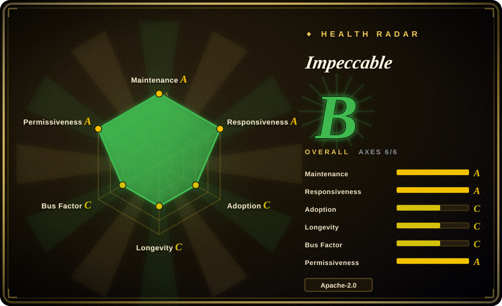
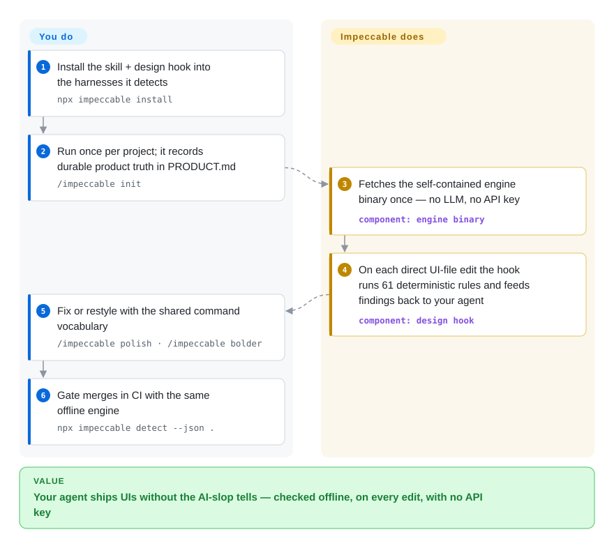

# Impeccable

When your AI-built UIs keep coming out with the same purple-gradient, bounce-easing "AI slop" look, Impeccable gives your coding agent a design language plus a deterministic linter: one `/impeccable` skill with 24 shared commands, and a self-contained engine binary that runs 61 detector rules — no LLM, no API key — against AI-generated frontend output on every edit and in CI.

## When to use

You're a frontend dev or a coding agent operator whose agent keeps shipping the same tells — purple-to-blue gradients, glassmorphism cards, bouncy easing, cramped padding, side-tab borders. The code works, but every screen looks like it came out of the same template, and "make it look better" prompts just produce a different flavor of the same slop. You want a deterministic, repeatable check that flags these patterns in CI and in the editor, plus a shared design vocabulary your agent can act on instead of vibes. You run `npx impeccable detect src/` (or point it at a URL, which drives an installed Chrome/Chromium/Edge), get a list of concrete violations with no API key needed, and wire the design hook so detectors fire on every file edit across Cursor, Claude Code, Copilot, Gemini CLI, Codex CLI, OpenCode and friends.

When you want the agent itself to improve the design rather than just lint it, you install the `/impeccable` skill and run subcommands like `audit`, `critique`, `polish`, `bolder`, or `quieter`, after `/impeccable init` distills your audience, brand, voice, colors and typography into `PRODUCT.md` / `DESIGN.md`. The deterministic detectors give you a hard, offline floor; the skill's LLM-driven critique commands give you the judgment layer on top. Current releases also add a live mode — iterating on visual variants in the browser against your local dev server.

## How it works

Impeccable ships in two layers. The layer you install is a skill: `npx impeccable install` drops provider-native skill/hook manifests into the harness folders it detects, and `/impeccable init` records durable product truth in `PRODUCT.md` so later commands don't confuse brand facts with surface styling. The layer that runs for you is a self-contained engine binary — fetched once into `~/.impeccable/bin/`, needing no LLM and no API key. A design hook registered by the installer fires that engine on every direct UI-file edit: 61 deterministic rules — fixed pattern checks like "is this another purple gradient" or "are the touch targets too small", not model guesses — flag AI-slop findings and feed them back into the agent's loop, so the model sees what it just wrote and fixes it. When you want judgment rather than lint, you call the 24 shared commands (`polish`, `bolder`, `quieter`, `critique`…) inside your agent, and gate merges in CI with the same engine (`npx impeccable detect --json .`). What stays yours: every actual code change, tuning out false positives on intentional styles, and pinning versions — the components ship fast.

<!-- flow-steps:begin (generated from flows/impeccable.json by tools/flow_card.py — do not edit) -->

Text version of the flow

1. **You**: Install the skill + design hook into the harnesses it detects — `npx impeccable install`
2. **You**: Run once per project; it records durable product truth in PRODUCT.md — `/impeccable init`
3. **Impeccable**: Fetches the self-contained engine binary once — no LLM, no API key — component: `engine binary`
4. **Impeccable**: On each direct UI-file edit the hook runs 61 deterministic rules and feeds findings back to your agent — component: `design hook`
5. **You**: Fix or restyle with the shared command vocabulary — `/impeccable polish · /impeccable bolder`
6. **You**: Gate merges in CI with the same offline engine — `npx impeccable detect --json .`

**Value**: Your agent ships UIs without the AI-slop tells — checked offline, on every edit, with no API key

<!-- flow-steps:end -->

## When NOT to use

- **You need a full design system / component library.** Impeccable critiques and detects; it does not give you tokens, components, or a Figma source of truth. Pair it with a real design system, don't replace one.
- **Your stack isn't web frontend.** The 61 rules target HTML/CSS/JS UI artifacts (line length, touch targets, heading order, AI-design patterns). Native mobile, backend, data viz, or non-web UI get little from it.
- **You want provider-neutral guarantees.** Integration is via provider-native skill/hook manifests built per harness (`dist/claude-code/`, `dist/cursor/`, …); a harness it doesn't ship a manifest for needs manual wiring, and the skill's command surface is Impeccable-specific lock-in.
- **You distrust opinionated taste baked into rules.** The deterministic rules encode one team's view of what "AI slop" is (e.g. flagging purple gradients, dark glows). Projects that intentionally use those styles will fight false positives. [推断]
- **You need a frozen, audited rule set.** CLI, Skill, engine and extension version independently and ship fast — the standalone engine alone went v0.1.1 → v0.1.6 in the three weeks to 2026-09-25 (GitHub releases); behavior moves under you between versions unless you pin.
- **You need URL scans in a locked-down environment.** `detect <url>` drives an *installed* Chrome, Chromium or Edge rather than bundling a browser, so a rendered-page scan needs one of those present; and the first run of the engine may fetch the pinned binary into `~/.impeccable/bin/`. On Claude Code the installer's hooks run independently of model-tool approval and can download the engine even if the session denies the launcher command — the README itself says to review installed hooks before unattended runs.

## Comparison

| Alternative | In index | Our verdict | Tradeoff |
|---|---|---|---|
| [html-anything](html-anything.md) | ✅ | Choose html-anything when you need agents to generate HTML artifacts. | Generates HTML artifacts from agents; Impeccable instead critiques/lints what an agent already produced. Complementary, not substitute. |
| [open-design](open-design.md) | ✅ | Choose open-design when you need a design-language/generation layer rather than a lint harness. | A design-language / generation layer in the same category; overlaps on "make agent design better" but differs on whether it lints existing output vs drives generation. Compare the two pages directly. |
| [guizang-ppt](../agent-skills/slides-ppt/guizang-ppt.md) | ✅ | Choose guizang-ppt when you need slide-deck generation as a skill-pack. | A skill-pack for slide-deck generation; narrow output type, no deterministic detector or CLI. Impeccable is broader frontend-quality tooling. |
| [guizang-social-card](../agent-skills/visual-content/guizang-social-card.md) | ✅ | Choose guizang-social-card when you need social-card generation as a skill-pack. | Skill-pack for social-card generation; single artifact type vs Impeccable's general UI linting. |
| ESLint + a11y plugins (eslint-plugin-jsx-a11y) | 未收录 | Choose ESLint/a11y plugins when you need mature AST-based accessibility/code linting. | Mature, AST-based linting for accessibility/code, fully offline; but no notion of "AI-design slop" patterns or aesthetic critique, and no agent-skill layer. |
| Stylelint | 未收录 | Choose Stylelint when you need deterministic CSS linting with a large rule ecosystem. | Deterministic CSS linting with a huge rule ecosystem; targets CSS correctness/conventions, not aesthetic AI-pattern detection or agent design coaching. |
| Lighthouse / axe-core | 未收录 | Choose Lighthouse or axe-core when you need rendered-page performance/accessibility audits. | Audits performance/accessibility on rendered pages; overlaps on URL scanning but not on AI-design-pattern detection or the skill-driven "polish/bolder/quieter" workflow. |

## Tech stack

- **Languages:** JavaScript (~73%) and Rust (~25%) per GitHub languages 2026-09 — the standalone engine is a Rust-compiled binary (`crates/`, `Cargo.toml` in the repo root); skill/CLI shims and the extension are JS. [推断：Rust crates 即引擎本体，据仓库结构未逐行读源码]
- **Distribution:** npm package (`npx impeccable` is a shim around the engine binary), per-platform engine binaries as GitHub release assets (darwin/linux/windows, x64/arm64), per-provider build outputs under `dist/<harness>/`, a Claude Code plugin marketplace, a VS Code/Copilot extension, and a Grok plugin.
- **Detector:** 61 deterministic rules that run with no LLM and no API key; covers AI-design patterns (gradients, glows, bounce easing, side-tab borders) and general quality (line length, padding, touch targets, heading order). Exact matching mechanism (regex/AST/heuristic) not documented.
- **URL scanning:** uses an installed Chrome, Chromium, or Edge to inspect the rendered page — no bundled browser download.
- **Skill surface:** one `/impeccable` skill with 24 commands; LLM-driven critique commands layered on top of the offline detectors; live mode iterates visual variants against a local dev server.
- **Browser extension:** Chrome MV3 extension (`extension/manifest.json` v1.4.0) running the same deterministic rules on live pages.

## Dependencies

- **Runtime:** none for the skill/hook path — the engine is a self-contained binary that ships next to the launcher or is fetched once into `~/.impeccable/bin/`. Node.js is needed only if you use the `npx impeccable` installer/CLI shim (a specific minimum version is not documented).
- **URL detection:** an installed Chrome / Chromium / Edge; nothing is downloaded for it.
- **LLM:** none required for the detector/engine/extension (explicitly "no LLM, no API key"); the skill's critique/polish commands run inside your coding agent and use whatever model that harness provides.
- **Install:** `npx impeccable install` (or Git-submodule / plugin-marketplace / direct-binary routes), then `/impeccable init` for one-time project setup; `npx impeccable update` refreshes an existing install.

## Ops difficulty

**Low.** The detector path is one `npx impeccable detect …` with no service to host, no API key, and `--json` output for CI (exit 0 clean / 2 findings); the engine binary needs no runtime. The agent-facing path is the skill/hook install, which is per-harness manifest wiring rather than infrastructure — but note Codex/Grok/Copilot need a one-time hook-trust approval step, and the README warns that Claude Code hooks run independently of model-tool approval. Ongoing burden is keeping up with the fast CLI/Skill/engine release cadence and tuning out false positives on intentional styles (per-repo waivers live in `.impeccable/config.json` and inline `impeccable-disable` comments).

## Health & viability

- **Responsiveness**: Grade A — median first-response time 7.3 hours across 32 qualifying issues/PRs (scorer, 2026-09-28).
- **Maintenance (as of 2026-09):** not archived, last commit 3 days before scoring, active in **all 13 of the last 13 weeks**; skill, CLI and the standalone engine all shipped releases between 2026-09-05 and 2026-09-25. Clearly in heavy development — and the same cadence is a churn risk (pin versions).
- **Governance & bus factor:** a `User`-owned repo (pbakaus) now at ~72k stars; the scorer counts 50 distinct active maintainers over 12 months but the top contributor holds ~79% of the commits — adoption rides overwhelmingly on one person, with no foundation or vendor backstop visible. [推断]
- **Age & Lindy verdict:** created 2025-11, so just under 1 year (repo age 316 days at scoring) — **young but no longer launch-week new**. The sustained 13-week activity streak is the real durability signal so far; the rule set and command surface are still moving, so treat longevity as unproven.
- **Adoption/ecosystem:** broad harness coverage — the README lists 17 supported tools (Claude Code, Cursor, Copilot, Gemini CLI, Codex CLI, OpenCode, Grok Build, Hermes, Trae, Qoder, Mistral Vibe, Veto …) plus a Chrome extension and a VS Code/Copilot plugin; 494,145 npm downloads/month and ~72k stars (scorer/GitHub, 2026-09) lower the bar to try it. That breadth is the main adoption signal.
- **Risk flags:** permissive Apache-2.0 (low legal/lock-in risk), but the detector encodes one team's aesthetic stance (false positives on intentional styles) and four surfaces (CLI, Skill, engine, extension) version independently — behavior moves between releases unless pinned.

## Caveats (unverified)

- [未验证] Version facts (CLI v4.1.0 released 2026-09-08; Skill v4.3.1 2026-09-09; engine v0.1.6 2026-09-25; extension manifest v1.4.0) are from GitHub releases/manifest as of 2026-09-28; the components version independently and ship fast, so any pin drifts quickly.
- [未验证] Star count ~71.9k as of 2026-09 — GitHub stars are unreliable and date-sensitive; indicative only.
- [未验证] The internal matching mechanism of the 61 detector rules (regex vs AST vs heuristic) and the complete rule list are not documented in the README surface read; "61 deterministic rules" is the project's own framing (its rule registry lives in `crates/live/assets/antipatterns.json`, not audited).
- [未验证] The precise set of supported harnesses and minimum Node version come from README prose and may change between releases — verify your specific harness/runtime against the current repo.
- [未验证] An earlier revision of this page claimed a Chrome **and Firefox** extension; the current repo shows a Chrome MV3 manifest and a Chrome Web Store listing only — Firefox support was not re-confirmed in this pass.
- [推断] The "AI slop" patterns the detector flags (e.g. purple gradients, dark glows) encode a specific aesthetic stance; whether a given flag is a true defect is project-dependent, so expect false positives on intentional designs.
