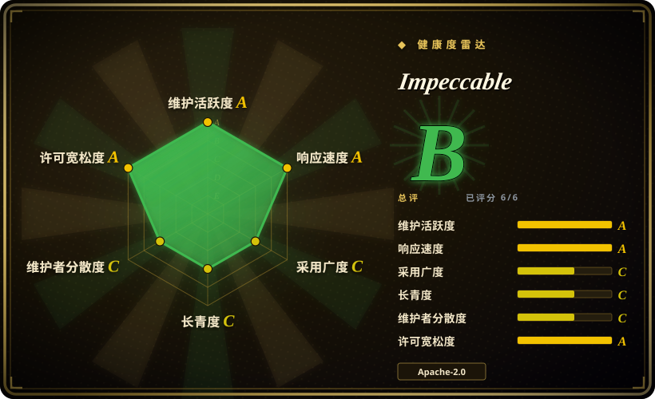
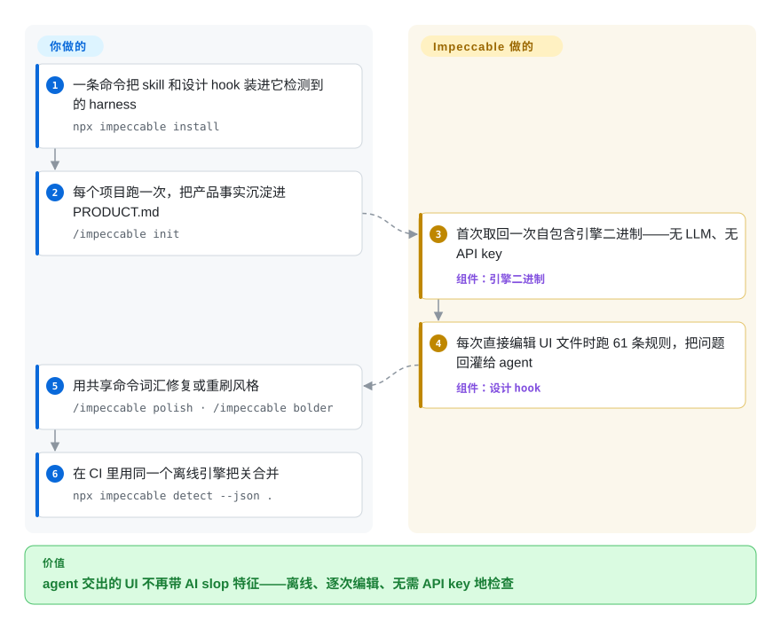

# Impeccable

当你的 AI 生成的 UI 总是带着同一股“紫渐变、弹跳缓动”的 AI slop 味，Impeccable 给你的 coding agent 一套设计语言加一台确定性 lint 机：一个 `/impeccable` skill（24 个共享命令），外加一个自包含引擎二进制，用 61 条 detector 规则——无 LLM、无 API key——在每次编辑和 CI 里扫描 AI 生成的前端产物。

## 何时使用

你是前端开发，或者负责运营某个 coding agent，而你的 agent 总是吐出同一批“AI 味”——紫蓝渐变、玻璃拟态卡片、弹跳缓动、过窄内边距、侧标签边框。代码能跑，但每个页面都像出自同一套模板，而“做得好看点”这类 prompt 只会换一种口味的同质 slop。你想要一个确定性、可复现的检查，在 CI 和编辑器里把这些模式标出来，再加一套 agent 能直接执行的共享设计词汇，而不是凭感觉。你跑 `npx impeccable detect src/`（或指向某个 URL，由本机已装的 Chrome/Chromium/Edge 去渲染），拿到一组具体违规项，全程不需要 API key，并把 design hook 接上，让 detector 在 Cursor、Claude Code、Copilot、Gemini CLI、Codex CLI、OpenCode 等 harness 的每次文件编辑时触发。

当你想让 agent 自己去改进设计而不只是 lint 时，就装上 `/impeccable` skill，在 `/impeccable init` 把你的受众、品牌、voice、配色和字体蒸馏进 `PRODUCT.md` / `DESIGN.md` 之后，运行 `audit`、`critique`、`polish`、`bolder`、`quieter` 等子命令。确定性 detector 给你一道离线的硬底线；skill 的 LLM 驱动 critique 命令在其上叠一层判断。当前版本还加入了 live 模式：对着本地 dev server 在浏览器里迭代视觉变体。

## 怎么用起来

Impeccable 分两层。你装进去的那层是 skill：`npx impeccable install` 把按 harness 生成的 skill/hook manifest 放进它检测到的目录，`/impeccable init` 把持久的产品事实写进 `PRODUCT.md`，让后续命令不把品牌事实和表面风格混为一谈。替你运行的那层是一个自包含引擎二进制——首次使用时取回一次放进 `~/.impeccable/bin/`，不需要 LLM、不需要 API key。安装器注册好的 design hook 会在每次直接编辑 UI 文件时调用这个引擎：61 条确定性规则——“这又是紫渐变吗”“触控目标是不是太小”这类固定检查，不是模型猜测——把 AI slop 问题回灌进 agent 的循环，让模型看见自己刚写了什么并改掉。想要判断而不只是 lint 时，你在 agent 里调用 24 个共享命令（`polish`、`bolder`、`quieter`、`critique` 等）；合并把关则在 CI 里跑同一个引擎（`npx impeccable detect --json .`）。留在你手上的：每一处实际代码改动、对有意为之风格的误报调优，以及版本锁定——这几个组件发版都很快。

<!-- flow-steps:begin (generated from flows/impeccable.json by tools/flow_card.py — do not edit) -->

流程文字版

1. **你**：一条命令把 skill 和设计 hook 装进它检测到的 harness — `npx impeccable install`
2. **你**：每个项目跑一次，把产品事实沉淀进 PRODUCT.md — `/impeccable init`
3. **Impeccable**：首次取回一次自包含引擎二进制——无 LLM、无 API key — 组件：`引擎二进制`
4. **Impeccable**：每次直接编辑 UI 文件时跑 61 条规则，把问题回灌给 agent — 组件：`设计 hook`
5. **你**：用共享命令词汇修复或重刷风格 — `/impeccable polish · /impeccable bolder`
6. **你**：在 CI 里用同一个离线引擎把关合并 — `npx impeccable detect --json .`

**价值**：agent 交出的 UI 不再带 AI slop 特征——离线、逐次编辑、无需 API key 地检查

<!-- flow-steps:end -->

## 何时不用

- **你需要一套完整设计系统 / 组件库。** Impeccable 做的是 critique 和 detect，不给你 token、组件或 Figma 事实源。把它和真正的设计系统配合用，别拿它替代。
- **你的技术栈不是 Web 前端。** 这 61 条规则面向 HTML/CSS/JS 的 UI 产物（行长、触控目标、标题层级、AI 设计模式）。原生移动端、后端、数据可视化或非 Web UI 几乎用不上。
- **你想要跨 provider 的一致保证。** 集成靠按 harness 构建的 provider-native skill/hook manifest（`dist/claude-code/`、`dist/cursor/` 等）；没有对应 manifest 的 harness 需要手动接线，而且 skill 的命令面是 Impeccable 专有锁定。
- **你不信任写进规则里的主观审美。** 确定性规则编码了某个团队对“AI slop”的看法（比如把紫渐变、暗发光判为问题）。有意使用这些风格的项目会和误报搏斗。[推断]
- **你需要一套冻结、可审计的规则集。** CLI、Skill、engine 与扩展各自独立发版且更新很快——仅独立引擎就在截至 2026-09-25 的三周内从 v0.1.1 走到 v0.1.6（GitHub releases）；不 pin 版本，行为会在版本间漂移。
- **封闭环境里要做 URL 扫描。** `detect <url>` 驱动的是本机已装的 Chrome/Chromium/Edge，不再捆绑下载浏览器，所以渲染页扫描要求环境里有其中之一；引擎首次运行还可能把 pin 住的二进制取回 `~/.impeccable/bin/`。在 Claude Code 上，安装器注册的 hook 独立于模型工具审批运行，即便会话拒绝了 launcher 命令也可能先下载引擎——README 自己就提醒无人值守运行前先审一遍已安装的 hook。

## 横向对比

| 替代品 | 是否收录 | 我们的评价 | 取舍 |
|---|---|---|---|
| [html-anything](html-anything.zh.md) | ✅ | 需要 agent 生成 HTML 产物时，选 html-anything。 | 由 agent 生成 HTML 产物；Impeccable 则是 critique/lint agent 已经产出的东西。互补而非替代。 |
| [open-design](open-design.zh.md) | ✅ | 需要设计语言/生成层而非 lint harness 时，选 open-design。 | 同类目下的设计语言 / 生成层；在“让 agent 设计更好”上有重叠，但分歧在于是 lint 现有产物还是驱动生成。建议直接对照两页。 |
| [guizang-ppt](../agent-skills/slides-ppt/guizang-ppt.zh.md) | ✅ | 需要幻灯片生成 skill-pack 时，选 guizang-ppt。 | 面向幻灯片生成的 skill-pack；产物类型窄，没有确定性 detector 或 CLI。Impeccable 是更宽的前端质量工具。 |
| [guizang-social-card](../agent-skills/visual-content/guizang-social-card.zh.md) | ✅ | 需要社交卡片生成 skill-pack 时，选 guizang-social-card。 | 社交卡片生成的 skill-pack；单一产物类型，对比 Impeccable 的通用 UI linting。 |
| ESLint + a11y 插件（eslint-plugin-jsx-a11y） | 未收录 | 需要成熟 AST-based 可访问性/代码 linting 时，选 ESLint/a11y 插件。 | 成熟、基于 AST 的可访问性/代码 linting，完全离线；但没有“AI 设计 slop”模式概念，也没有审美 critique 或 agent-skill 层。 |
| Stylelint | 未收录 | 需要规则生态庞大的确定性 CSS linting 时，选 Stylelint。 | 确定性 CSS linting，规则生态庞大；面向 CSS 正确性/约定，而非审美 AI 模式检测或 agent 设计辅导。 |
| Lighthouse / axe-core | 未收录 | 需要渲染后页面的性能/可访问性审计时，选 Lighthouse 或 axe-core。 | 在渲染后的页面上审计性能/可访问性；在 URL 扫描上有重叠，但不做 AI 设计模式检测，也没有 skill 驱动的 "polish/bolder/quieter" 工作流。 |

## 技术栈

- **语言：** JavaScript（约 73%）与 Rust（约 25%，GitHub languages 2026-09）——独立引擎是 Rust 编译的二进制（仓库根有 `crates/`、`Cargo.toml`）；skill/CLI 垫片与扩展是 JS。[推断：Rust crates 即引擎本体，据仓库结构未逐行读源码]
- **分发：** npm 包（`npx impeccable` 只是引擎二进制的垫片）、按平台的引擎二进制（darwin/linux/windows，x64/arm64，作为 GitHub release 资产）、按 provider 的构建产物放在 `dist/<harness>/`、一个 Claude Code plugin marketplace、一个 VS Code/Copilot 扩展和一个 Grok 插件。
- **Detector:** 61 条确定性规则，无 LLM、无 API key 运行；覆盖 AI 设计模式（渐变、发光、弹跳缓动、侧标签边框）和通用质量（行长、内边距、触控目标、标题层级）。具体匹配机制（正则/AST/启发式）未文档化。
- **URL 扫描：** 使用本机已装的 Chrome、Chromium 或 Edge 检查渲染后的页面——不捆绑下载浏览器。
- **Skill 面：** 一个 `/impeccable` skill，24 个命令；LLM 驱动的 critique 命令叠在离线 detector 之上；live 模式对着本地 dev server 在浏览器里迭代视觉变体。
- **浏览器扩展：** Chrome MV3 扩展（`extension/manifest.json` v1.4.0），在实时页面上跑同一套确定性规则。

## 依赖

- **运行时：** skill/hook 路径不需要运行时——引擎是自包含二进制，随 launcher 同目录分发或首次使用时取回一次放进 `~/.impeccable/bin/`。只有走 `npx impeccable` 安装器/CLI 垫片才需要 Node.js（未文档化具体最低版本）。
- **URL 检测：** 需要本机已装 Chrome / Chromium / Edge；该路径不下载任何东西。
- **LLM:** detector/引擎/扩展不需要（明确“无 LLM、无 API key”）;skill 的 critique/polish 命令在你的 coding agent 内运行，用该 harness 提供的模型。
- **安装：** `npx impeccable install`（另有 Git-submodule、plugin marketplace、直接下载二进制等路径），然后 `/impeccable init` 做一次性项目初始化；`npx impeccable update` 刷新已有安装。

## 运维难度

**低。** detector 路径就是一行 `npx impeccable detect …`，无需托管服务、无需 API key，`--json` 输出供 CI 使用（退出码 0 干净、2 有发现），引擎二进制不需要运行时。面向 agent 的路径是 skill/hook 安装，属于按 harness 写 manifest 的接线工作而非基础设施——但注意 Codex/Grok/Copilot 需要一次性 hook-trust 批准，README 也提醒 Claude Code 的 hook 独立于模型工具审批运行。日常负担主要是跟上 CLI/Skill/engine 的快发版节奏，以及对有意为之的风格调掉误报（豁免放在 `.impeccable/config.json` 或文件内 `impeccable-disable` 注释里）。

## 健康度与可持续性

- **响应速度**：Grade A——中位首次响应时间 7.3 小时，基于 32 个 qualifying issues/PRs（评分器，2026-09-28）。
- **维护（截至 2026-09）：** 未归档，最后提交距评分 3 天，近 13 周全部 13 周活跃；skill、CLI 与独立引擎均在 2026-09-05 至 2026-09-25 间发版。明显处于密集开发——同样的节奏也是 churn 风险（请锁版本）。
- **治理与 bus factor：** `User` 所有的仓库（pbakaus），如今约 72k star；评分器数到 12 个月内有 50 位活跃维护者，但头号贡献者占了约 79% 的提交——采用度高度押在一个人身上，看不到基金会或厂商兜底。[推断]
- **年龄与 Lindy 判断：** 建于 2025-11，评分时仓库 316 天、接近但不足 1 年——**年轻，但已过了发布首周的热乎劲**。13 周全活跃的纪录是目前真正的耐久信号；规则集与命令面仍在动，延续性视为未被证明。
- **采用/生态：** harness 覆盖广——README 列出 17 个受支持工具（Claude Code、Cursor、Copilot、Gemini CLI、Codex CLI、OpenCode、Grok Build、Hermes、Trae、Qoder、Mistral Vibe、Veto 等），外加 Chrome 扩展和 VS Code/Copilot 插件；npm 月下载 494,145、star 约 7.2 万（评分器/GitHub，2026-09），试用门槛低。这份广度是主要的采用信号。
- **风险标记：** 宽松的 Apache-2.0（法务/锁定风险低），但 detector 编码了某团队的审美立场（对有意为之的风格会误报），且 CLI、Skill、引擎、扩展四个面各自独立发版——不 pin 版本，行为会在版本间漂移。

## 存疑（未验证）

- [未验证] 版本事实（CLI v4.1.0 发布于 2026-09-08；Skill v4.3.1 为 2026-09-09；engine v0.1.6 为 2026-09-25；扩展 manifest v1.4.0）取自 2026-09-28 的 GitHub releases/manifest；各组件独立发版且更新很快，任何 pin 都会迅速过时。
- [未验证] star 约 71.9k（截至 2026-09）——GitHub star 不可靠且对时间敏感，仅供参考。
- [未验证] 61 条 detector 规则的内部匹配机制（正则 vs AST vs 启发式）与完整规则清单在所读 README 表面未文档化；“61 条确定性规则”是项目自己的表述（规则登记表在 `crates/live/assets/antipatterns.json`，未逐条审计）。
- [未验证] 受支持 harness 的确切集合与最低 Node 版本来自 README 文字，可能随版本变化——依赖前请对照当前仓库核实你的 harness/运行时。
- [未验证] 本页早前版本称扩展覆盖 Chrome 与 Firefox；当前仓库只见 Chrome MV3 manifest 与 Chrome Web Store 上架文案——Firefox 支持本轮未能再核实。
- [推断] detector 标记的“AI slop”模式（如紫渐变、暗发光）编码了一种特定审美立场；某个标记是否真是缺陷取决于项目，有意为之的设计要预期会有误报。
