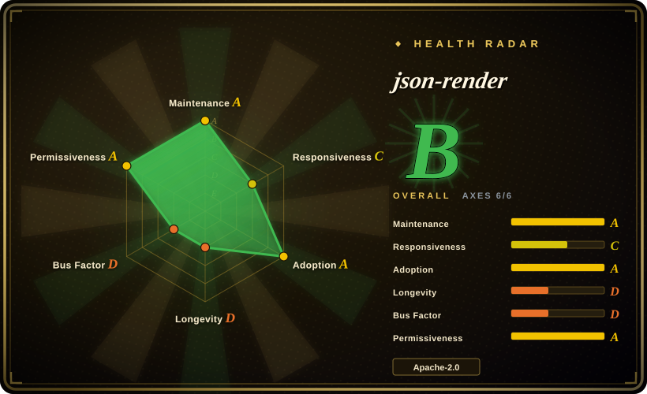
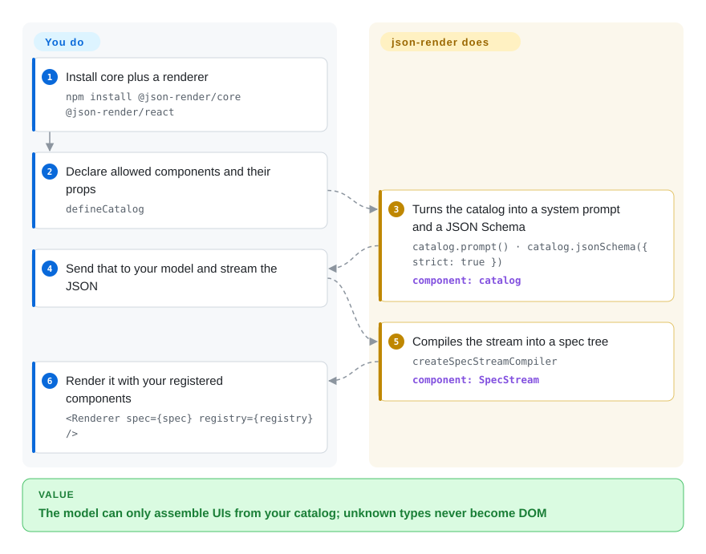

# json-render

You asked the model for a dashboard and it invented a GlowCard you don't ship, or dumped JSX that won't compile. json-render makes the model pick from the components you already registered and emit a JSON tree your renderer already knows how to paint.

## When to use

You're shipping a chat product, an internal ops console, or an agent surface that must show a dashboard, a form, or an invoice *inside your running app*. The model keeps doing one of two things: it writes JSX that imports a component you never published, or it emits JSON with a type you don't have — `GlowCard` — and the screen either crashes or looks off-brand. Repairing that in a retry loop burns tokens and still occasionally paints something you would never have designed.

Reach for json-render when the deciding tradeoff is **catalog over codegen**. You already have (or will write) a finite set of React / Vue / Svelte / Solid components. You register their props as Zod schemas. The model is only allowed to pick from that list. The output is a JSON spec your renderer paints — not source files you then review, merge, and deploy. Pick it over v0 or Lovable when the UI must stay inside the app and the design system you already ship; pick [HTML Anything](html-anything.md) or [Open Design](open-design.md) when the deliverable is a file (HTML / PPTX / MP4) produced by a coding-agent CLI, not a runtime tree.

## How it works

json-render does not sit in the model's sampling loop. You declare a catalog — allowed component names, Zod prop schemas, and actions. From that catalog it builds two artifacts you hand to the model: a system prompt (`catalog.prompt()`) that lists the parts bin, and optionally a JSON Schema (`catalog.jsonSchema({ strict: true })`) for a provider's structured-output API. The model streams a spec: a `root` key plus an `elements` map, or JSONL patches. `createSpecStreamCompiler` assembles the tree as chunks arrive. After generation, `catalog.validate()` runs Zod over the spec and `validateSpec` checks structural mistakes the model often makes (missing root, dangling children). `defineRegistry` maps each `type` string onto a real component; `<Renderer>` paints only those. Unknown types never become DOM because they are not in the registry — but the model can still emit invalid JSON until you validate. That is a parts bin plus an inspector, not a keyboard that cannot type illegal letters (that job is [XGrammar](../llm-inference/structured-generation/xgrammar.md)).

<!-- flow-steps:begin (generated from flows/json-render.json by tools/flow_card.py — do not edit) -->

Text version of the flow

1. **You**: Install core plus a renderer — `npm install @json-render/core @json-render/react`
2. **You**: Declare allowed components and their props — `defineCatalog`
3. **json-render**: Turns the catalog into a system prompt and a JSON Schema — `catalog.prompt() · catalog.jsonSchema({ strict: true })` — component: `catalog`
4. **You**: Send that to your model and stream the JSON
5. **json-render**: Compiles the stream into a spec tree — `createSpecStreamCompiler` — component: `SpecStream`
6. **You**: Render it with your registered components — `<Renderer spec={spec} registry={registry} />`

**Value**: The model can only assemble UIs from your catalog; unknown types never become DOM

<!-- flow-steps:end -->

## When NOT to use

- **You want the model to write source you will keep in git.** json-render emits a runtime JSON spec, not `.tsx` files. Use v0 (hosted, not a repo) or a coding agent when the deliverable is code you will review and own.
- **The deliverable is a file, not an in-app tree.** For Markdown-to-shippable-HTML with WeChat / X / Zhihu export, use [HTML Anything](html-anything.md). For a local-first desktop studio that also does decks and HTML→MP4, use [Open Design](open-design.md).
- **You need the JSON to be valid *by construction* at the token.** json-render's guardrail is a prompt, an optional JSON Schema, and Zod after the fact. If you own the logits and a missing brace is unacceptable, use [XGrammar](../llm-inference/structured-generation/xgrammar.md) (or the provider's structured-output mode) and treat json-render as the UI layer on top, not the constraint layer.
- **You do not want to maintain a component catalog.** The catalog *is* the product. If you would rather let the model invent layout in free HTML/JSX, write React yourself or use a codegen tool; json-render will not invent components you did not register.
- **You are on React 18 or Zod 3.** `@json-render/react` 0.21.0 peers `react@^19.2.3`; `@json-render/core` peers `zod@^4.0.0`. Stay on your current stack, or budget the upgrade, rather than expecting a compatibility shim that is not in the package metadata.
- **You need native SwiftUI or Android views.** The mobile path is React Native. There is no UIKit / Jetpack renderer in the published package list.
- **You only wanted a design-system kit.** The shadcn pack is 36 pre-built components *for this runtime*. If you just need buttons and cards in a normal React app, use shadcn/ui directly, not this framework.
- **You cannot tolerate 0.x churn or a Labs label.** The repo is a Vercel Labs product, versioned 0.21.x, with breaking changes called out in the changelog (for example the `executeAction` callback shape in 0.20.0). Pin the version; do not treat the API as frozen.

## Comparison

| Alternative | In index | Our verdict | Tradeoff |
|---|---|---|---|
| [HTML Anything](html-anything.md) | ✅ | Pick HTML Anything when a logged-in coding-agent CLI should turn Markdown into a shippable HTML file. Pick json-render when the model must assemble UI *inside* your running app from components you already ship. | HTML Anything produces a file via a spawned CLI and never enters your product runtime; json-render is a library you embed, and you must own the catalog and the model call. |
| [Open Design](open-design.md) | ✅ | Pick Open Design for a local-first desktop studio (prototypes, decks, images, HTML→MP4). Pick json-render when generative UI is a feature of an existing web/mobile app, not a separate studio. | Open Design is an Electron app you operate; json-render is a package you import. Studio breadth versus in-process control. |
| [XGrammar](../llm-inference/structured-generation/xgrammar.md) | ✅ | Pick XGrammar when you own the logits and a malformed token must be impossible. Pick json-render when the problem is *which components the model may name*, after a JSON string already exists. | XGrammar masks tokens inside generation; json-render constrains a component vocabulary with a prompt, a JSON Schema, and Zod. They stack: XGrammar (or hosted structured output) for shape, json-render for the parts bin. |
| Vercel AI SDK (`vercel/ai`) | 未收录 | Pick the AI SDK's generative-UI / streaming-UI helpers when you want React Server Components streamed as UI and you already live in that SDK. Pick json-render when the contract must be a catalogued JSON spec that also renders on Vue, Svelte, Solid, RN, PDF, or email. | The AI SDK path is React/RSC-shaped and does not give you a cross-renderer JSON catalog; json-render is catalog-first and model-agnostic, and you wire the model yourself. Left unindexed in this change because it is a large SDK, not a gen-UI-only repo. |
| v0 | 非仓库 | Pick v0 when you want hosted codegen that writes React source. Pick json-render when the model must not invent components and the UI must render from a spec at runtime. | v0 is a hosted product (no git repository as the unit of use). You get source files and a vendor workflow; json-render gives you an in-app parts bin and no hosted editor. |

## Tech stack

- **Language:** TypeScript. Published as a pnpm + Turborepo workspace of `@json-render/*` packages; all public packages share the `@json-render/core` version (0.21.0 as of 2026-09-18).
- **Core:** `@json-render/core` — catalogs, Zod schemas, `catalog.prompt()` / `catalog.jsonSchema()` / `catalog.validate()`, SpecStream (RFC 6902 JSON Patch lines), visibility, dynamic props (`$state`, `$cond`, `$template`, `$computed`), actions, directives. Runtime dependency: `zod` ^4.
- **Renderers (separate packages):** React, Vue 3, Svelte 5, Solid, React Native, Next.js, TanStack Start, Remotion, react-pdf, react-email, Ink, Satori image (SVG/PNG), React Three Fiber. `@json-render/react` peers `react@^19.2.3`.
- **Optional batteries:** `@json-render/shadcn` (36 shadcn/ui components), shadcn-svelte, Redux / Zustand / Jotai / XState store adapters, MCP Apps package, YAML wire format, codegen, framework-agnostic devtools.
- **Monorepo only (not the published library):** root `package.json` `engines` require Node `>=24` and pnpm `>=11` to *develop* the repo; published packages do not declare an `engines` field.

## Dependencies

- **Runtime library path:** Node + your chosen renderer. `@json-render/core` peers Zod 4; the React renderer peers React 19.2.3. No database, no daemon, no bundled model.
- **Model:** you bring the LLM. The library builds the prompt and schema; examples in-repo use the Vercel AI SDK (`streamText`) and an `AI_GATEWAY_API_KEY`, but that is the demo path, not a required dependency of `@json-render/core`.
- **Optional, per renderer:** Remotion, `@react-pdf/renderer`, `@react-email/*`, Ink, Satori / `@resvg/resvg-js`, Three.js / R3F, Next.js or TanStack Start — only if you install that package.
- **Dev of the upstream repo:** `portless` must be installed globally for `pnpm dev`; not needed to consume the npm packages.

## Ops difficulty

**Low as a library; the recurring cost is the catalog, not a server.** Install from npm, register components, call your model, render. There is nothing to host. What you will actually maintain: keep the catalog in sync with the components you ship, pin a 0.x version and read changelog breaking changes, and decide whether the model is constrained by prompt-only, by `jsonSchema({ strict: true })` on a provider API, or by both plus `catalog.validate()`. Streaming is progressive JSON, not a separate infra piece. Contributing to the upstream monorepo is a different bar (Node 24, pnpm 11, global `portless`).

## Health & viability

- **Maintenance — A (checked 2026-09-23).** Created 2026-01-14; `main` pushed 2026-09-21; latest tag `v0.21.0` published 2026-09-18. Last commit 4 days old, 6 active weeks in 13. Releases are frequent on a 0.x line (0.16 through 0.21 in 2026). Not archived. Active, and the same cadence is API-churn risk — pin it.
- **Responsiveness — C.** Median first response 545.1 hours across 3 qualifying issues. Shipping is fast; answering the issue tracker is not. Do not read the Labs badge as "someone will reply this week".
- **Governance — D.** 22 active maintainers in 12 months, but top-1 share 0.851 (`ctate`). Org is `vercel-labs`. No `CONTRIBUTING.md`, `CODEOWNERS`, or `SECURITY.md` in the tree at this revision. Treat Vercel as the backing vendor and one person as the day-to-day bus factor.
- **Longevity — D.** Repo age 252 days. **Young, high stars (~18.1k as of 2026-09-23).** Age × still-active does not yet give a Lindy prior; the star count is interest, not durability. Vercel Labs product (README Labs badge added 2026-09-16) — Labs is not a committed product line.
- **Adoption — A on npm volume, empty dependent graph.** `@json-render/core` last-month downloads 5357976 (scored 2026-09-23); `dependent_repos_count` is 0. Volume without a public dependent graph is a dated registry number, not proof of production share.
- **Risk / license — A.** Apache-2.0, no relicense in 36 months. Pre-1.0 with documented breaking changes. Peer-dep floor is React 19 + Zod 4. Open issues ~109 at review time.

## Caveats (unverified)

- [未验证] Star count ~18.1k and npm last-month downloads (~5.3M core / ~3.1M react) are dated 2026-09-23 / 2026-08-23–2026-09-21; both series inflate and drift. The download figure was not cross-checked against dependents.
- [未验证] Whether `jsonSchema({ strict: true })` is actually accepted unchanged by OpenAI / Anthropic / Gemini structured-output endpoints was not reproduced; the comment in `packages/core/src/schema.ts` is the project's own claim, and it documents that record/map types become opaque objects under `strict`.
- [未验证] Published packages declare no `engines` field; the Node `>=24` requirement is the monorepo's, not a verified consumer floor.
- [未验证] No `SECURITY.md` / `CONTRIBUTING.md` / `CODEOWNERS` were present in the tree at this revision; a private vulnerability channel outside the repo was not confirmed.
- [推断] Contributor concentration (`ctate` far ahead of the next human) is from the GitHub contributors API on 2026-09-23 and is not identity-deduplicated.
- [推断] "Vercel Labs can be sunset" is the usual Labs-product reading, not a Vercel statement about this repo.
- [推断] Vercel AI SDK (`vercel/ai`) is a real repository deliberately left unindexed by this change; the generative-UI comparison is from public positioning, not from a page read here.
- [未验证] React Native / Vue / Svelte / Solid / PDF / email / Ink renderers were not executed; package presence in `packages/` and README install lines are the evidence.
- [未验证] "36 shadcn/ui components" is the README figure; the component list was not counted in this review.
