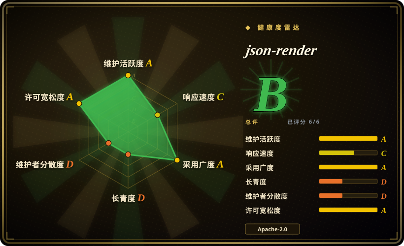
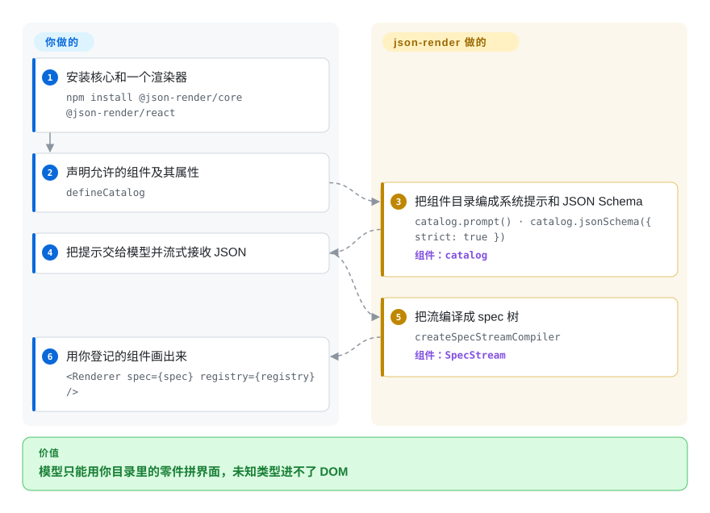

# json-render

你让模型画一张仪表盘，它发明了一个你根本没有的卡片，或者甩出一堆编不过的 JSX。json-render 让模型只能从你登记过的组件里挑，吐一棵渲染器已经会画的 JSON 树。

## 何时使用

你在做聊天产品、内部运维台，或一个必须在**正在跑的应用里**画出仪表盘、表单、发票的 agent 界面。模型总是干两件坏事之一：写出一堆 import 了你从未发布的组件的 JSX，或者吐出带 `GlowCard` 这种你没有的类型的 JSON——屏幕要么崩，要么看起来完全不像你们的品牌。用重试循环去修，既烧 token，偶尔还是会画出你绝不会设计的东西。

选 json-render 的那条取舍是**目录优先，而不是生成源码**。你已经有（或准备写）一套有限的 React / Vue / Svelte / Solid 组件，用 Zod 登记它们的 props，模型只能从这张清单里挑。产出是渲染器会画的 JSON spec，不是你还要 review、合并、再部署的源文件。当界面必须留在应用里、必须用你已经在用的设计系统时，选它而不是 v0 或 Lovable；当交付物是 coding-agent CLI 产出的文件（HTML / PPTX / MP4）而不是运行时的树时，选 [HTML Anything](html-anything.zh.md) 或 [Open Design](open-design.zh.md)。

## 快问快答

**这是 chatbot 的展示层吗？**
对，这就是主场。仓库里有 `examples/chat` 和 `examples/harness-chat`。但不止展示：按钮会触发你登记过的动作，表单能写回状态。模型不能发明你没登记的零件。Markdown 气泡加几张静态卡，上它会重；要模型直接写 React 源码，用 v0。

**CopilotKit 是不是一回事，已经收录了吗？**
没收录。重叠的只是「聊天里画出界面」。CopilotKit 是整套把 agent 塞进应用的 SDK——自带聊天 UI、共享状态、人在环里、Slack/Teams、托管的 Intelligence。json-render 只管零件箱。

## 怎么用起来

json-render 并不坐进模型的采样循环。你声明一份目录：允许的组件名、Zod 属性 schema、以及 actions。它从这份目录做出两样你交给模型的东西：列出零件箱的系统提示（`catalog.prompt()`），以及可选的、给供应商 structured-output API 用的 JSON Schema（`catalog.jsonSchema({ strict: true })`）。模型流式吐出一份 spec：一个 `root` 键加一张 `elements` 表，或 JSONL 补丁。`createSpecStreamCompiler` 在分片到达时把树拼起来。生成之后，`catalog.validate()` 用 Zod 校验 spec，`validateSpec` 再抓模型常犯的结构错误（缺 root、子节点悬空）。`defineRegistry` 把每个 `type` 字符串映射到真正的组件；`<Renderer>` 只画这些。未知类型进不了 DOM，因为 registry 里没有它们——但在你真正 `validate()` 之前，模型仍可能吐出非法 JSON。这是零件箱加质检员，不是一台打不出非法字母的键盘（那是 [XGrammar](../llm-inference/structured-generation/xgrammar.zh.md) 的活）。

<!-- flow-steps:begin (generated from flows/json-render.json by tools/flow_card.py — do not edit) -->

流程文字版

1. **你**：安装核心和一个渲染器 — `npm install @json-render/core @json-render/react`
2. **你**：声明允许的组件及其属性 — `defineCatalog`
3. **json-render**：把组件目录编成系统提示和 JSON Schema — `catalog.prompt() · catalog.jsonSchema({ strict: true })` — 组件：`catalog`
4. **你**：把提示交给模型并流式接收 JSON
5. **json-render**：把流编译成 spec 树 — `createSpecStreamCompiler` — 组件：`SpecStream`
6. **你**：用你登记的组件画出来 — `<Renderer spec={spec} registry={registry} />`

**价值**：模型只能用你目录里的零件拼界面，未知类型进不了 DOM

<!-- flow-steps:end -->

## 何时不用

- **你要模型写出你会收进 git 的源码。** json-render 吐的是运行时 JSON spec，不是 `.tsx` 文件。交付物是要 review、要自己拥有的代码时，用 v0（托管产品，不是仓库）或 coding agent。
- **交付物是文件，不是应用内的树。** 要把 Markdown 变成可投的 HTML 并导出微信 / X / 知乎，用 [HTML Anything](html-anything.zh.md)。要本地优先的桌面 studio，顺带做 deck 和 HTML→MP4，用 [Open Design](open-design.zh.md)。
- **你需要 JSON 在 token 这一层就不可能非法。** json-render 的护栏是提示词、一份可选的 JSON Schema，以及事后的 Zod。如果你握着 logits、少一个括号都不能接受，用 [XGrammar](../llm-inference/structured-generation/xgrammar.zh.md)（或供应商的 structured-output），把 json-render 当作上面的 UI 层，而不是约束层。
- **你不想维护一份组件目录。** 目录本身就是产品。如果更想让模型用自由 HTML/JSX 发明布局，自己写 React 或用 codegen；json-render 不会发明你没登记的组件。
- **你还在 React 18 或 Zod 3。** `@json-render/react` 0.21.0 的 peer 是 `react@^19.2.3`；`@json-render/core` 的 peer 是 `zod@^4.0.0`。留在现有栈，或把升级算进成本，不要指望包元数据里没有的兼容层。
- **你需要原生 SwiftUI 或 Android 视图。** 移动端路径是 React Native。已发布的包列表里没有 UIKit / Jetpack 渲染器。
- **你其实只要一套设计系统。** shadcn 包是给这个运行时准备的 36 个现成组件。普通 React 应用里只要按钮和卡片，直接用 shadcn/ui，不要上这套框架。
- **你要的是整套 copilot 产品，不是零件箱。** 聊天外壳、共享 agent 状态、人在环里、Slack/Teams——那是 CopilotKit（`未收录`），不是这个包。
- **你受不了 0.x 的接口变动，或 Labs 标签。** 这是 Vercel Labs 产品，版本 0.21.x，changelog 里点名过 breaking change（例如 0.20.0 的 `executeAction` 回调形状）。钉死版本，别把 API 当成冻结的。

## 横向对比

| 替代品 | 是否收录 | 我们的评价 | 取舍 |
|---|---|---|---|
| [HTML Anything](html-anything.zh.md) | 已收录 | 当已登录的 coding-agent CLI 要把 Markdown 变成可投 HTML 文件时选 HTML Anything；当模型必须在你正在跑的应用里、用你已有的组件拼界面时选 json-render。 | HTML Anything 经 spawn CLI 产出文件，从不进入你的产品运行时；json-render 是你嵌入的库，目录和模型调用都得自己扛。 |
| [Open Design](open-design.zh.md) | 已收录 | 要本地优先的桌面 studio（原型、deck、图像、HTML→MP4）时选 Open Design；当生成式 UI 是现有 web/mobile 应用的一项功能、而不是单独 studio 时选 json-render。 | Open Design 是你操作的 Electron 应用；json-render 是你 import 的包。studio 的广度对上进程内的控制权。 |
| [XGrammar](../llm-inference/structured-generation/xgrammar.zh.md) | 已收录 | 当你握着 logits、畸形 token 必须不可能出现时选 XGrammar；当问题是「模型可以点名哪些组件」、而 JSON 字符串已经存在时选 json-render。 | XGrammar 在生成过程里掩 token；json-render 用提示词、JSON Schema 和 Zod 约束组件词表。两者可叠：XGrammar（或托管 structured output）管形状，json-render 管零件箱。 |
| CopilotKit（`CopilotKit/CopilotKit`） | 未收录 | 要整套把 agent 塞进应用的 SDK（聊天 UI、共享状态、人在环里、Slack/Teams）时选 CopilotKit；你已经有聊天、只需要模型用你的目录拼界面时选 json-render。 | CopilotKit 是 agent 和用户之间的产品层；json-render 是你嵌入的、编过目的 JSON 渲染器。本次不收录，因为这次只把阅读对话补进已有页。 |
| v0 | 非仓库 | 要托管式 codegen、写出 React 源码时选 v0；当模型不许发明组件、界面必须在运行时从 spec 画出来时选 json-render。 | v0 是托管产品（使用单元不是 git 仓库）。你得到源文件和供应商工作流；json-render 给你应用内的零件箱，没有托管编辑器。 |

## 技术栈

- **语言：** TypeScript。以 pnpm + Turborepo 工作区发布 `@json-render/*` 包；所有公开包跟 `@json-render/core` 同一个版本（截至 2026-09-18 为 0.21.0）。
- **核心：** `@json-render/core`——目录、Zod schema、`catalog.prompt()` / `catalog.jsonSchema()` / `catalog.validate()`、SpecStream（RFC 6902 JSON Patch 行）、可见性、动态属性（`$state`、`$cond`、`$template`、`$computed`）、actions、directives。运行时依赖：`zod` ^4。
- **渲染器（独立包）：** React、Vue 3、Svelte 5、Solid、React Native、Next.js、TanStack Start、Remotion、react-pdf、react-email、Ink、Satori 图像（SVG/PNG）、React Three Fiber。`@json-render/react` 的 peer 是 `react@^19.2.3`。
- **可选电池：** `@json-render/shadcn`（36 个 shadcn/ui 组件）、shadcn-svelte、Redux / Zustand / Jotai / XState 的 store 适配器、MCP Apps 包、YAML 线格式、codegen、框架无关的 devtools。
- **只对上游 monorepo（不是已发布的库）：** 根 `package.json` 的 `engines` 要求 Node `>=24` 和 pnpm `>=11` 才能*开发*该仓库；已发布的包没有声明 `engines` 字段。

## 依赖

- **库的运行时路径：** Node + 你选的渲染器。`@json-render/core` peer Zod 4；React 渲染器 peer React 19.2.3。没有数据库、没有守护进程、不捆绑模型。
- **模型：** 你自己带 LLM。库只构建提示词和 schema；仓库里的例子用 Vercel AI SDK（`streamText`）和 `AI_GATEWAY_API_KEY`，那是 demo 路径，不是 `@json-render/core` 的必需依赖。
- **按渲染器可选：** Remotion、`@react-pdf/renderer`、`@react-email/*`、Ink、Satori / `@resvg/resvg-js`、Three.js / R3F、Next.js 或 TanStack Start——只有你安装对应包时才需要。
- **开发上游仓库：** `pnpm dev` 需要全局安装 `portless`；消费 npm 包不需要。

## 运维难度

**作为库是低；你真正要维护的是目录，不是一台服务器。** npm 安装、登记组件、调用模型、渲染。没有东西要托管。日常成本是：让目录跟你上线的组件保持同步、钉死 0.x 版本并读 changelog 里的 breaking change、以及决定模型是只靠提示词约束、靠供应商 API 上的 `jsonSchema({ strict: true })`，还是两者都要再加 `catalog.validate()`。流式是渐进 JSON，不是另一套基础设施。给上游 monorepo 做贡献是另一道门槛（Node 24、pnpm 11、全局 `portless`）。

## 健康度与可持续性

- **维护——A（核于 2026-09-23）。** 创建于 2026-01-14；`main` 推送于 2026-09-21；最新标签 `v0.21.0` 发布于 2026-09-18。上次提交距今 4 天，13 周里有 6 周活跃。0.x 线上发版频繁（2026 年从 0.16 到 0.21）。未归档。活跃，同一节奏也是 API 变动风险——钉死版本。
- **响应——C。** 3 个合格 issue 的中位首次响应 545.1 小时。发版快，回 issue tracker 不快。不要把 Labs 徽章读成「这周会有人回你」。
- **治理——D。** 12 个月里 22 个活跃维护者，但第一名占比 0.851（`ctate`）。组织是 `vercel-labs`。此修订的树上没有 `CONTRIBUTING.md`、`CODEOWNERS` 或 `SECURITY.md`。把 Vercel 当作背书厂商，把一个人当作日常巴士因子。
- **长青——D。** 仓库年龄 252 天。**年轻，星很多（截至 2026-09-23 约 18.1k）。** 年龄 × 仍在活跃还给不出林迪先验；星数是兴趣，不是耐久。Vercel Labs 产品（README 的 Labs 徽章加于 2026-09-16）——Labs 不是一条承诺的产品线。
- **采用——npm 量是 A，依赖图是空的。** `@json-render/core` 近月下载 5357976（评分于 2026-09-23）；`dependent_repos_count` 为 0。没有公开依赖图的下载量，是带日期的 registry 数字，不是生产份额的证据。
- **许可——A。** Apache-2.0，36 个月内未见换许可。未到 1.0，changelog 里有 breaking change。peer 下限是 React 19 + Zod 4。审阅时未关闭 issue 约 109。

## 存疑（未验证）

- [未验证] 星数约 18.1k、npm 近月下载（core 约 530 万 / react 约 310 万）分别核于 2026-09-23 与 2026-08-23–2026-09-21；两列数字都会膨胀、会漂。下载量没有对照 dependents 交叉核过。
- [未验证] `jsonSchema({ strict: true })` 是否会被 OpenAI / Anthropic / Gemini 的 structured-output 端点原样接受，没有在此复现；`packages/core/src/schema.ts` 里的注释是项目自己的说法，并且写明 `strict` 下 record/map 会变成不透明对象。
- [未验证] 已发布的包没有 `engines` 字段；Node `>=24` 是 monorepo 的要求，不是已核实的消费端下限。
- [未验证] 此修订的树上没有 `SECURITY.md` / `CONTRIBUTING.md` / `CODEOWNERS`；仓库外是否另有漏洞报告渠道，未确认。
- [推断] 贡献者集中（`ctate` 远超下一名人类）来自 2026-09-23 的 GitHub contributors API，没有做身份去重。
- [推断] 「Vercel Labs 可能被下线」是对 Labs 产品的常规读法，不是 Vercel 针对此仓库的声明。
- [推断] CopilotKit（`CopilotKit/CopilotKit`）是真实仓库，本次故意不收录；对比来自它 README 的定位（agent-native 应用、聊天 UI、AG-UI、Intelligence），不是选型页。
- [推断] Vercel AI SDK（`vercel/ai`）仍未收录；本页对比表改成 CopilotKit，因为它才是阅读对话里点名的、更近的 chatbot UI 替代品。
- [未验证] React Native / Vue / Svelte / Solid / PDF / 邮件 / Ink 渲染器没有实际跑过；证据是 `packages/` 里有对应包，以及 README 的安装行。
- [未验证] 「36 个 shadcn/ui 组件」是 README 数字；本次没有点过组件清单。
