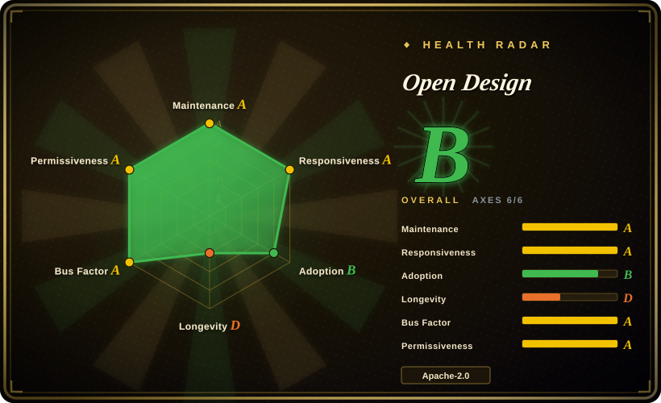
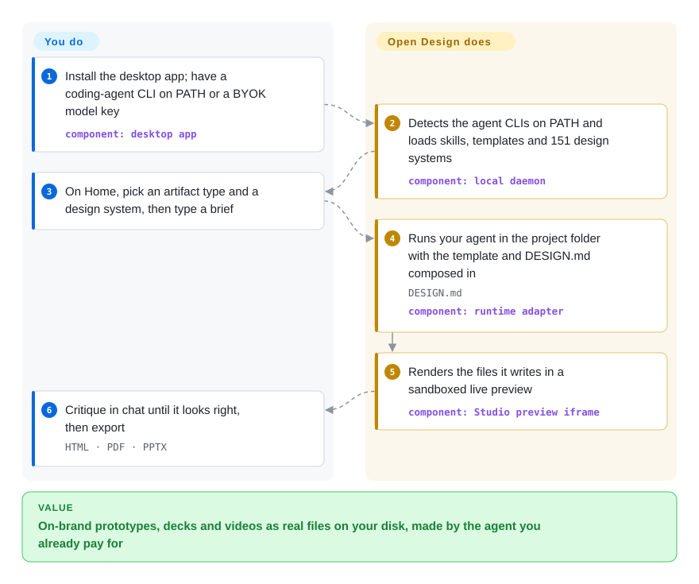

# Open Design

A local-first, BYOK Electron desktop app that turns a coding agent into a design studio — generating sandboxed HTML prototypes, magazine-style decks, brand-grade images and HTML→MP4 motion graphics, all driven by reusable Skills and `DESIGN.md` design systems.

## When to use

You're a product engineer or designer who already lives inside a coding agent (Claude Code, Codex, Cursor, Copilot, etc.) and you want it to *produce design artifacts*, not just code — a clickable mobile prototype, a pitch deck, a brand social card — without piping your prompts and assets through someone else's cloud. You care that everything runs on your own machine, that you bring your own model key, and that the output is plain HTML/PDF/PPTX/MP4 you can keep. Open Design gives you a desktop "Studio" where the agent reads a `DESIGN.md` design system, renders prototypes in a sandboxed iframe, and exports decks, images, dashboards and HyperFrames (HTML→MP4) — with 100+ functional skills and 151 brand design-system packages (Linear, Stripe, Apple, Notion, …) as starting points.

It also fits when you want one design surface that plugs into *whatever* agent you already use. Rather than locking you to a single assistant, it exposes itself through an MCP server and BYOK proxy (any OpenAI-compatible endpoint), so the same prototypes/decks workflow is callable from 26 distinct coding-agent CLIs (the daemon registry ships 27 runtime definitions). You prototype in the browser-like renderer, iterate on live artifacts in place, then export the file and move on — the open-source path needs no account and no per-seat SaaS, though since v0.9 the app also offers an optional paid sign-in model service if you would rather not bring your own key (it shipped in v0.9 as **OpenDesign AMR** and is now branded **OpenDesign Cloud**).

## How it works

OpenDesign is a local daemon with a design-studio surface on top — Electron desktop, browser UI, or a headless `od` CLI — and it deliberately ships *no agent of its own*. When you pick an artifact (prototype, deck, image, HyperFrames video) and a brief, the daemon spawns a coding-agent CLI already installed on your machine (26 distinct executables), or streams through a BYOK proxy to any OpenAI-compatible endpoint you configure; the model is always yours. The agent then composes three open, versionable things it can read and write on disk — a **skill/plugin** (the workflow), a **design template** (the rendering blueprint), and a **`DESIGN.md`** design system (the brand contract; 151 ship in the repo) — and emits real HTML/CSS project files, not a proprietary document. The daemon previews those files in a sandboxed iframe served loopback-only (127.0.0.1), HyperFrames renders motion graphics to a deterministic MP4 via headless Chrome + FFmpeg, and the finished artifact exports to HTML/PDF/PPTX/MP4/ZIP/Markdown. What stays yours: the model key (or the optional paid cloud service), the agent runtime, every output file — and note that while product analytics and session replay are consent-gated, the README states scrubbed safety/reliability telemetry is always on.

<!-- flow-steps:begin (generated from flows/open-design.json by tools/flow_card.py — do not edit) -->

Text version of the flow

1. **You**: Install the desktop app (macOS/Windows) — or attach your agent instead — `od mcp install claude`
2. **You**: Pick an artifact type, a plugin/skill and one of the 151 DESIGN.md systems, enter a brief
3. **Open Design**: Spawns a coding-agent CLI already on your PATH — or streams your BYOK endpoint — component: `local daemon`
4. **Open Design**: The agent composes skill + template + brand contract into real HTML/CSS files, previewed in a sandboxed iframe — component: `spawned agent`
5. **You**: Iterate in Studio, then export the artifact

**Value**: Prototypes, decks and videos as real files on your machine — no hosted studio, no model lock-in

<!-- flow-steps:end -->

## When NOT to use

- **You want a hosted, zero-setup SaaS.** This is a desktop app you install and run (Electron + a local Node daemon). If you'd rather log into a website and have a vendor manage everything, the proprietary Claude Design / similar hosted tools are a closer fit — this trades that convenience for local control.
- **You need true vector design / freeform canvas editing.** It generates *code-rendered* artifacts (HTML/PPTX/MP4), not an editable vector document. It is positioned as a "Figma alternative" for generation, but it is not a collaborative vector editor — for hand-pixel-pushing, real-time multiplayer, or precise vector work, Figma/Penpot remain the tools.
- **Early-stage maturity / churn.** It's pre-1.0 (v0.24.1, from v0.21 to v0.24 in the four weeks to 2026-09-24) with a ~500-issue backlog on a five-month-old repo; Skills, plugin formats and the agent-adapter surface are still moving. [推断] Lock-in risk is low (open formats, Apache-2.0), but breaking changes between minor versions are plausible.
- **You're on Linux desktop.** There is **no prebuilt Linux artifact** in official releases (macOS Apple Silicon/Intel + Windows x64 only; Linux is tracked in issue #4368) — you must run from source with Node ~24 + pnpm, which is a real setup step, not a download.
- **You can't or won't manage a model key.** The open-source path is BYOK — there is no bundled free inference. Since v0.9 an optional paid sign-in service (shipped as OpenDesign AMR, now branded OpenDesign Cloud) removes the key juggling, but that's a commercial hosted service; if neither an API key nor a paid cloud subscription is acceptable, you can't generate.
- **You require zero egress from a "local-first" tool.** Analytics and session replay are consent-gated, but the README states scrubbed safety/reliability telemetry is always on — local-first is the default posture, not an absolute guarantee.
- **No GPU/heavy video budget but you need lots of MP4.** HyperFrames (HTML→MP4) and video generation lean on local rendering plus your BYOK model spend; high-volume video is not free or instant.
- **Production design-system governance at team scale.** It's a single-user local studio; it has no built-in multiplayer, review workflow, or central asset governance.

## Comparison

| Alternative | In index | Our verdict | Tradeoff |
|---|---|---|---|
| [html-anything](html-anything.md) | ✅ | Pick html-anything when you only need prompt-to-standalone-HTML artifacts. | Sibling focused on turning prompts into standalone HTML artifacts; Open Design is the heavier full desktop studio (decks/video/design-systems/export) around that idea. |
| [Impeccable](impeccable.md) | ✅ | Pick Impeccable when high-polish UI generation is the whole job. | Sibling aimed at high-polish UI generation; Open Design is broader (slides, images, video, MP4) and ships as a local app rather than a narrower generator. |
| [guizang-ppt-skill](../agent-skills/slides-ppt/guizang-ppt.md) | ✅ | Pick guizang-ppt-skill when you need only deck generation as a Skill. | A single-purpose deck-generation Skill; Open Design includes deck generation as one of several artifact types plus its own runtime/export. |
| [guizang-social-card-skill](../agent-skills/visual-content/guizang-social-card.md) | ✅ | Pick guizang-social-card-skill when the artifact is a focused social card. | A focused social-card Skill; Open Design covers cards/images among many artifact types inside a packaged app. |
| Claude Design (Anthropic, hosted) | 未收录 | Pick the hosted proprietary product when managed cloud polish matters more than local-first/BYOK control. | The proprietary hosted product this clones; managed cloud + polish vs Open Design's local-first, BYOK, open-format stance. |
| v0 (Vercel) | 未收录 | Pick v0 when the target is hosted prompt-to-web-UI generation rather than a local multi-artifact studio. | Hosted prompt-to-UI generator; cloud SaaS, narrower to web UI, vs Open Design's local multi-artifact studio. |
| Figma / Penpot | 未收录 | Pick Figma or Penpot when you need multiplayer vector editing, not generated code-rendered artifacts. | True vector design editors with multiplayer; Open Design generates code-rendered artifacts, not editable vector docs. |

## Tech stack

- **Language:** TypeScript (primary, per repo).
- **Frontend/Studio:** Next.js 16 App Router + React 18 (per the README architecture table).
- **Local daemon:** Node 24 · Express · SSE streaming · `better-sqlite3` for project/conversation storage.
- **Desktop shell:** Electron with a sandboxed renderer; filesystem runs preview canonical project files in a sandboxed iframe, BYOK/plain-API runs parse one complete `<artifact>` block into a sandboxed `srcdoc` iframe; daemon binds 127.0.0.1 (LAN exposure needs explicit `OD_BIND_HOST` + `OD_ALLOWED_ORIGINS`).
- **Integration:** stdio MCP server with per-agent installers (`od mcp install <agent>`), plus a multi-provider BYOK proxy (`/api/proxy/{anthropic,openai,azure,google,ollama,senseaudio}/stream`) for any OpenAI-compatible endpoint, SSRF-guarded at the daemon edge; 27 runtime definitions over 26 distinct local CLI executables, DeepSeek Harness (`dsh`) as a first-class native runtime.
- **Content:** 100+ functional skills (`skills/`) + a separate rendering-template catalog (`design-templates/`), 151 `DESIGN.md` design-system packages, 277 official plugins (+183 remixable examples), 15 deck templates × 36 themes, 93 image prompt templates, 11 HyperFrames templates + 39 Seedance prompts.
- **Video:** HyperFrames is HeyGen's Apache-2.0 agent-native framework — the agent writes HTML+CSS+GSAP, rendered to a deterministic MP4 via headless Chrome + FFmpeg; optional routing to Seedance/Veo/Sora/Kling model variants and Suno/Lyria audio.
- **Export:** HTML, PDF (browser print), PPTX, MP4, ZIP, Markdown.

## Dependencies

- **Runtime:** Node ~24 and pnpm 10.33.x for run-from-source; packaged desktop builds ship **macOS (Apple Silicon + Intel) and Windows (x64) only** — no prebuilt Linux artifact yet (issue #4368).
- **Models:** a BYOK key for an OpenAI-compatible (or Anthropic/Azure/Google/Ollama) endpoint — required for generation on the open-source path; the optional paid OpenDesign Cloud subscription is the zero-config alternative.
- **Datastore:** local SQLite (`better-sqlite3`); no external database/service required for core use.
- **Video path:** MP4 export requires headless Chrome + FFmpeg present locally (HyperFrames rendering pipeline, per README).
- **Optional:** Docker (`deploy/` compose, web UI on 127.0.0.1:7456 behind `OD_API_TOKEN` basic auth), Sealos template, or Vercel for the web build.

## Ops difficulty

**Low for desktop use, medium from source/web.** The fastest path is the pre-packaged desktop app: download, add a BYOK key (or sign into OpenDesign Cloud), generate — close to zero ops, everything local. Running from source or self-hosting the web build is **medium**: you manage Node ~24 / pnpm versions, the local daemon (`pnpm tools-dev` lifecycle), and Docker/Vercel deployment, plus the usual Electron friction across OSes — and on macOS/WSL2 the bare `od` command collides with the system octal-dump binary, so the README tells desktop users to copy absolute-path snippets from Settings → MCP. Because it's local-first and single-user there's no server fleet to maintain, but you do own model-key management, updates across a fast minor-release cadence (v0.21 → v0.24 in four weeks), and the Chrome/FFmpeg toolchain for video.

## Health & viability

- **Responsiveness**: Grade A — median first-response time 0.1 hours across 15 qualifying issues/PRs (scorer, 2026-09-28).
- **Maintenance (as of 2026-09):** not archived; last commit 4 days before scoring, active in **all 13 of the last 13 weeks**, releases v0.21.0 → v0.24.1 shipped 2026-08-25 → 2026-09-24. Extremely active; the ~526 open issues against a five-month-old repo signal both heavy use and a fast-moving, not-yet-settled surface. [推断：把 issue 量读作使用强度]
- **Governance & bus factor:** `Organization`-owned (nexu-io) with 94 distinct active committers over 12 months and the top contributor at only ~19% of commits — a real team for a young repo, not a lone maintainer. But the org is small and unproven; the paid OpenDesign Cloud service implies commercial backing, yet funding and roadmap ownership are unverified. [推断：由云服务推断商业资助]
- **Age & Lindy verdict:** created 2026-04-28, repo age 153 days at scoring — **very young**, with stars that kept climbing after launch (~71k at this page's 2026-06 recheck → ~98k at 2026-09-28). Continued growth past the launch wave is encouraging but not durability; the opposite of a Lindy-safe bet — weigh it as "promising but unproven."
- **Adoption & ecosystem:** 1,757 Homebrew installs in 90 days and 946,916 GitHub release downloads (scorer, 2026-09-28); adapter coverage of 26 distinct agent CLIs plus MCP makes it plug-in-able from wherever an agent team already works.
- **Risk flags / lock-in:** the upside stays genuinely low-lock-in — Apache-2.0, local-first, BYOK, open export formats (HTML/PDF/PPTX/MP4), so you keep your artifacts even if the project stalls. Watch items: pre-1.0 minor-version breaking changes while plugin/Skill formats stabilize; the optional paid cloud adds a commercial surface next to the OSS core; and analytics/session-replay are consent-gated but scrubbed safety telemetry is always on (README).

## Caveats (unverified)

- [未验证] v0.24.1 published 2026-09-24 (GitHub releases as of 2026-09-28); the cadence is ~weekly, so any version pin drifts fast.
- [未验证] Star count ~98.4k as of 2026-09-28 — GitHub stars are unreliable and date-sensitive; treat as indicative only.
- [未验证] Content counts (151 design systems, 277 official plugins + 183 examples, 100+ skills, 26 CLIs / 27 runtime definitions, 93 image prompts, 11+39 video templates) are the current README's own framing and shift release-to-release; the ~526 open-issue count came from the GitHub search API on 2026-09-28 and includes bot/PR churn.
- [未验证] Framework/runtime versions (Next.js 16, React 18, Node ~24, pnpm 10.33.x) are from the README architecture table, not independently confirmed against the lockfile.
- [未验证] The README roadmap lists "AI-emitted tweaks panel UX — not yet implemented" while its product-tour demos show a live-dashboard tweaks panel; the current state of in-place parameter editing is internally inconsistent in the sources.
- [未验证] OpenDesign Cloud pricing, terms, and uptime are commercial-hosted-service details not checked in this pass.
- [Inferred] AMR → Cloud branding continuity: the v0.9 release notes introduced OpenDesign AMR, a sign-in model service; notes from v0.13 on and the current README call it OpenDesign Cloud (matching sign-in/wallet surfaces), but no rename is announced in the CHANGELOG.
- [推断] "Figma alternative" / "Claude Design alternative" are the project's positioning claims, not a feature-parity guarantee.
