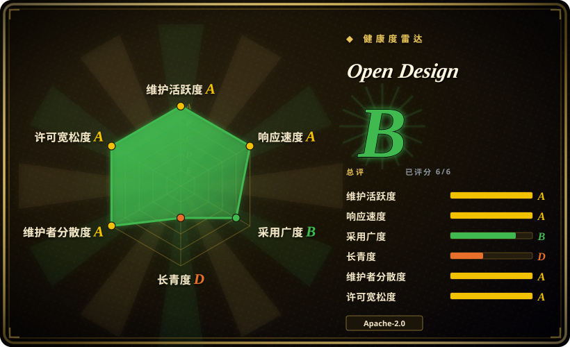
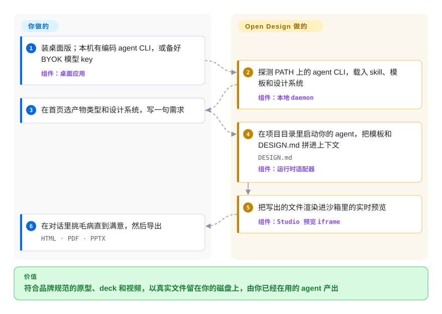

# Open Design

让编码 agent 出一份路演 deck 或一个能点的 App 原型，你拿到的是聊天框里一大段没样式的 HTML；要么就去付费用闭源的托管设计工具，文件留在人家服务器上。Open Design 给你已经在用的 agent 套上一个桌面工作室：把品牌设计规范和模板塞进它的上下文，结果实时预览，最后导出真正的 HTML/PDF/PPTX/MP4 文件。

## 何时使用

你是常驻在 Claude Code、Codex、Cursor 这类 agent 里的产品工程师或创始人，这周要的不是代码而是设计产物：给用户测试用的三屏移动端引导原型、一份 12 页的投资人月报、一条 30 秒的产品宣传片。直接让 agent 写，你会得到一个 Times New Roman 字体、默认蓝色链接的 `index.html`——它不知道你的品牌长什么样，也没法把结果摆给你看。托管方案（Claude Design、v0、Lovable）效果确实好，但按席位收费、只能用厂商的模型，你的 prompt、截图和品牌素材都存在别人的云上。

当你想要同样的“需求 → 预览 → 挑毛病 → 导出”循环，但由*你自己的* agent 和*你自己的*模型 key 驱动、产物以普通文件留在本机时，就想到 Open Design。它自带 151 套 `DESIGN.md` 品牌设计系统（Linear、Stripe、Apple、Notion 等）、100+ 个 skill 和一大批模板/插件，调起你装好的任意 agent CLI，并把它写出的文件放进沙箱 iframe 里预览。和索引里更窄的同类（单一 deck skill、prompt 转 HTML 工具）相比，决定性的取舍是覆盖面：原型、deck、仪表盘、图片和 HyperFrames 视频在同一个工作区里完成，代价是要装一个迭代极快的桌面应用并跟着它升级。

## 怎么用起来

Open Design 本身不带 agent。它是一个本地服务（“daemon”，常驻后台的 Node 进程，用一个 SQLite 文件存项目）加一个 web/Electron 前端。你提交需求后，daemon 在项目目录里启动你本机已有的编码 agent CLI——`claude`、`codex`、`cursor-agent` 等共 26 种——并把选中的模板或 skill 连同当前的 `DESIGN.md`（一份用 Markdown 写的品牌规范：配色、字体、组件）放进它的指令里；好比外包开工前先把品牌手册递给他。agent 写的是普通文件，Open Design 盯着这些文件，在一个锁死权限的预览框里渲染出来。本机没装 CLI 时，内置代理会拿你的 key 直接调任意 OpenAI 兼容端点。你要做的是：选产物类型和设计系统、写需求、判断结果、导出。另一种用法是完全不开界面——`od mcp install claude` 把它注册成你 agent 里的 MCP 服务（一种外挂工具接口），之后在平常的会话里说“用 open-design 生成一个落地页”即可。

<!-- flow-steps:begin (generated from flows/open-design.json by tools/flow_card.py — do not edit) -->

流程文字版

1. **你**：装桌面版；本机有编码 agent CLI，或备好 BYOK 模型 key — 组件：`桌面应用`
2. **Open Design**：探测 PATH 上的 agent CLI，载入 skill、模板和设计系统 — 组件：`本地 daemon`
3. **你**：在首页选产物类型和设计系统，写一句需求
4. **Open Design**：在项目目录里启动你的 agent，把模板和 DESIGN.md 拼进上下文 — `DESIGN.md` — 组件：`运行时适配器`
5. **Open Design**：把写出的文件渲染进沙箱里的实时预览 — 组件：`Studio 预览 iframe`
6. **你**：在对话里挑毛病直到满意，然后导出 — `HTML · PDF · PPTX`

**价值**：符合品牌规范的原型、deck 和视频，以真实文件留在你的磁盘上，由你已经在用的 agent 产出

<!-- flow-steps:end -->

## 何时不用

- **你要零安装、零维护。** 它是桌面应用加本地 daemon，每隔几天发一个 minor 版本。如果预算只够“登录网站就用”，托管的 Claude Design 或 v0（都不是仓库）更合适；你用本地文件和模型选择权换来省心。
- **你需要可编辑的矢量设计稿或实时多人协作。** 它产出的是代码渲染的 HTML/PPTX/MP4，不是分层矢量文档，文档里也没有多人协同编辑。要逐像素调整、带变体的组件库和团队评审，用 [Penpot](../design-editors/penpot.zh.md)（可自托管）或 Figma。
- **你的数据政策不允许外发遥测。** 官方构建默认开启产品分析（首次启动可选择退出；可选的内容通道会带上 prompt 和工具输出），另有一条经过脱敏的安全/可靠性遥测通道，不受开关控制、始终开启。没有遥测凭据的 fork 和源码构建两类都不发——所以在受监管或物理隔离环境里，要么从源码构建，要么在现有 agent 里直接用 [guizang-ppt-skill](../agent-skills/slides-ppt/guizang-ppt.zh.md) 这类纯 skill，它自己不带遥测。
- **你在 Linux 上且想要安装包。** 最新版本只发布 macOS（arm64/x64）和 Windows x64 安装包；Linux 只能从源码跑（Node ~24、pnpm 10.33）或用 Docker 镜像。嫌麻烦的话，[html-anything](html-anything.zh.md) 是更轻的 prompt 转 HTML 路线。
- **你需要一个稳定的底座往上搭。** 2026 年 6 月到 9 月它从 v0.11 跳到 v0.24.1（13 个 minor 版本），插件 manifest、运行时适配器和设计系统包结构都还在变。要么锁定版本，要么直接依赖底层组件——HTML→MP4 用 [HyperFrames](../video-production/hyperframes.zh.md)，幻灯片用单一 deck skill——它们能坏的面更小。
- **你没有任何模型渠道。** 它不带免费推理：要么有 agent CLI 订阅，要么有 BYOK key，要么付费买厂商自己的 OpenDesign Cloud 模型服务。三者都没有就什么也生成不了。
- **你要批量出 MP4。** HyperFrames 在本机靠无头 Chrome 加 FFmpeg 渲染，电影感视频/音频模板还会调用付费模型（Seedance、Veo、Suno）。批量视频流水线应该在渲染机上直接驱动 [HyperFrames](../video-production/hyperframes.zh.md)，而不是经过桌面 GUI。

## 横向对比

| 替代品 | 是否收录 | 我们的评价 | 取舍 |
|---|---|---|---|
| [html-anything](html-anything.zh.md) | ✅ | 产物只是一张由 prompt 生成的独立 HTML 页面时，选 html-anything；还需要 deck、视频、品牌系统和导出集中在一处时，选 Open Design。 | 要装要学的东西少得多；失去设计系统目录、实时工作室和 PPTX/MP4 导出。 |
| [Impeccable](impeccable.zh.md) | ✅ | 任务是在现有 agent 会话里打磨 UI 时，选 Impeccable；非 UI 产物（deck、图片、视频）也重要时，选 Open Design。 | 留在你的 agent 里、不多装应用；只管 UI 质量，不管多产物交付。 |
| [guizang-ppt-skill](../agent-skills/slides-ppt/guizang-ppt.zh.md) | ✅ | 只需要杂志风 deck 时，直接装 guizang-ppt-skill；Open Design 把这个 skill 原样打包进来，外加其他一切。 | 一个 skill、没有 daemon、没有遥测；没有预览工作室、其他产物类型和设计系统切换。 |
| [HyperFrames](../video-production/hyperframes.zh.md) | ✅ | 只需要 agent 写 HTML 转 MP4 视频、尤其是批量时，直接用 HyperFrames；Open Design 是它的 GUI 宿主加一套 prompt 模板。 | 可脚本化、可无头运行；放弃工作室预览和 Seedance/Veo 模板目录。 |
| [Penpot](../design-editors/penpot.zh.md) | ✅ | 设计师需要共享、可编辑、带组件和评论的矢量文件时，选 Penpot；要让 agent 直接产出成品代码渲染产物时，选 Open Design。 | 真正的多人矢量编辑、可自托管；没有 agent 生成循环，也不出 HTML/MP4。 |
| Claude Design（Anthropic） | 非仓库 | 托管省心和 Anthropic 的打磨度比本地文件和模型选择更重要时，选这个托管产品；Open Design 是它开源、本地优先的对应物。 | 零安装、零维护；闭源、只在云上、绑定 Anthropic 的模型和计费。 |

## 技术栈

- **语言：** TypeScript（pnpm monorepo：`apps/web`、`apps/daemon`、`apps/desktop`，外加共享的 `packages/`）。
- **前端：** Next.js 16.2 App Router + React 18.3。
- **本地 daemon：** Node 24 · Express 5 · SSE 流式 · `better-sqlite3` 12 存项目、会话和运行记录；stdio MCP 服务；`od` 命令行。
- **桌面外壳：** Electron 41，沙箱化 renderer 加 sidecar IPC 通道；预览在沙箱 iframe 里渲染。
- **模型接入：** 通过运行时适配器调起 26 种本地 agent CLI，或走 BYOK 代理接 Anthropic / OpenAI / Azure / Gemini / Ollama 及任意 OpenAI 兼容端点；SSRF 防护默认拦截内网 IP，需显式加白名单。
- **内容：** 151 个 `DESIGN.md` 设计系统包、100+ 个功能 skill、277 个官方插件、15 套 deck 模板 × 36 个主题、HyperFrames 模板。
- **导出：** HTML（内联资源）、PDF、PPTX、ZIP、Markdown、MP4（HyperFrames）。

## 依赖

- **模型渠道（必需）：** `PATH` 上有编码 agent CLI，或有受支持 / OpenAI 兼容端点的 BYOK key，或有付费的 OpenDesign Cloud 账号。
- **桌面版：** macOS（Apple Silicon / Intel）和 Windows x64 安装包自带运行时。macOS 上 `/usr/bin/od` 可能遮住 `od` 命令，改用“设置 → MCP server”里给的配置片段。
- **源码运行（Linux 或开发）：** Node `~24`、pnpm `>=10.33.2 <11`；数据在本地 SQLite 文件里，不需要外部数据库。
- **服务器/Docker：** `deploy/docker-compose` 配一个 `OD_API_TOKEN` 做 Basic/Bearer 认证；对外暴露还要反向代理和 `OPEN_DESIGN_ALLOWED_ORIGINS`。
- **视频：** HyperFrames 渲染需要本机有无头 Chrome + FFmpeg；电影感视频/音频模板需要它们所调用的付费模型的 key。

## 运维难度

**macOS/Windows 桌面版低，其他情况中等。** 装好安装包、指向一个 agent 或 key 就能生成；持续成本是跟上每隔几天一次、偶尔改变插件或运行时行为的发版。Linux 用户和自托管的人是**中等**：要对齐 Node/pnpm 版本、带 API token 的 Docker compose、暴露到本机回环之外时的反向代理 origin 配置，以及视频用的 Chrome/FFmpeg 工具链。注重安全的团队还得管遥测：每台安装都要关掉默认开启的分析，或者从源码构建来去掉两条遥测通道。

## 健康度与可持续性

- **维护（截至 2026-09-28）：** 非常活跃——最近一个季度每周都有提交，五个月里发了 38 个 GitHub release，最新 v0.24.1 发布于 2026-09-24。节奏本身就是风险：minor 版本来得比多数团队回归测试还快。
- **治理与 bus factor：** 归 `nexu-io` 组织所有（2026-02 创建，对外品牌为 OpenDesign）。过去一年约 94 人贡献，头号贡献者约占 19% 的提交，不是单人仓库；但 MAINTAINERS.md 把合并权留给不公开名单的内部核心团队，路线图由厂商掌控。
- **背后支撑与商业模式：** 同一团队在卖 OpenDesign Cloud——自 v0.9 起内置在应用里的付费模型服务，README 开头就是它的推广。这为项目提供了资金，但也是需要盯着的 open-core 式激励：以后的新功能落在免费 BYOK 路径上，还是只在 Cloud 登录之后，目前无从判断。[推断]
- **年龄与 Lindy 判断：** 2026-04-28 创建，五个月大，约 98k star、约 11k fork——是借 Claude Design 发布浪潮起来的仓库，不是 Lindy 意义上的安全押注。在它活过一年之前，把 star 当热度看。
- **风险标记/锁定：** Apache-2.0，至今没有改许可证，产物是普通的 HTML/PDF/PPTX/MP4，离开的成本很低。真正的风险标记是默认开启的产品遥测，以及插件和适配器格式在 minor 版本间的变动。

## 存疑（未验证）

- [未验证] 各项数量（151 套设计系统、100+ skill、277 个插件、26 种 agent CLI、15 套 deck 模板 × 36 个主题）是 2026-09-28 时 README 的自述，几乎每个版本都在变。
- [未验证] star（约 98.4k）和 fork（约 11.4k）取自 2026-09-28 的 GitHub API，波动大；五个月大的仓库的 star 不能证明耐久。
- [未验证] 遥测描述来自阅读时的 `PRIVACY.md`；未独立检查发布的二进制实际发送了什么。
- [推断] “文档里没有多人协同编辑”依据的是 README 和路线图；存在一个协作插件（`od-tune-collab`），其范围未核查。
- [推断] 以后的能力是留在免费 BYOK 路径上还是转到 OpenDesign Cloud 之后，是对激励的判断，不是已观察到的变化。
- [未验证] Linux 缺口依据 v0.24.1 的发布产物和 issue #4368；之后任何版本都可能补上 Linux 安装包。
