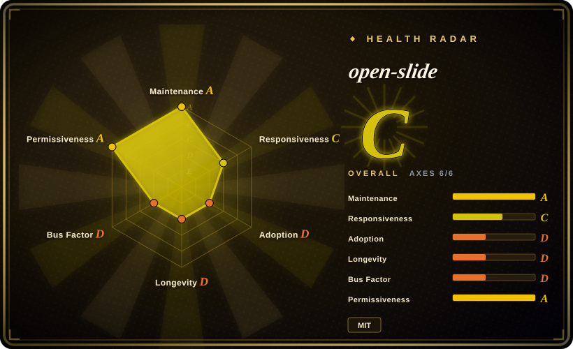
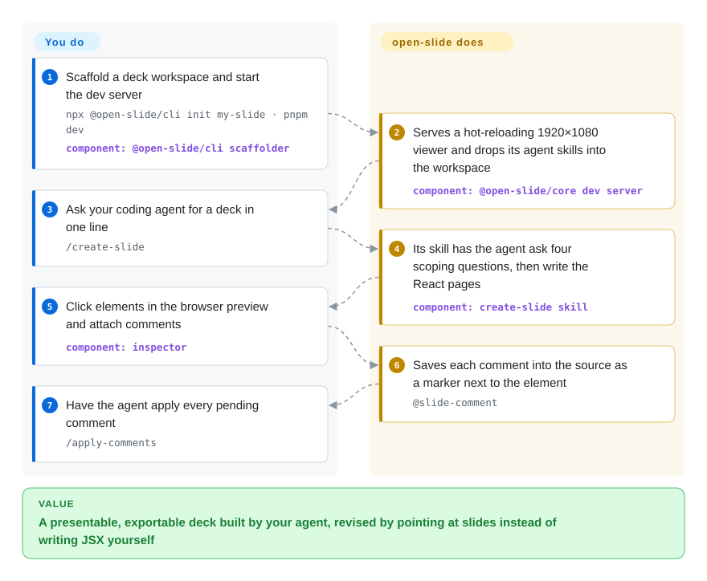

# open-slide

You ask your coding agent for "10 slides on our Q3 launch" and get either a Markdown outline you still have to lay out, or one giant HTML file whose text overflows the moment the window is resized — and every tweak means re-prompting the whole thing. open-slide gives the agent a fixed 1920×1080 stage to write React pages onto, and lets you revise by clicking an element in the browser and leaving a comment the agent then applies.

## When to use

You're a developer or developer-relations person who already works in Claude Code, Codex or Cursor, and you give talks, internal demos or launch decks a few times a month. Asking the agent for slides gets you `slides.html` where the title wraps into three lines on your laptop projector, there's no presenter view, and "make the headline smaller on page 4" means the agent re-reads 900 lines of HTML and sometimes breaks page 7. You want the agent to keep doing the writing, but on a stage where a pixel is a pixel and a change touches one page.

You reach for open-slide when you want a **project**, not a single file: each deck is `slides/<id>/index.tsx`, an array of React components rendered into a fixed 1920×1080 canvas that is scaled uniformly for preview, presenting and export. It scaffolds the workspace, ships the agent skills that drive authoring (`/create-slide`, `/apply-comments`, `/create-theme`), and runs a dev server with hot reload, a click-to-comment inspector, an assets panel, presenter mode and HTML/PDF/PPTX export. The deciding tradeoff against [Slidev](https://github.com/slidevjs/slidev) or reveal.js is that the source is arbitrary React that an agent writes and you steer visually, instead of Markdown you write yourself; against a single-file HTML deck skill such as [frontend-slides](../agent-skills/slides-ppt/frontend-slides.md), you trade "one file, zero install" for a Node workspace with a real editing loop and presenter tooling.

## How it works

open-slide splits the work into a runtime and a script. The runtime (`@open-slide/core`, a Vite-based dev server — a local web server that reloads the page the instant a file changes) owns everything that is the same for every deck: scaling the 1920×1080 canvas to your screen, keyboard navigation, the thumbnail rail, present mode with speaker notes and timer, and the exporters. The script is the agent skills it copies into your workspace: `create-slide` makes your agent ask four scoping questions (look and feel, page count, text density, motion) and then write each page as a zero-prop React component; `slide-authoring` is the reference card of canvas, type-scale and layout rules the agent reads first. When you click an element in the browser and type "shrink this to 88px", the inspector writes that note into the source file as an `@slide-comment` marker right next to the element — like a sticky note on a printed page — and `/apply-comments` has the agent rewrite exactly those spots and remove the notes. What you do: pick the aesthetic, answer the scoping questions, point at what's wrong, and present. What you do not do: write layout scaffolding, scaling code, presenter UI or export logic. `npm run build` turns the workspace into a plain static site you can host anywhere.

<!-- flow-steps:begin (generated from flows/open-slide.json by tools/flow_card.py — do not edit) -->

Text version of the flow

1. **You**: Scaffold a deck workspace and start the dev server — `npx @open-slide/cli init my-slide · pnpm dev` — component: `@open-slide/cli scaffolder`
2. **open-slide**: Serves a hot-reloading 1920×1080 viewer and drops its agent skills into the workspace — component: `@open-slide/core dev server`
3. **You**: Ask your coding agent for a deck in one line — `/create-slide`
4. **open-slide**: Its skill has the agent ask four scoping questions, then write the React pages — component: `create-slide skill`
5. **You**: Click elements in the browser preview and attach comments — component: `inspector`
6. **open-slide**: Saves each comment into the source as a marker next to the element — `@slide-comment`
7. **You**: Have the agent apply every pending comment — `/apply-comments`

**Value**: A presentable, exportable deck built by your agent, revised by pointing at slides instead of writing JSX yourself

<!-- flow-steps:end -->

## When NOT to use

- **The deck's real home is PowerPoint or Keynote, edited by other people.** Native, editable PPTX export only landed in v2.0.0 (2026-09-26): it rebuilds each page as PowerPoint text boxes, shapes and pictures, and falls back to a raster image for effects PowerPoint cannot express — so gradients, filters and animation are not round-trippable, and the docs' Export page still describes the older image-only PPTX. If colleagues will keep editing the file in Office, use [ppt-master](../agent-skills/slides-ppt/ppt-master.md), which treats an editable `.pptx` as the primary output rather than an export.
- **You want to write the slides yourself, in Markdown.** open-slide's source is React/TSX designed for an agent to author; by hand it is verbose. For human-written, version-controlled talks use Slidev (Markdown + Vue, 5 years old) or reveal.js (HTML/Markdown, 15 years old) — both far more battle-tested for that job.
- **You need a non-16:9 canvas.** Every page is a fixed 1920×1080 stage; configurable canvas size (portrait, square carousel, LinkedIn PDF) is still an open request (#404, #106 as of 2026-09-28). Slidev exposes `aspectRatio`/`canvasWidth`; a plain HTML deck skill lets you set any size.
- **You need to export in CI or from a script.** Export runs from the toolbar inside the browser (PDF is not supported in Safari); a headless `export` CLI command is an open request (#364). If decks must be rendered in a pipeline, use `slidev export` (Playwright, PDF/PPTX/PNG) or Marp CLI (`--pdf`/`--pptx`).
- **You want one file and nothing to install.** open-slide is a Node ≥20.19 workspace with a dependency tree (React 19, Vite 8, Tailwind 4) and a dev server. For a one-off deck you mail as a single HTML file, a skill like [frontend-slides](../agent-skills/slides-ppt/frontend-slides.md) or [guizang-ppt-skill](../agent-skills/slides-ppt/guizang-ppt.md) runs inside the agent you already have.
- **You need decks to survive years without touching them.** Pages import `@open-slide/core` APIs (`Page`, hooks, `Steps`, morph); v1→v2 arrived five months after launch and required a Node bump, React 19 and removing `vite` from `devDependencies`. For an archive of talks meant to render unchanged in 2030, reveal.js's longer track record is the safer substrate.
- **Decks are one artifact among many.** If the same brief also needs UI mockups, social images or video, [Open Design](open-design.md) hosts decks alongside those, at the cost of a heavier desktop app.

## Comparison

| Alternative | In index | Our verdict | Tradeoff |
|---|---|---|---|
| Slidev (`slidevjs/slidev`) | not indexed | When a human writes the talk in Markdown and needs CLI export and custom aspect ratios, pick Slidev; pick open-slide when an agent writes the pages and you revise by clicking. | Mature (2021), MIT, `slidev export` and `aspectRatio`; Vue + Markdown source is less free-form than arbitrary React, and it ships no agent comment loop. Not added in this tab-intake batch. |
| reveal.js (`hakimel/reveal.js`) | not indexed | For long-lived decks that must keep rendering for years with no build toolchain churn, pick reveal.js; pick open-slide for agent-authored decks with an inspector and presenter tooling. | 15 years old and framework-free; you write HTML/Markdown yourself and get no agent skills, fixed canvas or PPTX export. Not added in this tab-intake batch. |
| [ppt-master](../agent-skills/slides-ppt/ppt-master.md) | ✅ | When the deliverable is an editable `.pptx` others will open in PowerPoint, pick ppt-master; pick open-slide when the deck is presented from the browser and PPTX is a secondary export. | Native Office objects as the primary output; you give up React's free layout, hot-reload preview and click-to-comment revision. |
| [frontend-slides](../agent-skills/slides-ppt/frontend-slides.md) | ✅ | For a one-off single-file HTML deck from the agent you already run, pick frontend-slides; pick open-slide when you maintain several decks and want a workspace, inspector and exports. | Zero install and one portable file; no dev server, no source-anchored comment loop, no PDF/PPTX exporters. |
| [Open Design](open-design.md) | ✅ | When decks are one output among prototypes, images and video, pick Open Design; when decks are the whole job, open-slide is the narrower, lighter tool. | One studio for many artifact types with brand design systems; a desktop app and daemon to install, versus a single npm workspace. |

## Tech stack

- **Language:** TypeScript; pnpm + Turbo monorepo with `packages/core` (runtime, Vite plugin, `open-slide` dev/build/preview CLI), `packages/cli` (the `init` scaffolder and template), `apps/demo` and `apps/web` (docs site).
- **Runtime:** React 19, Vite 8 (Rolldown-based), Tailwind CSS 4, shadcn / Base UI components, React Router 7, dnd-kit for drag-and-drop.
- **Source editing:** `@babel/parser` for the inspector's write-back of comments and visual edits into `slides/*.tsx`; dev-server mutation routes guarded against cross-site requests.
- **Export:** in-browser pipelines — `html-to-image` for rasters, a custom DOM-to-OOXML scene builder zipped with `fflate` for PPTX, print-ready PDF, static HTML/zip.
- **Tooling:** tsdown builds, Biome lint/format, Vitest unit tests, Playwright e2e, Changesets releases.

## Dependencies

- **Node.js `^20.19.0 || >=22.12.0`** (required by Vite 8) and npm, pnpm, yarn or bun.
- **A coding agent** that can read workspace skills — the scaffolder writes them to `.agents/skills/` and symlinks `.claude/skills/` for Claude Code; `open-slide sync:skills` refreshes them after upgrades. The `create-slide` skill calls Claude Code's `AskUserQuestion` for its scoping step.
- **A Chromium- or Firefox-class browser** for authoring and export (PDF export does not work in Safari).
- **Any static host** for sharing (Vercel, Netlify, Cloudflare Pages, GitHub Pages); no server, database or model key of its own.
- **Optional network:** the assets panel searches the svgl logo catalogue and Google Fonts from the dev server.

## Ops difficulty

**Low.** It is a local dev server plus a static build; there is nothing to run in production. The recurring cost is upgrades: the framework is moving fast (v1→v2 in September 2026 required Node 20.19+, React 19 and deleting the old `vite` devDependency, and `open-slide` refuses to start until you do), and each core upgrade should be followed by `npm run sync:skills` so the agent's instructions match the runtime. Keep `open-slide dev` bound to localhost: the dev server exposes file-writing authoring endpoints, so do not publish it with `--host` on an untrusted network.

## Health & viability

- **Maintenance (as of 2026-09-28):** very active — last push 2026-09-27; v2.0.0 of `core` and `cli` shipped 2026-09-26 and `core` 2.0.1 the next day, after a week of betas; ~130 commits in the last three months.
- **Governance & bus factor:** effectively one maintainer. Yiwei Ho (`1weiho`) authored ~490 of ~650 commits overall and 69 of ~80 human commits in the last quarter; the repo moved from his personal account (`1weiho/open-slide` now redirects) into the `open-slide` organization. No governance doc names other maintainers. High bus-factor risk.
- **Backing:** listed in Vercel's 2026 open-source program and funded through Buy Me a Coffee; no company owns the roadmap.
- **Age & Lindy verdict:** created 2026-04-26, five months old, already on its second major version with ~8.3k stars and ~580 forks. Young and fast-moving — a promising tool, not yet a Lindy-safe substrate for decks you need to render unchanged for years.
- **Adoption & responsiveness:** `@open-slide/core` had 20,686 npm downloads last month by the health scorer's count (`cli` ~2.8k), so real workspaces exist beyond stargazers, though no dependent repositories are registered. Median time to first response on recent issues is ~9 days, and 119 issues are open, including several inspector write-back bugs with shared components (#327, #237, #213).
- **Risk flags:** MIT, no relicense. `SECURITY.md` is still GitHub's unedited template (issue #422 open), so there is no stated vulnerability-reporting channel for a dev server that writes files.

## Caveats (unverified)

- [未验证] Star (~8.3k), fork (~580) and open-issue (119) counts are from the GitHub API on 2026-09-28 and are volatile.
- [未验证] The PPTX fidelity description comes from the v2.0.0 changelog and the `export-pptx.ts` source comment; no deck was exported and opened in PowerPoint for this page.
- [未验证] npm download counts depend on the window: the health scorer recorded 20,686 for `@open-slide/core`, while npm's point API returned 23,653 for 2026-08-28 to 2026-09-26; both include CI and mirror traffic.
- [推断] "Effectively one maintainer" is from commit counts; the org membership and whether others hold merge or release rights were not inspected.
- [未验证] The ~130 commits in the last three months include ~50 bot commits (dependabot, release bot); the human count is ~80.
- [推断] Hand-authoring React pages being "verbose" versus Markdown is a judgment from the page contract, not a measured comparison.
- [未验证] How well `create-slide` works in agents other than Claude Code is not documented beyond the claim of "any coding agent"; its scoping step names Claude Code's `AskUserQuestion` tool.
