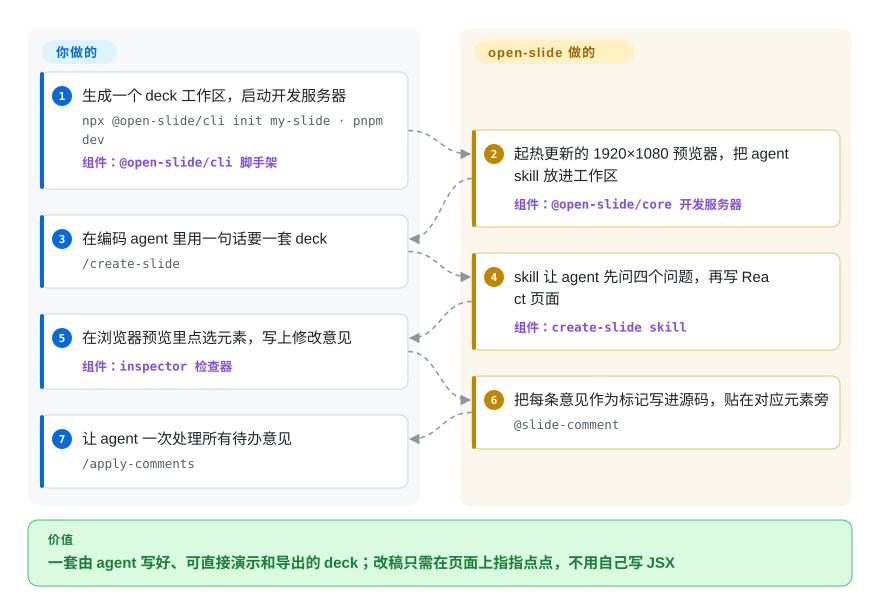

# open-slide

你让编码 agent 做“10 页 Q3 发布会幻灯片”，拿到的要么是一份还得自己排版的 Markdown 大纲，要么是一个巨大的 HTML 文件，窗口一缩放标题就溢出；想改一处，就得让它把整份重写一遍。open-slide 给 agent 一块固定 1920×1080 的舞台去写 React 页面，你在浏览器里点中某个元素留一句意见，agent 就只改那一处。

## 何时使用

你是开发者或技术布道者，平时就在 Claude Code、Codex 或 Cursor 里干活，每个月要讲几次分享、做内部演示或发布会。直接让 agent 出幻灯片，你会拿到一个 `slides.html`：投到会议室投影上标题折成三行，没有演讲者视图；说一句“第 4 页标题小一点”，agent 就要重读 900 行 HTML，偶尔还顺手把第 7 页弄坏。你想让 agent 继续负责写，但要一块像素就是像素的舞台，改一处只动一页。

这时你会想到 open-slide：它给你的是一个**工程**，不是一个文件。每套 deck 是 `slides/<id>/index.tsx`，内容是一组 React 组件，渲染进固定 1920×1080 的画布，预览、演示和导出时整体等比缩放。它负责生成工作区，附带驱动写作的 agent skill（`/create-slide`、`/apply-comments`、`/create-theme`），并提供开发服务器：热更新、点选留言的 inspector 检查器、素材面板、演讲者模式，以及 HTML/PDF/PPTX 导出。和 [Slidev](https://github.com/slidevjs/slidev) 或 reveal.js 相比，决定性的差别是：源码是 agent 写的任意 React，你在画面上指挥它，而不是你自己写 Markdown；和 [frontend-slides](../agent-skills/slides-ppt/frontend-slides.zh.md) 这类单文件 HTML deck skill 相比，你放弃“一个文件、零安装”，换来一个 Node 工作区、真正的修改闭环和演讲工具。

## 怎么用起来

open-slide 把工作拆成“运行时”和“剧本”两部分。运行时是 `@open-slide/core`，一个基于 Vite 的开发服务器（本地 Web 服务，文件一改页面立刻刷新），负责所有 deck 都一样的事：把 1920×1080 画布缩放到你的屏幕、键盘翻页、缩略图栏、带备注和计时器的演讲模式，以及各种导出器。剧本是它复制进你工作区的 agent skill：`create-slide` 让 agent 先问四个范围问题（视觉风格、页数、文字密度、动效），再把每一页写成一个不带参数的 React 组件；`slide-authoring` 是 agent 动笔前要读的画布、字号和版式规则卡。你在浏览器里点中一个元素、写下“缩到 88px”，检查器就把这句话作为 `@slide-comment` 标记写进源码、贴在那个元素旁边——就像在打印稿上贴便利贴——然后 `/apply-comments` 让 agent 只改这些地方，并撕掉便利贴。你要做的：定风格、回答范围问题、指出哪里不对、上台演示。你不用做的：写版式骨架、缩放代码、演讲者界面和导出逻辑。`npm run build` 把工作区变成一个纯静态网站，放哪儿都能托管。

<!-- flow-steps:begin (generated from flows/open-slide.json by tools/flow_card.py — do not edit) -->

流程文字版

1. **你**：生成一个 deck 工作区，启动开发服务器 — `npx @open-slide/cli init my-slide · pnpm dev` — 组件：`@open-slide/cli 脚手架`
2. **open-slide**：起热更新的 1920×1080 预览器，把 agent skill 放进工作区 — 组件：`@open-slide/core 开发服务器`
3. **你**：在编码 agent 里用一句话要一套 deck — `/create-slide`
4. **open-slide**：skill 让 agent 先问四个问题，再写 React 页面 — 组件：`create-slide skill`
5. **你**：在浏览器预览里点选元素，写上修改意见 — 组件：`inspector 检查器`
6. **open-slide**：把每条意见作为标记写进源码，贴在对应元素旁 — `@slide-comment`
7. **你**：让 agent 一次处理所有待办意见 — `/apply-comments`

**价值**：一套由 agent 写好、可直接演示和导出的 deck；改稿只需在页面上指指点点，不用自己写 JSX

<!-- flow-steps:end -->

## 何时不用

- **deck 最终要在 PowerPoint 或 Keynote 里被别人继续改。** 原生可编辑的 PPTX 导出在 v2.0.0（2026-09-26）才上线：它把每页重建成 PowerPoint 文本框、形状和图片，PowerPoint 表达不了的效果就退回成一张位图——所以渐变、滤镜和动画无法原样往返，文档的 Export 页还停留在旧的“仅图片 PPTX”描述。如果同事要在 Office 里持续编辑，用 [ppt-master](../agent-skills/slides-ppt/ppt-master.zh.md)，它把可编辑 `.pptx` 当作主产物，而不是一个导出选项。
- **你想自己用 Markdown 写。** open-slide 的源码是为 agent 撰写设计的 React/TSX，手写很啰嗦。人写、进版本管理的分享稿，用 Slidev（Markdown + Vue，已有 5 年）或 reveal.js（HTML/Markdown，已有 15 年）——两者在这件事上都经过更多实战。
- **你需要非 16:9 的画布。** 每一页都是固定 1920×1080；可配置画布尺寸（竖版、方形轮播、LinkedIn 用 PDF）截至 2026-09-28 仍是未解决的需求（#404、#106）。Slidev 提供 `aspectRatio`/`canvasWidth`；普通 HTML deck skill 可以设任意尺寸。
- **你要在 CI 或脚本里导出。** 导出是在浏览器里点工具栏完成的（Safari 不支持 PDF）；无头的 `export` 命令行仍是未解决的需求（#364）。deck 必须在流水线里渲染时，用 `slidev export`（基于 Playwright，出 PDF/PPTX/PNG）或 Marp CLI（`--pdf`/`--pptx`）。
- **你只要一个文件，什么都不想装。** open-slide 是一个 Node ≥20.19 工作区，带一整棵依赖树（React 19、Vite 8、Tailwind 4）和开发服务器。一次性、要当单个 HTML 文件发出去的 deck，用 [frontend-slides](../agent-skills/slides-ppt/frontend-slides.zh.md) 或 [guizang-ppt-skill](../agent-skills/slides-ppt/guizang-ppt.zh.md) 这类 skill，直接在你现有的 agent 里跑。
- **你要 deck 放几年不动也能照常渲染。** 页面依赖 `@open-slide/core` 的 API（`Page`、各种 hook、`Steps`、morph）；上线五个月就出了 v1→v2，要求升级 Node、换 React 19、从 `devDependencies` 里删掉 `vite`。想让一批分享稿到 2030 年还能原样打开，reveal.js 更长的记录是更稳的底座。
- **deck 只是众多产物之一。** 如果同一份需求还要 UI 原型、社交配图或视频，[Open Design](open-design.zh.md) 把 deck 和这些放在一起，代价是一个更重的桌面应用。

## 横向对比

| 替代品 | 是否收录 | 我们的评价 | 取舍 |
|---|---|---|---|
| Slidev（`slidevjs/slidev`） | 未收录 | 由人用 Markdown 写稿、还需要命令行导出和自定义画幅时，选 Slidev；由 agent 写页面、你靠点选来改稿时，选 open-slide。 | 成熟（2021 年起）、MIT、有 `slidev export` 和 `aspectRatio`；Vue + Markdown 源码不如任意 React 自由，也没有 agent 留言闭环。本批次（tab 收录批）未添加。 |
| reveal.js（`hakimel/reveal.js`） | 未收录 | deck 要多年照常渲染、不想被构建工具链升级拖着走时，选 reveal.js；要 agent 写 deck、带检查器和演讲工具时，选 open-slide。 | 15 年历史、不依赖框架；HTML/Markdown 要你自己写，没有 agent skill、固定画布和 PPTX 导出。本批次（tab 收录批）未添加。 |
| [ppt-master](../agent-skills/slides-ppt/ppt-master.zh.md) | ✅ | 交付物是别人要在 PowerPoint 里打开编辑的 `.pptx` 时，选 ppt-master；deck 主要在浏览器里演示、PPTX 只是附带导出时，选 open-slide。 | 以原生 Office 对象为主产物；放弃 React 的自由版式、热更新预览和点选留言改稿。 |
| [frontend-slides](../agent-skills/slides-ppt/frontend-slides.zh.md) | ✅ | 用现有 agent 出一次性单文件 HTML deck，选 frontend-slides；要长期维护多套 deck、需要工作区、检查器和导出时，选 open-slide。 | 零安装、一个可随处打开的文件；没有开发服务器、没有锚定源码的留言闭环、没有 PDF/PPTX 导出器。 |
| [Open Design](open-design.zh.md) | ✅ | deck 只是原型、图片、视频等众多产物之一时，选 Open Design；deck 就是全部工作时，open-slide 更窄也更轻。 | 一个工作室覆盖多种产物并带品牌设计系统；要装桌面应用和 daemon，而不是一个 npm 工作区。 |

## 技术栈

- **语言：** TypeScript；pnpm + Turbo monorepo，包含 `packages/core`（运行时、Vite 插件、`open-slide` dev/build/preview 命令行）、`packages/cli`（`init` 脚手架和模板）、`apps/demo` 和 `apps/web`（文档站）。
- **运行时：** React 19、Vite 8（基于 Rolldown）、Tailwind CSS 4、shadcn / Base UI 组件、React Router 7、dnd-kit 拖拽。
- **源码回写：** 检查器用 `@babel/parser` 把留言和可视化修改写回 `slides/*.tsx`；开发服务器的写入接口拦截跨站请求。
- **导出：** 全部在浏览器里完成——`html-to-image` 出位图，自研的 DOM 转 OOXML 场景构建器加 `fflate` 打包出 PPTX，另有可打印 PDF 和静态 HTML/zip。
- **工具链：** tsdown 构建、Biome 格式化与 lint、Vitest 单测、Playwright 端到端测试、Changesets 发版。

## 依赖

- **Node.js `^20.19.0 || >=22.12.0`**（Vite 8 的要求），以及 npm、pnpm、yarn 或 bun 之一。
- **一个能读取工作区 skill 的编码 agent**——脚手架把 skill 写到 `.agents/skills/`，并为 Claude Code 建 `.claude/skills/` 软链；升级后用 `open-slide sync:skills` 刷新。`create-slide` 的范围提问一步调用的是 Claude Code 的 `AskUserQuestion` 工具。
- **Chromium 或 Firefox 一类浏览器**，用来写稿和导出（Safari 下 PDF 导出不可用）。
- **任意静态托管**用于分享（Vercel、Netlify、Cloudflare Pages、GitHub Pages）；它自己不需要服务器、数据库或模型 key。
- **可选联网：** 素材面板会从开发服务器搜索 svgl 图标库和 Google Fonts。

## 运维难度

**低。** 它就是一个本地开发服务器加一次静态构建，生产环境里没有东西要跑。持续成本在升级：框架迭代很快（2026 年 9 月的 v1→v2 要求 Node 20.19+、React 19，并删除旧的 `vite` 开发依赖，不删 `open-slide` 就拒绝启动），每次升级 core 之后都要跑一次 `npm run sync:skills`，让 agent 的说明书和运行时对得上。`open-slide dev` 要保持只监听本机：开发服务器暴露了会写文件的编辑接口，不要在不可信网络上用 `--host` 对外开放。

## 健康度与可持续性

- **维护（截至 2026-09-28）：** 非常活跃——最近一次推送在 2026-09-27；`core` 和 `cli` 的 v2.0.0 于 2026-09-26 发布，经过一周 beta 后第二天又发了 `core` 2.0.1；最近三个月约 130 次提交。
- **治理与巴士因子：** 实际上只有一位维护者。Yiwei Ho（`1weiho`）贡献了全部约 650 次提交中的约 490 次，最近一个季度约 80 次人工提交里占 69 次；仓库从他的个人账号迁到了 `open-slide` 组织（`1weiho/open-slide` 现在会重定向过来）。没有治理文档列出其他维护者。巴士因子风险高。
- **背后支持：** 入选 Vercel 2026 开源计划，并通过 Buy Me a Coffee 接受赞助；没有公司掌握路线图。
- **年龄与 Lindy 判断：** 创建于 2026-04-26，五个月大，已经到第二个大版本，约 8.3k star、约 580 fork。年轻且变化快——是一个有前途的工具，还不是能让 deck 多年原样渲染的 Lindy 安全底座。
- **采用与响应：** 按健康度评分引擎的统计，`@open-slide/core` 上个月有 20,686 次 npm 下载（`cli` 约 2.8k 次），说明除了 star 之外确有真实工作区在用，但没有登记在案的依赖仓库。近期 issue 首次回复的中位时间约 9 天，未关闭 issue 有 119 个，其中几个是检查器在共享组件上回写出错的 bug（#327、#237、#213）。
- **风险信号：** MIT，没有改过许可证。`SECURITY.md` 仍是 GitHub 未修改的模板（issue #422 未关闭），一个会写文件的开发服务器却没有公布漏洞报告渠道。

## 存疑（未验证）

- [未验证] star（约 8.3k）、fork（约 580）和未关闭 issue（119）数量取自 2026-09-28 的 GitHub API，随时变化。
- [未验证] PPTX 还原度的描述来自 v2.0.0 changelog 和 `export-pptx.ts` 的源码注释；写本页时没有实际导出一套 deck 并在 PowerPoint 里打开。
- [未验证] npm 下载数随统计窗口变化：健康度评分引擎记录 `@open-slide/core` 为 20,686 次，npm 的 point API 对 2026-08-28 至 2026-09-26 返回 23,653 次；两者都含 CI 和镜像流量。
- [推断] “实际上只有一位维护者”依据的是提交数；组织成员名单、其他人是否有合并或发版权限没有核查。
- [未验证] 最近三个月约 130 次提交里有约 50 次是机器人（dependabot、发版机器人），人工提交约 80 次。
- [推断] “手写 React 页面比 Markdown 啰嗦”是根据页面约定作出的判断，没有做量化对比。
- [未验证] `create-slide` 在 Claude Code 以外的 agent 里效果如何，文档只说“任何编码 agent”都行，没有更多说明；它的范围提问一步点名的是 Claude Code 的 `AskUserQuestion` 工具。
