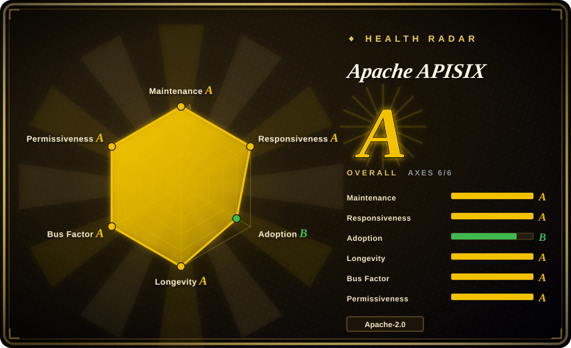
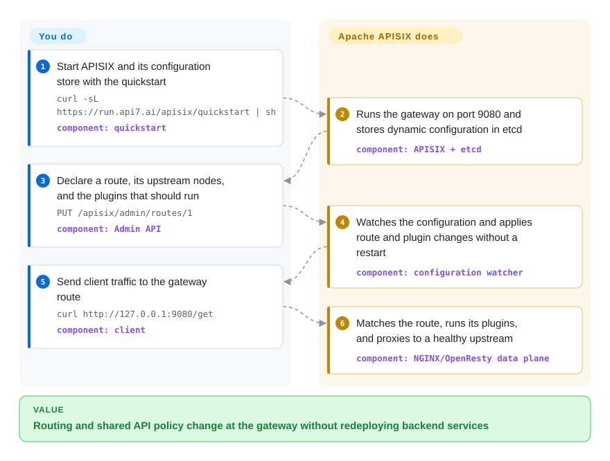

# Apache APISIX

An Apache-governed API and AI gateway built on NGINX/OpenResty, with etcd-backed live configuration, dynamic routing, and a broad in-process plugin layer.

## When to use

You run a platform edge for many services and need routes, upstreams, certificates, authentication, rate limits, traffic splitting, and observability policy to change without restarting gateway workers. Choose APISIX when an Apache Software Foundation governance model and an etcd-backed, dynamically updated control surface matter more than Kong's PostgreSQL or DB-less operating model, or Envoy's lower-level xDS data-plane role.

It is also a fit when one gateway must cover ordinary HTTP/gRPC traffic and selected AI workloads through plugins, while remaining deployable on bare metal, VMs, or Kubernetes. The cost of that flexibility is an OpenResty/Lua stack plus a configuration system that your team must secure and operate.

## How it works

You run APISIX in front of upstream services and declare routes, upstream nodes, and plugins through its Admin API or a standalone YAML/JSON configuration. In the default etcd-backed modes, APISIX watches configuration changes and applies them in memory without replacing worker processes; standalone mode can instead load the full configuration locally. For each request, its NGINX/OpenResty data plane matches a route, executes the configured plugin phases, selects an upstream, and proxies the request. You own the deployment, configuration source, upstream services, secrets, and plugin policy; APISIX owns route matching, plugin execution, load balancing, and request forwarding.

<!-- flow-steps:begin (generated from flows/apisix.json by tools/flow_card.py — do not edit) -->

Text version of the flow

1. **You**: Start APISIX and its configuration store with the quickstart — `curl -sL https://run.api7.ai/apisix/quickstart | sh` — component: `quickstart`
2. **Apache APISIX**: Runs the gateway on port 9080 and stores dynamic configuration in etcd — component: `APISIX + etcd`
3. **You**: Declare a route, its upstream nodes, and the plugins that should run — `PUT /apisix/admin/routes/1` — component: `Admin API`
4. **Apache APISIX**: Watches the configuration and applies route and plugin changes without a restart — component: `configuration watcher`
5. **You**: Send client traffic to the gateway route — `curl http://127.0.0.1:9080/get` — component: `client`
6. **Apache APISIX**: Matches the route, runs its plugins, and proxies to a healthy upstream — component: `NGINX/OpenResty data plane`

**Value**: Routing and shared API policy change at the gateway without redeploying backend services

<!-- flow-steps:end -->

## When NOT to use

- **Your platform already standardizes on xDS and a service-mesh control plane.** Choose [Envoy](envoy.md) instead, because APISIX adds an opinionated gateway configuration and plugin layer above the lower-level proxy role you already operate.
- **You want a PostgreSQL-backed or fully DB-less gateway workflow with a large vendor product ecosystem.** Choose [Kong Gateway](kong.md); APISIX centers its dynamic mode on etcd, while its standalone mode trades the distributed configuration store for full-file or full-payload updates.
- **You need a self-contained Go gateway focused on declarative API aggregation.** Choose KrakenD instead; APISIX carries NGINX/OpenResty, Lua dependencies, and a broader runtime policy surface.
- **You want a vendor-led API-management suite where dashboard, developer portal, and commercial support are the primary selection criteria.** Evaluate Tyk rather than assuming the APISIX core repository supplies that whole product layer.
- **You have only a few static routes and no shared policy needs.** Use NGINX, Caddy, or your application's router; operating a programmable gateway and its configuration lifecycle would add machinery without a corresponding control-plane benefit.

## Comparison

| Alternative | In index | Our verdict | Tradeoff |
|---|---|---|---|
| [Kong Gateway](kong.md) | ✅ | Choose APISIX when ASF governance, etcd-backed live configuration, and its bundled plugin model are decisive; choose Kong when PostgreSQL or DB-less workflows and Kong's vendor ecosystem fit the organization better. | Both use NGINX/OpenResty and Lua plugins; APISIX pays for etcd-centered dynamic configuration, while Kong pays for PostgreSQL in traditional mode or accepts DB-less control limits. |
| [Envoy](envoy.md) | ✅ | Choose Envoy for an xDS-managed L4/L7 data plane or service-mesh foundation; choose APISIX when operators need an Admin API and ready-made gateway plugins rather than assembling a separate control plane. | Envoy is lower-level and control-plane neutral; APISIX is more immediately usable as an API gateway but imposes its resource and plugin model. |
| Tyk | not indexed | Choose Tyk when a Go-based, vendor-led API-management stack and its management products are the priority; choose APISIX when neutral ASF governance and OpenResty/Lua extensibility matter more. | Tyk changes the implementation and governance model; APISIX offers foundation stewardship but asks the team to operate its gateway and configuration components. |
| KrakenD | not indexed | Choose KrakenD when stateless configuration and API aggregation are the center of the design; choose APISIX when dynamic per-route policy, runtime plugins, and hot configuration changes are the harder requirement. | KrakenD keeps runtime state and extension surfaces narrower; APISIX gains a richer policy gateway at the cost of more moving parts. |

## Tech stack

- **Data plane:** NGINX with OpenResty and LuaJIT; the repository's primary implementation language is Lua.
- **Routing and plugins:** `lua-resty-radixtree` for route matching plus Lua plugins that hook request-processing phases; external plugin runners support Java, Go, Python, and Node.js over RPC, while Proxy-Wasm support is documented as experimental.
- **Configuration:** etcd in traditional and decoupled modes, or local YAML/JSON and a full-configuration Admin API in standalone modes.
- **Interfaces:** REST Admin API for gateway resources, Prometheus and tracing plugins for observability, and a separate APISIX Ingress Controller for Kubernetes.

## Dependencies

- **Core runtime:** a Linux environment with the APISIX OpenResty distribution and its pinned LuaRocks dependencies.
- **Configuration store:** etcd for the default traditional and decoupled modes; standalone file/API-driven modes can run without etcd.
- **Deployment tooling:** official container images and Helm charts are available; the README quickstart requires Docker and starts APISIX with etcd.
- **Optional components:** external plugin runners, service-discovery systems, telemetry backends, and the separate Kubernetes ingress controller depend on the selected deployment.

## Ops difficulty

**Medium-to-high.** A quickstart is small, but a production dynamic deployment adds an etcd cluster, Admin API hardening, gateway-node rollout and capacity management, certificate and secret handling, plugin compatibility, telemetry, and upgrade testing. Standalone mode removes etcd and can simplify Git-managed deployments, but operators then own full-configuration publication and consistency. [推断]

## Health & viability

- **Maintenance:** Grade A — the latest commit was on the scoring date and all 13 measured weeks were active; v3.18.0 was published on 2026-08-20.
- **Responsiveness:** Grade A — measured median first-response time was 0.0 hours across 51 qualifying issues.
- **Adoption:** Not scored because the service has no canonical package-registry signal; the repository had 17,153 GitHub stars in the 2026-09-22 snapshot, and its README lists production users across several industries.
- **Longevity:** Grade A — the repository was 2,722 days old with a commit on the scoring date; age plus current activity is a positive Lindy signal for the core gateway. [推断]
- **Governance:** Grade A — 19 active maintainers were measured over 12 months, with 29.7% from the top contributor and 70.1% from the top three. Apache APISIX is an ASF top-level project, not a current podling; it graduated on 2020-07-15.
- **Risk / license:** Grade A — GitHub and the repository license identify Apache-2.0, and the scorer found no relicensing in the measured 36-month window.

## Caveats (unverified)

- [推断] “Medium-to-high” operations difficulty is an architectural judgment based on the production components and responsibilities, not a measured benchmark.
- [推断] The positive Lindy verdict combines repository age with current commit and release activity; it is a selection prior, not a prediction of future maintenance.
