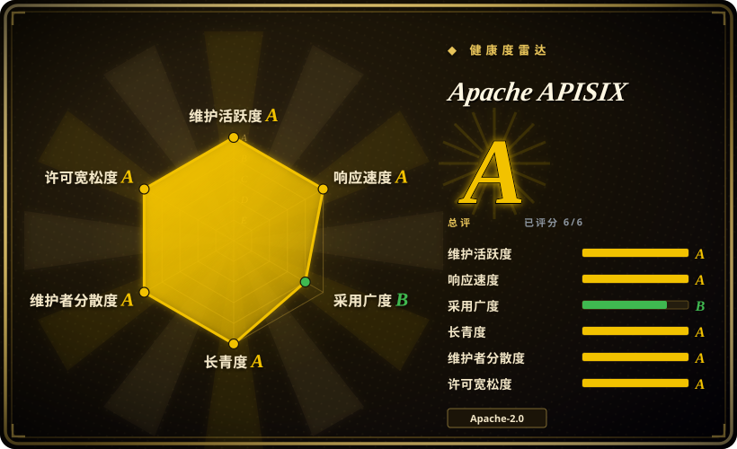
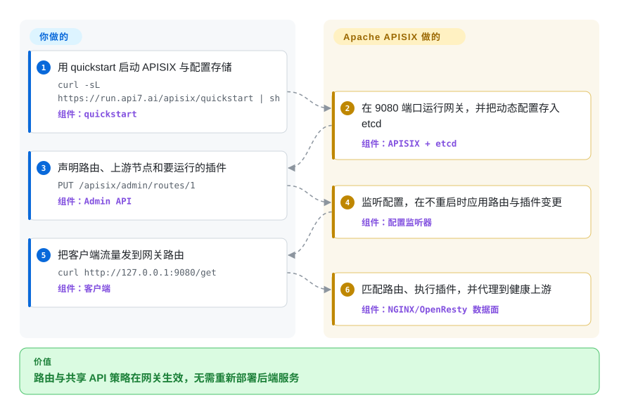

# Apache APISIX

一个由 Apache 治理的 API 与 AI 网关：基于 NGINX/OpenResty，以 etcd 承载实时配置，并提供动态路由和丰富的进程内插件层。

## 何时使用

你为许多服务维护统一流量入口，需要在不重启网关 worker 的情况下更新路由、上游、证书、鉴权、限流、流量切分和可观测策略。当 Apache 软件基金会的治理模式，以及由 etcd 支撑的动态控制面，比 Kong 的 PostgreSQL 或 DB-less 运维模型、Envoy 更底层的 xDS 数据面定位更重要时，选 APISIX。

当同一个网关既要承接普通 HTTP/gRPC 流量，又要通过插件处理部分 AI 工作负载，并且要能部署到裸机、虚拟机或 Kubernetes 时，它也很合适。代价是你要掌握 OpenResty/Lua 技术栈，并负责保护和运维配置系统。

## 怎么用起来

你把 APISIX 部署在上游服务前面，通过 Admin API 或 standalone YAML/JSON 配置声明路由、上游节点和插件。在默认的 etcd 模式里，APISIX 监听配置变化，在内存中生效而不替换 worker 进程；standalone 模式则可以从本地加载完整配置。每次请求到来时，NGINX/OpenResty 数据面先匹配路由，再执行配置的插件阶段、选择上游并转发请求。部署、配置来源、上游服务、密钥和插件策略由你负责；路由匹配、插件执行、负载均衡与请求转发由 APISIX 负责。

<!-- flow-steps:begin (generated from flows/apisix.json by tools/flow_card.py — do not edit) -->

流程文字版

1. **你**：用 quickstart 启动 APISIX 与配置存储 — `curl -sL https://run.api7.ai/apisix/quickstart | sh` — 组件：`quickstart`
2. **Apache APISIX**：在 9080 端口运行网关，并把动态配置存入 etcd — 组件：`APISIX + etcd`
3. **你**：声明路由、上游节点和要运行的插件 — `PUT /apisix/admin/routes/1` — 组件：`Admin API`
4. **Apache APISIX**：监听配置，在不重启时应用路由与插件变更 — 组件：`配置监听器`
5. **你**：把客户端流量发到网关路由 — `curl http://127.0.0.1:9080/get` — 组件：`客户端`
6. **Apache APISIX**：匹配路由、执行插件，并代理到健康上游 — 组件：`NGINX/OpenResty 数据面`

**价值**：路由与共享 API 策略在网关生效，无需重新部署后端服务

<!-- flow-steps:end -->

## 何时不用

- **你的平台已经统一使用 xDS 和 service mesh 控制面。** 选 [Envoy](envoy.zh.md)；你已经在运维底层代理角色，APISIX 会额外引入一套有明确主张的网关配置与插件层。
- **你想用 PostgreSQL 支撑网关，或偏好完全 DB-less 的工作流和较大的厂商产品生态。** 选 [Kong Gateway](kong.zh.md)；APISIX 的动态模式以 etcd 为中心，standalone 模式则用整份文件或完整 payload 更新换掉分布式配置存储。
- **你需要聚焦声明式 API 聚合的自包含 Go 网关。** 选 KrakenD；APISIX 带来 NGINX/OpenResty、Lua 依赖和更宽的运行时策略表面。
- **你的首要标准是厂商主导的 API 管理套件，包括 dashboard、开发者门户和商业支持。** 评估 Tyk，不要假定 APISIX 核心仓库包含整套产品层。
- **你只有少量静态路由，也没有共享策略需求。** 用 NGINX、Caddy 或应用框架自带的路由；运行可编程网关及其配置生命周期只会增加机器和流程，却没有相应控制面收益。

## 横向对比

| 替代品 | 是否收录 | 我们的评价 | 取舍 |
|---|---|---|---|
| [Kong Gateway](kong.zh.md) | ✅ | ASF 治理、etcd 动态配置和 APISIX 的内置插件模型是决定因素时选 APISIX；更适合 PostgreSQL 或 DB-less 工作流及 Kong 厂商生态时选 Kong。 | 两者都使用 NGINX/OpenResty 与 Lua 插件；APISIX 为 etcd 中心的动态配置付出运维成本，Kong 则在传统模式运维 PostgreSQL，或接受 DB-less 控制限制。 |
| [Envoy](envoy.zh.md) | 已收录 | 要 xDS 管理的 L4/L7 数据面或 service mesh 基础时选 Envoy；要 Admin API 和现成网关插件，而不是另组控制面时选 APISIX。 | Envoy 层级更低且不绑定控制面；APISIX 更快形成可用 API 网关，但会引入自己的资源与插件模型。 |
| Tyk | 未收录 | Go 实现、厂商主导的 API 管理栈及其管理产品优先时选 Tyk；中立 ASF 治理和 OpenResty/Lua 扩展性更重要时选 APISIX。 | Tyk 改变了实现与治理模型；APISIX 获得基金会治理，但团队要自行运维网关和配置组件。 |
| KrakenD | 未收录 | 无状态配置和 API 聚合是设计中心时选 KrakenD；更需要逐路由动态策略、运行时插件和热更新时选 APISIX。 | KrakenD 的运行时状态和扩展面更窄；APISIX 用更多运维零件换来更丰富的策略网关。 |

## 技术栈

- **数据面：** NGINX、OpenResty 与 LuaJIT；仓库的主要实现语言是 Lua。
- **路由与插件：** 用 `lua-resty-radixtree` 匹配路由，Lua 插件挂接请求处理阶段；外部 plugin runner 通过 RPC 支持 Java、Go、Python 与 Node.js，Proxy-Wasm 支持在文档中仍标为实验性。
- **配置：** traditional 与 decoupled 模式使用 etcd；standalone 模式可使用本地 YAML/JSON 或接收完整配置的 Admin API。
- **接口：** REST Admin API 管理网关资源，Prometheus 与 tracing 插件提供可观测性，Kubernetes 则使用独立的 APISIX Ingress Controller。

## 依赖

- **核心运行时：** Linux 环境、APISIX OpenResty 发行包及其固定版本的 LuaRocks 依赖。
- **配置存储：** 默认 traditional 与 decoupled 模式需要 etcd；standalone 文件或 API-driven 模式可以不运行 etcd。
- **部署工具：** 项目提供官方容器镜像和 Helm chart；README quickstart 需要 Docker，并同时启动 APISIX 与 etcd。
- **可选组件：** 外部 plugin runner、服务发现系统、遥测后端和独立 Kubernetes ingress controller 取决于所选部署方式。

## 运维难度

**中到高。** quickstart 很小，但生产动态部署会增加 etcd 集群、Admin API 加固、网关节点发布与容量管理、证书和密钥处理、插件兼容性、遥测及升级测试。standalone 模式移除 etcd，能简化由 Git 管理的部署，但整份配置的发布与一致性转由运维方负责。[推断]

## 健康度与可持续性

- **维护：** Grade A——最近提交就在评分当天，所测 13 周全部活跃；v3.18.0 发布于 2026-08-20。
- **响应速度：** Grade A——中位首次响应时间为 0.0 小时，基于 51 个 qualifying issues。
- **采用广度：** 该项未评分，因为 service 没有 canonical package registry 信号；在 2026-09-22 快照中，仓库有 17,153 个 GitHub stars，README 还列出了多个行业的生产用户。
- **长青度：** Grade A——仓库已创建 2,722 天，评分当天仍有提交；年龄与当前活跃度结合，对核心网关构成正面的 Lindy 信号。[推断]
- **治理：** Grade A——过去 12 个月测得 19 名活跃维护者，头部一人贡献占 29.7%，前三人占 70.1%。Apache APISIX 是 ASF 顶级项目，不是当前 podling；它于 2020-07-15 毕业。
- **风险与许可：** Grade A——GitHub 与仓库许可证都标明 Apache-2.0，评分器在所测 36 个月窗口内未发现重新许可。

## 存疑（未验证）

- [推断]“中到高”的运维难度来自生产组件与职责的架构判断，并非实测基准。
- [推断] 正面的 Lindy 判断结合了仓库年龄与当前提交、发版活动；它是选型先验，不是对未来维护的预测。
