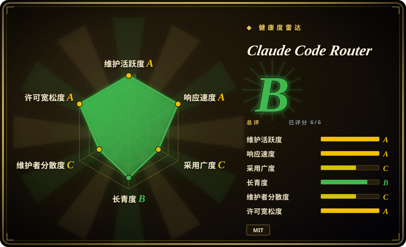

# Claude Code Router

一个本地控制面与代理：让 Claude Code 以及其他 coding agent 接到你想用的模型供应商，并在其上加条件路由、协议适配、重试与 fallback，配置走桌面端或 CLI 界面。

## 何时使用

你是开发者，想继续用 Claude Code 自己的工作流——斜杠命令、工具、会话——但不想被单一供应商锁死：日常改动用便宜模型，难推理时切强模型，能按任务或按规则切换，而不用换客户端。这时选 Claude Code Router，因为它就是为这个客户端做的：本地网关（默认 `127.0.0.1:3456`）理解 coding agent 协议，配置在桌面 UI 里写入 SQLite（`~/.claude-code-router/config.sqlite`），所以你不需要把一个通用网关当服务来运维。

相对最近邻替代品，决定性的取舍是**作用层级**。当你只是在重定向某个开发者的 coding agent、不想为一个带数据库、虚拟密钥和预算的多租户网关背运维时，选它而不是 [LiteLLM](litellm.zh.md) 或 [CLIProxyAPI](cliproxyapi.zh.md)；当你要的是在现有客户端里做模型路由、而不是把 harness 执行当成产品 API 时，选它而不是 [HarnessRouter](harnessrouter.zh.md)；当你需要跨平台、配置驱动的路由、而不是某一家厂商的 Windows 代理路径时，选它而不是 [Funtool](funtool.zh.md)。

## 何时不用

- **一个供应商已够用。** 直接用 Anthropic 官方的 Claude Code；多一层代理等于为到达同一个模型而多出进程、端口、凭据和升级路径。
- **你要给产品后端做 LLM 网关，要密钥、预算和按团队隔离。** 改用 [LiteLLM](litellm.zh.md) 或 Portkey Gateway；Router 是本地 agent 控制面，不是治理网关。
- **你要把 agent 任务当服务跑（会话、文件、取消）给应用用。** 改用 [HarnessRouter](harnessrouter.zh.md)；Router 只重定向客户端的模型调用，不执行也不托管任务。
- **你要把消费订阅或 OAuth 登录态再暴露给别的工具。** 改用供应商 API key；若接受该风险可用 [CLIProxyAPI](cliproxyapi.zh.md)，或改用托管网关；各供应商是否允许订阅转接，本文无法确认。[未验证]
- **无法容忍协议转换损失。** 直接用供应商原生 API；开放 issue 报告跨协议路由时图片被静默丢弃，以及 fallback 链没有切换供应商。
- **不想维护一个带 CA/MITM 路径和 SQLite 配置文件的本地代理。** 改用托管路由如 OpenRouter；本地部署既给你控制权，也正是你要维护的部分。

## 横向对比

| 替代品 | 是否收录 | 我们的评价 | 取舍 |
|---|---|---|---|
| [LiteLLM](litellm.zh.md) | 已收录 | 一个网关要服务多个应用、要虚拟密钥/预算/花费追踪时，选 LiteLLM；任务只是单个开发者的 coding agent、不想要治理型服务的开销时，选 Router。 | LiteLLM 带来 PostgreSQL/Redis 与更重的功能面，但有真正的多用户治理；Router 保持本地与简单，也完全没有这些治理能力。 |
| [CLIProxyAPI](cliproxyapi.zh.md) | 已收录 | 想把多个 CLI/OAuth 账号复用成一个覆盖面广的多协议 API 时，选 CLIProxyAPI；想在 Claude Code 内部做配置驱动的模型路由时，选 Router。 | CLIProxyAPI 覆盖更多上游 CLI 产品与 API 形状；Router 更窄，但把路由决策留在 coding agent 工作流内部。 |
| [HarnessRouter](harnessrouter.zh.md) | 已收录 | 产品要把整只 agent 任务放在 API 之后跑时，选 HarnessRouter；Router 只用于重定向你已经在跑的客户端。 | HarnessRouter 接管会话、文件与工作区，运维面大得多；Router 只在请求链路上。 |
| [Funtool](funtool.zh.md) | 已收录 | 只需要“Windows + Claude Code + 指定厂商端点”这条路径、且接受预打包二进制时，选 Funtool；要跨平台、配置驱动的路由时，选 Router。 | Funtool 是窄而不透明的二进制；Router 是可审查的 TypeScript 且有 UI，代价是 Node/Electron 栈和更大的配置面。 |
| OpenRouter | 未收录 | 不想在本地跑任何路由、接受托管中间商时，选 OpenRouter；provider 凭据与路由必须留在本机时，选 Router。 | OpenRouter 去掉本地运维，却在请求链路里多一个第三方和按 token 的加价；Router 凭据留在本地，但运维责任归你。 |

## 技术栈

- **语言与形态：** TypeScript monorepo；Node.js 22+ CLI，外加 Electron 42 桌面应用与 React 18 / Base Web / Tailwind 4 界面。
- **本地网关：** 默认监听 `127.0.0.1:3456`（管理界面 `3458`）；负责条件路由、模型链与 fallback，并可在 MITM 代理模式加装 CA 证书，供需要拦截的客户端使用。
- **状态/配置：** UI 写入的 SQLite 数据库 `~/.claude-code-router/config.sqlite`；旧的 `config.json` 仅用于迁移。运行依赖含 `better-sqlite3`、`undici`、`node-forge`。
- **分发：** release 二进制、`npm install -g @musistudio/claude-code-router`，或 Docker。

## 依赖

- CLI 路径需要 **Node.js 22+**，或用打包好的桌面二进制。
- 每个要路由到的模型都需要**供应商凭据**；Router 负责保存并转发。
- **本地端口** `3456`（网关）与 `3458`（管理），启用 MITM 拦截时还要装 CA 证书。
- **本地 SQLite 文件及其备份**——配置就在里面，丢了等于重建路由规则。

## 运维难度

**低到中等。** 对单个开发者而言它是带 UI 的本地进程：启动、选供应商、让 Claude Code 走它。长期成本在于升级频繁（近 90 天 25 个 release）、备份 SQLite 配置，以及盯住路由语义——近期 issue 报告 fallback 没有切换供应商（#1804）、跨协议静默丢图（#1678）、全局 agent 配置被接管（#1575）。请把本地网关当作持有凭据的基础设施：既往公告 GHSA-8hmm-4crw-vm2c 显示 1.0.34 之前 CORS 配置错误可暴露 API key，这正是回环代理保存供应商密钥时的风险类型。[未验证] 上述三个 issue 是否已在 v3.1.1 修复。

## 健康度与可持续性

- **维护活跃度（截至 2026-09）：** 最新 release v3.1.1（2026-09-16），此前 90 天约 25 个 release——非常活跃，不是躺平。
- **治理与 bus factor：** 具名贡献者 58 人，但第一贡献者占约 76.7% 提交（二、三名各 3.1% 与 2.0%）。实际是单人主导项目，持续性系于一人。[推断]
- **背景与长青度：** 独立维护者项目（主页 `ccrdesk.top`），非基金会也非有资金的厂商；项目约 1.6 年且仍活跃（2025-02 起）——Lindy 位置中等，既非“年轻未经检验”，也非“长期确立”。
- **采用度：** 约 37k stars、3.1k forks，watchers 140。fork 与 star 说明有真实使用，但 watcher 比例偏低，因此部分关注可能来自推广。[推断]
- **风险旗：** MIT，树内未发现 `enterprise/` 目录或 CLA；低危公告 CVE-2025-57755 / GHSA-8hmm-4crw-vm2c（CORS 可暴露 API key，1.0.34 修复）；开放 issue 存量较大（1,132）。

## 存疑（未验证）

- [未验证] 转发消费订阅/OAuth 凭据是否被各上游供应商允许；README 未声明获得供应商授权，封号率也无从确认。
- [未验证] issue #1804（fallback 未切供应商）、#1678（跨协议静默丢图）、#1575（agent 配置被接管）是否已在 v3.1.1 修复；调研时它们仍是开放状态。
- [推断] 单人主导（约 77% 提交）意味着该维护者离开即为连续性风险。
- [推断] watcher 与 star 之比偏低（140 watchers 对约 37k stars），提示相当一部分 star 来自推广而非持续使用。
- [未验证] 是否存在外部或私下 CLA；仅确认了树内 MIT LICENSE。
- [未验证] 本页没有安装或运行 Router，运行时行为与上述 issue 的实际严重程度取自仓库与 issue tracker，而非复现结果。
