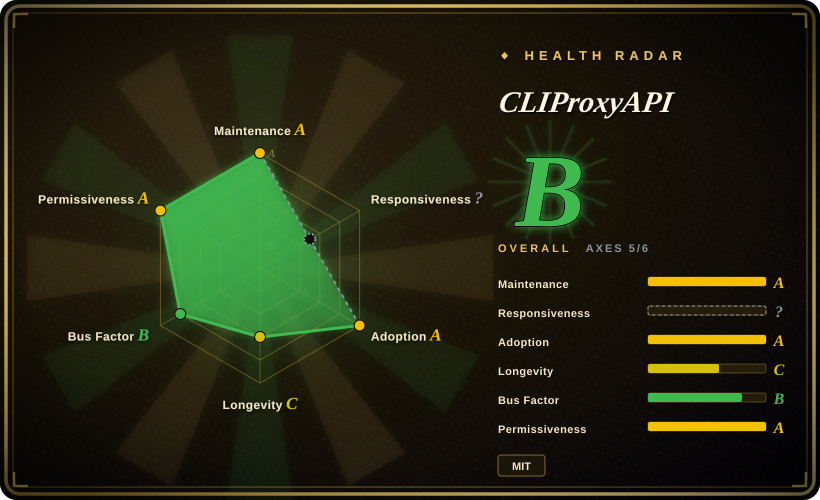

# CLIProxyAPI

Wraps consumer CLI and OAuth logins — ChatGPT Codex, Claude Code, Gemini/Antigravity, Grok and others — plus provider API keys into OpenAI-, Gemini-, Claude- and Codex-compatible HTTP APIs, so other tools can call them.

## When to use

You already hold CLI or OAuth logins for several model products and want to use them from other software — an SDK, an editor, another agent — without rewriting each integration, and you want a pool of accounts with failover instead of one credential per tool. You reach for CLIProxyAPI because it is a single Go binary that speaks several API shapes at once (OpenAI Chat/Responses, Gemini GenerateContent, Claude Messages, Codex-compatible) and stores its account state locally, so deployment is one process and one config file rather than a platform.

The deciding tradeoff is *what it reuses*. Choose it over [LiteLLM](litellm.md) when your asset is CLI/OAuth access rather than provider API keys — LiteLLM routes keys and adds governance, CLIProxyAPI routes accounts; choose it over [Claude Code Router](claude-code-router.md) when you need many CLI products and multiple protocol shapes rather than routing inside one coding agent; choose it over [HarnessRouter](harnessrouter.md) when you want a raw API façade, not agent task execution with sessions and files. The cost of that reuse is legal and operational: whether proxying these credentials is permitted is a vendor-terms question this page does not settle. [未验证]

## When NOT to use

- **You cannot accept the terms-of-service and account-ban risk of re-exposing consumer logins as an API.** Use the official provider APIs (OpenAI, Anthropic, Google) or a hosted broker; the risk here is inherent to the design, not a bug. [推断]
- **You need tenants, RBAC, budgets and audit.** Use [LiteLLM](litellm.md) or Portkey Gateway; CLIProxyAPI is a credential pool, not a governance layer.
- **You need a contractual production SLA.** Use official hosted APIs, Azure OpenAI or Vertex AI; this is a self-hosted community project with no support contract.
- **You only need one provider with complete protocol semantics.** Use that vendor's own SDK; every compatibility layer loses some field-level fidelity.
- **You will not let OAuth refresh tokens rest on the proxy host.** Use a managed key gateway; CLIProxyAPI persists account tokens to disk.
- **You just want model routing inside one coding agent.** Use [Claude Code Router](claude-code-router.md); a full multi-protocol proxy is more machinery than that job needs.
- **You want a simpler self-hosted key-based gateway.** Use One API; CLIProxyAPI's value is account reuse, not key administration.

## Comparison

| Alternative | In index | Our verdict | Tradeoff |
|---|---|---|---|
| [LiteLLM](litellm.md) | ✅ | When the traffic is provider-key based and needs budgets, virtual keys and spend tracking, choose LiteLLM; choose CLIProxyAPI when the asset you are reusing is CLI/OAuth logins rather than API keys. | LiteLLM is a governed gateway with databases and a commercial feature boundary; CLIProxyAPI is a lighter binary but offers no multi-tenant controls and carries account-risk. |
| [Claude Code Router](claude-code-router.md) | ✅ | When one developer wants to route a coding agent across models with a desktop UI, choose Router; choose CLIProxyAPI when the goal is a broad multi-account, multi-protocol API façade. | Router is narrower and friendlier for a single workstation; CLIProxyAPI exposes more API shapes and account pooling at the cost of a larger operational and legal surface. |
| [HarnessRouter](harnessrouter.md) | ✅ | When your product needs to run agent tasks (sessions, files, cancellation), choose HarnessRouter; CLIProxyAPI only serves model requests and leaves execution to the caller. | HarnessRouter owns the whole task lifecycle and its operational duties; CLIProxyAPI is a pure request-path proxy, smaller to run but capable of far less. |
| One API | not indexed | When you want a straightforward self-hosted gateway built around issued keys and channels, choose One API; choose CLIProxyAPI specifically when reusing consumer CLI logins is the point. | One API keeps the key-based model and avoids account-policy exposure, but does not turn CLI subscriptions into an API. |
| OpenRouter | not indexed | When you would rather pay a hosted broker than run the proxy and carry the account risk, choose OpenRouter; choose CLIProxyAPI when traffic must stay on your own host. | OpenRouter takes the legal/ops burden off you and adds per-token margin plus a third party in the path; CLIProxyAPI keeps everything local, including the consequences. |

## Tech stack

- **Language:** Go 1.26, distributed as cross-platform release binaries and a Docker image (Debian base with only CA certificates and tzdata).
- **Serving:** Gin for HTTP, Gorilla WebSocket, a Bubble Tea terminal UI, plus OAuth flows and a plugin SDK; exposes OpenAI Chat/Responses, Gemini GenerateContent/Interactions, Claude Messages and Codex/Grok-compatible shapes.
- **State:** account tokens and metadata persisted as mode-`0600` JSON under `~/.cli-proxy-api` by default; alternative filestores include PostgreSQL, Git and S3-compatible object storage.
- **Config:** a `config.yaml` plus downstream API keys issued by the proxy.

## Dependencies

- **One or more upstream CLI/OAuth logins** (or provider API keys) — the proxy is useless without at least one credential source.
- **A config file and downstream API keys** you issue to callers.
- **A host that keeps secrets safe:** OAuth refresh tokens are written to disk (`0600`), so host or backup compromise exposes them.
- **A reverse proxy with TLS** if you expose it beyond loopback; it has no built-in gateway auth story beyond the keys you issue.
- **Optional external storage** (PostgreSQL / Git / S3-compatible) if the default local JSON filestore is not enough.

## Ops difficulty

**Medium, with a policy tax.** Running it is one binary or container plus a config file, and the default filestore needs no database. The work is elsewhere: browser OAuth logins per account, rotating and backing up credentials, keeping the account pool healthy, and accepting that the built-in persistent usage statistics were removed so you must observe usage yourself. Recent issues show compatibility layers are the fragile part — protocol conversion dropping `tool_choice`, `strict`, audio or file fields, Gemini tool-history mismatches, and Codex stream-error misclassification — and an open P1 cache-poisoning fix request (#3105) is a reminder that a credential-holding proxy is a high-value target. Budget time for frequent upgrades: about 30 releases in the last 29 days.

## Health & viability

- **Maintenance, as of 2026-09:** latest release v7.3.8 (2026-09-18), roughly daily releases (about 30 in 29 days) — extremely active, and the repository was pushed within a day of this check.
- **Governance and bus factor:** 258 contributors and 3,950 attributed contributions, but the top contributor holds about 54.6% and the top three about 79.2% — a single-maintainer core inside a broader contributor pool. Owned by the `router-for-me` organization. [推断]
- **Backing and longevity:** community organization, not a foundation; started 2025-07, so about 1.2 years old and active. A separate `CLIProxyAPIBusiness` repository exists under SSPL with a CLA, so the *product line* is layered even though this repository is MIT. [推断]
- **Adoption:** about 52k stars and 7.9k forks against 110 watchers. The fork count is strong evidence of real deployment, but the watcher ratio is very low, which is consistent with attention driven by promotion as much as by sustained use. [推断]
- **Risk flags:** the core legal risk is the terms of service of the accounts being proxied; the main repository carries an open P1 cache-poisoning fix request; Git history of a `pgx` CVE was remediated by upgrading, and GitHub Security Advisories are empty as of this check. Secrets live in a local JSON file.

## Caveats (unverified)

- [未验证] Whether each upstream vendor permits re-exposing its CLI/OAuth login as an API, and what the practical ban rate is; issue reports exist but do not establish causation.
- [未验证] The complete feature and support difference between the MIT community repository and the SSPL `CLIProxyAPIBusiness` edition; only the latter's README claim was read.
- [推断] Re-exposing consumer credentials as an API is a real terms-of-service and account-ban risk for the user, even though no vendor statement was verified for this page.
- [未验证] Whether the open P1 cache-poisoning pull request (#3105) has been merged or a fix released.
- [未验证] Native Qwen CLI authentication support — the README's wrapped-product list could not be fully confirmed.
- [未验证] This page did not run the proxy, so conversion-loss and error-classification behaviour is taken from the issue tracker and docs rather than from a reproduction.
